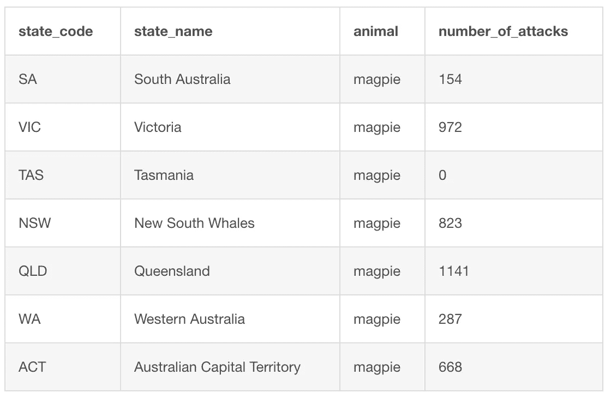
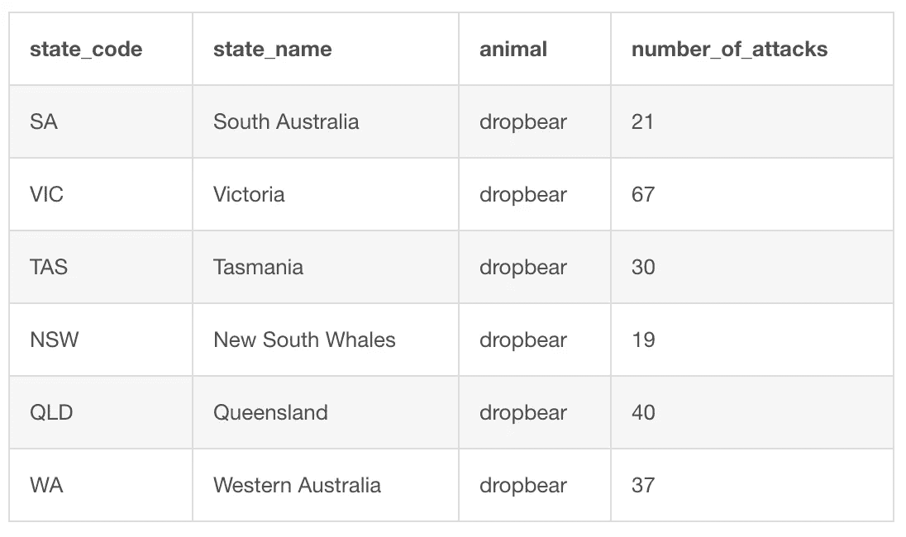
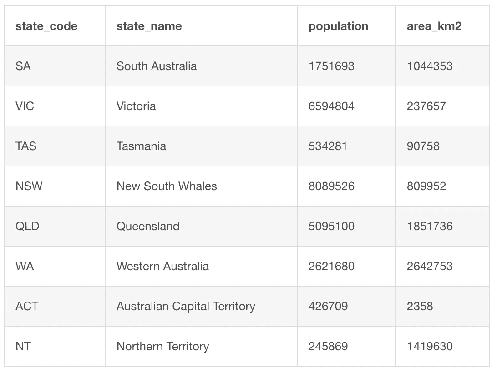
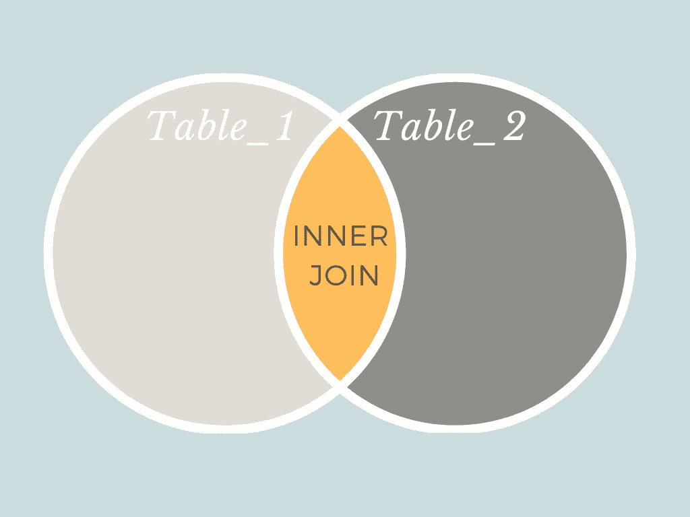
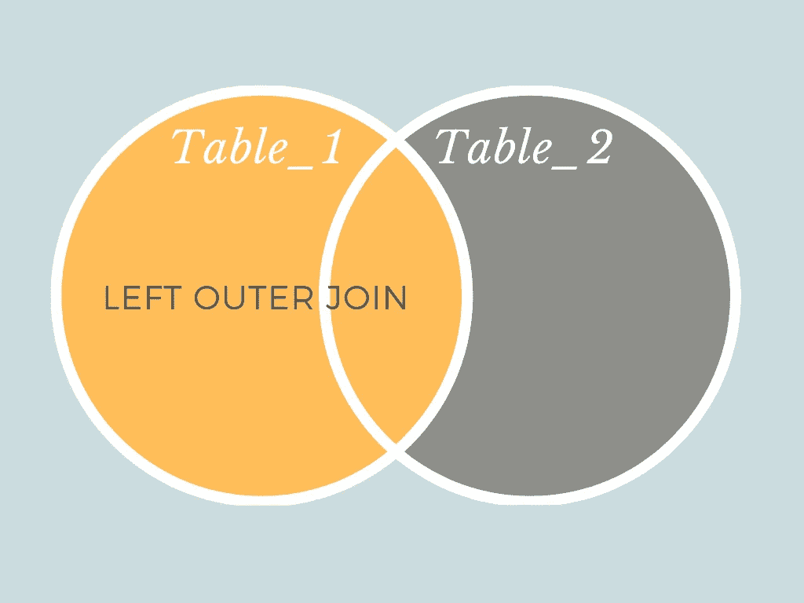
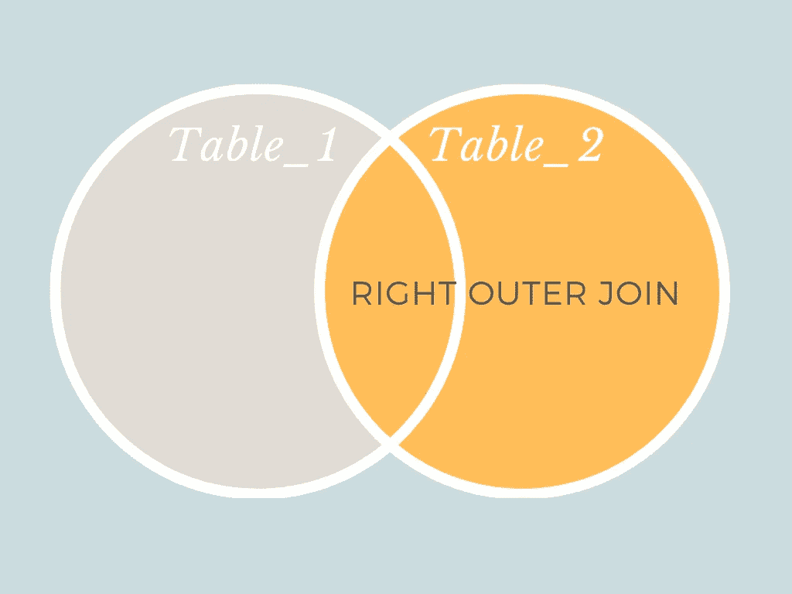

# 如何使用 SQL 连接表以组合数据集

> 原文：<https://towardsdatascience.com/combining-tables-using-sql-f6ddfd5f8b6f?source=collection_archive---------0----------------------->

## [在保持社交距离的同时学习数据科学](https://towardsdatascience.com/tagged/ldswsd)

## 使用 SQL 关键字 UNION、UNION ALL、INNER JOIN、LEFT OUTER JOIN 和 RIGHT OUTER JOIN 找出澳大利亚哪里的喜鹊最危险


照片由[大流士 K](https://unsplash.com/@drazgoosh?utm_source=medium&utm_medium=referral) 在 [Unsplash](https://unsplash.com?utm_source=medium&utm_medium=referral) 上拍摄

# 介绍

在过去的 4 周里，我和我的朋友们在保持社交距离的同时互相帮助学习新技能。我们正在以在线学习小组的形式学习数据科学。我们几乎完成了 SQL 部分。我为每个人的努力和他们尝试新事物的意愿感到骄傲。

在过去的几周里，我的父母甚至决定尝试一下我的课程。他们只有几周的时间来补上，所以听听他们的想法会很有趣。

# 前一课

上周，我们利用辣妹组合发行的三张专辑的数据来判断哪张专辑是最好的。我们使用 GROUP BY 关键字这样做，以便我们可以聚合每个专辑的统计数据。

# 这一课

现在我们知道了如何分组和聚合表中的数据，本周我们将学习如何将表连接在一起。

能够组合数据集是有帮助的。尤其是如果每个表中有不同的细节。通过将它们连接在一起，你可以进行一些计算。或者，您可以创建一个新表，在一个数据集中包含所有不同的详细信息。

为了合并表，我们将使用 UNION、UNION ALL、INNER JOIN、LEFT OUTER JOIN 和 RIGHT OUTER JOIN 关键字。

## 主要学习内容

*   使用关键字 UNION 堆叠没有重复值的数据集
*   使用关键字 UNION ALL 来堆叠具有重复值的数据集
*   使用关键字 INNER JOIN 将两个表连接在一起，只获得重叠的值
*   使用关键字 LEFT OUTER JOIN 将两个表连接在一起，并且不会丢失左表中的任何数据，即使那些记录在右表中没有匹配项
*   使用关键字 RIGHT OUTER JOIN 将两个表连接在一起，并且不会丢失右表中的任何数据，即使是那些在左表中没有匹配项的记录
*   理解 UNION 和 UNION ALL 关键字的区别
*   理解内部连接、左外部连接和右外部连接之间的区别。

# 问题是

每个人都知道澳大利亚充满了危险的动物。然而，一种鲜为人知的食肉动物是喜鹊。这种鸟猛扑向毫无防备的受害者，锋利的喙装备精良，可以挖出一只眼睛。我们想知道澳大利亚各州喜鹊攻击事件有多普遍。哪里要戴防护帽？😜


弗兰克·布施在 [Unsplash](https://unsplash.com?utm_source=medium&utm_medium=referral) 上的照片

# 数据

为了解决我们的问题，我们有几个数据表。

首先是一个表格，根据网站[喜鹊警报](https://www.magpiealert.com/Swooping-Magpie-Attack-Statistics-2019)，包含了澳大利亚各州报告的喜鹊攻击数量。需要注意的是，这个网站的数据是众包的。当人们被喜鹊袭击时，他们会自我报告。因此，根据网站最受欢迎的地方，可能会有一些偏差。



喜鹊攻击表

我们的第二组数据是 dropbear 攻击的表格。北极熊是另一种凶猛的澳大利亚动物。我们可以将此表与喜鹊攻击数据进行比较。

**免责声明:** dropbears 不是真的，所以数据是我编造的😃



Dropbear 攻击表

除了关于动物袭击的两个表格，我们还有我从维基百科[获得的澳大利亚各州的数据。我们可以使用这个表来标准化我们的动物攻击表，以反映各州之间的人口或地区差异。](https://en.wikipedia.org/wiki/States_and_territories_of_Australia)



澳大利亚州和地区表

# 组合表格的语法

将两个表组合在一起的最简单的方法是使用关键字 UNION 或 UNION ALL。这两种方法将一批选定的数据堆积在另一批数据之上。

```
 SELECT 
        name_column_one, 
        name_column_three
    FROM
        name_of_table_one
UNION
    SELECT
        name_column_one, 
        name_column_three
    FROM
        name_of_table_two
;
```

这两个关键字之间的区别在于 UNION 只接受不同的值，而 UNION ALL 则保留所有选中的值。两者使用相同的语法。

```
 SELECT 
        name_column_one, 
        name_column_three
    FROM
        name_of_table_one
UNION ALL
    SELECT
        name_column_one, 
        name_column_three
    FROM
        name_of_table_two
;
```

## 如果您想根据匹配值合并表，该怎么办？

有几种不同的方法可以根据值匹配来组合表。它们包括内部连接、完全外部连接、左外部连接和右外部连接。

在不同版本的 SQL 语言中，可用的连接略有不同。我们一直在学习 MySQL。因此，我们将只关注 MySQL 中可用的连接。在 MySQL 中可以使用内连接、左外连接和右外连接，但不能使用全外连接。

如果你想学习如何做一个完整的外连接，我的另一篇关于 SQL 中的内连接和外连接的[区别的文章中有介绍。](/what-is-the-difference-between-an-inner-and-an-outer-join-in-sql-5b5ec8277377)

## 如果您只想要两个表都包含匹配值的数据，该怎么办？

如果要执行的联接只包含两个表在指定列中包含匹配值的数据，则可以使用内部联接。



内部连接图:内部连接的结果将只包含 Table_1 和 Table_2 重叠的黄色部分

内部联接只返回两个数据集重叠的部分。这样，只有在两个表中要连接的列中有匹配值时，才会返回记录。内部联接的语法如下所示:

```
SELECT *
FROM
    name_of_table_one
INNER JOIN
    name_of_table_two
ON
    name_of_table_one.name_column_one = name_of_table_two.name_column_one
```

在上面的示例中，表一和表二的记录都将被返回，但前提是表一第一列中的值与表二第一列中的值匹配。内部联接不会返回任何没有匹配值的记录。

我们在前面的课程中没有遇到的连接语法的一部分是通过表名和列名来引用列。这在连接表时很重要，因为两个表可能有同名的列。如果在选择同名列时不包括表名，程序将不会知道您引用的是哪一个。

为了避免混淆，我们使用由句号分隔的表名和列名来为每一列创建唯一的标识符。

## 如果您想连接一个匹配值，但只想保留左侧表中的所有数据，并且只保留右侧表中匹配的记录，该怎么办？

要基于列匹配连接两个表而不丢失左表中的任何数据，可以使用左外连接。



左外部连接图:左外部连接的结果将包含 Table_1 和 Table_2 重叠的黄色部分，以及包含 Table_1 其余部分的黄色部分

当您希望从一个表中获取所有值，但只从右表中获取与左表匹配的记录时，可以使用左外连接。

```
SELECT *
FROM
    name_of_table_one
LEFT OUTER JOIN
    name_of_table_two
ON
    name_of_table_one.name_column_one = name_of_table_two.name_column_one
```

在上面左侧的外部连接示例中，将返回表一中的所有行，以及表二和表一中基于每个表中的列一共有的行。

## 左外连接和右外连接有什么区别？



右外连接图:右外连接的结果将包含 Table_1 和 Table_2 重叠的黄色部分，以及包含 Table_2 其余部分的黄色部分

右外连接的语法与左外连接的语法相同。两者之间唯一的区别是右边的表，在我们的示例表 2 中，将保留它的所有记录。而在左边的表中，表 1 将只保留其第一列和表 2 的第一列匹配的记录。

```
SELECT *
FROM
    name_of_table_one
RIGHT OUTER JOIN
    name_of_table_two
ON
    name_of_table_one.name_column_one = name_of_table_two.name_column_one
```

# 现在让我们试一试

1.  前往[https://www.db-fiddle.com/](https://www.db-fiddle.com/)
2.  在左栏中，将 CREATE TABLE 和 INSERT 放入下面的查询中

```
CREATE TABLE magpie_attacks(
    state_code varchar(255),
    state_name varchar(255),
    animal varchar(255),
    number_of_attacks int(255)
);INSERT INTO magpie_attacks(
    state_code,
    state_name,
    animal,
    number_of_attacks
)
VALUES
    ('SA', 'South Australia', 'magpie', 154),
    ('VIC', 'Victoria', 'magpie', 972),
    ('TAS', 'Tasmania', 'magpie', 0),
    ('NSW', 'New South Whales', 'magpie', 823),
    ('QLD', 'Queensland', 'magpie', 1141),
    ('WA', 'Western Australia', 'magpie', 287),
    ('ACT', 'Australian Capital Territory', 'magpie', 668);CREATE TABLE dropbear_attacks(
    state_code varchar(255),
    state_name varchar(255),
    animal varchar(255),
    number_of_attacks int(255)
);INSERT INTO dropbear_attacks(
    state_code,
    state_name,
    animal,
    number_of_attacks
)
VALUES
    ('SA', 'South Australia', 'dropbear', 21),
    ('VIC', 'Victoria', 'dropbear', 67),
    ('TAS', 'Tasmania', 'dropbear', 30),
    ('NSW', 'New South Whales', 'dropbear', 19),
    ('QLD', 'Queensland', 'dropbear', 40),
    ('WA', 'Western Australia', 'dropbear', 37)
;CREATE TABLE australian_states(
    state_code varchar(255),
    state_name varchar(255),
    population int(255),
    area_km2 int(255)
);INSERT INTO australian_states(
    state_code,
    state_name,
    population,
    area_km2
)
VALUES
    ('SA', 'South Australia', 1751693, 1044353),
    ('VIC', 'Victoria', 6594804, 237657),
    ('TAS', 'Tasmania', 534281, 90758),
    ('NSW', 'New South Whales', 8089526, 809952),
    ('QLD', 'Queensland', 5095100, 1851736),
    ('WA', 'Western Australia', 2621680, 2642753),
    ('ACT', 'Australian Capital Territory', 426709, 2358),
    ('NT', 'Northern Territory', 245869, 1419630)
;
```

3.在右栏中输入您的查询，并使用左上角的“运行”按钮运行它们

4.运行下面的查询，看看它是否会返回您所期望的结果:

```
 SELECT 
        * 
    FROM
        magpie_attacks
UNION
    SELECT 
        *
    FROM 
        dropbear_attacks
;
```

5.运行下面的查询，看看它是否会返回您所期望的结果:

```
 SELECT 
        state_code, 
        state_name
    FROM
        magpie_attacks
UNION
    SELECT 
        state_code, 
        state_name
    FROM 
        dropbear_attacks
;
```

6.运行下面的查询，并将结果与之前的查询进行比较:

```
 SELECT 
        state_code, 
        state_name
    FROM
        magpie_attacks
UNION ALL
    SELECT 
        state_code, 
        state_name
    FROM 
        dropbear_attacks;
```

7.运行下面的查询，看看它是否会返回您所期望的结果:

```
SELECT 
    magpie_attacks.state_code, 
    magpie_attacks.number_of_attacks AS magpie_attacks,
    dropbear_attacks.number_of_attacks AS dropbear_attacks
FROM
    magpie_attacks
INNER JOIN
    dropbear_attacks
ON
    magpie_attacks.state_code = dropbear_attacks.state_code;
```

8.运行以下查询，并将结果与之前的查询进行比较:

```
SELECT 
    magpie_attacks.state_code, 
    magpie_attacks.number_of_attacks AS magpie_attacks,
    dropbear_attacks.number_of_attacks AS dropbear_attacks
FROM
    magpie_attacks
LEFT OUTER JOIN
    dropbear_attacks
ON
    magpie_attacks.state_code = dropbear_attacks.state_code;
```

9.运行下面的查询，并将结果与前两个查询进行比较:

```
SELECT 
    magpie_attacks.state_code, 
    magpie_attacks.number_of_attacks AS magpie_attacks,
    dropbear_attacks.number_of_attacks AS dropbear_attacks
FROM
    magpie_attacks
RIGHT OUTER JOIN
    dropbear_attacks
ON
    magpie_attacks.state_code = dropbear_attacks.state_code;
```

10.运行下面的查询，并将结果与前两个查询进行比较:

```
SELECT 
    magpie_attacks.state_code, 
    magpie_attacks.number_of_attacks AS magpie_attacks,
    dropbear_attacks.number_of_attacks AS dropbear_attacks,
      dropbear_attacks.number_of_attacks / magpie_attacks.number_of_attacks * 100 AS 'dropbear_attacks_as_percentage_of_magpie_attacks'
FROM
    magpie_attacks
INNER JOIN
    dropbear_attacks
ON
    magpie_attacks.state_code = dropbear_attacks.state_code
;
```

**练习 1:** 使用我们在本课中学到的每一种不同的 union 和 join 方法，组合 magpie_attacks 表和 australian_states 表。为了运行查询，您可以根据需要随意选择任意多或任意少的列。

**练习 2:** 写一个查询，找出澳大利亚哪个州的喜鹊攻击次数占该州人口的百分比最高。提示:如果需要，您可以使用步骤 10 中的查询作为参考。

# 学习回顾

学完本课后，你应该知道:

*   如何使用关键字 UNION 来堆叠没有重复值的数据集
*   如何使用关键字 UNION ALL 来堆叠具有重复值的数据集
*   如何使用关键字 INNER JOIN 将两个表连接在一起，并且只获得重叠的值
*   如何使用关键字 LEFT OUTER JOIN 将两个表连接在一起，并且不丢失左表中与右表不匹配的任何数据
*   如何使用关键字 RIGHT OUTER JOIN 将两个表连接在一起，并且不会丢失右表中与左表不匹配的任何数据
*   理解 UNION 和 UNION ALL 关键字的区别
*   理解内部连接、左外部连接和右外部连接之间的区别。

# 下一课

下一课将回顾我们在过去 5 课中学到的关于 SQL 的知识。我总是认为练习新技能来巩固课程是个好主意。希望复习课也能让我们以一种更独立的方式使用在课上学到的所有技能。到目前为止，这些练习与之前的例子非常相似。然而，我希望下节课我们将学到的部分内容是如何选择使用什么方法来解决问题。

除了数据，我的另一个爱好是绘画。你可以在 www.katemarielewis.com 找到我的野生动物艺术

# 社交距离学习数据科学(LDSWSD)系列中的所有课程

[](https://towardsdatascience.com/tagged/ldswsd) [## Ldswsd —走向数据科学

### 阅读《走向数据科学》中关于 Ldswsd 的文章。共享概念、想法和代码的媒体出版物。

towardsdatascience.com](https://towardsdatascience.com/tagged/ldswsd)