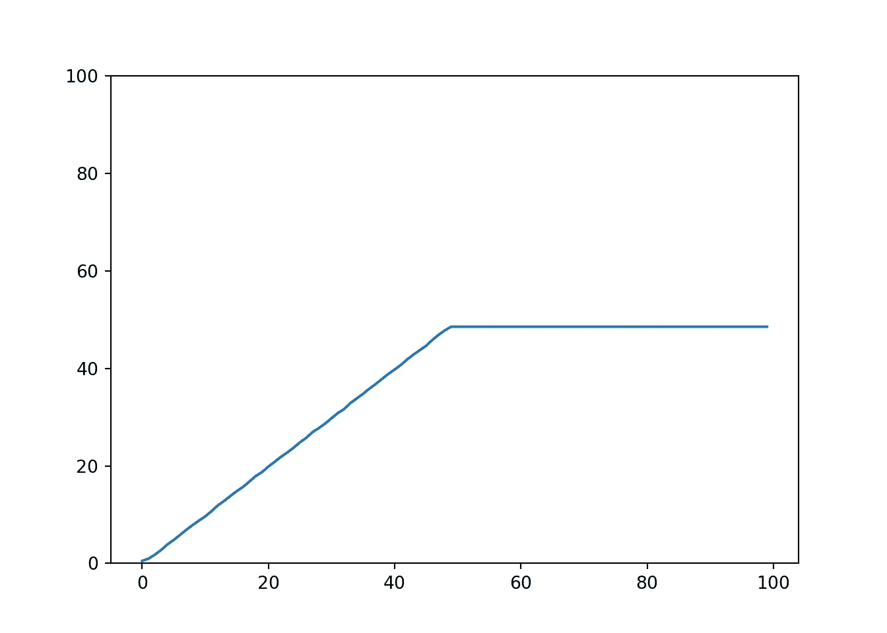
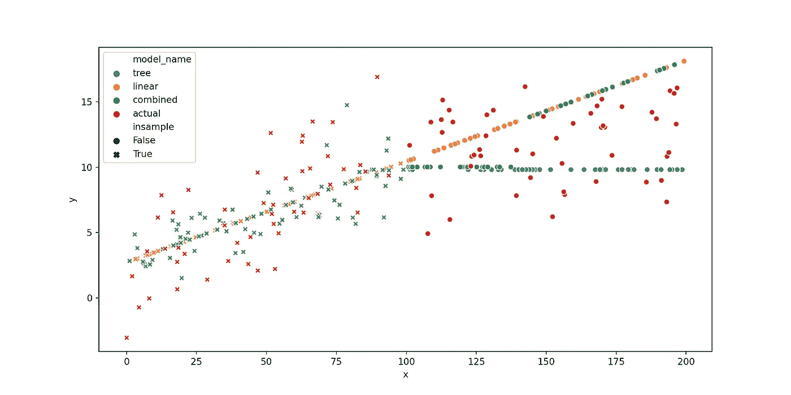

# 将基于树的模型与线性基线模型相结合以改进外推

> 原文：<https://towardsdatascience.com/combining-tree-based-models-with-a-linear-baseline-model-to-improve-extrapolation-c100bd448628?source=collection_archive---------38----------------------->

## [实践教程](https://towardsdatascience.com/tagged/hands-on-tutorials)

## 编写自己的 sklearn 函数，第 1 部分

这篇文章是一个简短的介绍，介绍如何结合不同的机器学习模型以达到实用的目的，在它们的优缺点之间找到一个好的平衡。在我们的例子中，我们将集成一个随机森林，一个非常强大的非线性、非参数的基于树的全能者，一个经典的线性回归模型，一个非常容易解释并且可以使用领域知识验证的模型。

对于许多问题来说，梯度推进或随机森林是最常用的模型。他们经常[胜过](http://blog.kaggle.com/2017/01/23/a-kaggle-master-explains-gradient-boosting/)许多其他模型，因为他们能够学习几乎任何线性或非线性关系。然而，树模型的一个缺点是，它们不能很好地处理新数据，它们通常推断得很差——[阅读更多关于这个](http://freerangestats.info/blog/2016/12/10/extrapolation)的内容。出于实际目的，这可能会导致不期望的行为，例如在预测时间、距离或成本时，稍后将对此进行概述。

我们可以快速验证随机森林模型的 sklearn 实现可以很好地学习给定范围(0 到 50)的标识，但是对于训练数据范围之外的值却很失败:

```
import numpy as np
import matplotlib.pyplot as plt
import seaborn as snsfrom sklearn.ensemble import RandomForestRegressormodel = RandomForestRegressor()X = np.arange(0, 100).reshape(-1, 1)
y = np.arange(0, 100)# train on [0, 50]
model.fit(X[:50], y[:50]);# predict for [0, 100]
## RandomForestRegressor()
plt.ylim(0, 100);
sns.lineplot(X.reshape(-1,), model.predict(X));
plt.show()
```



树模型很难预测样本外的图像。

与树模型相比，线性模型以不同的方式处理新数据。他们可以很容易地推断预测，但当然也有只学习线性关系的缺点。此外，线性模型允许一个简单的解释，简单地通过查看回归系数，我们实际上可以将其与领域知识进行比较，并实际验证它。

因此，对于一些回归问题，将这两种方法结合起来是有意义的，我们可以用一个例子来详细说明:假设我们想要使用历史数据(包含车辆类型、距离和行驶时间的数据集)来估计不同车辆相对于行驶距离的行驶时间。我们可能会考虑使用线性或非线性模型，这也取决于我们的预期。如果我们的目标是估计自行车的旅行时间，距离的增加会导致时间的比例变化(如果你骑自行车的时间增加一倍，你可能会旅行两倍的距离)。如果我们训练一个线性模型，它将是一个很好的拟合，并且系数表达了距离和时间之间的比例。

但是线性模型的一个缺点是，它可能很难了解其他车辆类型(如汽车)的时间与距离的关系。如果开车旅行的距离增加，我们可能会走高速公路，而不是更短的距离，所以旅行时间的增加可能不再是线性比例的。在这种情况下，非线性模型会表现得更好。然而，如果我们在观察到的行驶汽车距离上训练非线性树模型，它将在新数据上表现不佳，即看不见的距离:如果我们的训练数据仅包含 100 公里的汽车行程，则 200 公里的估计将非常糟糕，而线性模型仍将提供良好的外推估计。

为了解决这个问题，我们可以通过以下方式用线性模型支持树模型:如果树模型的预测离我们的基线线性模型的预测太远，我们默认使用线性模型预测。因此，对于我们的示例:如果 200 公里汽车行驶的非线性模型预测是 2 小时(因为它只看到了 2 小时的汽车行驶)，但线性模型预测是 3 小时，我们默认为 3 小时。然而，如果非线性模型的预测与线性模型的验证预测相差不太远(比如说小于 25%)，我们就坚持它(因为我们预期它通常会表现得更好)。

# 编写您自己的组合估计器

在`sklearn`中，我们可以通过创建[我们自己的估计器](http://danielhnyk.cz/creating-your-own-estimator-scikit-learn/)以下面的方式实现这一点。请注意，这第一个实现还不符合 sklearn API 标准——我们将在本文末尾根据[接口](https://scikit-learn.org/stable/developers/develop.html)改进这个版本。

我们简单地拟合两个估计量，并使用两个估计量进行预测。然后，我们可以比较两种预测，并相应地调整我们的预测。如果在线性预测的一定范围内，我们将采用树模型预测。除了比较两个模型并选择更合理的预测，我们还可以取两个预测的平均值或以不同方式混合它们。此外，我们可以使用网格搜索优化参数`upper`和`lower`(为此，我们将需要实现一些进一步的方法，如`get_params`和`set_params`)。

让我们使用非线性函数`f(x)=x+sqrt(x)+rnorm(0, 3)`生成一些样本数据来评估模型:

```
import pandas as pddef f(x):
    if isinstance(x, int):
        return np.sqrt(x) + np.random.normal(0, 3)
    else:
        return np.sqrt(x) + np.random.normal(0, 3, len(x))def generate_data(n=100, x_max=100):
    x = np.random.uniform(0, x_max, n)
    return pd.DataFrame.from_records({'x': x}), f(x)
```

我们现在可以在我们的小样本数据集上训练三个不同的模型:`RandomForestRegressor`、`LinearRegression`和我们的定制`CombinedRegressor`。

```
from sklearn.metrics import mean_absolute_errornp.random.seed(100)
X, y = generate_data(n=100)for model_name, model in models.items():
    print(f'Training {model_name} model.')
    model.fit(X, y);
    print(f'Training score: {model.score(X, y)}')
    print(f'In-sample MAE: {mean_absolute_error(y, model.predict(X))} \n')
## Training tree model.
## RandomForestRegressor()
## Training score: 0.8620816087110539
## In-sample MAE: 1.081361379476639 
## 
## Training linear model.
## LinearRegression()
## Training score: 0.28917115492576073
## In-sample MAE: 2.586843328406717 
## 
## Training combined model.
## CombinedRegressor()
## Training score: 0.35418433030406293
## In-sample MAE: 2.3593815648352554
```

如果我们观察所有三个模型预测和真实值的图(见下文),我们可以很快看到最初讨论的问题:树模型不能真正外推

正如所料，随机森林模型在样本内平均绝对误差方面表现最佳。现在，如果我们评估样本外(150，而不是训练数据中的最大值 100)，事情看起来会有所不同:

```
np.random.seed(101)x = [150]
X_new, y_new = pd.DataFrame({'x': x}), f(x)for model_name, model in models.items():
    y_pred = model.predict(X_new)
    print(f'Testing {model_name} model.')
    print(f'y_new: {y_new}, y_pred: {y_pred}')
    print(f'Test MAE: {mean_absolute_error(y_new, y_pred)} \n')
## Testing tree model.
## y_new: [20.36799823], y_pred: [7.81515835]
## Test MAE: 12.552839880512696 
## 
## Testing linear model.
## y_new: [20.36799823], y_pred: [13.39757247]
## Test MAE: 6.970425764867624 
## 
## Testing combined model.
## y_new: [20.36799823], y_pred: [13.39757247]
## Test MAE: 6.970425764867624
```

由于不能外推，树模型做得不好，线性模型做得更好，因此由线性回归支持的集合模型做得更好。同时，它仍将在样本内表现良好，并且如果我们大幅增加范围，它将表现良好(仅比树模型好，比线性回归差):

```
np.random.seed(102)X_new, y_new = generate_data(n=100, x_max=200)for model_name, model in models.items():
    y_pred = model.predict(X_new)
    print(f'Testing {model_name} model.')
    print(f'Test MAE: {mean_absolute_error(y_new, y_pred)} \n')
## Testing tree model.
## Test MAE: 3.67092130330585 
## 
## Testing linear model.
## Test MAE: 2.5770058863460985 
## 
## Testing combined model.
## Test MAE: 2.6143623109839984
```

我们还可以绘制一些随机数据(训练样本内外)的单个预测，并快速查看之前未看到的 x 值和树模型的初始讨论问题，该问题变平了。线性模型继续趋势，组合版本有不愉快的颠簸，但一旦树模型偏离太多，至少跟随趋势。



我们不同模型的外推行为——图片由作者完成。

# Sklearn 兼容性

如果我们想实现[完全 sklearn 兼容性](https://scikit-learn.org/stable/developers/develop.html)(型号选择、管道等。)并使用 sklearn 的机载测试工具，我们必须对估计器进行一些修改:

*   我们需要为参数添加 setters 和 getters(我们使用 sklearn 的约定，用名称和两个下划线作为参数的前缀，即`base_regressor__some_param`)
*   随机状态的一致处理

这可以通过以下方式实现:

然后，我们可以在我们的自定义估计器上运行超参数网格搜索:

我们还可以使用`sklearn.utils.estimator_checks`工具来检查我们的估计器:

在某些情况下，您可能无法满足特定的验证，例如，在这种情况下，您可以将特定检查的返回值伪造为 true:

```
import mockfrom sklearn.utils.estimator_checks import check_estimatorwith mock.patch('sklearn.utils.estimator_checks.check_estimators_data_not_an_array', return_value=True) as mock:
    check_estimator(CombinedRegressor())
```

# 包裹

如果我们有一个模型，它对一组特定的输入非常有效，但是一旦输入变得更加奇特，我们就会失去信心，那么这种方法就非常有用。在这种情况下，我们可以通过使用更透明的(例如线性)方法，我们可以很容易地与领域知识同步，并保证特定的行为(例如外推、比例增量)。

除了使用组合估计器，我们还可以使用具有更好外推行为的非线性模型，如神经网络。另一种替代方法是向训练数据集添加一些人工样本，以增加支持的响应范围。

*最初发表于*[*【https://blog.telsemeyer.com】*](https://blog.telsemeyer.com/2019/10/30/combining-tree-based-modelss-with-a-linear-baseline-model-to-improve-extrapolation-writing-your-own-sklearn-functions-part-1/)*。*