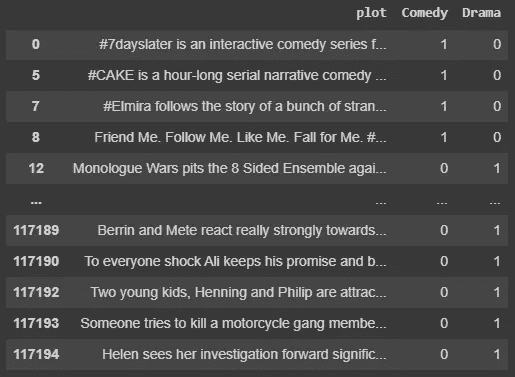
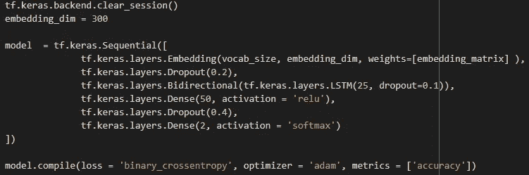
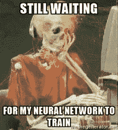
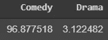
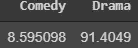

# 喜剧还是戏剧？

> 原文：<https://towardsdatascience.com/comedy-or-drama-d8f30c31552c?source=collection_archive---------62----------------------->

## 教机器幽默感的尝试

查尔斯·德鲁维奥在 [Unsplash](https://unsplash.com?utm_source=medium&utm_medium=referral) 上拍摄的照片

如果你是 YouTube 或网飞的用户，你一定知道在你观看每个视频后会弹出的*‘推荐给你’*视频。这是一个商业如何使用自然语言处理(NLP)技术开发数据驱动产品的经典例子。无论是有监督的还是无监督的 NLP 变体，都一直吸引着我去深入挖掘和研究这些黑箱模型。作为一个了解更多的实验用例，我试图开发一个流派分类器(版本 1.0.0 ),根据其情节/剧情简介预测电影是喜剧还是戏剧。让我们开始吧。

# 数据

我把这个项目建立在 [IMDB 数据集](https://www.imdb.com/interfaces/)上。原始数据集包含了从电影语言到演员细节的大量信息。对于我目前的用例，我将只局限于电影的情节和类型。原始数据集包含 26 个流派，然而，我决定一步一步来，目标是首先在 2 个类别上安装二元分类器，即喜剧和戏剧。这是我的原始数据的样子:

我从来没有听说过的电影情节！

# 预处理和设计

第一项任务是将文本转换成机器能够理解的语言。这包括很多步骤，比如标记化和嵌入，每一步都有不同的风格。如果你是 NLP 新手，这篇[文章](https://www.kdnuggets.com/2020/01/intro-guide-nlp-data-scientists.html)将带你快速了解处理 NLP 问题的一般技术。

作为 Keras 库的热心用户，使用 Keras 对文本进行了处理和标记。对于我的单词嵌入，我选择了[手套](https://nlp.stanford.edu/projects/glove/)。虽然 Keras 嵌入为您提供了使用多个单词嵌入的灵活性，但预训练手套嵌入带来的性能提升是无与伦比的。

任何数据科学项目的一个重要要点是 GIGO(垃圾输入，垃圾输出)，再多的模型开发也无法弥补垃圾数据。这个 [Kaggle 内核](https://www.kaggle.com/christofhenkel/how-to-preprocessing-when-using-embeddings)将向您展示选择正确的文本预处理和单词嵌入如何对最终模型产生影响。一旦我们准备好数据，我们就可以继续进行模型构建。

在几个世纪的时间里，我尝试了不同的排列和组合，最终构建了一个双向 LSTM 神经网络，它给了我一个合理的性能(在测试集上有 85%的准确率)。

最终模型

最终密集层中的 softmax 激活函数返回潜在结果的概率分布。因此，例如，如果模型返回 70%喜剧和 30%戏剧的概率分布，则电影情节将被分类为喜剧。

图片胜过千言万语！

# 观察和结果

现在，事情变得有趣了。我在一些我最喜欢的电影的不同情节上尝试了我的模型。因为有太多的模特，我把模特表现特别好的那些列入了候选名单。先说我最喜欢的一部喜剧电影的节选。

> 婚礼前两天，道格和三个朋友开车去拉斯维加斯参加一个疯狂而难忘的男性聚会。事实上，当三个伴郎第二天早上醒来时，他们什么都不记得了；他们也找不到道格。时间不多了，三个朦胧的伙伴试图重新追踪他们的脚步，找到道格，这样他们就可以让他及时回到洛杉矶，走上红毯。

正如一些人可能已经猜到的，这是《*宿醉*》的梗概。我的模型对这个情节做出了如下预测。

“宿醉”的预测

在我的另一部最爱，莱昂纳多迪卡普里奥的戏剧电影*《血钻》*上尝试，产生了以下结果。

> 随着 20 世纪 90 年代塞拉利昂内战的爆发，两个男人，一个南非雇佣兵和一个门德渔民加入了一个共同的追求，寻找一种能够改变他们生活的稀有宝石。在一名美国记者的帮助下，这些人踏上了穿越叛军领地的危险旅程，以实现他们的目标。”

“血钻”的预测

这些都是相当准确的预测。然而，它并不总是阳光和彩虹，因为模型远非完美！。NLP 模型的驱动引擎是词汇表及其与其他相似单词的相应空间关联。而且，就像人类的大脑一样，这个引擎必须经过调整和训练，才能理解单词的上下文。这是我的模型无法清晰描述的。当它看到脱离上下文的单词时，它会有一点挣扎。比如电影*‘小丑’。*

> 失败的喜剧演员亚瑟·弗莱克永远独自在人群中，当他走在高谭市的街道上时，他寻求联系。亚瑟戴着两个面具——一个是他为日常工作画的小丑面具，另一个是他徒劳地试图感觉自己是周围世界的一部分的伪装面具。受到社会的孤立、欺凌和忽视，弗莱克开始慢慢陷入疯狂，他变成了被称为小丑的犯罪大师。

“小丑”的预测

可能是受到了单词*‘喜剧演员’，*的影响，这个模型把上面的错误归类为*‘喜剧’*，而这部电影，实际上，完全相反。

从好的方面来看，有一些先进的技术可以处理这个问题，我将在接下来构建多类分类器的过程中探索这些技术。非常感谢您的阅读。我将很快上传一个记录在案的 Colab 笔记本，所以你可以以此为基础来改进它和/或尝试你的想法。