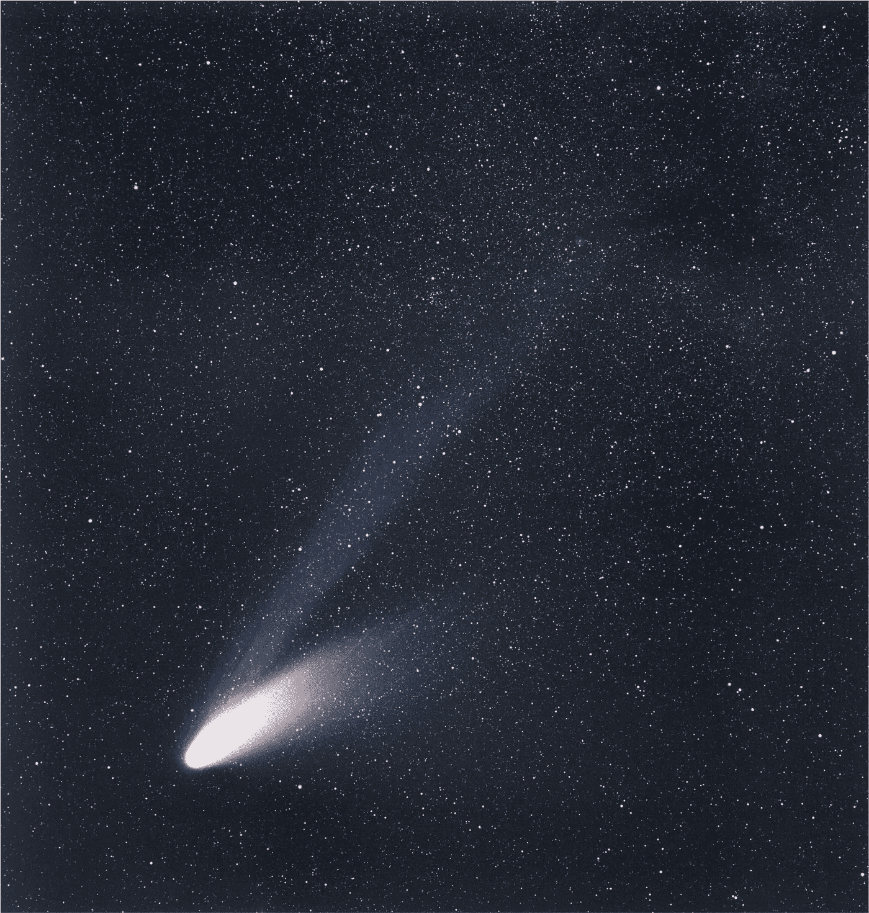

# Python 的空间科学:彗星——来自远方的游客

> 原文：<https://towardsdatascience.com/comets-visitors-from-afar-4d432cf0f3b?source=collection_archive---------60----------------------->

## [用 Python 进行空间科学](https://towardsdatascience.com/tagged/space-science-with-python)

## 系列教程的第 7 部分“[用 Python 进行空间科学](https://towardsdatascience.com/tagged/space-science-with-python)”将开始一个小的科学项目，在那里我们将熟悉冰冷的宇宙访客:彗星


艺术家对来自另一个恒星系的星际访客“Oumuamua”彗星的印象。鸣谢:[ESA/哈勃，NASA，ESO，m . Kornmesser](https://www.eso.org/public/unitedkingdom/images/eso1820a/)；许可: [*知识共享署名 4.0 国际许可*](http://creativecommons.org/licenses/by/4.0/)

# 前言

*这是我的 Python 教程系列“用 Python 进行空间科学”的第 7 部分。这里显示的所有代码都上传到了*[*GitHub*](https://github.com/ThomasAlbin/SpaceScienceTutorial)*上。尽情享受吧！*

# 介绍

每一代都有它的“大彗星”。从地球上肉眼可见的彗星，以其模糊的外观和长长的尾巴在夜空中闪耀数周或数月。对我来说，它是 20 世纪 90 年代末的海尔-波普彗星。我的父母给我买了一个望远镜，从我们公寓的阳台上，一个终生的激情诞生了。

从远处看，彗星经常被称为“肮脏的冰球”。固体“球”就是所谓的原子核。如果这样一个核靠近太阳，它就会升温，释放出气体和尘埃粒子。气体和尘埃大量释放出来，在彗星的核心部分形成了三个结构。这三个部分是:

*   **彗发**:围绕着原子核的球形大气状结构，包含气体和尘埃/冰粒
*   尘埃尾:尘埃粒子沿着彗星的轨道/路径分布
*   **离子尾**:由于太阳的辐射，气体粒子带电，并受到太阳磁场和太阳风(太阳发射的带电粒子)的强烈影响。离子尾径向远离太阳

除了水和矿物质，我们知道彗星还含有氨基酸和其他重要的生命构成元素。这些科学见解只有通过向这些宇宙流浪者发送机器人航天器才有可能实现。未完成的任务有:

*   乔托:1980 年末欧洲航天局对哈雷彗星的探测任务
*   星尘:美国国家航空航天局的一项任务，15 年前从 81P / Wild 2 号彗星的尾部收集尘埃颗粒并将其送回地球
*   Rosetta :欧空局对彗星 67P/Churyumov-Gerasimenko 的任务。经过 10 年的旅程，飞船于 2014 年抵达彗星，并部署了一个名为菲莱的着陆器

*但是彗星是从哪里来的？为什么有些出现的频率更高？他们是威胁还是我们都认识他们？(*)*

在本节课和接下来的几节课中，我们将仔细研究这些数据。我们将确定彗星的起源，并计算一些基本属性来回答这些问题。

现代空间科学和天体物理研究与数据科学和机器学习密切相关。但是作为任何数据科学工作，我们需要从数据工程部分开始，在那里我们收集数据并为我们未来的工作做准备。

# 小行星中心

在我们开始使用数据之前，我们需要看一下我们现在使用的库。就像在我们上次的会议中一样，我们需要像 [*datetime*](https://docs.python.org/3/library/datetime.html) (用于日期时间解析)、 [*numpy*](https://numpy.org/) 和 [*pandas*](https://pandas.pydata.org/) 这样的库来进行数据准备和工程。我们稍后使用 [*pathlib*](https://docs.python.org/3/library/pathlib.html) 创建一个子目录，并加载 [*spicepy*](https://github.com/giaccone/SpicePy/blob/master/README.md) 以使用 [NASA 的 SPICE 工具包](https://naif.jpl.nasa.gov/naif/toolkit.html)来执行空间科学任务。

上次我们创建了一个函数，允许我们从互联网下载文件(例如，SPICE 内核文件)并将其存储在本地目录中。该功能存储在名为 *_auxiliary* 的新主文件夹中。目前，我们只有一个公共函数，不需要为一个任务创建单独的 Python 库。因此，使用包 [*sys*](https://docs.python.org/3/library/sys.html) 和函数 *sys.path.insert* (第 12 行和第 13 行)，我们从*_ 辅助*文件夹(第 14 行)添加脚本和内容。

第 1/10 部分

已知彗星的详细列表由[小行星中心](https://www.minorplanetcenter.net/iau/mpc.html) (MPC)提供。MPC 收集所有居住在我们太阳系的小天体的信息。我们[下载](https://www.minorplanetcenter.net/data)以压缩 JSON 格式提供的数据，并将它们存储在一个名为 *raw_data* 的文件夹中。(第 3 + 4 行定义文件夹和 MPC URL 第 7 行调用下载函数，该函数创建子目录并存储文件*cometels.json.gz*。MPC 提供了文件内容的[详细描述](https://www.minorplanetcenter.net/iau/info/CometOrbitFormat.html)。我们一会儿就需要这些信息。

第 2/10 部分

出于测试目的，我们将在下一节计算彗星的状态向量。这样就加载了一个 SPICE 内核元文件…

第 3/10 部分

…路径指向 *gm_de431.tpc* (包含其他行星常数)和 *naif0012.tls* (包含时间和闰秒信息)内核。

```
\begindataKERNELS_TO_LOAD = (
 ‘../_kernels/pck/gm_de431.tpc’
 ‘../_kernels/lsk/naif0012.tls’,
 )
```

现在，压缩的 JSON 文件被加载。 *pandas* 函数 [*read_json*](https://pandas.pydata.org/pandas-docs/stable/reference/api/pandas.read_json.html) 直接读取压缩文件并创建数据帧。

第 4/10 部分

让我们看看提供的数据。该文件包含轨道要素、彗星名称、参考文献等。和:2 个不同的日期时间；根据[文档](https://www.minorplanetcenter.net/iau/info/CometOrbitFormat.html):

```
**Columns   F77    Use**

[...]
   15 -  18  i4     Year of perihelion passage
   20 -  21  i2     Month of perihelion passage
   23 -  29  f7.4   Day of perihelion passage (TT)
[...]
   82 -  85  i4     Year of epoch for perturbed solutions
   86 -  87  i2     Month of epoch for perturbed solutions
   88 -  89  i2     Day of epoch for perturbed solutions
```

基于轨道元素，我们想要计算状态向量。对于这个计算，我们将应用 SPICE 函数 [*二次曲线*](https://naif.jpl.nasa.gov/pub/naif/toolkit_docs/C/cspice/conics_c.html) 。该函数需要一个天体的平均异常值和相应的星历时间，称为历元。平均异常是使用近日点方向作为参考方向的角度。因此，“年”、“月”和“近日点通过日”是需要的日期时间。与近日点通过的日期时间相对应的平均异常是(根据定义)0 度！

让我们基于三个日期列(第 10 到 14 行)创建一个 UTC 时间戳。应用 lambda 函数，将年、月和日字符串合并为格式为*年-月-日*的日期。日期是以十进制数给出的。例如，15.5 对应于 UTC 第 15 天的 12:00:00。“十进制时间”需要转换成适当的时间格式。首先(第 18 行)，我们定义一个占位符日期，它可以与第 23 到 26 行中的[*datetime . time delta*](https://docs.python.org/3/library/datetime.html#timedelta-objects)函数一起使用。将十进制的日期和时间添加到占位符日期(第 25 行)，并使用 [*strftime*](https://docs.python.org/3/library/datetime.html#strftime-and-strptime-behavior) 函数将得到的日期时间对象转换为*小时:分钟:秒*(第 26 行)。

现在，日期和时间在第 29 到 32 行合并，并且相应的星历时间(ET)可以在第 35 行使用 SPICE 函数 [*utc2et*](https://naif.jpl.nasa.gov/pub/naif/toolkit_docs/C/cspice/utc2et_c.html) 计算。

第 5/10 部分#

我们现在准备计算一个用于测试的状态向量，看看我们是否正确地处理了数据。

# 伟大的海尔波普



大彗星 C/1995 O1 的图像(海尔-波普)。上世纪末，这颗彗星有一年多的时间是可见的。蓝色的尾巴是所谓的离子尾，主要受太阳风的影响。灰/白尾巴由沿着彗星轨道分布的尘埃和冰粒组成。信用:[ESO/e . Slawik](https://www.eso.org/public/unitedkingdom/images/phot-mar14-hbs-2/)；许可: [*知识共享署名 4.0 国际许可*](http://creativecommons.org/licenses/by/4.0/)

对于测试用例，我们选择海尔-波普彗星。*不得不承认，我个人的喜好是选择这颗特殊彗星*的原因。

对于 [*圆锥曲线*](https://naif.jpl.nasa.gov/pub/naif/toolkit_docs/C/cspice/conics_c.html) 函数，我们需要轨道元素(存储在数据帧 *c_df* 中)以及太阳的 *G*M* 参数。第 4+5 行使用 SPICE 函数 [*bodvcd*](https://naif.jpl.nasa.gov/pub/naif/toolkit_docs/C/cspice/bodvcd_c.html) 从对应的行星内核中提取并定义 *G*M* 常数。第 8 行创建了一个 Hale-Bopp 数据帧。代码部分…

```
c_df[‘Designation_and_name’].str.contains(‘Hale-Bopp’)
```

…使用 *Designation_and_name* 列，搜索包含 *Hale-Bopp* 的子串。通过 [*loc*](https://pandas.pydata.org/pandas-docs/stable/reference/api/pandas.DataFrame.loc.html) 功能，分配相应的 Hale-Bopp 数据帧行。

第 13 行到第 21 行定义了一个输入数组，该数组包含了 [*二次曲线*](https://naif.jpl.nasa.gov/pub/naif/toolkit_docs/C/cspice/conics_c.html) 函数的正确格式的所有数据(距离以 km 为单位，角度以弧度为单位，平均异常等于 0 度)。

第 6/10 部分

彗星的状态向量是为协调世界时 2020 年 5 月 5 日(午夜)计算的(第 2+3 行)。我们使用 [NASA 地平线网络接口](https://ssd.jpl.nasa.gov/horizons.cgi)来计算参考状态向量，以便与(**)进行比较:

第 7/10 部分

结果如下所示。可以看出，基于 MPC 轨道数据的结果与 NASA HORIZONS 数据非常一致。

```
Comparison of the computed state 
vector with the NASA HORIZONS results
==========================================
X in km (Comp): 5.347972e+08
X in km (NASA): 5.348377806424425E+08
==========================================
Y in km (Comp): -2.702078e+09
Y in km (NASA): -2.702225247057124E+09
==========================================
Z in km (Comp): -5.904119e+09
Z in km (NASA): -5.904425343521862E+09
==========================================
VX in km/s (Comp): 6.856500e-01
VX in km/s (NASA): 6.857065492623227E-01
==========================================
VY in km/s (Comp): -3.265125e+00
VY in km/s (NASA): -3.265390887669909E+00
==========================================
VZ in km/s (Comp): -4.968756e+00
VZ in km/s (NASA): -3.265390887669909E+00
```

# 科学数据库

我们从 MPC 下载了彗星数据。我们通过比较计算出的状态向量和 NASA 地平线系统的结果来检查数据的一致性。因此，我们为进一步的彗星研究打下了坚实的数据基础！

我们创建了一个 [SQLite](https://www.sqlite.org/index.html) 数据库，而不是重新加载数据帧和解析 JSON 文件。SQLite 允许生成一个存储在一个文件中的全功能 SQL 数据库。这种嵌入式解决方案用于例如移动设备上。甚至更大的数据集也可以存储在这个嵌入式解决方案中，而不需要专用服务器或分布式文件系统(*轶事:在我的硕士论文和后来的博士研究中，我一直使用 SQLite。我创建并使用了大小约为 250 GB 的 SQLite 数据库，令人惊讶的是，它们具有良好的性能*。

但是首先，让我们增加两个参数，我们可以很容易地从轨道元素中得到:半长轴(第 2 到 5 行)和远日点(第 8 到 11 行)。我们只计算偏心率小于 1 的闭合轨道的值。

第 8/10 部分

在教程的主文件夹中，为(comets)数据库创建了一个新目录(第 3 行)。第 6 行连接(分别创建)一个 SQLite 数据库，第 7 行设置一个游标。现在，创建了一个名为 *comets_main* 的表(第 11 到 25 行)。主键是彗星的指定名称。整数或分类主键更好更快，例如，在不同的表之间创建连接。在我们的例子中，我们只有几百行和几列。这场演出对我们的目的来说足够好了。此外，一切都保持“人类可读”。第 20 行添加了平均异常，并设置默认值为 0 度，因为平均异常不是由 MPC 数据提供的(只有近日点通过时间)。

第 9/10 部分

我们现在使用[命令*执行*命令](https://docs.python.org/3/library/sqlite3.html#sqlite3.Cursor.executemany)将数据写入数据库。我们现在为进一步的科学工作做好了准备！

第 10/10 部分

# 结论与展望

今天我们开始了我们的彗星科学之旅。我们从小行星中心下载了数据，分析了数据，并使用海尔-波普数据来验证内容。在接下来的教程中，我们的分析将基于创建的 SQLite 数据库。数据工程、准备和清理是数据科学以及任何其他科学领域的关键要素。

下一次，我们将熟悉数据，并从 800 颗彗星中获得科学见解(*)，例如，什么是 C 或 P 轨道类型？*)。我们将学习一些基本的 SQL 命令。如果你想看一下数据库，我建议你使用一个 SQLite 浏览器，比如 [SQLiteBrowser](https://sqlitebrowser.org/) 。由于数据库相当小，它也被上传到 GitHub 上。

托马斯

## 脚注

(*)彗星、小行星、流星体、行星、矮行星等等……*这些天体有什么区别？有什么不同吗？*除了“Python 的空间科学”系列，我还想在一些“补充空间科学文章”中与您分享一些空间科学知识。

(**) NASA HORIZONS 只是许多其他伟大工具中的一个工具。无论是作为网络界面还是桌面应用程序:“补充空间科学文章”也可以涵盖有用工具和程序的附加信息。

请让我知道如果一些简短的补充空间科学文章将不胜感激。