# 常见的激活功能以及为什么你必须知道它们

> 原文：<https://towardsdatascience.com/common-activation-functions-and-why-you-must-know-them-ec90e54a7079?source=collection_archive---------51----------------------->

## 对常用激活功能的实现、额外好处、注意事项和使用的总结

激活函数是神经网络的基本构件。然而，在人们能够有效地使用它们之前，必须仔细地研究它们。这是因为激活函数有活动区域和死亡区域，使得它们在模型中要么学习要么行动死亡。让我们一个接一个地讨论它们的正确使用和它们的缺点。

# Sigmoid 函数

**Sigmoid 函数**或 **logistic 函数**或**软阶跃函数**是研究神经网络性能的共同出发点。从数学上讲，这个函数及其导数可以表示为图 1 所示。

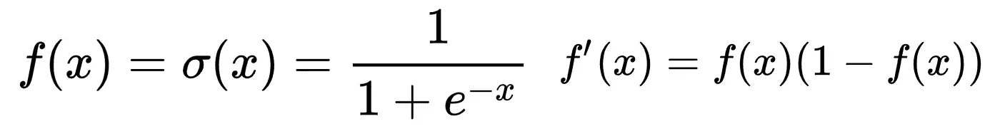

图 1 Sigmoid 函数和导数(图片由作者提供)

该函数可以如图 2 所示绘制。

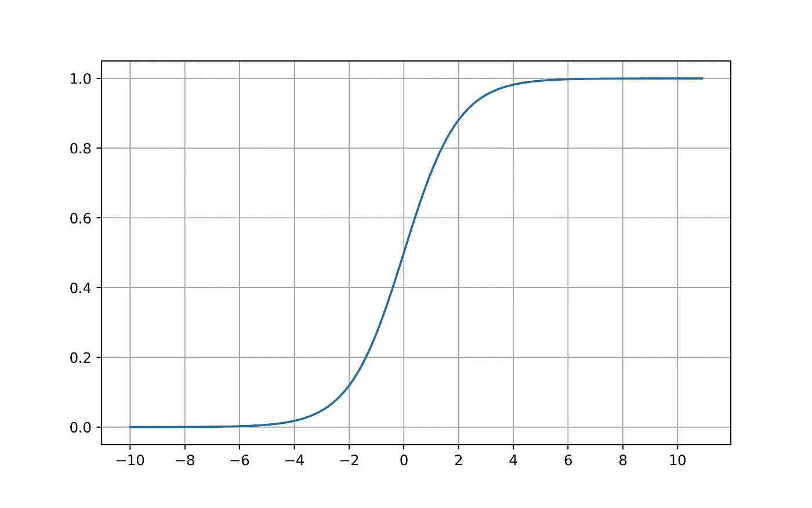

图 2 Sigmoid 函数(图片由作者提供)

我们可以看到该函数只能在大致-4 到 4 的范围内帮助训练。这是因为，在任何一侧超过这些限制，梯度都不显著。让我们看看图 3 所示的梯度曲线。

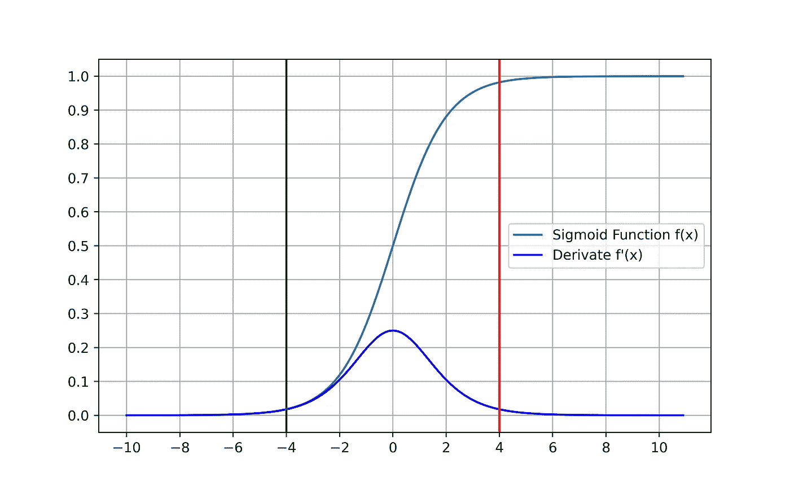

图 3 sigmoid 函数的导数(图片由作者提供)

我们可以看到，在绿线和红线所示的[-4，4]的限制之外，梯度并不那么显著。这就是所谓的**消失渐变**的问题。由于这个原因，在深层网络中使用 sigmoid 函数是不理想的。此外，如果你想把更小的值(< 1)不断相乘，你最终会得到非常小的值。这在深层网络中是不利的条件。所以 **sigmoid** 根本就不是深度学习想要的激活。 **ReLU** 是克服 sigmoid 函数不良结果的第一个变通方法。

虽然 **sigmoid** 函数不用于隐藏层，但它是**输出层**的理想选择。这是因为 sigmoid 给出了[0，1]范围内的值，这可以帮助我们训练一个用于二进制编码输出的网络。这应当连同一个 ***二元交叉熵*** 损失函数一起完成。

# ReLU ( **R** 有效 **L** 线性单位)函数

ReLU 只是简单地输出一个神经元的非负输出。在数学上，这可以表示为如图 4 所示。

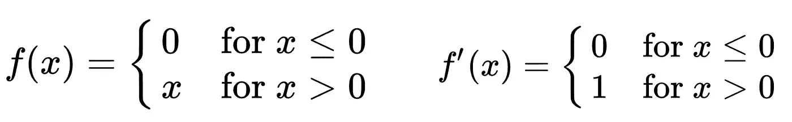

图 4 ReLU 函数和导数(图片由作者提供)

我们可以绘制函数及其导数，如图 5 所示。

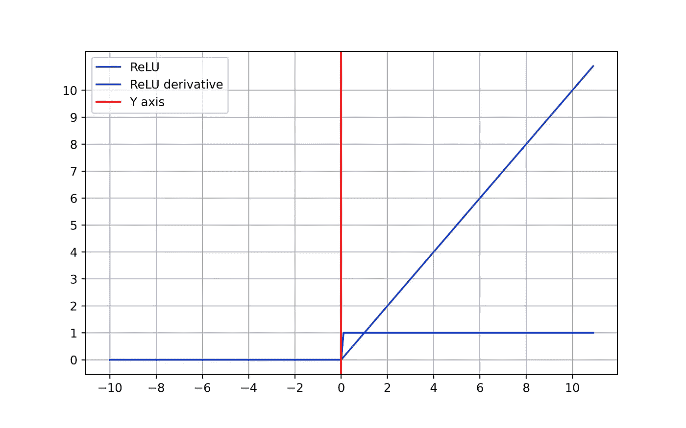

图 5 ReLU 及其衍生产品(图片由作者提供)

如图 5 所示，导数永远不会死在正区域。此外，由于值是在没有任何阻尼的情况下输出的，因此值不会像我们在 **sigmoid** 函数中看到的那样消失。因此， **ReLU** 成为深度学习的理想候选。然而，正如你可能已经注意到的， **ReLU** 根本不存在于负空间中。这通常是可以的，因为神经网络的输入值和输出值是正的。然而，如果你有范围[-1，1]内的标度值或标准化值，这可能会杀死一些无法恢复的神经元。这种现象被称为**垂死的 ReLU** 。虽然这不是人们应该担心的事情(可以通过使用最小-最大缩放器进行缩放来避免)，但了解变通方法是值得的。注意，由于值通过 ReLU 网络的爆炸性质，通常不希望在**输出层**中使用 **ReLU** 。此外，爆炸值会导致**爆炸梯度**的现象。然而，使用适当的 ***剪裁*** 和 ***规则化*** 可以有所帮助。

# ReLU 变量和其他线性单位函数

ReLU 有几个变种，有助于克服**死 ReLU** 的问题。

## PReLU(参数 ReLU)和泄漏 ReLU

**参数化 ReLU** 试图将负输入参数化，从而使垂死 ReLU 恢复。然而，该参数是一个可学习的参数，但 **Leaky ReLU** 除外，它为负分量使用一个固定参数。通常这个参数被选择为一个小值，因为网络的典型输出被认为是正的。

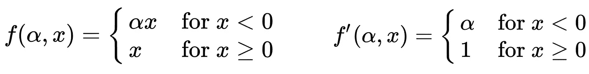

图 6 PReLU 和衍生工具(图片由作者提供)

对于给定的𝛂值(0.1)，我们绘制了如图 7 所示的图表。这是**漏 ReLU** 的场景，0.1 为负乘数。

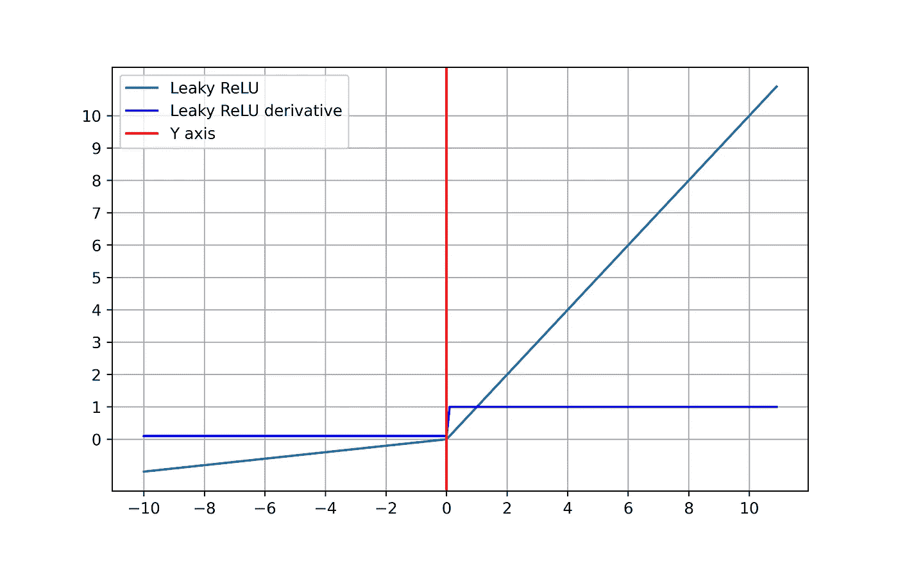

图 7 ⍺=0.1 的泄漏 ReLU(图片由作者提供)

注意，负区域中的梯度是细微的，但不为零。还有，节点面对太多负面数字也不会死。

## ELU(指数线性单位)函数

在该函数中，负分量使用指数表示法建模。然而，我们仍然有可学习的参数𝛂.

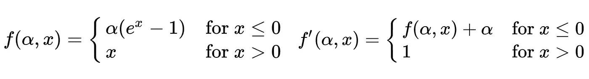

图 8 ELU 函数(图片由作者提供)

我们可以将其绘制成图 9 所示。这里，为了更好的可视性，我们假设𝛂=0.5。

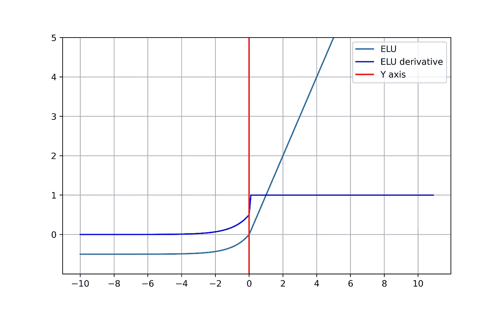

图 9 ELU 函数及其导数(图片由作者提供)

既然我们已经讨论了深度网络中使用的几个重要函数，那么让我们来看看一些常见但不那么复杂的函数。

# Tanh 函数

**谭**是 **LSTM** 网络背后的驱动力。这有助于避免 **RNNs** 的缺点。

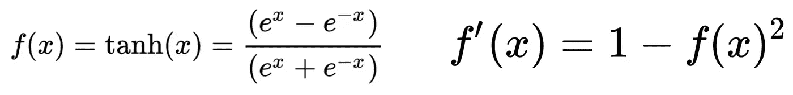

图 10 双曲正切函数和导数(图片由作者提供)

我们可以将其绘制成图 11 所示。

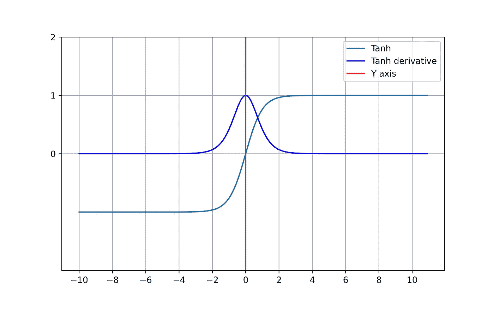

图 11 双曲正切函数和导数(图片由作者提供)

# 更多的激活功能

*   **恒等函数:**这是`f(x)=x`带导数`f'(x)=1`的朴素函数。
*   **Softmax 函数:**该函数保证输出加起来为 1 的层的值。这主要用于使用 ***分类交叉熵*** 作为损失函数的分类分类，并且主要用于输出层。

## 笔记

激活函数的设计主要考虑导数。这就是为什么你会看到一个很好的简化的导数函数。

必须通过查看输入值的范围来选择激活函数。然而， **ReLU** 或 **PReLU** 是一个很好的起点，带有**s 形**或 **softmax** 到输出层。

具有可学习参数的激活功能通常被实现为单独的层。这更直观，因为参数是通过相同的反向传播算法学习的。

希望你喜欢阅读这篇文章。

干杯！:)