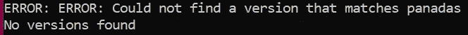
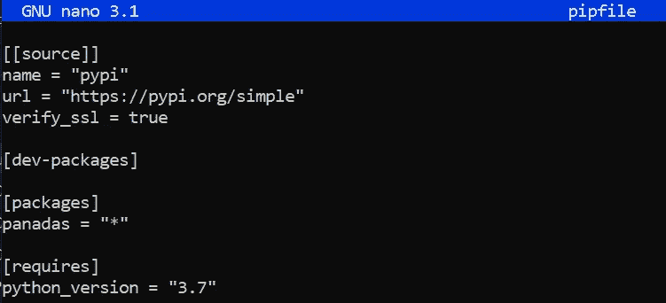
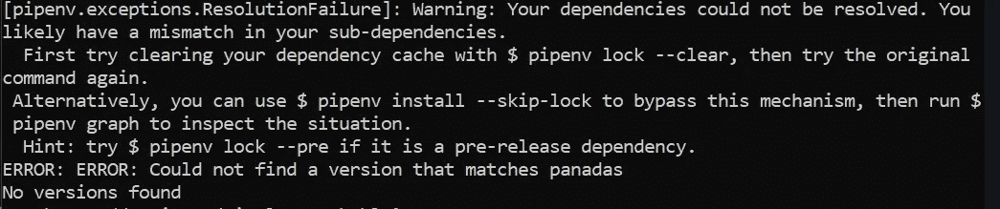

# 常见 Pipenv 错误及解决方法:为什么不能锁定？！

> 原文：<https://towardsdatascience.com/common-errors-and-how-to-solve-them-why-wont-it-lock-8f5e57111f23?source=collection_archive---------3----------------------->

## Pipenv 无法锁定时该怎么办

作者:[爱德华·克鲁格](https://www.linkedin.com/in/edkrueger/)和[道格拉斯·富兰克林](https://www.linkedin.com/in/douglas-franklin-1a3a2aa3/)。

本文是众多介绍 Python 包和使用 Pipenv 进行环境管理的文章之一。在这里，您将学习如何解决 Pipenv 安装和锁定问题。有关 Pipenv 或环境的更多信息，请查看这篇 [***中型文章***](/virtual-environments-for-data-science-running-python-and-jupyter-with-pipenv-c6cb6c44a405) *！*


马科斯·迈尔在 Unsplash 上的照片

## Pipenv 是什么？

Pipenv 将软件包管理和虚拟环境控制结合到一个工具中，用于安装、删除、跟踪和记录您的依赖关系；以及创建、使用和管理您的虚拟环境。Pipenv 本质上是将 pip 和 virtualenv 包装在一个产品中。

当您使用 Pipenv 开始一个项目时，该工具会自动创建一个虚拟环境、一个 Pipfile 和一个 Pipfile.lock。当您用`pipenv install`安装一个包时，Pipfile 会自动用新的依赖项更新。

## 锁定问题:Pipfile 包含对不存在的包的引用

当 Pipfile 试图安装不存在的软件包，即错别字时，它不会锁定。

例如:

```
pipenv install panadas
```

Pipenv 查找您指定的包，不管它是否存在。当包不存在或由于其他原因找不到时，您会在终端中看到以下错误和更多错误。现在，我们将把重点放在这两个方面。


安装错别字



Pipenv 找不到 Panadas 的版本

锁定失败！请注意,“panadas”被添加到 Pipfile 的包中。这种打字错误将成为一个问题，因为现在我们的 Pipfile 包含一个错误，任何使用这个 Pipfile 的人都会遇到锁定和依赖错误。请注意，“安装成功”警报是不真实的；没有要安装的 Panadas。所发生的只是将“panadas”添加到 Pipfile 中。Pipfile 中的拼写错误是锁定失败的最常见原因。

只要 Pipfile 中存在这种输入错误，安装一个包，不管存在与否，都会导致锁定失败。您需要在文本编辑器中修复 Pipfile。我用的是纳米。你可以使用任何你觉得舒服的编辑器；Sublime，VS 代码，Atom 等。只需将 Panadas 改为 Pandas，然后`pipenv install.`



现在让我们看看锁定失败时控制台中出现的其他一些错误消息。



注意建议`pipenv install --skip-lock`。这应该只在极端或因果编程环境中使用，因为它绕过了 Pipfile。锁的主要用途；锁定软件包版本并创建安装环境依赖项的公式。

## pip 文件管理:指定版本

锁定失败的第二个最常见的原因是我们试图安装一个预发布版本的包。您可以通过在安装中添加`--pre`标志来解决预发布版本冲突。

```
pipenv install --pre
```

在这个命令之后，您的 Pipfile 有了一个新变量； `allow_prereleases = true`。请注意，这将允许在您的环境中安装任何预发行软件包。现在是固定特定包版本有用的时候了。固定版本是一个很好的习惯，可以防止将来出现依赖问题。

请注意上面“要求”部分下的 Pipfile 图像；你看`python_version = 3.7`。Pipfile 在这里指定了 Python 版本。

要使用特定的 Python 版本构建 Pipfile 或环境，请使用以下语法。

```
pipenv --python 3
```

需要时还可以指定包版本。

```
pipenv install django=1.11.10
```

## 结论

通过 Pipenv 和 Pipfile，您向其他人展示了一种安装项目依赖项以及测试和开发需求的标准化方法。任何拥有您的 Pipfile 副本的人都可以使用下面的命令重新创建您的环境。

```
pipenv install
```

这将创建一个由 Pipfile 指定的环境。确保 Pipfile 没有打字错误，并且在共享之前指定了正确的包和 Python 版本！

如果这不是您正在寻找的 pipenv 解决方案，请查看这篇中型文章以获得有关其他 Pipenv 错误的帮助！

[](/common-pipenv-errors-3a6f8ce81562) [## 常见 Pipenv 错误

### Pipenv 错误及其解决方案的集合。

towardsdatascience.com](/common-pipenv-errors-3a6f8ce81562)