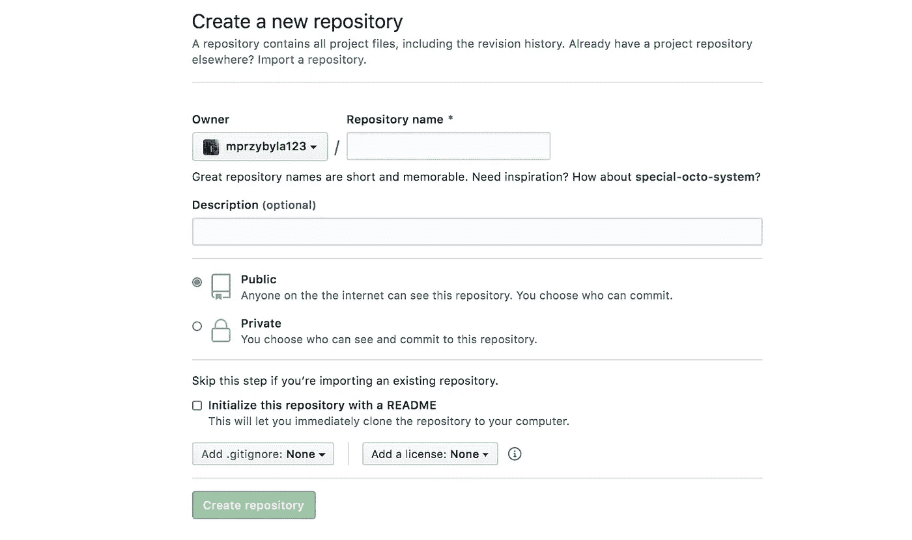

# 每个数据科学家都需要知道的通用 Git 命令

> 原文：<https://towardsdatascience.com/common-github-commands-every-data-scientist-needs-to-know-e7d5d9c4f080?source=collection_archive---------50----------------------->

## 通过使用 Git 和 GitHub 成为更好的数据科学家的指南


马库斯·温克勒在[Unsplash](https://unsplash.com/s/photos/github?utm_source=unsplash&utm_medium=referral&utm_content=creditCopyText)【1】上的照片。

# 目录

1.  介绍
2.  GitHub 设置
3.  命令
4.  摘要
5.  参考

# 介绍

对于软件工程师、数据工程师、机器学习工程师和数据科学家来说，GitHub 是一个非常有价值和有用的工具。起初，作为一名学生，甚至是一名专业的数据科学家，我倾向于远离 GitHub，因为它令人困惑，而且似乎不是我作为一名数据科学家需要了解的东西。但是，随着时间的推移，我逐渐意识到，为了扩展您的代码和模型，尤其是如果涉及到不止一个人(*，通常是*)，以及采用精确的版本控制，Git 和 GitHub 是必不可少的。虽然您可以选择在 Jupyter 笔记本上完成大部分工作，但是一旦您的模型准备好进行部署，文件的数量就会增加，因为。py 文件很可能都是面向对象的，其中的代码不是以研究为中心，而是像软件工程师一样高效地编码，GitHub 将是这一过程的解决方案。下面，我将讨论 GitHub 及其非常有用的 Git 命令，它们将帮助您成为更好的数据科学家。

# GitHub 设置



作者截图[2]。

在这种情况下，GitHub[3]是数据科学家通过使用 Git 进行协作和使用版本控制的工具。它可以用于研究目的，但主要分配给机器学习模型的部署代码。使用它的最佳方式是通过使用拉请求。这有助于确保多个人(这是一个可编辑的字段)审查和批准您的代码更改。上图是创建第一个存储库的一般设置。我不会过多地关注这一点，因为我们将讨论有用的 Git 命令，但是需要注意的是，在使用所描述的命令之前，这是整个过程的第一步。

在这里可以找到从您的终端创建存储库的设置代码:

```
echo "# article" >> README.md
git init
git add README.md
git commit -m "first commit"
git remote add origin https://github.com/mprzybyla123/article.git
git push -u origin master
```

# 命令


照片由 [Yancy Min](https://unsplash.com/@yancymin?utm_source=unsplash&utm_medium=referral&utm_content=creditCopyText) 在[Unsplash](https://unsplash.com/s/photos/github?utm_source=unsplash&utm_medium=referral&utm_content=creditCopyText)【4】上拍摄。

一旦建立了存储库，就可以按照这些有用的 Git 命令在终端中移动存储库。由于许多人将在同一个存储库上工作，所以创建分支是很重要的，这将是您的工作空间，一旦拉请求被批准，它将最终合并到主存储库中。以下是常见数据科学命令的代码示例及其相关信息。

```
git branch
```

这个分支命令返回您的存储库的所有分支，以后可能会超过 20 个，所以这个命令将以绿色突出显示，而其他分支是白色的，这是您当前所在的分支。这个命令非常重要，这样您就不会意外地将不正确的代码推送到您的主分支——通过确保您不在主分支上。

```
git branch name_of_branch
```

要复制主分支并创建自己的分支，请使用上面的 branch 命令。这确保了您在一个单独的分支上工作，在 pull 请求被批准后，该分支也可以与新的代码变更合并在一起。将*分行名称*更改为您想要的分行名称。

```
git pull
```

在检查您的分支，并切换到主分支时，这个命令将获取所有新的代码更改，您的主分支将完全更新。建议您经常执行此 pull 命令。

```
git status
```

一旦你真正进入了你的仓库，在文件之间切换并创建变更，你将需要知道你改变了什么。在对主分支进行新的代码更改之前，检查您的更改状态是非常有用的。

> 接下来的 4 个命令将是连续的命令，以便添加更改、提交更改并将其推送到您的 GitHub respiratory，它将与您的主分支进行比较，最终在获得批准后合并。

```
git add folder_name/folder_name/folder_name/file.py
```

上面的 add 命令是三个文件夹目录的一个例子，这三个文件夹包含了你要添加的文件，所以你可以随意用你实际文件夹的名字替换那些*文件夹的名字*，也可以把*文件. py* 改成你实际的文件夹。py 文件。

```
git commit -m “Added file change”
```

commit 命令是这个过程中的第二步，它不仅命名您所做的更改，还提交代码更改。

```
git push
```

要将前面的所有步骤一起编译，您将使用 push 命令将文件及其更改发送到存储库。注意:您不必在之后执行拉请求，但这通常是大多数人在这个过程中会采取的步骤。

```
git push --set-upstream origin name_of_branch
```

如果您一直在本地处理您的分支机构，并且这是您第一次将它托管为共享和公共的(*在您的公司*分支机构内)，您将必须使用这个推送命令，它将作为一个建议被自动提示。分支的*名称将替换为您已经命名的分支。*

虽然这段代码很简单，但它非常强大，可以让您成为一名数据科学家，在代码中使用带有检查和平衡的受控系统。现在，您可以将您的代码更改与同样在同一模型上工作的其他数据科学家或软件工程师进行比较。最后，您将看到一个绿色图标，询问您是否要'*创建一个拉取请求*。然后，您将能够创建、可视化和查看您的代码与主代码相比如何。在代码被比如说两个人批准之后，您可以将您的更改合并到 master 中，并删除您的分支。

# 摘要


由[迦勒·怀特](https://unsplash.com/@caleb_white?utm_source=unsplash&utm_medium=referral&utm_content=creditCopyText)在 [Unsplash](https://unsplash.com/s/photos/github?utm_source=unsplash&utm_medium=referral&utm_content=creditCopyText) 上拍摄的照片。

本文描述了如何快速设置您的存储库，以便在本地计算机上使用，同时还能够应用于整个主分支，该分支将存放您的数据科学或机器学习模型的生产级代码。

使用所讨论的通用 Git 命令，您将能够成功地将代码更改应用到您的 data science GitHub 存储库中。

*   *检查你在哪个分支——****git 分支***
*   *从您的主分支创建一个新的分支—****git branch branch _ name***
*   *提取主分支，使其保持最新—* ***git 提取***
*   *检查您的文件(代码)变更—* ***git 状态***
*   *添加您的文件(代码)从您的分支—* ***git 添加***
*   *从您的分支提交您的更改—****git commit-m " Added change "***
*   *从你的分支推送你的变更—* ***git 推送***

# 参考

[1]马库斯·温克勒在 [Unsplash](/s/photos/github?utm_source=unsplash&utm_medium=referral&utm_content=creditCopyText) 上拍摄的照片，(2020)

[2] M.Przybyla，GitHub 的截图，(2020 年)

[3] GitHub， [GitHub 主页](https://github.com/)，(2020)

[4]照片由 [Yancy Min](https://unsplash.com/@yancymin?utm_source=unsplash&utm_medium=referral&utm_content=creditCopyText) 在[Unsplash](https://unsplash.com/s/photos/github?utm_source=unsplash&utm_medium=referral&utm_content=creditCopyText)(2019)上拍摄

[5]照片由[凯勒·怀特](https://unsplash.com/@caleb_white?utm_source=unsplash&utm_medium=referral&utm_content=creditCopyText)在[Unsplash](https://unsplash.com/s/photos/github?utm_source=unsplash&utm_medium=referral&utm_content=creditCopyText)(2019)拍摄