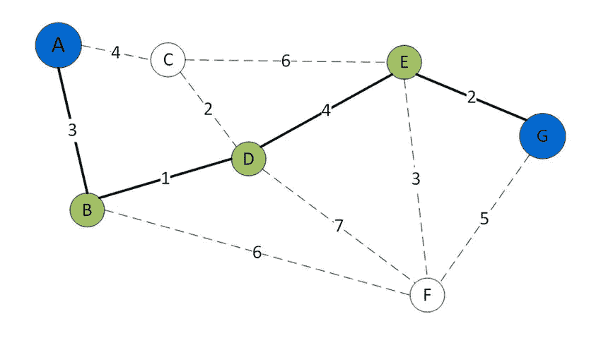
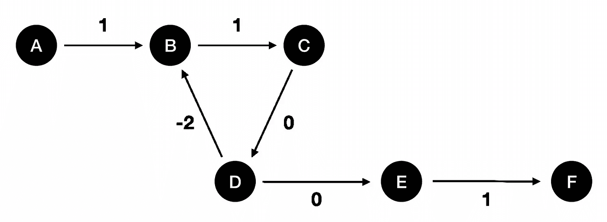
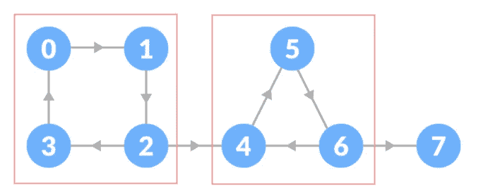
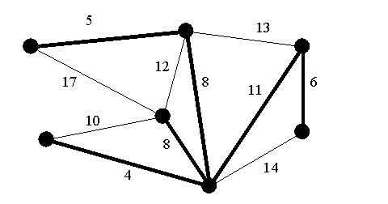
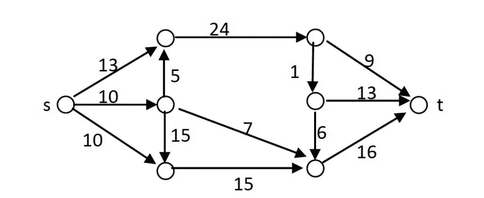

# 常见的图论问题

> 原文：<https://towardsdatascience.com/common-graph-theory-problems-ca990c6865f1?source=collection_archive---------12----------------------->

## [图论简化版](https://towardsdatascience.com/tagged/graph-theory-simplified)

## 这篇文章旨在使用图论给出一组广泛而直观的问题陈述和可能的解决方案。

我们每天遇到的许多问题都可以被解释为一个图问题或者一个近似的子问题。因此，需要对不同的图形变体及其应用有所了解。如果你想重温一下图论的基础知识，你一定要去参观一下[这个](/get-started-with-graph-theory-2b4460eeafc)。后者将让你对不同类型的图及其表示有一个简要的了解。

## 最短路径问题

最常见的图形问题之一就是最短路径问题。给定一个加权图，我们必须找出从节点 A 到 g 的最短路径。所有可能路径中的最短路径肯定是优化成本函数的路径。

作者照片

例如，考虑上面给出的图中的节点是世界上不同的城市。如果您仔细观察该图，我们可以看到与每个边缘相关的成本。所以这是一个有向加权图。回到我们的直觉，与每对城市相关联的权重被认为是城市间旅行的成本。为了方便起见，让我们将每个成本乘以 100 美元，得到一个真实的数字。因此，在城市 A 和 B 之间旅行的费用是 300 美元，B 和 F 之间的费用是 600 美元，以此类推。如果我们想在两个城市之间计划一次划算的旅行，我们应该参考这张图表来估算总成本。两个城市之间可能有多条路径，我们最寻求的路径应该是成本最低的路径。这是最短路径问题的一个非常基本但可以理解的例子。

幸运的是，有一些算法可以以最小的代价把我们从节点 A 引导到节点 B。 ***广度优先搜索*** ， ***迪杰斯特拉的*** ， ***贝尔曼-福特*** ， ***弗洛伊德-沃肖*** ， ***A**** 还有很多算法可以用来解决最短路径问题。

## 连通性

顾名思义，连通性是图论中的一个大问题，它表示从节点 A 到 B 是否存在一条路径。需要注意的一点是，我们不关心最小成本，只关心路径。

作者照片

解决这个问题的最基本方法是进行**广度优先搜索**或**深度优先搜索**。

## **负周期**

有时我们的图会有负边，这可能会破坏图的整个流。我要说的是，负面循环是一个永无止境的陷阱。因此，我们检查，是否存在任何一对节点之间的负加权边，如果是这样，它如何形成一个循环。

作者照片

在给定的图中存在负边。显然，它对负面循环的形成有所贡献。一个这样的循环是***【B，C，D】***。如果我们循环通过这些边缘，我们将永远以最小的成本进行下去。然而，在某些情况下，负面循环扮演了天使的角色。例如，如果我们运行一个从一种货币到另一种货币再到另一种货币的货币兑换游戏，我们可以使用这样一个负图，这反过来可能会产生一些成本效益。这只是一个假设，可能会也可能不会成为事实，因为货币汇率不会保持不变这么久。有某些算法如 ***贝尔曼-福特*** 和 ***弗洛伊德-沃肖尔*** 来检测负周期。

## 强连通分量

这些是有向图中的独立循环，因此循环中的每个节点都可以到达同一循环中的所有其他节点。

作者照片

重要的是要看是否有强连接的组件。红色方框内的循环就是这些组件的示例。用于检测这些组件的不同算法是 **Tarjan 的**和 ***Kosaraju 的算法。***

## 旅行推销员问题

如果没有听过这个学期，没有人会完成他们的计算机科学学位。如果你没有，我很抱歉。但是它非常容易理解，并且有很多实际应用。

图片来自[文章公司](https://blog.essaycorp.com/wp-content/uploads/2017/01/Travelling-Salesman-Problem.png)的博客

该问题的结构是给定一个城市列表和每对可能的城市之间的成本或距离。然后，销售人员必须在相同的节点开始和结束，但必须以最小的成本或距离访问轨迹中的每个城市一次，这取决于目标函数。这个问题看起来非常简单，并且在路径估计和成本优化问题中得到了广泛的关注。诸如分支定界和 hold-Karp 的几种算法可用于解决这个问题。这仍然是一个计算上具有挑战性但研究仍在继续的问题。

## 布里奇斯

桥是图中的边，移除桥可以增加图中连通分量的数量。网桥非常重要，因为它们代表了图中的漏洞和瓶颈。

照片由[onion-router.net](https://www.onion-router.net/Archives/Route/Alg1/Bridge.html)拍摄

移除连接节点 G 和 N 的边将导致两个单独的组件被连接。如果那是一座真的桥，拆除它将会导致两个孤立的城市。所以，桥总是一个弱点，因为它的断开会造成额外的麻烦。

类似地， ***关节点*** 是一个节点，其移除导致连接的组件的总数增加。

## 最小生成树

最小生成树是连接所有顶点以形成最小成本树的边的子集。

照片[由萨尔萨克·阿加瓦尔](https://www.commonlounge.com/profile/a54d8b0187134ac1b1931c4ee89a3944)通过[commonlounge.com](https://www.commonlounge.com/discussion/bd1277f681d545c280e9e8b39c73fc80/history)拍摄

正如你所看到的，给定的图形是加权的和无向的。粗边表示连接所有顶点的最小成本生成树，但代价最小。我们将不同的问题，如路线规划、电路设计和更多的问题公式化为最小生成树，这些问题可以通过 **Kruskal 的**和 **Prim 的算法来解决。**

## 最大网络流量

顾名思义，这些问题可以用来估计一个图所能容纳的最大体积(取决于问题)。例如，如果我们将电网视为我们的图形，将电线杆视为图形中的不同节点。我们可以假设在不影响电网的情况下，有多少电力可以通过网络发送。另一个例子是移动网络，其中每个用户充当图中的一个节点。与前一个示例一样，我们可以计算出在没有网络流量的情况下可以保持在线的最大用户数量。

作者照片

这个公式可以回答所有问题中的最大值，并预测潜在的瓶颈。使用的不同算法有 ***福特-富尔克森*** 和 ***埃德蒙兹卡普&迪尼奇的算法。***

我们已经讨论了图论中几乎所有的问题。我们将在接下来的文章中讨论这里提到的每一个算法。我非常兴奋能和你们分享所有的这些。在那之前，再见！

