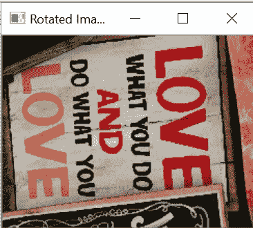

# Python 中常用的图像处理技术

> 原文：<https://towardsdatascience.com/common-image-processing-techniques-in-python-e768d32813a8?source=collection_archive---------31----------------------->

## 使用 PIL 和 OpenCV 学习简单而强大的图像处理技术

*在这篇文章中，你将学习*

*   *使用 PIL 和 OpenCV 的常见图像处理技术，如将 RGB 图像转换为灰度图像、旋转图像、去除图像噪声、检测图像边缘以及裁剪图像中的感兴趣区域*
*   *使用 OpenCV 的模板匹配在图像中搜索物体*

## 必需的库:

PIL、OpenCV 和 imutils

***为什么需要学习图像处理技术？***

深度学习用于分析、识别和生成对图像中对象的智能理解。一些常见的应用是**图像分类、对象检测、实例分割、**等。因此，必须对图像处理技术有深入的了解，如图像增强，包括裁剪图像、去除图像中存在的噪声或旋转图像等。，以建立更好的训练数据集。

图像处理技术同样有助于光学字符识别(OCR)

> 图像处理技术通过帮助识别关键特征或从图像中读取文本来增加图像的可解释性，以分类或检测图像中存在的对象。


照片由[缺口缺口](https://unsplash.com/@jannerboy62?utm_source=unsplash&utm_medium=referral&utm_content=creditCopyText)在[缺口](https://unsplash.com/s/photos/sign-board?utm_source=unsplash&utm_medium=referral&utm_content=creditCopyText)处拍摄

此处提供代码和图片

**导入所需的库**

```
**import cv2
from PIL import Image**
```

***让我们先用 OpenCV 和 PIL*** 显示图像

**使用 OpenCV 读取并显示图像**

```
# Reading and Displaying the file
**image = cv2.imread(r'love.jpg')
cv2.imshow("Image", image)
cv2.waitKey(0)**
```

如果图像太大，那么显示图像的窗口将不适合屏幕。

***那么我如何在屏幕上显示完整的图像呢？***

默认情况下，当显示超大图像时，您会看到裁剪后的显示。要查看完整图像，您将使用 OpenCV 的 ***namedWindow(name，flag)*** 创建一个新窗口。第一个参数， ***name，*** 是窗口的标题，将被用作标识符。当您将 ***标志*** 设置为 **cv2 时。WINDOW_NORMAL，**然后显示完整图像，您可以调整窗口大小。flag 参数还有其他选项。

```
# Resizing the image for the user to resize the window 
**image = cv2.imread(r'love.jpg')
cv2.namedWindow('Normal Window', cv2.WINDOW_NORMAL)
cv2.imshow('Normal Window', image)
cv2.waitKey(0)**
```

**调整图像大小**

当我们调整图像大小时，我们改变图像的高度和/或宽度，并保持纵横比。图像的宽高比是图像的宽高比。

```
**image= cv2.imread(r'taj.jpg')**
**scale_percent =200** # percent of original size
**width = int(image.shape[1] * scale_percent / 100)**
**height = int(image.shape[0] * scale_percent / 100)
dim = (width, height)
resized = cv2.resize(image, dim, interpolation = cv2.INTER_AREA)
cv2.imshow("Resize", resized)
cv2.waitKey(0)**
```

**使用 PIL 读取并显示图像**

您将使用 ***open()*** 加载图像，然后使用 ***show()*** 进行显示。

***形象。*show()**创建一个临时文件。

```
**pil_image= Image.open(r'love.jpg')
pil_image.show("PIL Image")**
```

***如果你对识别图像中的边缘或其他特征感兴趣怎么办？***

灰度图像用于识别边缘。灰度图像还有助于理解图像中存在的对比度或阴影梯度，以及理解它们在分析图像特征中的作用。

与灰度图像的 2D 通道相比，RGB 图像有三个通道:红色、绿色和蓝色。与彩色图像相比，灰度图像的每像素信息更少，因此灰度图像的处理时间更快。

## 利用 OpenCV 实现彩色图像的灰度化

我们正在使用 ***cvtColor()，*** 将彩色图像转换为灰度图像，这将把图像从一个色彩空间保存到另一个色彩空间。

```
#Converting image to grayscale
**image = cv2.imread(r'love.jpg')
gray_image= cv2.cvtColor(image, cv2.COLOR_RGB2GRAY)
cv2.namedWindow('Gray Image', cv2.WINDOW_NORMAL)
cv2.imshow('Gray Image', gray_image)
cv2.waitKey(0)**
```


## 使用 PIL 对彩色图像进行灰度缩放

***【convert()***返回此图像的转换副本；灰度使用“L”模式，彩色使用“RGB”模式。

```
# Gray image using PIL
**pil_image= Image.open(r'love.jpg')
gray_pil=pil_image.convert('L')
gray_pil.show()**
```

## 使用 OpenCV 进行边缘检测

使用 **canny 边缘检测器**检测图像中的边缘。**Canny 边缘检测器通过多阶段算法使用灰度图像**。

***Canny()* :** 第一个参数是**输入图像，**第二个和第三个参数是 **threshold1** 和 **threshold2** 值。

强度梯度大于阈值 2 的边缘被认为是边缘，而低于阈值 1 的边缘被认为是非边缘。非边缘将被移除。两个阈值之间的任何梯度强度值基于它们的连通性被分类为边缘或非边缘。

```
**image= cv2.imread(r'taj.jpg')
cv2.namedWindow("Edge", cv2.WINDOW_NORMAL)
denoised_image = cv2.Canny(image, 100,200 )
cv2.imshow("Edge", denoised_image)
cv2.waitKey(0)**
```


Canny 边缘检测器

***如果图像有歪斜或轻微旋转，想对图像进行纠偏怎么办？***

倾斜文本的 OCR 效果不好，因此我们需要进行倾斜校正。可以使用 OpenCV 和 PIL 的 ***rotate()*** 对图像进行纠偏。

## 使用 OpenCV 旋转图像

***rotate()*** 将根据 **rotationCode，**旋转图像，该代码为旋转函数的第二个参数。

**旋转码**的值为

*   cv2。顺时针旋转 90 度，
*   cv2。逆时针旋转 90 度
*   cv2。旋转 _180 度

```
#Rotating the image
**image = cv2.imread(r'love.jpg')
cv2.namedWindow("Rotated Image", cv2.WINDOW_NORMAL)
rotated_img= cv2.rotate(image,cv2.ROTATE_90_CLOCKWISE )
cv2.imshow("Rotated Image", rotated_img)
cv2.waitKey(0)**
```



使用 OpenCV 顺时针旋转 90 度的图像

***如果我想只旋转图像一个特定的角度怎么办？***

**根据特定角度旋转图像**

在下面的代码中，使用 **imutils** 的 ***rotate()*** 将图像旋转 60 度

```
**import imutils
import numpy as np****image = cv2.imread(r'love.jpg')**# loop over the rotation angles
**for angle in np.arange(0, 360, 60):
    cv2.namedWindow("Rotated", cv2.WINDOW_NORMAL)
    rotated = imutils.rotate(image, angle)
    cv2.imshow("Rotated", rotated)
    cv2.waitKey(0)**
```


使用 imutils 以 60 度为增量旋转图像

## 使用 PIL 旋转图像

这里的图像使用 PIL 旋转了 110 度

```
# Rotate image using PIL
**pil_image= Image.open(r'love.jpg')
rotate_img_pil=pil_image.rotate(110)
rotate_img_pil.show()**
```


使用 PIL 旋转 110 度的图像

***当图像质量因噪声的存在而变差并影响图像分析时，如何增强图像质量？***

## 利用 OpenCV 实现图像去噪

噪声是不想要的信号，就图像而言，它是颜色的随机变化。

使用 OpenCV 最小化图像中的噪声。

```
**image= cv2.imread(r'taj.jpg')
cv2.namedWindow("Noised Image", cv2.WINDOW_NORMAL)
cv2.imshow("Noised Image", image)
cv2.waitKey(0)**
```


OpenCV 中有不同的方法来去除图像中的噪声。下面用的是[**cv . fastnlmeansdenoisingcolored(**](https://docs.opencv.org/3.4/d1/d79/group__photo__denoise.html#ga03aa4189fc3e31dafd638d90de335617)**)，**就是去除彩色图像中的噪点。

**fast nimeans 降噪**方法的常见参数有

*   **src** :来源图片
*   **dst** :输出与 src 相同大小和类型的图像
*   **h** :调节过滤强度。较高的 h 值完美地去除了图像细节中的噪声，较小的 h 值将保留图像细节和一些噪声。
*   **hForColorComponents** :与 h 相同，但仅用于彩色图像，通常与 h 相同
*   **templateWindowSize** :应该是奇数。(推荐 7)
*   **searchWindowSize** :应该是奇数。(推荐 21)

```
**image= cv2.imread(r'taj.jpg')
cv2.namedWindow("Denoised Image", cv2.WINDOW_NORMAL)
denoised_image = cv2.fastNlMeansDenoisingColored(image,None, h=5)
cv2.imshow("Denoised Image", denoised_image)
cv2.waitKey(0)**
```


***如何从一幅图像中提取某些感兴趣的区域？***

## 裁剪图像

裁剪图像可让您提取图像中感兴趣的区域。

我们将裁剪泰姬陵的图像，只保留泰姬陵，并删除图像中的其他细节。

**使用 OpenCV 裁剪图像**

OpenCV 中的裁剪是通过对图像数组进行切片来完成的，我们通过 y 坐标的起点和终点，然后是 x 坐标的起点和终点。

**图像【y_start:y_end，x _ start:x _ end】**

```
**image= cv2.imread(r'taj.jpg')
resized_img= image[15:170, 20:200]
cv2.imshow("Resize", resized_img)
cv2.waitKey(0)**
```


**使用 PIL 裁剪图像**

PIL 的 ***crop()*** 允许我们裁剪图像的一个矩形区域，参数 ***crop()*** 是 ***左坐标、上坐标、右坐标和下像素坐标。***

```
# Opens a image in RGB mode 
**pil_image = Image.open(r'taj.jpg')** 

# Get the Size of the image in pixels 
**width, height = pil_image.size** 

# Setting the cropped image co-ordinates
**left = 3
top = height /25
right = 200
bottom = 3 * height / 4**

# Crop the  image based on the above dimension 
**cropped_image = pil_image.crop((left, top, right, bottom))**

# Shows the image in image viewer 
**cropped_image.show()**
```


使用 PIL 裁剪图像

## 模板匹配

您可以提供一个模板，并使用 OpenCV 的***match template()***在图像中搜索该模板并提取其位置。

模板像卷积神经网络一样在整个图像上滑动，并试图将模板与输入图像匹配。

**minMaxLoc()** 用于获取最大/最小值，它将是矩形的左上角连同宽度和高度。

有 6 种方法可用于模板匹配

*   cv2。TM_SQDIFF
*   cv2。TM_SQDIFF_NORMED
*   cv2。TM_CCORR
*   cv2。TM_CCORR_NORMED
*   cv2。TM_CCOEFF
*   cv2。TM_CCOEFF_NORMED

在下面的例子中，我从主图像中裁剪了一小部分来创建模板。

用于模板匹配的方法是 TM_CCOEFF_NORMED。匹配的阈值设置为 0.95。它定位具有大于 95%的较高匹配概率的位置，然后在对应于匹配的区域周围绘制矩形。

```
import cv2
**import numpy as np
from matplotlib import pyplot as plt
img = cv2.imread(r'love.jpg',0)****cv2.imshow("main",img)
cv2.waitKey(0)****template = cv2.imread(r'template1.png',0)
cv2.imshow("Template",template**)
**cv2.waitKey(0)****w, h = template.shape[::-1]
methods = [ 'cv2.TM_CCOEFF_NORMED']****for meth in methods:

    method = eval(meth)**# Apply template Matching
    **res = cv2.matchTemplate(img,template,method)
    min_val, max_val, min_loc, max_loc = cv2.minMaxLoc(res)
    threshold=0.95
    loc=np.where(res>threshold)
    if len(loc[0])>0:**# If the method is TM_SQDIFF or TM_SQDIFF_NORMED, take minimum
        **if method in [ cv2.TM_SQDIFF_NORMED]:
            top_left = min_loc
        bottom_right = (top_left[0] + w, top_left[1] + h)****cv2.rectangle(img,top_left, bottom_right,100,20)****plt.subplot(121),plt.imshow(res,cmap = 'gray')
        plt.title('Matching Result'), plt.xticks([]), plt.yticks([])
        plt.subplot(122),plt.imshow(img,cmap = 'gray')
        plt.title('Detected Point'), plt.xticks([]), plt.yticks([])
        plt.suptitle(meth)****plt.show()
    else:
        print("Template not matched")**
```


## 结论:

我们已经讨论了最常见的图像处理技术，这些技术可用于图像分类、对象检测以及 OCR 的图像分析。

## 参考资料:

[](https://docs.opencv.org/master/d4/dc6/tutorial_py_template_matching.html) [## OpenCV:模板匹配

### 在本章中，您将学习模板匹配是一种搜索和查找模板位置的方法…

docs.opencv.org](https://docs.opencv.org/master/d4/dc6/tutorial_py_template_matching.html)  [## 参考—枕头(PIL 叉)3.1.2 文件

### 编辑描述

pillow.readthedocs.io](https://pillow.readthedocs.io/en/3.1.x/reference/) 

[https://opencv-python-tutroals.readthedocs.io/en/latest/](https://opencv-python-tutroals.readthedocs.io/en/latest/)