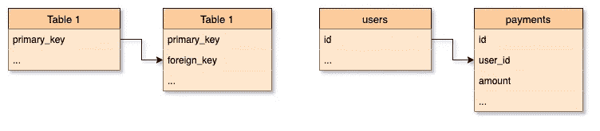
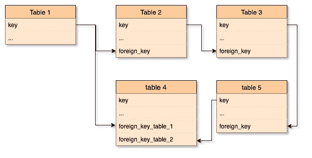

# 引用完整性经常被忽略，但却很重要

> 原文：<https://towardsdatascience.com/common-issues-founded-with-referential-integrity-fc05e93693a1?source=collection_archive---------27----------------------->

*让我们来看看数据完整性的一个关键组成部分的常见情况。*

[法比奥](https://unsplash.com/@fabioha?utm_source=medium&utm_medium=referral)在 [Unsplash](https://unsplash.com?utm_source=medium&utm_medium=referral) 上的照片

## 引用完整性的重要性

引用完整性是一个简单但强大的工具。在数据湖、个性化推荐和深度数据分析工具的世界里，基本概念有时会被遗忘。但是我们不能放弃。当我们设计数据模型时，这个概念应该一直在我们的脑海中。它是数据系统中数据完整性的支柱。

我假设本文的所有潜在读者都知道如何实现它，但是简单的提醒总是有用的。引用表(数据集，数据实体)的外键仍必须引用和被引用表中的有效行。参照完整性确保两个表之间的关系在执行更新和删除指令期间保持同步。

在左边的一般情况下—在右边的特定示例情况下

当然，在标准生活应用中，设计越来越复杂，结构具有嵌套和圆形形式:

虽然我将要提出的清单并不详尽，但它代表了现实世界的问题。注意，这些问题都是我在职业生涯中发现的。没有猜测，也没有二手故事。我知道有些用户案例和项目不需要引用完整性(但我认为大多数生活应用程序需要引用完整性)。让我们一起来回顾一下这些令人痛心的案例:

## 引用完整性不适用

这是最糟糕的情况，不仅仅是因为后果(数据丢失、重复、数据丢失、内部不一致等)，还因为它意味着:

*   缺乏知识
    最初的*开发者 d* 根本不知道引用完整性。我在不止一个初创企业和小企业中看到过这个问题。通常，造成这种混乱的罪魁祸首是来自不同业务部门的人，他们做得很快，或者是非开发人员重新转变为开发人员。
*   完全不小心
    对我来说，这是最痛苦的。而*肇事者*知道如何正确实施，却不去做。最典型的借口是:这是一个订单，我想缩短上市时间，或者这只是一个概念证明。

## 参照完整性的设计错误

也许这可以包括在*缺乏知识*这一点中，但是在这种情况下，开发/数据人员知道引用完整性。尽管如此，由于执行不力，最终结果是错误的。这些是我经常发现的情况:

*   忘记添加两个或多个表之间的关系。
*   忘记添加确保级联更新和删除的触发器。
*   应用了错误的数据完整性类型。最常见的是在部分完整性是正确选择时使用弱完整性(反之亦然，这很常见)。但是我也看到了不同组合的错位:弱完整代替强，部分完整代替强，强完整代替部分，等等。

## 引用完整性由应用程序应用，而不是由数据库引擎应用

让我明确这一点:如果可能的话，依靠数据库引擎。这样做，你就可以避免将来的问题。这是一个明显的*重新发明轮子*的场景:在最好的情况下，你的开发会像预期的那样工作。在最坏的情况下，您将不得不处理一个巨大的混乱，混合和丢失的数据。客户、合作伙伴、同事和经理会对你大喊大叫，要求你提供一个很可能是不可能的解决方案。

请记住，即使有一个好的初始设计和完美的实现，在未来的开发迭代中，总有添加 bug 的风险。当我们谈到数据完整性时，一个小错误可能会产生相当大的影响，以后可能会有一个很难解决的问题。此外，其他部门可能会访问原始数据，并由于数据库引擎中缺乏一致性而产生问题。

此外，DB 引擎一直以提供最佳性能而著称。投入时间和资源来达到 DB 默认提供的相同结果是一个非常糟糕的主意。

## 数据库引擎没有引用完整性功能

一个很好的例子是在 MongoDB 版本 4 之前的实现。我听过几次断言*在非 SQL 数据库中不需要添加参照完整性。我完全不同意这样的肯定。虽然引用完整性对任何关系数据库都是至关重要的，但它对非 SQL 数据库也很有用。*

我将用一个例子来说明这一点。首先，我们来看下面这个集合:

这样的设计将对应于一个希望以最快的方式提供 Book 元素的系统，就像在一个高需求的 GET RESTful 端点中所需要的那样。

现在来看看这两个系列:

该模型将允许执行更平滑的聚合操作和更好的性能。它还可以在作者之间提供更有效的查询。这并没有放弃第一个解决方案的面向文档的设计(但是检索书籍的性能较低)。最后，我的观点是，对于使用非纯关系数据库，当需要引用完整性时，您不应该放弃它。