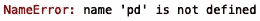

# Python 中常见的机器学习编程错误

> 原文：<https://towardsdatascience.com/common-machine-learning-programming-errors-in-python-5d76de85e975?source=collection_archive---------28----------------------->

## 机器学习中常见的 Python 错误


马库斯·斯皮斯克在[的照片](https://www.pexels.com/photo/working-pattern-internet-abstract-1089438/)

在这篇文章中，我将回顾我在 python 建模和开发过程中遇到的一些最常见的错误。出于演示目的，我们将使用在 [Kaggle](https://www.kaggle.com/mustafaali96/weight-height) 上可以找到的身高/体重数据。数据包括性别、身高(英寸)和体重(磅)。

根据我的经验，最常见的错误如下:

**进口**

1.  名称错误
2.  ModuleNotFoundError
3.  属性错误
4.  导入错误

**读取数据**

6.FileNotFoundError

**选择列**

7.键盘错误

**数据处理**

8.值错误

我们将构建一个简单的线性回归模型，并修改代码以显示上述错误在实践中是如何出现的。

首先让我们使用 pandas 导入数据并打印前五行:

```
import pandas as pd
df = pd.read_csv("weight-height.csv")
print(df.head())
```


如你所见，数据集非常简单，有性别、身高和体重三列。接下来我们可以使用 matplotlib 和 seaborn 来可视化数据:

```
import matplotlib.pyplot as pltplt.scatter(df['Weight'],  df['Height'])
plt.xlabel("Weight")
plt.ylabel("Height")
plt.show()
```


从体重与身高的散点图中我们可以看出，这种关系是线性的。

接下来，让我们定义我们的输入(X)和输出(y ),并为训练和测试拆分数据:

```
from sklearn.model_selection import train_test_split
import numpy as npX = np.array(df["Weight"]).reshape(-1,1)
y = np.array(df["Height"]).reshape(-1,1)
X_train, X_test, y_train, y_test = train_test_split(X, y, random_state = 42, test_size = 0.33)
```

然后，我们可以定义线性回归模型，拟合我们的训练数据，对测试集进行预测，并评估模型的性能:

```
from sklearn.linear_model import LinearRegression
reg = LinearRegression()
reg.fit(X_train, y_train)
y_pred = reg.predict(X_test)
print("R^2 Accuracy: ", reg.score(X_test, y_test))
```


我要讨论的第一个错误是 **NameError** ，例如，如果我忘记导入一个包，就会出现这个错误。在下面的代码中，我删除了“import numpy as np”:

```
from sklearn.model_selection import train_test_splitX = np.array(df["Weight"]).reshape(-1,1)
y = np.array(df["Height"]).reshape(-1,1)
X_train, X_test, y_train, y_test = train_test_split(X, y, random_state = 42, test_size = 0.33)
```

如果我试图在缺少该行代码的情况下运行脚本，我会得到以下错误:


我会收到类似的消息，因为我忽略了 seaborn、matplotlib 和 pandas 的导入语句:



另一个问题是意外地试图导入一个由于拼写错误而不存在的包，这导致了一个 **ModuleNotFoundError** 。例如，如果我将“pandas”拼错为“pandnas”:

```
import pandnas as pd
```


或者，如果我忘记了 matplotlib 散点图导入中的“pyplot ”,我们会得到一个 **AttributeError** :

```
import matplotlib as plt
```


类似地，如果我忘记了 sklearn 导入中的 linear_regression 和 model_selection 属性，我将得到一个 **ImportError** :

```
from sklearn import LinearRegression 
from sklearn import train_test_split
```


在读取文件方面，如果我拼错了文件名，我会得到一个 **FileNotFoundError** :

```
df = pd.read_csv("weight-heigh1t.csv")
```


此外，如果我试图从 pandas 数据框中选择一个不存在的列，我会得到一个 **KeyError** :

```
plt.scatter(df['Weight1'],  df['Height'])
```


如果我忘记将 pandas 系列的“体重”和“身高”转换成 numpy 数组，我会得到一个**值 Error** 。这是因为 sklearn 方法只接受 numpy 数组。我经常发现自己忘记了从 pandas 系列转换到 numpy 数组的简单步骤:

```
X = df["Weight"]
y = df["Height"]
X_train, X_test, y_train, y_test = train_test_split(X, y, random_state = 42, test_size = 0.33)reg = LinearRegression()
reg.fit(X_train, y_train)
```


或者，如果我忘记将 numpy 数组整形为一个二维数组，我也会得到一个**值 Error** :

```
X = np.array(df["Weight"])
y = np.array(df["Height"])
X_train, X_test, y_train, y_test = train_test_split(X, y, random_state = 42, test_size = 0.33)reg = LinearRegression()
reg.fit(X_train, y_train)
```


导致**值错误**的另一个常见原因是在进行列车试运行时。我经常忘记 X 和 y 数组的顺序:

```
X_train, X_test, y_train, y_test = train_test_split(X, y, random_state = 42, test_size = 0.33)
```

其中我切换 X_test 和 y_train:

```
X_train, y_train, X_test, y_test = train_test_split(X, y, random_state = 42, test_size = 0.33)
```

这在拟合时给出了以下误差:


最后，当试图拟合与特定类别或人群相对应的模型数据时，我经常会遇到没有足够数据的问题。让我们过滤我们的数据框架来重现这个问题。让我们过滤数据，只包括“权重”等于 241.893563 的记录。这将产生恰好一行数据:

```
df = df[df['Weight'] == 241.893563]
```

如果我们尝试构建我们的模型，我们会在拆分数据的行中得到以下错误:

```
X_train, X_test, y_train, y_test = train_test_split(X, y, random_state = 42, test_size = 0.33)reg = LinearRegression()
reg.fit(X_train, y_train)
y_pred = reg.predict(X_test)print("R^2 Accuracy: ", reg.score(X_test, y_test))
```


如果我们试着去适应，我们会得到下面的错误:

```
#X_train, X_test, y_train, y_test = train_test_split(X, y, random_state = 42, test_size = 0.33)reg = LinearRegression()
reg.fit(X, y)
```


最后，如果数据有缺失值或无穷大值，fitting while 将抛出一个错误。让我们用“nan”(非数字)值重新定义 weight 列，以生成以下错误:

```
df['Weight'] = np.nanX = np.array(df["Weight"]).reshape(-1,1)
y = np.array(df["Height"]).reshape(-1,1)X_train, X_test, y_train, y_test = train_test_split(X, y, random_state = 42, test_size = 0.33) reg = LinearRegression()
reg.fit(X_train, y_train)
```


我们会得到相同的错误消息，其中包含无限个值:

```
df['Weight'] = np.infX = np.array(df["Weight"]).reshape(-1,1)
y = np.array(df["Height"]).reshape(-1,1)X_train, X_test, y_train, y_test = train_test_split(X, y, random_state = 42, test_size = 0.33)reg = LinearRegression()
reg.fit(X_train, y_train)
```


在这篇文章中，我们回顾了用 python 开发模型时出现的不同错误。我们回顾了与导入包、读取文件、选择列和处理数据相关的错误。在生产机器学习代码时，对开发机器学习模型时出现的不同类型的错误有扎实的知识会很有用。了解这一点可以防止错误发生，并在错误发生时通知可用于捕捉这些错误的逻辑。

我每天都会遇到更多的错误，但我在这篇文章中列出的错误是我经验中最常见的。我希望这篇文章有用。这篇文章的代码可以在 [GitHub](https://github.com/spierre91/medium_code) 上找到。感谢您的阅读！