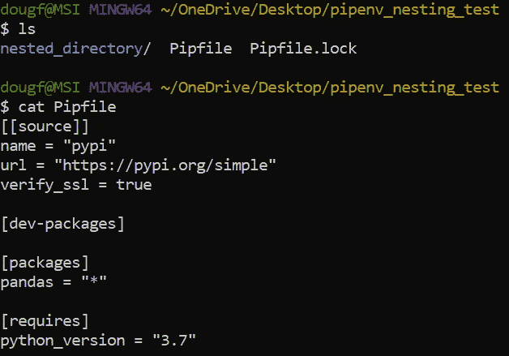
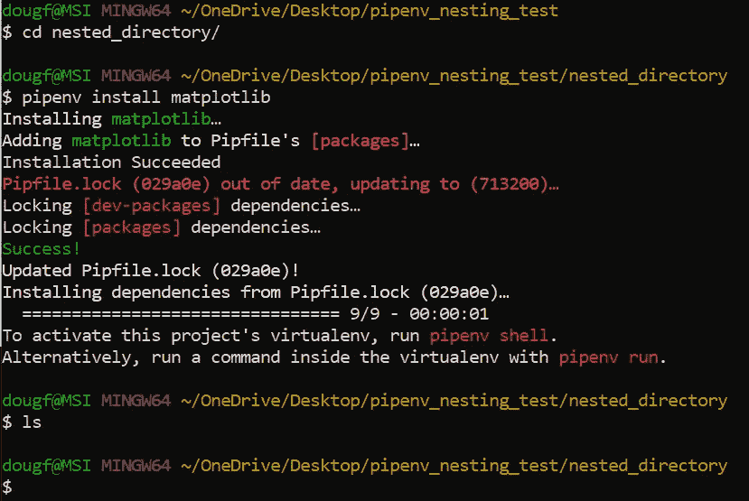
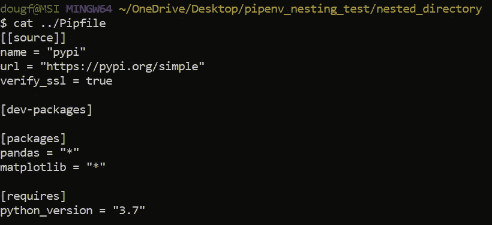
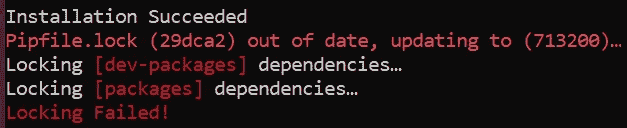
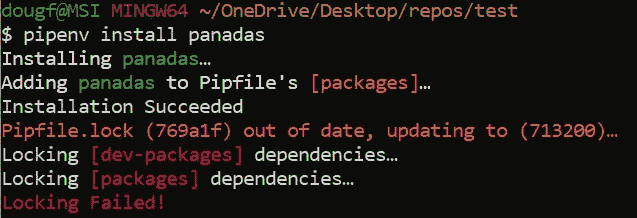
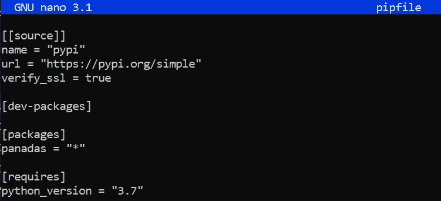
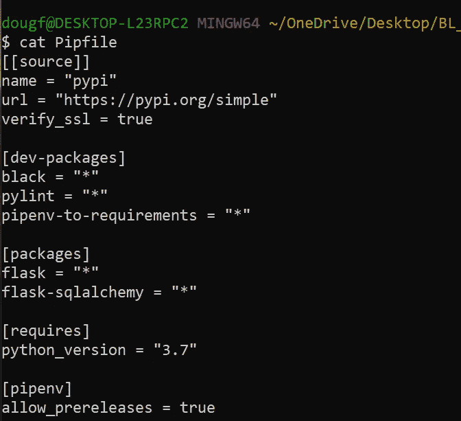
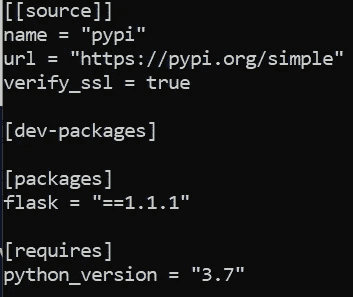
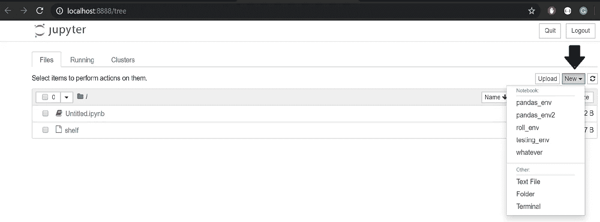
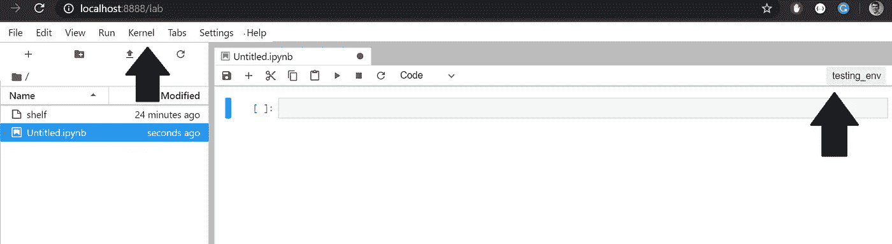

# 常见 Pipenv 错误

> 原文：<https://towardsdatascience.com/common-pipenv-errors-3a6f8ce81562?source=collection_archive---------14----------------------->

## Pipenv 错误及其解决方案的集合。

作者: [Edward Krueger](https://www.linkedin.com/in/edkrueger/) 数据科学家兼讲师和 [Douglas Franklin](https://www.linkedin.com/in/douglas-franklin-1a3a2aa3/) 助教兼开发者倡导者。

*在本文中，我们将讨论 Pipenv 虚拟环境，在您的机器上的什么地方使用它们，如何利用 Pipfile 和 Pipfile.lock 特性，以及当这些操作不正确时可能出现的一些问题。我们从为什么环境对于数据科学和软件开发至关重要开始。*


开发者最好的朋友:照片由 Timothy Dykes 在 Unsplash 上拍摄

有关 Pipenv 环境或入门的更多信息，请查看本文

# 数据科学和部署问题

数据科学家通常是跨学科的，他们还没有开发出编码技能来与其他人合作并将项目推向生产。因此，通常缺乏环境和依赖性管理技能。这给代码可复制性和项目协作带来了困难。其他人可以轻松地重新创建、修改和运行的数据科学项目是可复制的数据科学项目

正确执行的环境管理实践减少了项目之间的依赖版本冲突，并防止开发环境变得臃肿和不可管理，从而帮助用户创建可重复的项目。

# Pipenv 是什么？

Pipenv 将软件包管理和虚拟环境控制结合到一个工具中，用于安装、删除、跟踪和记录您的依赖关系；以及创建、使用和管理您的虚拟环境。Pipenv 将 pip 和 virtualenv 结合成一个产品。有关 Pipenv 或虚拟环境的更多信息，请查看本文！

Pipenv 将包管理和虚拟环境控制结合到一个工具中，使其成为数据科学家和开发人员的绝佳工具。

Pipenv 基于每个项目来管理依赖项，因此最好在项目目录中使用 Pipenv。要安装软件包，请转到您的项目目录并运行:

```
$ cd myproject
$ pipenv install requests
```

当您使用 Pipenv 开始一个项目时，该工具会自动创建一个虚拟环境、一个 Pipfile 和一个 Pipfile.lock。Pipfile 存储运行项目代码所需的包或依赖项。对于那些使用 pip 开发的人来说，Pipfile 非常类似于 requirements.txt 文件。Pipfile.lock 存储特定的依赖版本，这些版本支持环境的确定性构建。当您使用`pipenv install`来获得一个新的依赖项时，Pipfile 和 Pipfile.lock 会自动用这个新的依赖项进行更新。在上面的例子中，您的 Pipfile 将包含包“requests”，而您的 Pipfile.lock 将包含已安装的版本。

# 常见问题:虚拟环境和 Pipfile 位置

使用 Pipenv，您需要为每个项目创建一个新目录。这允许您隔离依赖项及其关联的文件。这通常是一个好的实践，尤其是在创建隔离的开发环境时。

```
> mkdir new_project> cd new_project> pipenv install pandas matplotlib
```

完成上述命令后，您将拥有一个需要 Python、Pandas 和 Matplotlib 的项目的基础设施。这个基础结构由目录 new_project、包含已安装包的 Pipfile 和包含它们的特定版本的 Pipfile.lock 组成。

为每个项目创建一个新的目录和 Pipenv 环境将使您的机器保持有序，并允许从一个项目到另一个项目的无缝转换。要参与项目，请切换到一个新目录，并通过运行以下命令激活该目录的环境:

```
> pipenv install> pipenv shell
```

## 丢失的 pip 文件

假设出于某种原因，你在一个奇怪的地方有一个 Pipfile，比如在根目录下。当你使用

```
> pipenv install
```

例如，在一个较低的目录`~/Desktop/new_project`中，Pipenv 将找到并使用根目录下的 Pipfile。这实际上阻止了您使用该包来管理依赖项。在本例中，在根目录下有一个 Pipfile，它为您在较低目录下创建的所有 Pipenv 虚拟环境提供资源。如果您遇到这种情况，您必须删除导致问题的杂散 pip 文件。

现在我们将重新创建这个错误。下面是一个没有 Pipfile 放在根目录那么极端的例子，但是将说明相同的概念，在路径的一个级别上有一个 Pipfile，然后尝试在该路径的较低级别上创建另一个 Pipfile。

这里我们已经创建了目录 pipenv_nesting_test 并运行`pipenv install pandas`。请注意，这将在该目录中创建 Pipfile 和 Pipfile.lock。



更高级目录中的 Pipfile

请注意，Pipfile 与 nested_directory 处于同一级别。现在我们将导航到这个目录并运行`pipenv install matplotlib`。



安装 matplotlib

注意，在运行`ls`之后，没有生成 Pipfile 或 Pipfile.lock。这是因为 Pipenv 找到了路径中较高位置的 Pipfile，并修改了这些文件中的数据以包含 matplotlib。下面我们使用`cat ../Pipfile`来可视化 matplotlib 确实已经被添加到路径中更高的 Pipfile 中。



包含熊猫和 matplotlib 的 Pipfile

将 pip 文件保存在它们的项目目录中是避免在您的机器上出现不明确或不确定的 pip 文件的最好方法。此外，当您在一个在线项目存储库中有一个 pip 文件时，例如 Github，其他用户可以很容易地克隆您的 repo，从 pip 文件重新创建您的环境，并运行您的代码！

# 常见问题:锁定失败



锁定失败！

## Pipfile.lock 是做什么的？

当您使用命令`pipenv install`时，会创建一个 Pipfile.lock 文件。此外，命令`pipenv lock`可以用来创建一个`Pipfile.lock`，它在**最新可用版本**中声明**项目的所有**依赖项(和子依赖项)，并存储下载文件的当前散列。这意味着依赖项和子依赖项的所有特定版本都存储在 Pipfile.lock 中。这确保了可重复的，最重要的是， ***确定性的*** 构建。然而，许多不良做法可能导致锁定失败。下面我们将介绍一些避免和解决这个问题的方法。

命令`pipenv install`首先尝试从 Pipfile.lock 构建虚拟环境，如果 Pipfile.lock 不可用，Pipenv 将从 Pipfile 创建虚拟环境，然后创建 Pipfile.lock。

## 锁定问题:Pipfile 包含对不存在的包的引用

Pipfile.lock 在尝试安装不存在的软件包(即错别字)时不会锁定。

```
pipenv install panadas
```

Pipenv 查找您指定的包，不管它是否存在。当包不存在或由于其他原因找不到时，您会在终端中看到以下错误以及更多错误。现在，我们将把重点放在这两个方面。



安装错别字


Pipenv 找不到 Panadas 的版本

锁定失败！请注意,“panadas”被添加到 Pipfile 的包中。这种打字错误将成为一个问题，因为现在我们的 Pipfile 包含一个错误，任何使用这个 Pipfile 的人都会遇到锁定和依赖错误。请注意，“安装成功”警报是不真实的；没有要安装的 Panadas。所发生的只是将“panadas”添加到 Pipfile 中。Pipfile 中的拼写错误是锁定失败的最常见原因。

只要 Pipfile 中存在这种输入错误，安装一个包，不管存在与否，都会导致锁定失败。您需要在文本编辑器中修复 Pipfile。我用的是纳米。你可以使用任何你觉得舒服的编辑器；Sublime，VS 代码，Atom 等。简单地把 Panadas 改成熊猫然后`pipenv install.`



现在让我们看看锁定失败时控制台中出现的其他一些错误消息。


注意建议`pipenv install --skip-lock`。这应该只在极端或因果编程环境中使用，因为它绕过了 Pipfile。锁的主要用途；锁定软件包版本并创建安装环境依赖项的公式。

当在另一台机器上克隆存储库时，可能会遇到 Pipfile.lock 不兼容问题。这是因为 Pipfile.lock 是特定于系统的。如果合作开发人员使用不同的系统，即 macOS 和 Windows，最好删除 Pipfile.lock，让每个系统解决其依赖性。在这种情况下，确保每个人都使用相同版本的包，方法是手动将它们固定在 Pipfile 中。

锁定失败的另一个常见原因是，如果 Pipfile 中的包只作为预发布版本存在。要允许预发布软件包，您必须在 install 命令中添加— pre 标志，否则锁定将会失败。

```
pipenv install --pre black
```

您可以通过在安装命令`pipenv install --pre`中添加 pre 标志来解决预发布版本冲突。在这个命令之后，您的 Pipfile 有了一个新变量；allow_prereleases = true。请注意，这将允许在您的环境中安装任何预发行软件包。现在是固定特定包版本有用的时候了。固定版本是一个很好的习惯，可以防止将来出现依赖问题。



允许 Pipfile 中的预发布

**Pipfile 管理:指定 Python 版本**

请注意上面“要求”部分下的 Pipfile 图像；你看 python_version = 3.7。Pipenv 可用于指定 Python 版本和包版本。

要使用特定的 Python 版本构建 Pipfile 或环境，请使用以下语法。

```
pipenv --python <path>
#or
pipenv --python python3
```

注意:需要时可以指定包的版本。

展示 pip 文件的样子，并说明您也可以直接在 pip 文件中修改它

```
pipenv install flask1.1.1
```

注意，这个版本被固定在下面的 Pipfile 中。



您可能还想直接编辑您的 Pipfile 来更改版本。

# 常见问题:在虚拟环境中运行 Jupyter

许多数据科学家使用 Jupyter 进行探索性数据分析和模型选择。Jupyter 可能很难与包管理器一起使用。但是，我们可以很容易地用 Pipenv 创建一个环境，并用一个内核将其连接到 Jupyter。

在 Jupyter 中，您可以访问指向虚拟环境的 Jupyter 内核。虚拟环境是用 Pipenv 创建的。

Pipenv 自动将项目映射到其特定的虚拟环境。命令`pipenv shell`指向你计算机上的一个虚拟环境。虚拟环境以项目根目录的名称加上项目根目录的完整路径的散列(即`my_project-a3de50`)进行全局存储。因此，如果您更改项目的路径，就会破坏这样的默认映射，Pipenv 将不再能够找到并使用项目的虚拟环境。

在使用下面的命令之前，您需要知道您的 Python 版本并安装 Jupyter。设置指南可在“Pipenv 工作流教程:Jupyter”标题下的另一篇文章**、**、[、**中找到。**](/virtual-environments-for-data-science-running-python-and-jupyter-with-pipenv-c6cb6c44a405)

将 Pipenv 虚拟环境连接到 Jupyter 内核。首先，运行`pipenv shell.`,然后在 shell 中创建 Jupyter 内核，使其指向虚拟环境。

```
python3.7 -m ipykernel install --user --display-name matpltlib --name matpltlib
```

当让内核指定一切时，为了安全起见。一些计算机的内核总是被命名为 Python 3，当`--display-name`或`--name`没有通过时，会覆盖其他虚拟环境。我们建议对`--name`和`--display-name`使用相同的名称，以避免混淆。

如果你只有一个版本的 Python，你应该可以使用`python`而不是上面的`python3.7`。如果您使用的是 Mac，默认情况下您将拥有 Python 版本。如果您不确定您使用的是哪个 Python 版本，请查看:

```
python --version
#and/or
python3 --version
```

## 在 Jupyter 中选择内核

完成上述操作后，您现在应该能够运行:

```
jupyter notebook
```

或者您更喜欢实验室用户界面和附加功能。

```
jupyter lab
```

在 **Jupyter Notebook 中，**选择“新建”查看下拉列表，查看可用内核列表。请注意，上面第 3 步中创建的“example_env”是内核的名称。



选择笔记本中的内核

在 **Jupyter Lab，**你必须点击右上角的内核框来访问内核列表。或者，您可以单击“内核”选项卡，然后选择“更改内核”来访问同一个下拉菜单。



实验室中选择内核的两个位置

## 测试导入

在一个新的。ipynb 文件，尝试在单元格中运行以下代码。

```
import pandas
```

如果成功的话，你正在改进你的开发工作流程！

如果出现任何问题，请确保您选择了正确的内核，在连接内核和运行`jupyter lab`或`jupyter notebook`之前，您已经运行了`pipenv shell`。

# 结论

Pipenv 是开发人员和数据科学家的优秀工具。然而，在学习这些工具和方法时，我们会遇到一些常见的错误。对于 Pipenv，Pipfile.lock 在默认情况下固定特定的版本；然而，由于提到的锁定问题和其他复杂性，当在开发人员之间共享时，锁可能会失败。因此，将您的依赖项固定在 Pipfile 中用于生产是一个最佳实践，并且在从 Pipfile.lock 构建环境时要小心。此外，在共享 Pipfile 或使用它来构建环境之前，您需要检查您的 Pipfile 是否有拼写错误！

Jupyter 笔记本是学习代码或制作使用代码创建可视化的报告的有用工具。在 Pipenv 虚拟环境中使用 Jupyter 可以让您将所有环境依赖项导入笔记本，从而简化依赖项管理。将虚拟环境连接到 Jupyter 内核可能会很棘手，但是如果您按照上面的步骤操作，应该没有任何困难！

作为数据科学家和开发人员，正确的开发、打包和虚拟环境管理实践都是需要学习的关键技能。使用 Pipenv 来管理虚拟环境可以加速生产，并允许您创建确定性的构建来复制代码和将项目推向生产。

将 pip 文件保存在它们的项目目录中是避免在您的机器上出现任何含糊不清或杂乱无章的 pip 文件的方法。此外，当您在一个在线存储库中有一个 Pipfile 时，例如 Github，其他用户可以很容易地克隆您的 repo，重新创建您的环境，并使用您的代码。通过 Pipenv 和 Pipfile，您向其他人展示了一种安装项目依赖项以及测试和开发需求的标准化方法。任何拥有您的 Pipfile 副本的人都可以使用以下内容重新创建您的环境。

```
pipenv install
```

这个命令创建一个由 Pipfile 指定的环境。在分享它之前，只要确保它没有打字错误，并且指定了正确的包和 Python 版本就可以了！

我们希望这是信息丰富和有帮助的。祝你好运，继续编码！