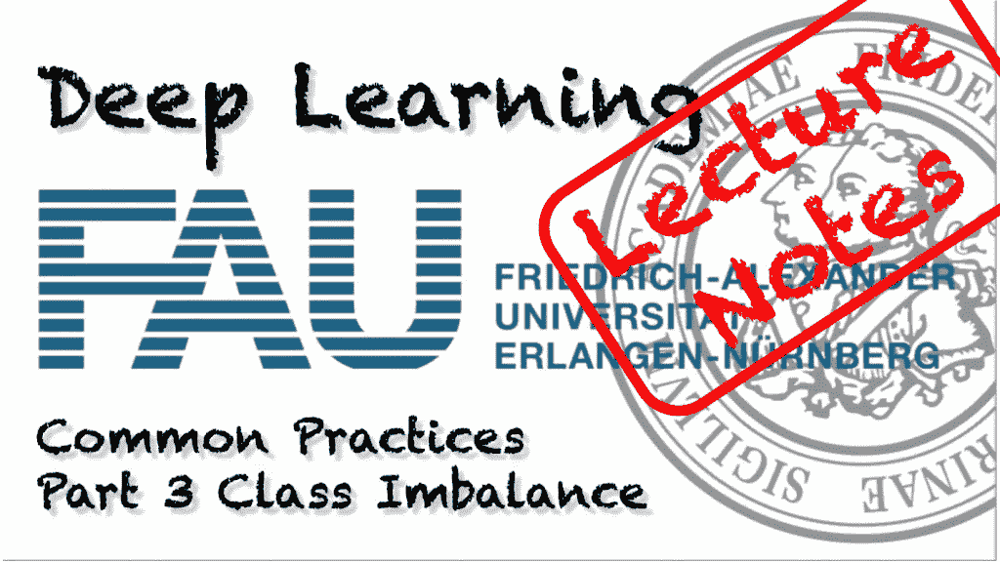
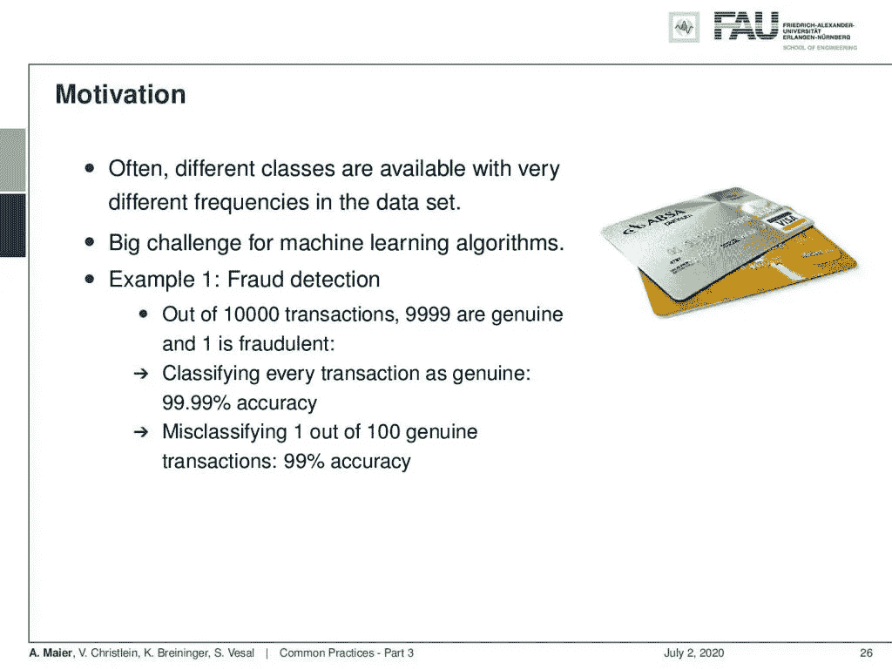
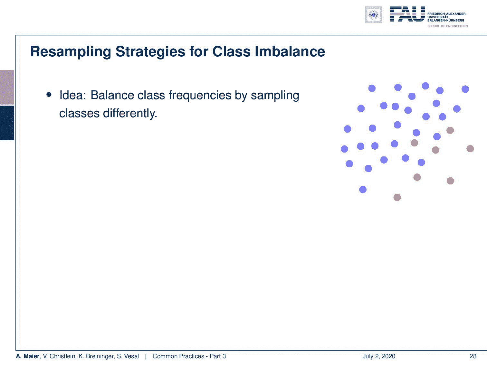
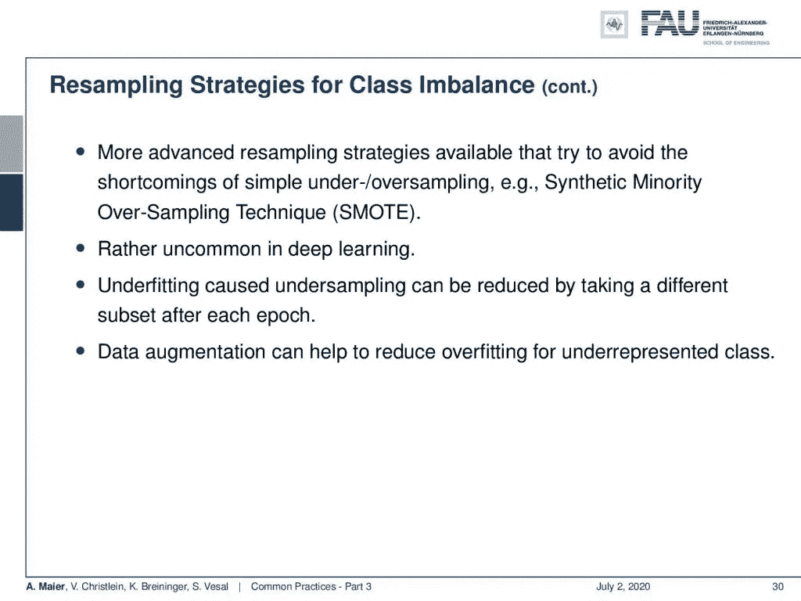
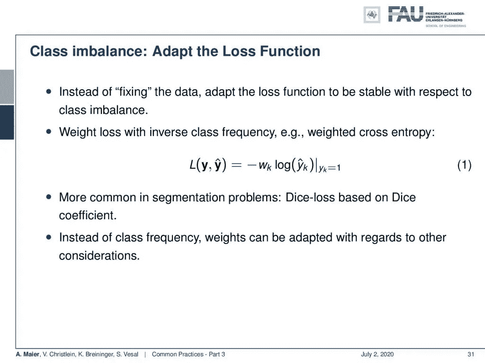

# 常见做法—第 3 部分

> 原文：<https://towardsdatascience.com/common-practices-part-3-f4853b0ac977?source=collection_archive---------75----------------------->

## [FAU 讲座笔记](https://towardsdatascience.com/tagged/fau-lecture-notes)关于深度学习

## 阶级不平衡

FAU 大学的深度学习。下图 [CC BY 4.0](https://creativecommons.org/licenses/by/4.0/) 来自[深度学习讲座](https://www.youtube.com/watch?v=p-_Stl0t3kU&list=PLpOGQvPCDQzvgpD3S0vTy7bJe2pf_yJFj&index=1)

**这些是 FAU 的 YouTube 讲座** [**深度学习**](https://www.youtube.com/watch?v=p-_Stl0t3kU&list=PLpOGQvPCDQzvgpD3S0vTy7bJe2pf_yJFj&index=1) **的讲义。这是与幻灯片匹配的讲座视频&的完整抄本。我们希望，你喜欢这个视频一样多。当然，这份抄本是用深度学习技术在很大程度上自动创建的，只进行了少量的手动修改。如果你发现了错误，请告诉我们！**

# 航行

[**上一讲**](/common-practices-part-2-23dad51e2aae) **/** [**观看本视频**](https://youtu.be/rKvVI1oCZTs) **/** [**顶级**](/all-you-want-to-know-about-deep-learning-8d68dcffc258) **/** [**下一讲**](/common-practices-part-4-70c08fce3588)

欢迎回到深度学习！今天，我们想继续谈谈我们的常见做法。我们今天感兴趣的方法是关于阶级不平衡的。因此，一个非常典型的问题是，一门课——尤其是非常有趣的一门课——并不经常上。所以，这是对所有机器学习算法的挑战。

今日问题:如何应对阶层失衡？ [CC 下的图片来自](https://creativecommons.org/licenses/by/4.0/)[深度学习讲座](https://www.youtube.com/watch?v=p-_Stl0t3kU&list=PLpOGQvPCDQzvgpD3S0vTy7bJe2pf_yJFj&index=1)的 4.0 。

让我们以欺诈检测为例。在 10，000 笔交易中，9，999 笔是真实的，只有一笔是欺诈性的。所以，如果你把所有东西都归类为正品，你会得到 99.99%的准确率。显然，即使在不太严重的情况下，如果你有一个模型，它会从一百个交易中错误地分类出一个，那么你最终只能得到一个准确率为 99%的模型。这当然是一个很难的问题。特别是，在筛选应用程序时，你必须非常小心，因为仅仅将所有东西归类到最常见的类别中仍然可以获得非常非常好的准确性。

为了评估癌症的侵袭性，有丝分裂细胞是重要的。 [CC 下的图片来自](https://creativecommons.org/licenses/by/4.0/)[深度学习讲座](https://www.youtube.com/watch?v=p-_Stl0t3kU&list=PLpOGQvPCDQzvgpD3S0vTy7bJe2pf_yJFj&index=1)的 4.0 。

不一定是信用卡，比如这里检测有丝分裂细胞就是一个非常类似的问题。有丝分裂细胞是正在进行细胞分裂的细胞。正如我们在引言中所听到的，这些细胞非常重要。如果你计算处于有丝分裂状态的细胞，你就会知道相关的癌症是如何迅速增长的。所以这是一个非常重要的特征，但是你必须正确地检测它们。它们只占组织中细胞的很小一部分。所以，这个类的数据在训练期间被看到得少得多，并且像准确度、L2 范数和交叉熵这样的度量没有显示出这种不平衡。所以，他们对此反应不是很强烈。

欠采样是对抗类不平衡的第一个想法。来自[深度学习讲座](https://www.youtube.com/watch?v=p-_Stl0t3kU&list=PLpOGQvPCDQzvgpD3S0vTy7bJe2pf_yJFj&index=1)的 [CC BY 4.0](https://creativecommons.org/licenses/by/4.0/) 下的图片。

你可以做的一件事是，比如重新采样。这个想法是，你通过对类进行不同的采样来平衡类的频率，所以，你可以理解这意味着你必须丢弃很多最频繁类的训练数据。这样你就可以训练一个分类器来平衡这两个类。现在他们几乎和其他班级一样频繁地出现。这种方法的缺点是，您没有使用所有看到的数据，当然，您也不想丢弃数据。

过采样是处理类不平衡的另一种策略。 [CC 下的图片来自](https://creativecommons.org/licenses/by/4.0/)[深度学习讲座](https://www.youtube.com/watch?v=p-_Stl0t3kU&list=PLpOGQvPCDQzvgpD3S0vTy7bJe2pf_yJFj&index=1)的 4.0 。

另一种技术是过采样。你可以更多地从代表性不足的班级中取样。在这种情况下，您可以使用所有的数据。缺点当然是它会导致对不太常见的例子的过度拟合。欠采样和过采样的组合也是可能的。

SMOTE 是在深度学习中执行重采样的一种相当不常见的方法。更常见的是，您会发现对数据扩充的巧妙使用。来自[深度学习讲座](https://www.youtube.com/watch?v=p-_Stl0t3kU&list=PLpOGQvPCDQzvgpD3S0vTy7bJe2pf_yJFj&index=1)的 [CC BY 4.0](https://creativecommons.org/licenses/by/4.0/) 下的图片。

这就产生了先进的重采样技术，试图避免合成少数过采样的欠采样缺点。在深度学习中相当少见。由欠采样引起的欠拟合可以通过在每个时期之后采用不同的子集来减少。这很常见，你也可以使用数据扩充来帮助减少对代表性不足的类的过度拟合。所以，你实际上增加了更多你不常看到的样本。

一个很常见的选择是根据上课频率调整损耗。 [CC 下的图片来自](https://creativecommons.org/licenses/by/4.0/)[深度学习讲座](https://www.youtube.com/watch?v=p-_Stl0t3kU&list=PLpOGQvPCDQzvgpD3S0vTy7bJe2pf_yJFj&index=1)的 4.0 。

当然，除了固定数据之外，你还可以尝试调整损失函数，使其相对于类别不平衡保持稳定。在这里，您可以选择一个与类别频率相反的损失。然后，您可以创建加权交叉熵，其中您引入了一个额外的权重 w，它被简单地确定为逆类频率。分割问题中更常见的是基于[骰子系数](https://en.wikipedia.org/wiki/S%C3%B8rensen%E2%80%93Dice_coefficient)的骰子损失。在这里，您将评估测量区域重叠的 dice 系数的损失。这是一种非常典型的用于评估分段而不是类别频率的方法。权重也可以根据其他考虑因素进行调整，但我们不会在本次讲座中讨论它们。

在这个深度学习讲座中，更多令人兴奋的事情即将到来。 [CC 下的图片来自](https://creativecommons.org/licenses/by/4.0/)[深度学习讲座](https://www.youtube.com/watch?v=p-_Stl0t3kU&list=PLpOGQvPCDQzvgpD3S0vTy7bJe2pf_yJFj&index=1)的 4.0 。

这已经把我们带到了这一部分的结尾，在通用实践的最后一节，我们现在将讨论评估的方法以及如何恰当地评估我们的模型。所以，非常感谢大家的收听，再见！

如果你喜欢这篇文章，你可以在这里找到[更多的文章](https://medium.com/@akmaier)，在这里找到更多关于机器学习的教育材料[，或者看看我们的](https://lme.tf.fau.de/teaching/free-deep-learning-resources/)[深度](https://www.youtube.com/watch?v=p-_Stl0t3kU&list=PLpOGQvPCDQzvgpD3S0vTy7bJe2pf_yJFj) [学习](https://www.youtube.com/watch?v=p-_Stl0t3kU&list=PLpOGQvPCDQzvgpD3S0vTy7bJe2pf_yJFj&index=1) [讲座](https://www.youtube.com/watch?v=p-_Stl0t3kU&list=PLpOGQvPCDQzvgpD3S0vTy7bJe2pf_yJFj)。如果你想在未来了解更多的文章、视频和研究，我也会很感激关注 YouTube、Twitter、脸书、LinkedIn 或 T21。本文以 [Creative Commons 4.0 归属许可](https://creativecommons.org/licenses/by/4.0/deed.de)发布，如果引用，可以转载和修改。

# 参考

[1] M. Aubreville，M. Krappmann，C. Bertram 等，“用于组织学细胞分化的导向空间转换器网络”。载于:ArXiv 电子版(2017 年 7 月)。arXiv: 1707.08525 [cs。简历】。
【2】詹姆斯·伯格斯特拉和约舒阿·本吉奥。“随机搜索超参数优化”。在:j .马赫。学习。第 13 号决议(2012 年 2 月)，第 281-305 页。
【3】让·迪金森·吉本斯和 Subhabrata Chakraborti。“非参数统计推断”。载于:国际统计科学百科全书。斯普林格，2011 年，第 977-979 页。
[4]约舒阿·本吉奥。“深度架构基于梯度训练的实用建议”。《神经网络:交易的诀窍》。斯普林格出版社，2012 年，第 437-478 页。
[5]·张，Samy Bengio，Moritz Hardt 等，“理解深度学习需要反思泛化”。载于:arXiv 预印本 arXiv:1611.03530 (2016)。
[6]鲍里斯·T·波亚克和阿纳托利·B·朱迪斯基。“通过平均加速随机逼近”。摘自:SIAM 控制与优化杂志 30.4 (1992)，第 838-855 页。
【7】普拉吉特·拉马钱德兰，巴雷特·佐夫，和阔克诉勒。“搜索激活功能”。载于:CoRR abs/1710.05941 (2017 年)。arXiv: 1710.05941。
[8] Stefan Steidl，Michael Levit，Anton Batliner 等，“所有事物的衡量标准是人:情感的自动分类和标签间的一致性”。在:过程中。ICASSP 的。电气和电子工程师协会，2005 年 3 月。