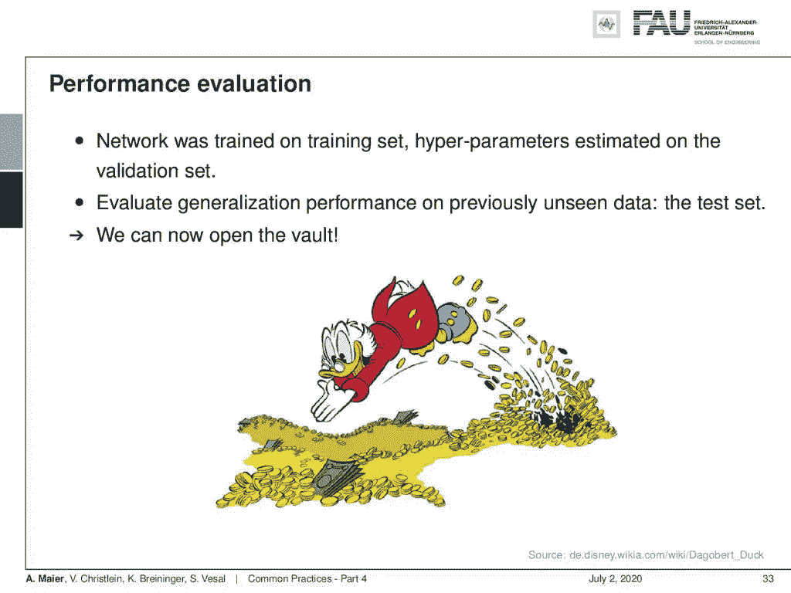
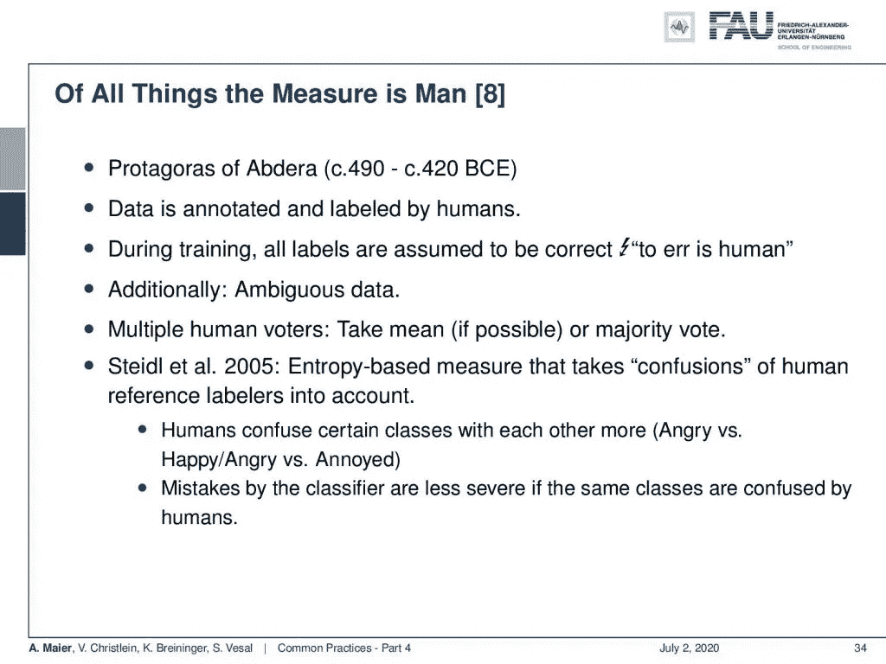
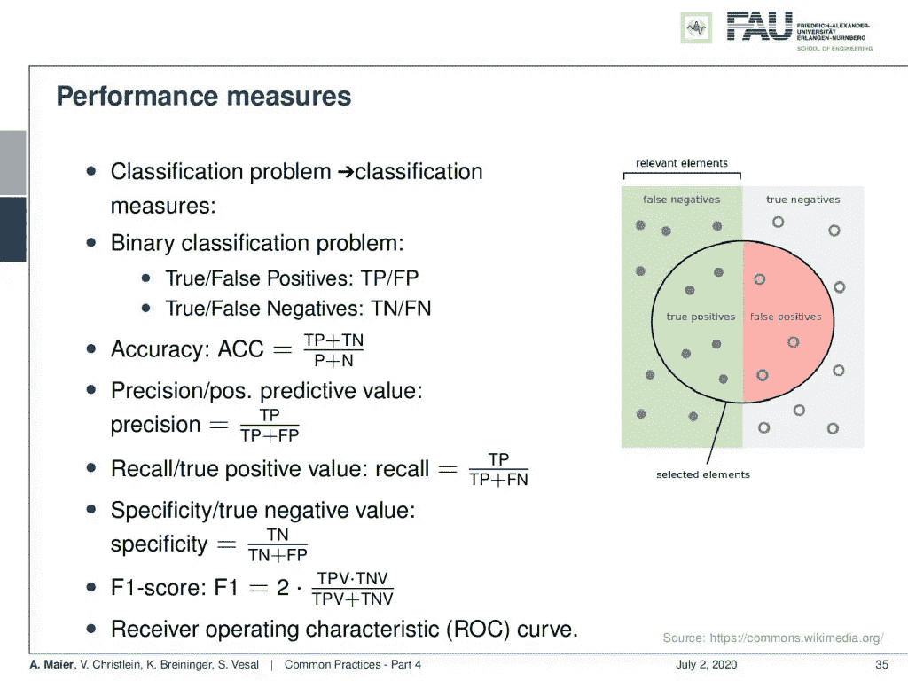
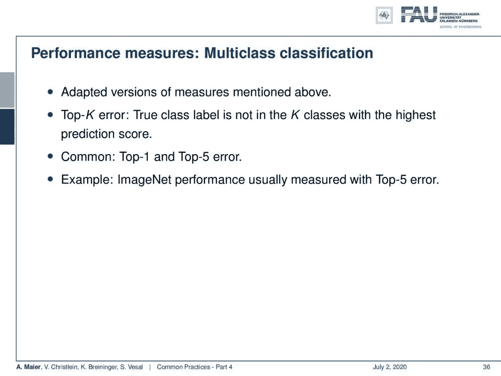
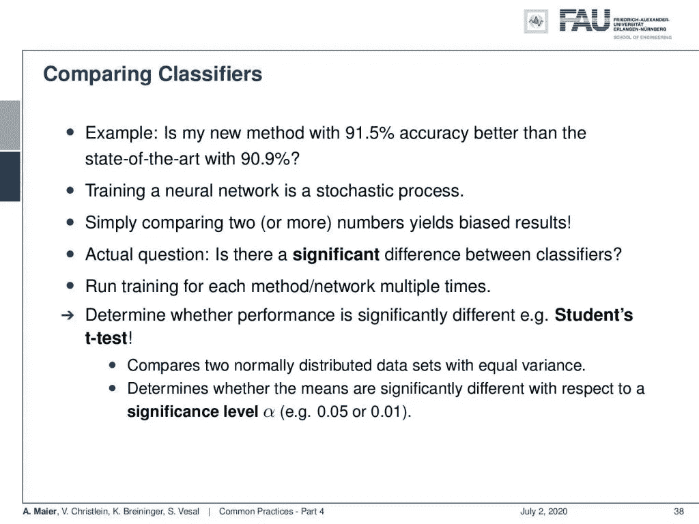
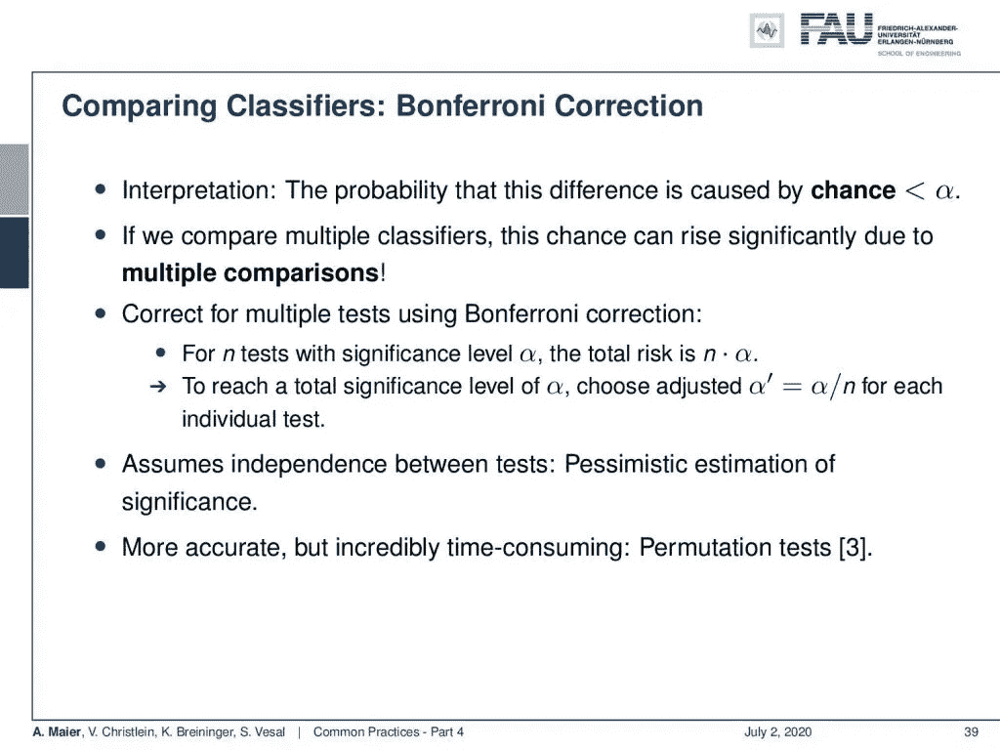
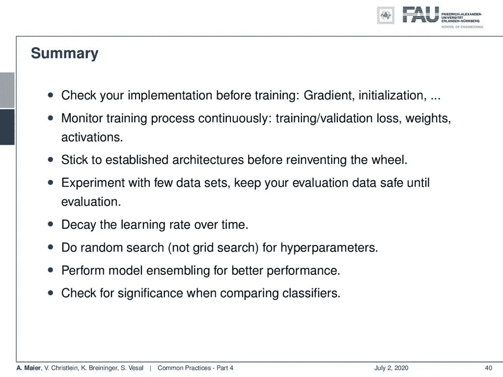

# 常见做法—第 4 部分

> 原文：<https://towardsdatascience.com/common-practices-part-4-70c08fce3588?source=collection_archive---------56----------------------->

## [FAU 讲座笔记](https://towardsdatascience.com/tagged/fau-lecture-notes)关于深度学习

## 性能赋值

FAU 大学的深度学习。下图 [CC BY 4.0](https://creativecommons.org/licenses/by/4.0/) 来自[深度学习讲座](https://www.youtube.com/watch?v=p-_Stl0t3kU&list=PLpOGQvPCDQzvgpD3S0vTy7bJe2pf_yJFj&index=1)

**这些是 FAU 的 YouTube 讲座** [**深度学习**](https://www.youtube.com/watch?v=p-_Stl0t3kU&list=PLpOGQvPCDQzvgpD3S0vTy7bJe2pf_yJFj&index=1) **的讲义。这是与幻灯片匹配的讲座视频&的完整抄本。我们希望，你喜欢这个视频一样多。当然，这份抄本是用深度学习技术在很大程度上自动创建的，只进行了少量的手动修改。如果你发现了错误，请告诉我们！**

# 航行

[**上一讲**](/common-practices-part-3-f4853b0ac977) **/** [**观看本视频**](https://youtu.be/lua5KI8fpAo) **/** [**顶级**](/all-you-want-to-know-about-deep-learning-8d68dcffc258) **/** [**下一讲**](/architectures-part-1-62c686f500c3)

最后，我们可以深入研究测试数据。 [CC 下的图片来自](https://creativecommons.org/licenses/by/4.0/)[深度学习讲座](https://www.youtube.com/watch?v=p-_Stl0t3kU&list=PLpOGQvPCDQzvgpD3S0vTy7bJe2pf_yJFj&index=1)的 4.0 。

欢迎大家进入深度学习的下一部分！今天，我们想结束对常见实践的讨论，特别是，我们想看一下评估。当然，我们需要评估到目前为止我们已经训练过的模型的性能。现在，我们已经设置了训练，设置了超参数，并配置了所有这些。现在，我们想要评估之前未见过的数据的泛化性能。这意味着测试数据，是时候打开保险库了。

请记住，我们正在处理的大多数类别都是人造的。其中一些定义可能远不如乍看上去那样清晰。 [CC 下的图片来自](https://creativecommons.org/licenses/by/4.0/)[深度学习讲座](https://www.youtube.com/watch?v=p-_Stl0t3kU&list=PLpOGQvPCDQzvgpD3S0vTy7bJe2pf_yJFj&index=1)的 4.0 。

记住“万物的尺度是人”。因此，数据由人工标注和标记，在训练期间，所有的标记都被认为是正确的。当然，犯错是人之常情。这意味着我们可能有模棱两可的数据。您实际上希望您的数据的理想情况是，它已经由多个人类投票者进行了注释。然后你可以采取平均或多数投票。还有一篇由 Stefan Steidl 在 2005 年发表的非常好的论文。它引入了一种基于熵的测量方法，考虑了人类参考标签的混淆。这在标签不清楚的情况下非常有用。特别是，在情感识别中，这是一个问题，因为人类有时会混淆愤怒和烦恼等类别，而他们不太可能混淆“愤怒”和“快乐”，因为这是一个非常明显的区别。有不同程度的快乐。有时候你只是有点开心。在这些情况下，真的很难区分开心和中立。这对人类来说也很难。在原型中，如果你让演员扮演，你会得到超过 90%的情感识别率。如果你有真实的数据情绪，如果你有日常生活中发生的情绪，那就很难预测了。这也可以在标签和标签的分布中看到。如果你有一个原型，所有的评分者都会同意这个观察显然是这个特殊的类。如果你有细微差别和不那么明确的情绪，你会发现我们的评分者在标签上的分布也不太明显，甚至是均匀的，因为他们也不能评估特定的样本。因此，如果人类也混淆了同一个类，分类器的错误显然不那么严重。这正是 Steidl 基于熵的度量所考虑的。

两类问题的典型评价措施。来自[深度学习讲座](https://www.youtube.com/watch?v=p-_Stl0t3kU&list=PLpOGQvPCDQzvgpD3S0vTy7bJe2pf_yJFj&index=1)的 [CC BY 4.0](https://creativecommons.org/licenses/by/4.0/) 下的图片。

现在，如果我们研究绩效评估，您需要考虑典型的分类评估。它们通常围绕假阴性、真阴性、真阳性和假阳性而建立。从二进制分类问题，你可以计算真和假阳性率。这通常会产生一些数字，比如准确率，即正的数量加上负的数量除以正的数量和负的数量。然后是精确度或阳性预测值，计算方法是真阳性的数量除以真阳性加上假阳性的数量。有一种所谓的召回，它被定义为真阳性与真阳性加上假阴性之比。特异性或真负值是真阴性除以真阴性加上假阳性。F1 分数是混合这些指标的中间方式。你有真正的正值乘以真正的负值，除以两个正值和真正的负值之和。我通常推荐[接收机工作特性(ROC)曲线](https://en.wikipedia.org/wiki/Receiver_operating_characteristic)，因为你在上面看到的所有测量都依赖于阈值。如果你有 ROC 曲线，你基本上评估了所有不同阈值的分类器。这将为您分析它在不同场景下的表现。

多类问题的典型措施。来自[深度学习讲座](https://www.youtube.com/watch?v=p-_Stl0t3kU&list=PLpOGQvPCDQzvgpD3S0vTy7bJe2pf_yJFj&index=1)的 [CC BY 4.0](https://creativecommons.org/licenses/by/4.0/) 下的图片。

此外，在多类分类中还有性能测量。这些是上述措施的变通版本。top- *K* 误差是真实类别标签不在具有最高预测分数的 *K* 估计中的概率。常见的实现是前 1 名和前 5 名错误。例如，ImageNet 通常使用 top-5 错误。如果你真的想了解多类分类中发生了什么，我建议看看混淆矩阵。混淆矩阵对 10 到 15 个班级很有用。如果你有一千个类，混淆矩阵不再有任何意义。尽管如此，如果您在类较少的情况下查看混淆矩阵，您可以对正在发生的事情有更多的了解。

交叉验证是估计样本外误差的常用工具。 [CC 下的图片来自](https://creativecommons.org/licenses/by/4.0/)[深度学习讲座](https://www.youtube.com/watch?v=p-_Stl0t3kU&list=PLpOGQvPCDQzvgpD3S0vTy7bJe2pf_yJFj&index=1)的 4.0 。

现在，有时你只有很少的数据。因此，在这些情况下，您可能希望选择交叉验证。在 k 倍交叉验证中，您将数据分成 k 倍，然后使用 k-1 倍作为训练数据，并在 k 倍上进行测试。然后，重复 k 次。这样，你在评估数据中看到了所有的数据，但是你是在独立数据上训练的，因为你在训练的时候拿出来了。这在深度学习中相当少见，因为这意味着非常长的训练时间。你必须重复整个训练 K 次，如果你训练 7 天，这真的很难。如果你有七次交叉验证，你知道你可以做数学，这将需要很长时间。如果用于超参数估计，就得嵌套。不要只对所有数据进行交叉验证，选择超参数，然后对相同的数据进行测试。这会给你带来乐观的结果。你应该始终确保，如果你选择了参数，你在你想要测试的地方拿出了测试数据，所以有将交叉验证嵌套到交叉验证中的技术，但这也会在计算上变得非常昂贵，所以如果你想嵌套交叉验证，那就更糟了。你必须记住的一点是，结果的方差通常被低估了，因为训练授权不是独立的。你还需要注意 通过合并架构选择和超参数选择，可能会引入额外的偏差，因此这应该在不同的数据上进行，如果您正在使用交叉验证，即使没有交叉验证，这也是非常困难的。训练是一个高度随机的过程，因此如果您选择随机初始化，您可能需要使用不同的初始化来多次重新训练您的网络，然后报告标准偏差，以确保您的训练实际执行得有多好。

两个识别率之间的差异可能是训练过程的统计性质的产物。来自[深度学习讲座](https://www.youtube.com/watch?v=p-_Stl0t3kU&list=PLpOGQvPCDQzvgpD3S0vTy7bJe2pf_yJFj&index=1)的 [CC BY 4.0](https://creativecommons.org/licenses/by/4.0/) 下的图片。

现在，你想比较不同的分类器。问题是:“我 91.5%准确率的新方法比 90.9%的最先进方法好吗？”当然，训练一个系统是一个随机过程。因此，仅仅比较这两个数字会产生有偏差的结果。你要问的实际问题是:“分类器之间有**显著的**差异吗？”这意味着您需要为每种方法运行多次培训。例如，只有这样，您才能使用 t-test 来查看结果的分布是否有显著差异(参见链接部分)。t 检验比较两个方差相等的正态分布数据集。然后，您可以确定均值在显著性水平α(即随机性水平)方面存在显著差异。你经常会在文献中发现 5%或 1%的显著性水平。所以，如果这个观察结果是随机的，概率小于 5%或 1%，你就有了显著的不同。

针对相同数据的多次测试需要进行统计校正，如 Bonferroni 校正。来自[深度学习讲座](https://www.youtube.com/watch?v=p-_Stl0t3kU&list=PLpOGQvPCDQzvgpD3S0vTy7bJe2pf_yJFj&index=1)的 [CC BY 4.0](https://creativecommons.org/licenses/by/4.0/) 下的图片。

现在，如果您在相同的数据上训练多个模型，请小心。如果你多次询问相同的数据，你实际上必须修正你的重要性计算。这被称为 Bonferroni 校正。如果我们比较多个分类器，这将引入多个比较，然后您必须对此进行校正。如果你进行了显著性水平为α的 *n* 次测试，那么总风险为 *n* 乘以α。因此，为了达到α的总显著性水平，对于每个单独的测试，调整后的α’将是α除以 *n* 。因此，对相同的数据运行的测试越多，需要除以的次数就越多。当然，这假设了测试之间的独立性，这是一种对显著性的悲观估计。但在这种情况下，你想要悲观，只是为了确保你不是在报告一件偶然产生的事情。仅仅因为你测试的次数足够多，而且你的测试是一个随机的过程，可能会有一个非常好的结果碰巧出现。更准确，但非常耗时的是排列测试，相信我，你可能想用 Bonferroni 校正来代替。置换一切将比我们之前看到的交叉验证方法花费更长的时间。

深度学习常用实践总结。 [CC 下的图片来自](https://creativecommons.org/licenses/by/4.0/)[深度学习讲座](https://www.youtube.com/watch?v=p-_Stl0t3kU&list=PLpOGQvPCDQzvgpD3S0vTy7bJe2pf_yJFj&index=1)的 4.0 。

好的，让我们总结一下我们之前所看到的:在训练之前检查你的实现，梯度初始化，持续监控训练过程，训练，验证损失，权重，和激活。在重新发明轮子之前，坚持已建立的架构。使用少量数据进行实验，并在评估之前保持评估数据的安全。随着时间的推移，学习率逐渐下降。随机搜索，而不是网格搜索超参数。执行模型集合以获得更好的性能，当然，当您检查您的比较时，您希望进行显著性测试以确保您没有报告随机观察。

在这个深度学习讲座中，更多令人兴奋的事情即将到来。来自[深度学习讲座](https://www.youtube.com/watch?v=p-_Stl0t3kU&list=PLpOGQvPCDQzvgpD3S0vTy7bJe2pf_yJFj&index=1)的 [CC BY 4.0](https://creativecommons.org/licenses/by/4.0/) 下的图片。

因此，下一次在深度学习中，我们实际上想看看神经网络架构的演变。所以从深层网络到更深层的网络。我们想看看稀疏和密集的连接，我们将介绍许多常见的名称，到处都可以听到的名称，LeNet、GoogLeNet、ResNet 等等。因此，在接下来的系列讲座视频中，我们将了解许多有趣的最新方法。所以，非常感谢大家的收听，下期视频再见！

如果你喜欢这篇文章，你可以在这里找到更多的文章，或者看看我们的讲座。如果你想在未来了解更多的文章、视频和研究，我也会很感激关注 [YouTube](https://www.youtube.com/c/AndreasMaierTV) 、 [Twitter](https://twitter.com/maier_ak) 、[脸书](https://www.facebook.com/andreas.maier.31337)或 [LinkedIn](https://www.linkedin.com/in/andreas-maier-a6870b1a6/) 。本文以 [Creative Commons 4.0 归属许可](https://creativecommons.org/licenses/by/4.0/deed.de)发布，如果引用，可以转载和修改。

# 链接

*   [在线 t-test](https://www.usablestats.com/calcs/2samplet&summary=1)
*   [用于比较识别率的在线测试](http://peaks.informatik.uni-erlangen.de/cgi-bin/significance.cgi)
*   [比较相关性的在线测试](http://peaks.informatik.uni-erlangen.de/cgi-bin/usignificance.cgi)

# 参考

[1] M. Aubreville，M. Krappmann，C. Bertram 等，“用于组织学细胞分化的导向空间转换器网络”。载于:ArXiv 电子版(2017 年 7 月)。arXiv: 1707.08525 [cs。简历】。
【2】詹姆斯·伯格斯特拉和约舒阿·本吉奥。“随机搜索超参数优化”。在:j .马赫。学习。第 13 号决议(2012 年 2 月)，第 281-305 页。
【3】让·迪金森·吉本斯和 Subhabrata Chakraborti。“非参数统计推断”。载于:国际统计科学百科全书。斯普林格，2011 年，第 977-979 页。
[4]约舒阿·本吉奥。“深度架构基于梯度训练的实用建议”。《神经网络:交易的诀窍》。斯普林格出版社，2012 年，第 437-478 页。
[5]·张，Samy Bengio，Moritz Hardt 等，“理解深度学习需要反思泛化”。载于:arXiv 预印本 arXiv:1611.03530 (2016)。
[6]鲍里斯·T·波亚克和阿纳托利·B·朱迪斯基。“通过平均加速随机逼近”。摘自:SIAM 控制与优化杂志 30.4 (1992)，第 838-855 页。
【7】普拉吉特·拉马钱德兰，巴雷特·佐夫，和阔克诉勒。“搜索激活功能”。载于:CoRR abs/1710.05941 (2017 年)。arXiv: 1710.05941。
[8] Stefan Steidl，Michael Levit，Anton Batliner 等，“所有事物的衡量标准是人:情感的自动分类和标签间的一致性”。在:过程中。ICASSP 的。电气和电子工程师协会，2005 年 3 月。