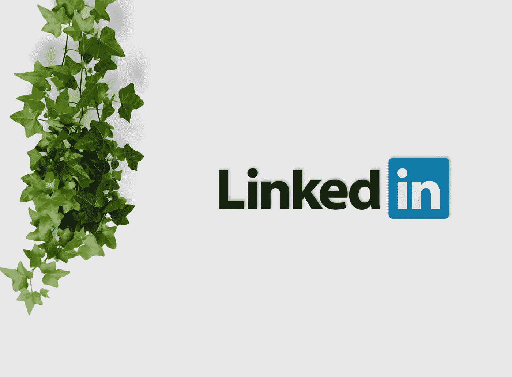

# 机器学习学生和从业者在 LinkedIn 上问的常见问题

> 原文：<https://towardsdatascience.com/common-questions-machine-learning-students-and-practitioners-ask-on-linkedin-51bedcdea82c?source=collection_archive---------55----------------------->

由 [Unsplash](https://unsplash.com/s/photos/linkedin?utm_source=unsplash&utm_medium=referral&utm_content=creditCopyText) 上的 [inlytics](https://unsplash.com/@inlytics?utm_source=unsplash&utm_medium=referral&utm_content=creditCopyText) 拍摄

## 经验

## 本文中的答案可以为您的机器学习之旅节省一些时间和麻烦

# 介绍

LinkedIn 多年来越来越受欢迎，它已经成为专业人士的社交网络空间。

我见过许多专业人士以各种方式利用 LinkedIn。一些人把它作为个人品牌建设的工具，而另一些人把它作为潜在客户和营销的工具。

LinkedIn 的一个突出用途是联系个人寻求职业和学术建议。这些人可能在物理上无法接触到，因此 LinkedIn 是一个沟通渠道，它弥合了个人之间的物理距离。

使用 LinkedIn 作为建议平台是本文的重点。个人已经阅读了我的文章，并通过 [LinkedIn](https://www.linkedin.com/in/richmondalake/) 联系我，以获得更多关于特定主题的信息和建议，所有这些都与机器学习相关。

## 在这篇文章中，我将包括机器学习从业者和学生提出的一些常见问题，我还将包括我提供的相应答案。

*我已经从问题中删除了任何姓名和个人信息，以保护联系过我的个人的身份。*

# 如何阅读这篇文章

> ***个人提出的问题将遵循您正在阅读的这份特定陈述的格式*** 。

*“我的声明看起来像这样”*

答案将遵循以下格式:

## 回答:

包含对问题的回答的段落

# 问题 1(在线学习)

## 问题:

> 你好，Richmond，我正在学习计算机视觉，如果你有任何对我有帮助的课程链接/文章/电子书，我将不胜感激。谢谢！

*这是好奇的人问的一个常见问题，他们希望获得一些关于机器学习相关主题的基础知识。我倾向于引导新学员使用我利用的免费资源。我认为，在花钱购买课程和参加证书课程之前，最好先了解一下学科领域和主题。*

## 回答

要学习计算机视觉，你必须了解机器学习、神经网络和图像处理的基础知识。

## 神经网络

在机器学习中，理解线性代数、微积分和偏微分等主题是必不可少的。

在神经网络中，理解基本概念和思想是至关重要的。理解诸如反向传播、消失梯度下降和不同的神经网络架构(例如卷积神经网络(CNN))的概念也很重要；深度神经网络(deep)和递归神经网络(RNN)。

[3Blue1Brown 神经网络视频](https://www.youtube.com/playlist?list=PLZHQObOWTQDNU6R1_67000Dx_ZCJB-3pi)

## 斯坦福计算机视觉讲座

在了解 ML 和神经网络的基础知识之后，您可以深入斯坦福大学的一些学术内容，这些内容解释了一些标准的计算机视觉技术、理论和算法。

[斯坦福计算机视觉视频](https://www.youtube.com/playlist?list=PLf7L7Kg8_FNxHATtLwDceyh72QQL9pvpQ)

## 深度蜥蜴机器学习&深度学习

如果你对神经网络和一些机器学习算法背后的理论和数学有坚实的掌握，你可以继续使用标准的机器学习库，如 [PyTorch](https://pytorch.org/) ，进行一些实际的项目和网络实现。

[深度蜥蜴机器学习&深度学习](https://www.youtube.com/playlist?list=PLZbbT5o_s2xq7LwI2y8_QtvuXZedL6tQU)

[深蜥蜴神经网络编程](https://www.youtube.com/playlist?list=PLZbbT5o_s2xrfNyHZsM6ufI0iZENK9xgG)

有了你积累的所有知识，你应该能够开始你的个人项目，并拥有获得入门级计算机视觉工作职位所需的专业知识。

我建议你创建自己的项目，并参加一些竞赛。此外，如果你尝试在[媒体](https://medium.com/)上写作，展示你对计算机视觉和机器学习的主题和概念的理解，也会有所帮助。

 [## 学习计算机视觉的 5 种方法

### 本文列出了一些可以用来学习计算机视觉的方法，这是一个机器学习相关领域

towardsdatascience.com](/5-ways-you-can-learn-computer-vision-6dae3f312686) 

# 问题 2(博士与硕士)

## 问题:

> 我最近开始了我作为毕业生的第一份人工智能工作，特别是在计算机视觉方面。我有计算机工程学士学位，但我正在考虑在大学里开始非全日制人工智能硕士课程，我会在工作时间之外的业余时间做这些。只是想知道，你有没有考虑过读博士，或者你觉得在人工智能领域工作一个硕士就足够了？

## 回答:

直接回答你的问题，我觉得一个硕士对于在 AI 领域工作来说绰绰有余。

高级资格证书的好处是，它提供了学术权威，也向潜在雇主表明你已经花时间专攻某一特定领域。

在进行求职时，我看到一些机器学习和人工智能职位要求申请人获得博士学位，但大多数职位要么非常专业，要么在公司的研究部门内。

博士学位向雇主表明，你可以在某个领域的某个特定领域投入时间，成为某种程度上的专家，并为该领域的发展做出贡献。对于行业中的大多数机器学习角色来说，这并不完全必要。

我会说，你应该去攻读硕士学位，并全力以赴，或许如果你在机器学习领域找到了自己感兴趣的领域，那么你可以攻读博士学位。

目前，我没有考虑读博士，因为我想在机器学习和计算机视觉领域建立一个坚实的五年职业生涯。

也许我会在 7 年左右的时间里评估我的决定。

 [## 该不该考机器学习的博士？

### 探索攻读机器学习博士学位的好处

towardsdatascience.com](/should-you-take-a-phd-in-machine-learning-79530e1cb01c) 

# 问题 3(机器学习研究与工程)

## 问题:

> 我希望从事这样一份工作:一半时间研究新的、令人兴奋的东西，一半时间阅读、写论文和编写代码，同时管理人员，解决现实世界的问题(我知道解决现实世界的问题是研究的一部分)。我不确定这样的角色是否存在。我觉得我正处于职业生涯的一个重要阶段，我需要做出重要的决定。考虑到你的经历，如果你能给我以上的建议，那就太神奇了。

## 回答:

关于寻找一个在工程和研究之间保持 50/50 平衡的角色，我将诚实地告诉你，并不是很多工作角色都能提供这种平衡，甚至不能在工作角色描述中定义正确的平衡。

正如我在我的[文章](/7-key-differences-between-machine-learning-engineers-and-researchers-salaries-included-b62c3aaebde9)中提到的，有很多工程师进行研究，反之亦然。但是我没有提到的一个关键点是，ML 研究人员角色和工程角色的平衡可以基于当前的需求和业务要求。

我发现在你为公司工作期间，工程和研究变化之间的平衡是基于公司当前的目标和重点。

以我为例，我申请了现在的职位，在工作描述和面试中，并没有提到我将进行任何深入的研究。但是在头两个月，我做的研究比工程多，但是头两个月后到现在，我做的工程比研究多。

我的建议是你继续尽你所能从人群中脱颖而出。使用最先进的机器学习方法的工程工具，还可以培养阅读和撰写研究论文的技能。

当你到了申请角色的阶段，一定要问清楚工程和研究之间的平衡是什么。

你会发现很难找到一个完美的 50/50 平衡的角色，但有一些工作机会，你可以定义你想要的平衡类型，尽管它们很少，但它们仍然存在。

# 问题 4(机器学习职业可能性)

## 问题:

> ***我一直在想我是否有可能成为一名计算机视觉工程师。我不是博士，也没有硕士学位，我只是一名毕业生。你有什么建议？***

## 回答

我建议看看你所在的地方对计算机视觉工程师的工作角色要求。

确定你需要了解哪些技能、技术、算法、编程语言和工具，并确保你正在获取它们。

接下来，为了弥补资格的不足，我建议如果可以的话，考虑攻读硕士学位。但如果你无法追求机器学习的高级学位，那么你可以考虑以下选项:

1.  参加在线计算机视觉相关课程，完成后提供证书。 [Udacity](https://www.udacity.com/course/computer-vision-nanodegree--nd891) 适合这个:

2.拥有 3-5 个令人印象深刻的计算机视觉/机器学习项目的项目组合。

3.看看如何完成 [Kaggle 挑战](https://www.kaggle.com/)。

# 结论

我希望您已经从这篇文章的内容中发现了一些价值。

有人将我的经验和专业知识视为一个学习点，这非常令人羞愧。如果你有任何问题想问我，或者你可能更喜欢我更详细地阐述一些问题的答案，那么你可以像往常一样通过 [LinkedIn](https://www.linkedin.com/in/richmondalake/) 联系我。

我不愿意回答机器学习相关的问题或疑问，因为我知道这个领域有多困难和具有挑战性，所以请不要羞于问任何紧迫的问题。我会尽力提供合适的答案。

# 我希望这篇文章对你有用。

要联系我或找到更多类似本文的内容，请执行以下操作:

1.  订阅我的 [**邮件列表**](https://richmond-alake.ck.page/c8e63294ee) 获取每周简讯
2.  跟我上[中型 ](https://medium.com/@richmond.alake)
3.  通过 [**LinkedIn**](https://www.linkedin.com/in/richmondalake/) 联系我