# Python 中常用的时间序列数据分析方法和预测模型

> 原文：<https://towardsdatascience.com/common-time-series-data-analysis-methods-and-forecasting-models-in-python-f0565b68a3d8?source=collection_archive---------14----------------------->

## 使用 ARIMA 和 LSTM 模型分析用于预测的时间序列数据

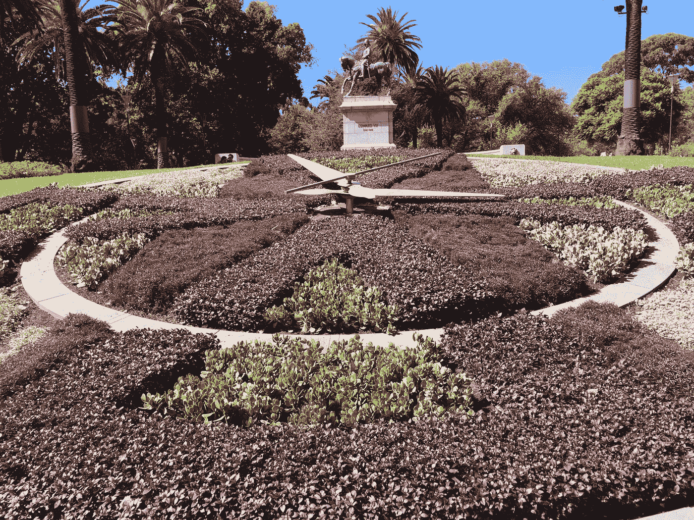

作者照片

[时间序列](https://en.wikipedia.org/wiki/Time_series)是以相等的时间间隔按时间顺序获取的数据样本序列。时间序列包括来自金融、医学、科学研究(如全球变暖、语音分析、地震)等不同领域的多种真实实验数据。[1][2].时间序列预测在各个领域都有很多实际应用，例如商业预测(如销售、股票)、天气、死亡等[1]。

给定用于预测的监督机器学习的传统(时间顺序独立)数据集，在可以执行特征工程之前需要数据探索和预处理，并且在可以选择机器学习模型并将其应用于工程特征以进行预测之前需要完成特征工程。

与传统数据集类似，给定一个时间序列数据集，在可以分析时间序列数据之前，需要进行数据探索和预处理，并且在可以选择时间序列预测模型并将其应用于所分析的数据集以进行预测之前，需要进行时间序列数据分析。

在本文中，我使用 Kaggle [2]的全球变暖数据集来演示 Python 中一些常见的时间序列数据预处理/分析方法和时间序列预测模型。演示包括以下内容:

*   时间序列数据预处理
*   时间序列数据分析
*   时间数列预测法

# 1.时间序列数据预处理

如前所述，对于时间序列数据，在进行数据分析之前，需要进行数据预处理。

## 1.1 加载数据

数据预处理的第一步是从 csv 文件加载数据。

时间顺序在时间序列数据分析和预测中起着至关重要的作用。特别是，时间序列中的每个数据样本必须与唯一的时间点相关联。这可以在 Pandas DataFrame/Series 中通过使用 *DatetimeIndex* 类型的值作为其索引值来实现。

一旦 Kaggle [2]中的地球表面温度数据集被下载到本地机器上，数据集 csv 文件可被加载到 Pandas 数据帧中，如下所示:

```
df_raw = pd.read_csv('./data/GlobalTemperatures.csv', parse_dates=['dt'], index_col='dt')
df_raw.head()
```

选项 *parse_dates* 是告诉 Pandas 将 *dt* 列中的字符串值解析为 Python *datatime* 值，而选项 *index_col* 是告诉 Pandas 将 *dt* 列的解析值转换为 *DatatimeIndex* 类型，然后将它们用作索引。

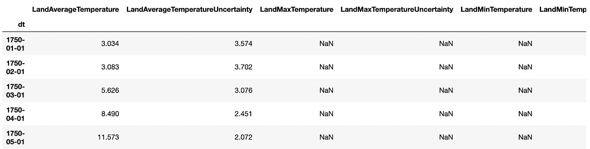

为了简单起见，我提取了 *LandAverageTemperature* 列作为 Pandas 系列，以便在本文中进行演示:

```
df = df_raw['LandAverageTemperature']
```

## 1.2 处理缺失数据

与传统数据集类似，时间序列数据中经常出现缺失数据，在对数据进行进一步预处理和分析之前，必须对其进行处理。

以下代码可以检查缺少多少数据条目:

```
df.isnull().value_counts()
```

地球表面温度时间序列中有 12 项缺失数据。在不破坏过去的时间相关性的情况下，这些丢失的值不能简单地被移除或设置为零。有多种方法可以恰当地处理时间序列中的缺失数据[3]:

*   向前填充
*   反向填充
*   线性内插法
*   二次插值法
*   最近邻居的平均值
*   季节对比平均值

我使用向前填充来填充本文中缺少的数据条目:

```
df = df.ffill()
```

# 2.时间序列数据分析

一旦数据预处理完成，下一步就是分析数据。

## 2.1 可视化数据

作为一种常见的实践[1][3][4]，时间序列数据分析的第一步是将数据可视化。

以下代码使用 Pandas DataFrame/Series 内置绘图方法绘制地球表面温度时间序列:

```
ax = df.plot(figsize=(16,5), title='Earth Surface Temperature')
ax.set_xlabel("Date")
ax.set_ylabel("Temperature")
```

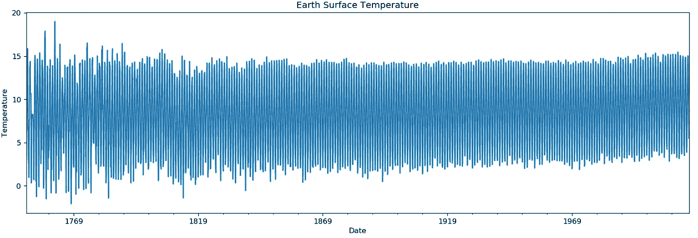

**图 1:** 地球表面温度。

上图显示，地球表面的平均温度大约在[5，12]的范围内，总体趋势是缓慢上升。由于不同时间序列成分(如基准水平、趋势、季节性)和其他成分(如误差和随机噪声)的混合，图中没有显示其他明显的模式[1][3]。时间序列可以分解成单个的部分，以便进一步分析。

## 2.2 将数据分解成组件

为了将一个时间序列分解成组件以供进一步分析，可以将该时间序列建模为基准水平、趋势、季节性和误差(包括随机噪声)的*加法*或*乘法*[3]:

*   **加法时间序列** :
    *数值* = *基数* **+** *趋势* **+** *季节性* **+** *误差*
*   **乘法时间序列** :
    *数值* = *基数水平* **x** *趋势* **x** *季节性* **x** *误差*

本文将地表温度时间序列建模为*相加*时间序列；

```
additive = seasonal_decompose(df, model='additive', extrapolate_trend='freq')
```

选项`extrapolate_trend='freq'`是处理时间序列开始时趋势和残差中的任何缺失值[3]。

理论上，通过将选项*模型=‘加法’*替换为*模型=‘乘法’，可以很容易地将相同的数据集建模为*乘法*时间序列。*然而，乘法模型不能应用于该特定数据集，因为数据集包含零值和/或负值，这在*乘法季节性分解*中是不允许的。

加法分解的结果分量可以被提取以形成如下的熊猫数据帧:

```
additive_df = pd.concat([additive.seasonal, additive.trend, additive.resid, additive.observed], axis=1)
additive_df.columns = ['seasonal', 'trend', 'resid', 'actual_values']
additive_df.head()
```

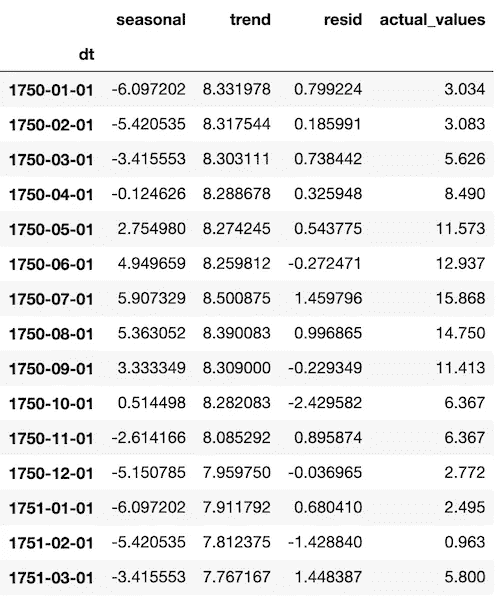

下面的代码是可视化的相加分解成分:趋势、季节和残差(即，基础水平+误差)。

```
plt.rcParams.update({'figure.figsize': (10,10)})
additive.plot().suptitle('Additive Decompose')
```

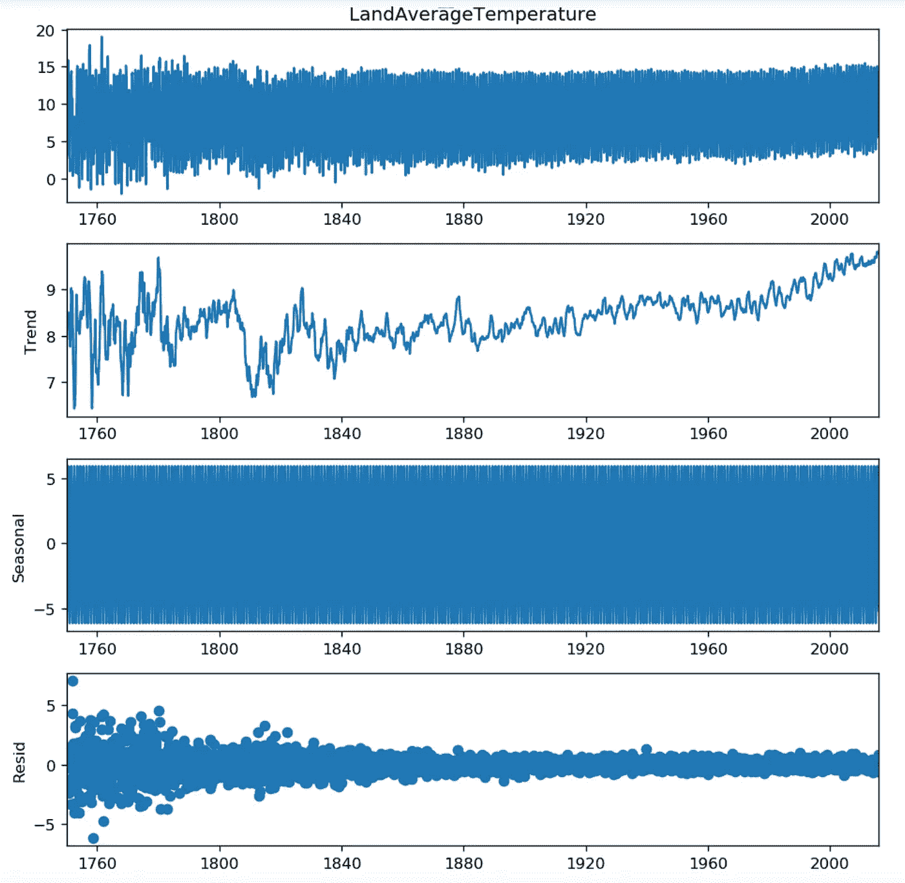

**图 2:** 时间序列分解。

对于地表温度时间序列数据，我们最感兴趣的是其长期趋势，可提取如下:

```
trend = additive.trend
```

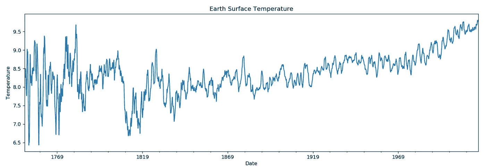

**图 3:** 地表温度趋势。

# 3.时间数列预测法

一旦数据预处理和分析完成，时间序列预测就可以开始了。

本节介绍了将两种常见的时间序列预测模型应用于地球表面温度趋势数据的结果:

*   [ARIMA](https://en.wikipedia.org/wiki/Autoregressive_integrated_moving_average) (自回归综合移动平均)
*   [LSTM](https://en.wikipedia.org/wiki/Long_short-term_memory) (长短期记忆)

## 3.1 ARIMA 模式

ARIMA 模型[1][4]由三个参数决定:

*   **p** :自回归顺序
*   **d** :使时间序列平稳的差分顺序
*   **问**:均线下单

ARIMA 模型由三部分组成[4]:自回归(AR)、移动平均(MA)和一个常数:

ARIMA =常数+ AR + MA

在哪里

AR =过去时间点的 ***p*** 连续值的线性组合(即滞后)

MA =线性组合 ***q*** 过去时间点的连续预测误差(即滞后预测误差)

AR 和 MA 都只能应用于平稳的时间序列，这是通过 ARIMA 差分实现的。

**3.1.1 确定差分 d 的阶数**

一个时间序列是(弱)*平稳的*如果它的*均值*是常数(与时间无关)并且它的 [*自协方差*](https://en.wikipedia.org/wiki/Autocovariance) 在时间序列的两个不同时间点 *s* 和 *t* 之间的函数只取决于时间间隔|s - t|(即滞后)，而不是特定的时间点[1]。

时间序列预测仅对平稳时间序列有效，因为只有平稳时间序列的行为是可预测的。

我们可以使用 ADF 检验([扩展的 Dickey Fuller 检验](https://en.wikipedia.org/wiki/Augmented_Dickey%E2%80%93Fuller_test) ) [4]来检验一个时间序列是否是平稳的。例如，下面的代码将检查地球表面温度时间序列的平稳性:

```
from statsmodels.tsa.stattools import adfullerresult = adfuller(trend.values)
print('ADF Statistic: %f' % result[0])
print('p-value: %f' % result[1])
```

测试的 p 值为 0.012992。

ADF 检验的默认零假设是时间序列是非平稳的。由于上述 ADF 测试的 p 值小于 0.05 的显著性水平，我们拒绝零假设，并得出时间序列是平稳的结论(在这种情况下只有[趋势平稳](https://en.wikipedia.org/wiki/Stationary_process))。

一般来说，要使时间序列平稳，需要做以下工作:

*   移除会随时间改变均值和/或协方差的不规则行为
*   去除可能随时间改变均值和/或协方差的常规行为，如趋势和季节性

差分是一种常用的数据转换方法，用于消除非平稳行为(尤其是趋势)。

以下代码用于对地表温度时间序列进行一阶和二阶差分:

```
from statsmodels.graphics.tsaplots import plot_acf, plot_pacf# Original Series
fig, axes = plt.subplots(3, 2, sharex=True)
axes[0, 0].plot(trend.values); axes[0, 0].set_title('Original Series')
plot_acf(trend.values, ax=axes[0, 1]).suptitle('Original Series', fontsize=0)# 1st Differencing
diff1 = trend.diff().dropna()
axes[1, 0].plot(diff1.values)
axes[1, 0].set_title('1st Order Differencing')
plot_acf(diff1.values, ax=axes[1, 1]).suptitle('1st Order Differencing', fontsize=0)# 2nd Differencing
diff2 = trend.diff().diff().dropna()
axes[2, 0].plot(diff2.values)
axes[2, 0].set_title('2nd Order Differencing')
plot_acf(diff2.values, ax=axes[2, 1]).suptitle('2nd Order Differencing', fontsize=0)
```

下图显示一阶差分足以消除趋势。二阶差分没有任何改进。因此，在本文中，差分顺序 *d* 被设置为 1。

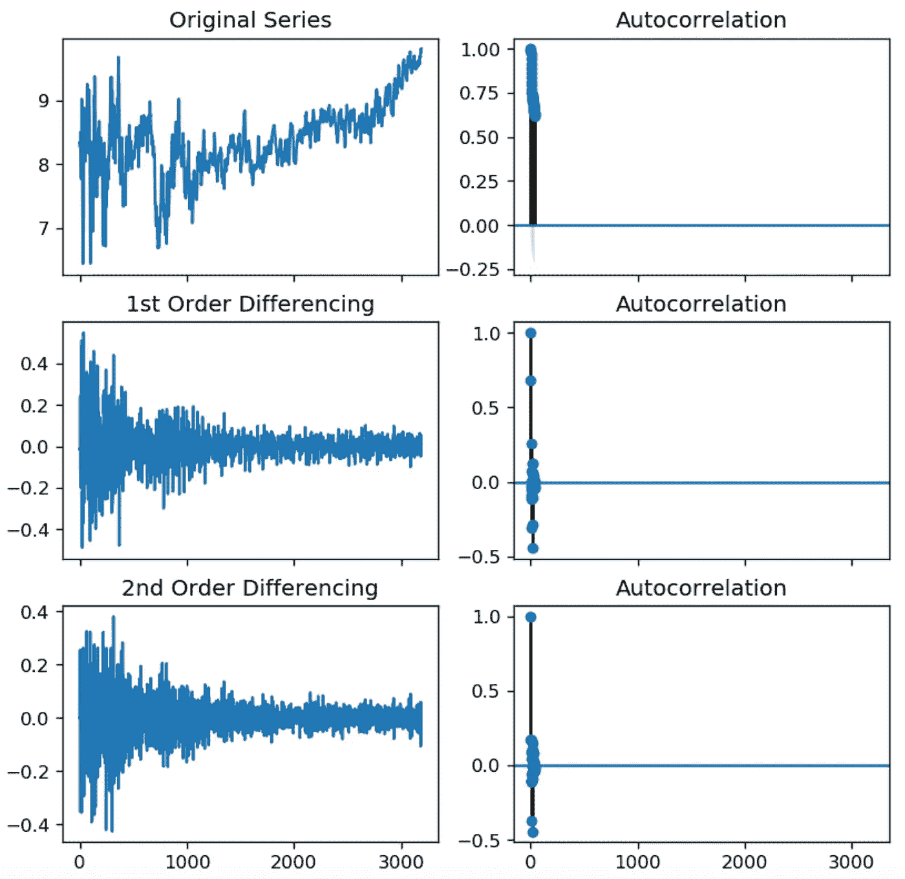

**图 4:** 一阶和二阶差分。

**3.1.2 确定自回归阶数 p**

通过分析时间序列数据[1][4]的一阶差分的 PACF ( [偏自相关函数](https://en.wikipedia.org/wiki/Partial_autocorrelation_function))的结果，可以确定自回归阶数 *p* :

```
plt.rcParams.update({'figure.figsize':(9,3), 'figure.dpi':120})size = 100fig, axes = plt.subplots(1, 2, sharex=True)
axes[0].plot(diff1.values[:size])
axes[0].set_title('1st Order Differencing')
axes[1].set(ylim=(0,5))
plot_pacf(diff1.values[:size], lags=50, ax=axes[1]).suptitle('1st Order Differencing', fontsize=0)
```

我们可以观察到 PACF 滞后 1 远远高于显著性线(灰色区域)。因此，自回归顺序 *p* 在本文中被设置为 1。

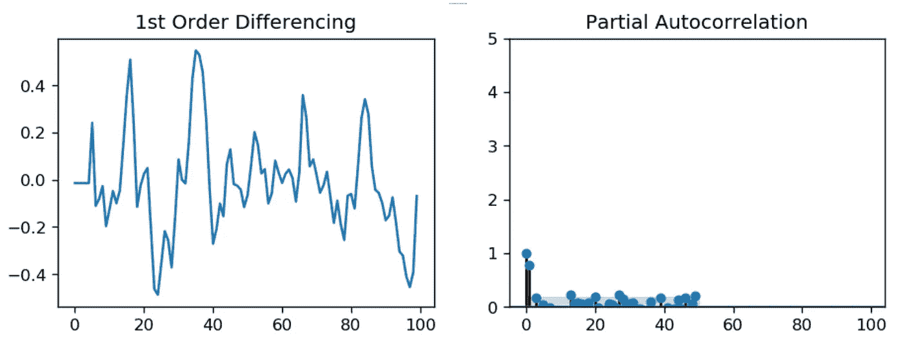

**图 5:** 一阶差分 PACF。

**3.1.3 确定移动平均顺序 q**

移动平均阶数 *q* 可以通过分析时间序列数据的一阶差分的自相关函数(ACF)的结果来确定[1][4]:

```
plt.rcParams.update({'figure.figsize':(9,3), 'figure.dpi':120})size = 100fig, axes = plt.subplots(1, 2, sharex=True)
axes[0].plot(diff1.values[:size])
axes[0].set_title('1st Order Differencing')
axes[1].set(ylim=(0,1.2))
plot_acf(diff1.values[:size], lags=50, ax=axes[1]).suptitle('1st Order Differencing', fontsize=0)
```

我们可以观察到 ACF 滞后 1 远远高于显著性线(灰色区域)。因此，在本文中，移动平均顺序 *q* 也被设置为 1。


**图 6:** 一阶差分的 ACF。

**3.1.4 培训 ARIMA 模型**

以下代码首先将地表温度趋势时间序列分为训练和测试子序列，然后使用训练数据训练一个 ARIMA 模型，其确定值为 *p* =1， *d* =1， *q* = 1。

传统的数据集通常被随机分为训练和测试子集。但是，这对时间序列无效，因为它打破了顺序时间依赖性。为了避免这个问题，温度趋势时间序列数据通过保持其原始顺序来划分。

```
from statsmodels.tsa.arima_model import ARIMAtrain = trend[:3000]
test  = trend[3000:]# order = (p=1, d=1, q=1)
model = ARIMA(train, order=(1, 1, 1))  
model = model.fit(disp=0)  
print(model.summary())
```

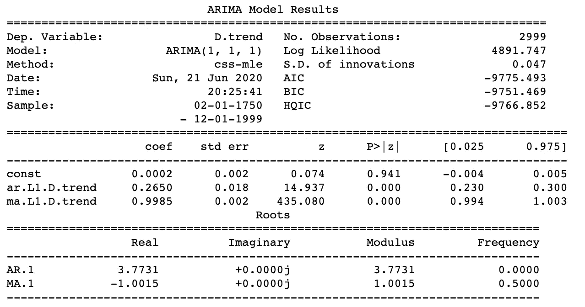

从上面的模型训练结果可以看出，p>|z|列中 AR1 和 MA1 的 P 值是高度显著的(<< 0.05). This indicates that the choices of p =1 and q =1 are appropriate.

The code below is to plot the residuals.

```
# Plot residual errors
residuals = pd.DataFrame(model.resid)
fig, ax = plt.subplots(1,2)
residuals.plot(title="Residuals", ax=ax[0])
residuals.plot(kind='kde', title='Density', ax=ax[1])
```

The plot of the residuals shows no patterns (i.e., with constant mean and variance) except for the first 20% of the time series. This indicates that the trained ARIMA model behaves appropriately.

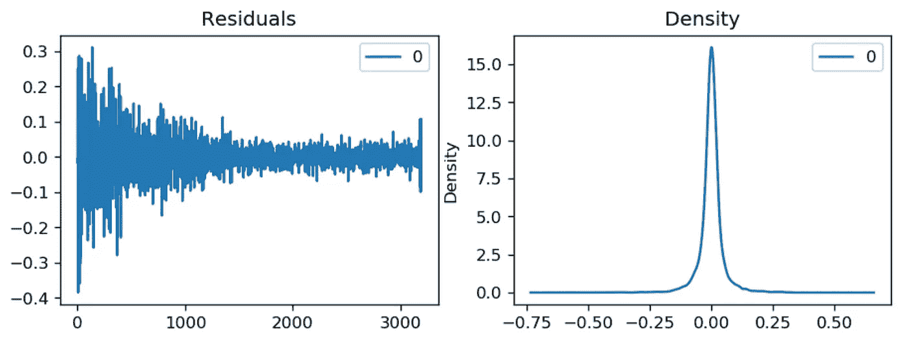

**图 7:** 残差分布。

**3.1.5 使用训练好的 ARIMA 模型进行预测**

下面的代码使用经过训练的 ARIMA 模型来预测 192 个(可以是任何正整数)温度值，然后将它们与测试时间序列进行比较:

```
# Forecast: 192 forecasting values with 95% confidence
fc, se, conf = model.forecast(192, alpha=0.05)# Make as pandas series
fc_series = pd.Series(fc, index=test.index)
lower_series = pd.Series(conf[:, 0], index=test.index)
upper_series = pd.Series(conf[:, 1], index=test.index)# Plot
plt.figure(figsize=(12,5), dpi=100)
plt.plot(train, label='training')
plt.plot(test, label='actual')
plt.plot(fc_series, label='forecast')
plt.fill_between(lower_series.index, lower_series, upper_series, 
                 color='k', alpha=.15)
plt.title('Forecast vs Actuals')
plt.legend(loc='upper left', fontsize=8)
```

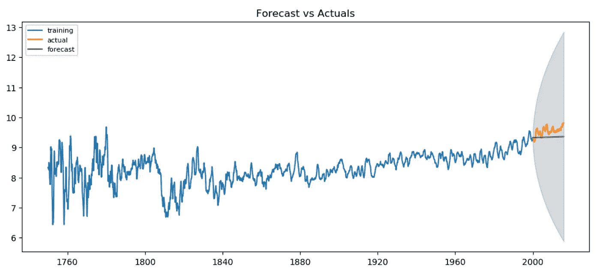

**图 8:** 利用 ARIMA 进行气温预报。

上述预测结果表明，经过训练的 ARIMA 模型预测的温度往往低于实际温度。

## 3.2 LSTM 模式

本节介绍将著名的 LSTM 模型应用于地球表面温度趋势时间序列的结果。

**3.2.1 准备数据集**

与[6]类似，下面的代码从温度时间序列中生成特征向量对(过去时间点的温度值序列)和标签对(当前时间点的目标温度),用于 LSTM 模型训练和评估。

```
from numpy import array
from keras.models import Sequential
from keras.layers import LSTM
from keras.layers import Densedef split_sequence(sequence, n_steps):
    X, y = list(), list()
    for i in range(len(sequence)):
        # find the end of this pattern
        end_ix = i + n_steps
        # check if we are beyond the sequence
        if end_ix > len(sequence)-1:
            break
        # gather input and output parts of the pattern
        seq_x, seq_y = sequence[i:end_ix], sequence[end_ix]
        X.append(seq_x)
        y.append(seq_y)
    return array(X), array(y)# define input sequence
raw_seq = trend.tolist()
# choose a number of time steps
n_steps = 12
# split into samples
X, y = split_sequence(raw_seq, n_steps)
```

为了简单起见，在本文中，我使用过去 12 个月的温度来预测下个月的温度。以下是生成的数据集的两个示例:

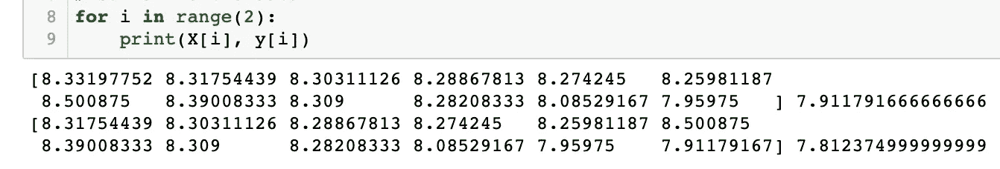

生成的数据集分为两部分:前 3000 个数据集用于模型训练，其余数据集用于模型测试:

```
X_train = X[:3000]
y_train = y[:3000]
X_test  = X[3000:]
y_test  = y[3000:]
```

**3.2.2 选择 LSTM 型号**

以下 LSTM 模型[6]将一系列温度值作为输入，并生成一个目标温度作为输出。由于温度预测是一个回归问题，LSTM 模型的输出可以取任何值，因此没有相关的激活函数。

```
n_features = 1X_train = X_train.reshape((X_train.shape[0], X_train.shape[1], n_features))# define model
model = Sequential()
model.add(LSTM(50, activation='relu', input_shape=(n_steps, n_features)))
model.add(Dense(1))
model.compile(optimizer='adam', loss='mse')
# fit model
model.fit(X_train, y_train, epochs=200, verbose=1)
```

**3.2.3 培训 LSTM 模型**

以下是模型训练的结果:

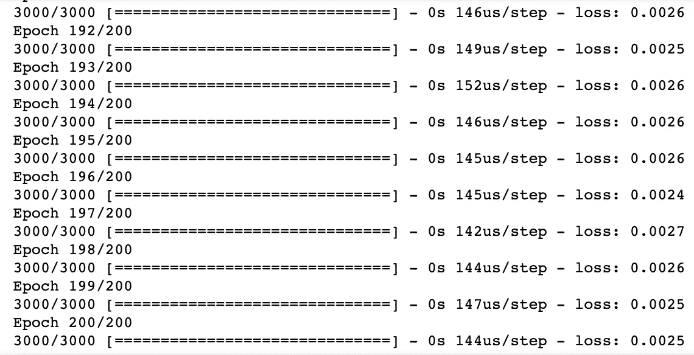

**3.2.4 使用训练好的 LSTM 模型进行预测**

一旦模型训练完成，经过训练的 LSTM 模型就可以应用于测试时间序列来预测温度:

```
X_test = X_test.reshape((X_test.shape[0], X_test.shape[1], n_features))
y_pred = model.predict(X_test, verbose=0)
```

下面的代码将预测温度与测试时间序列中的实际温度进行了对比:

```
def plot_forecosting(df1, df2, line_stype1='b-', line_stype2='r--', title="", xlabel='Date', ylabel='Temperature', dpi=100):
    plt.figure(figsize=(16,5), dpi=dpi)
    plt.plot(df1.index, df1, line_stype1, label='actual') 
    plt.plot(df2.index, df2, line_stype2, label='forecast')
    plt.gca().set(title=title, xlabel=xlabel, ylabel=ylabel)
    plt.title('Forecast vs Actuals')
    plt.legend(loc='upper left', fontsize=8)
    plt.show()y_pred_1 = y_pred.reshape((y_pred.shape[0]))
y_pred_series = pd.Series(y_pred_1)
y_test_1 = y_test.reshape((y_test.shape[0]))
y_test_series = pd.Series(y_test_1)plot_forecosting(y_test_series, y_pred_series, title='Land Average Temperature')
```

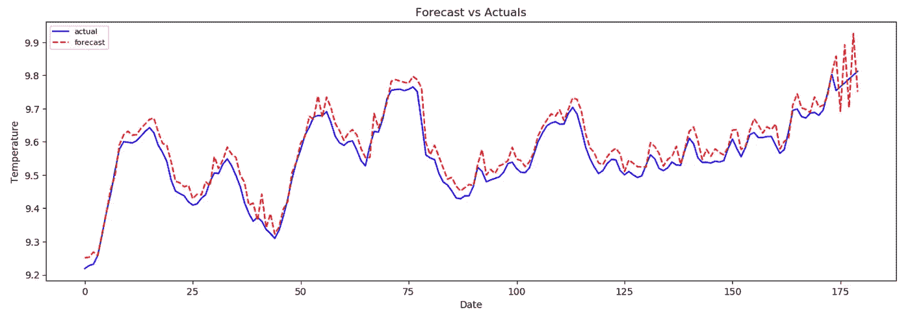

**图 9:** 利用 LSTM 进行气温预报。

预测温度与整个温度趋势时间序列的关系如下:

```
X_all = X.reshape((X.shape[0], X.shape[1], n_features))
y_pred_all = model.predict(X_all, verbose=0)
y_pred_all_1 = y_pred_all.reshape((y_pred_all.shape[0]))
y_pred_all_series = pd.Series(y_pred_all_1)
y_all = y.reshape((y.shape[0]))
y_all_series = pd.Series(y_all)
plot_forecosting(y_all_series, y_pred_all_series, title='Land Average Temperature')
```

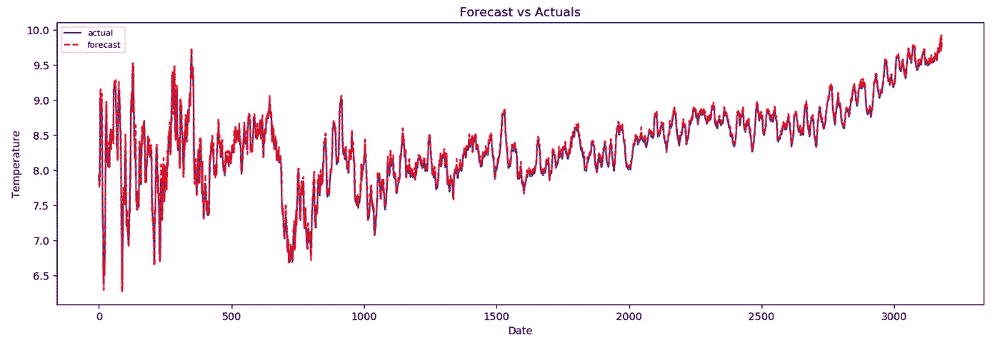

**图 10:** 利用 LSTM 进行全时间序列的温度预报。

上述预报结果表明，预报温度与实际温度非常接近。

# 4.摘要

在本文中，我使用了 Kaggle [2]的全球变暖数据集来演示一些常见的时间序列数据预处理/分析实践，以及 Python 中两个广泛采用的时间序列预测模型 ARIMA 和 LSTM。

从第 3 节可以看出，ARIMA 模型的性能严重依赖于数据预处理和分析，以使时间序列平稳，而 LSTM 可以用最少的数据预处理和分析来处理时间序列(例如，在 LSTM 模型中不需要通过差分来消除趋势)。

本文中使用的所有源代码都可以在 Github [7]中找到。

# 参考

1.  R.Shumway 和 D. Stoffer，时间序列分析及其应用，Springer，第 4 版，2017 年
2.  [气候变化:地表温度数据](https://www.kaggle.com/berkeleyearth/climate-change-earth-surface-temperature-data?select=GlobalTemperatures.csv)
3.  南 Prabhakaran，*[Python 中的时间序列分析—带示例的综合指南](https://www.machinelearningplus.com/time-series/time-series-analysis-python/)*
4.  *南普拉巴卡兰， [ARIMA 模型 Python 中时间序列预测的完整指南](https://www.machinelearningplus.com/time-series/arima-model-time-series-forecasting-python/)*
5.  *J.Brownlee，[如何用 Python 中的差分变换去除趋势和季节性](https://machinelearningmastery.com/remove-trends-seasonality-difference-transform-python/)*
6.  *J.Brownlee，[如何开发用于时间序列预测的 LSTM 模型](https://machinelearningmastery.com/how-to-develop-lstm-models-for-time-series-forecasting/)*
7.  *Y.张 [Github](https://github.com/yzzhang/machine-learning/tree/master/time_series) 中的 Jupyter 笔记本*