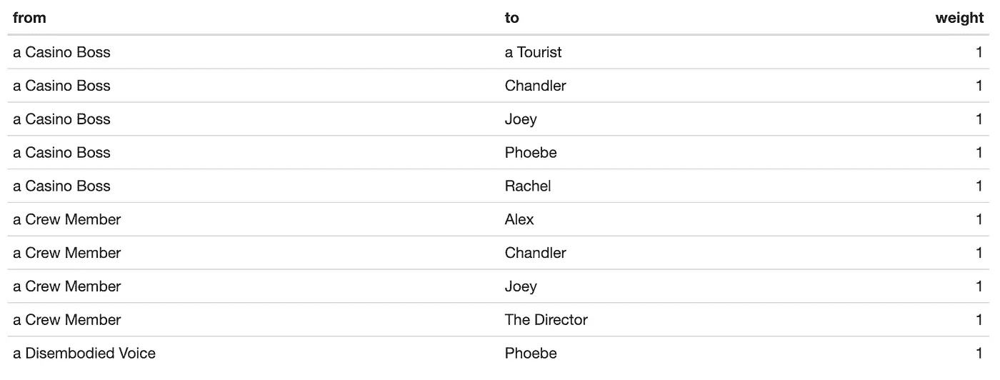
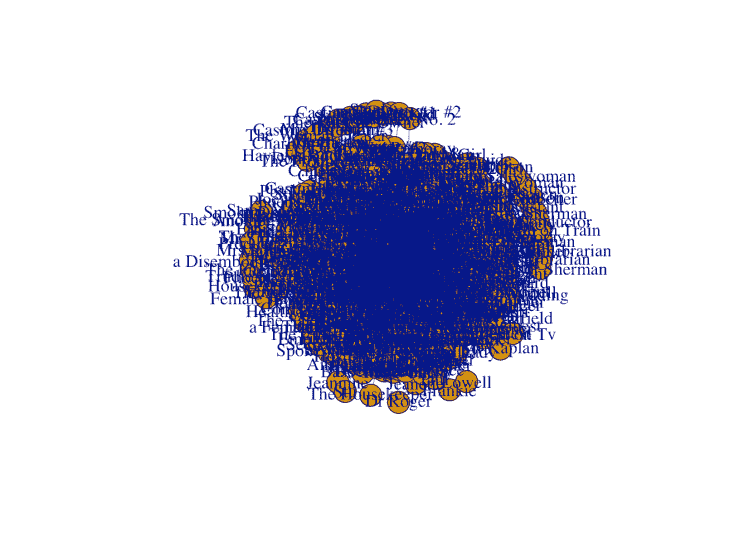
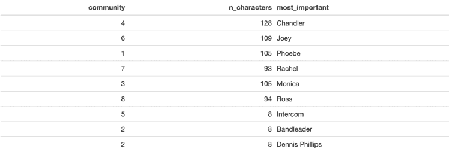
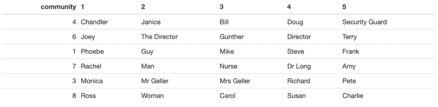
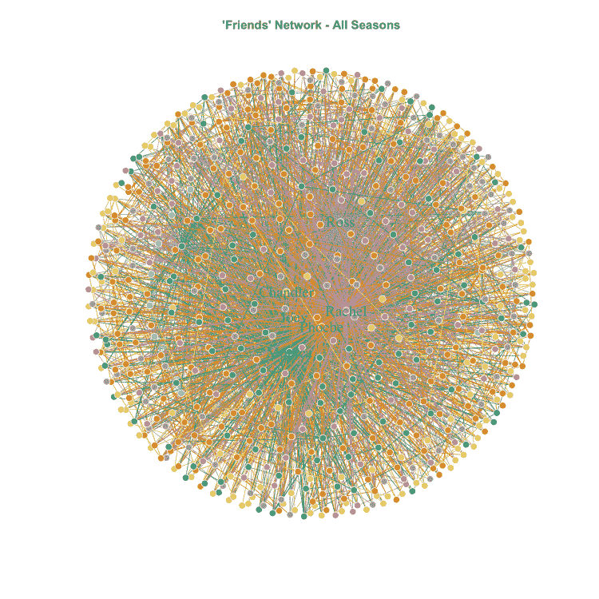
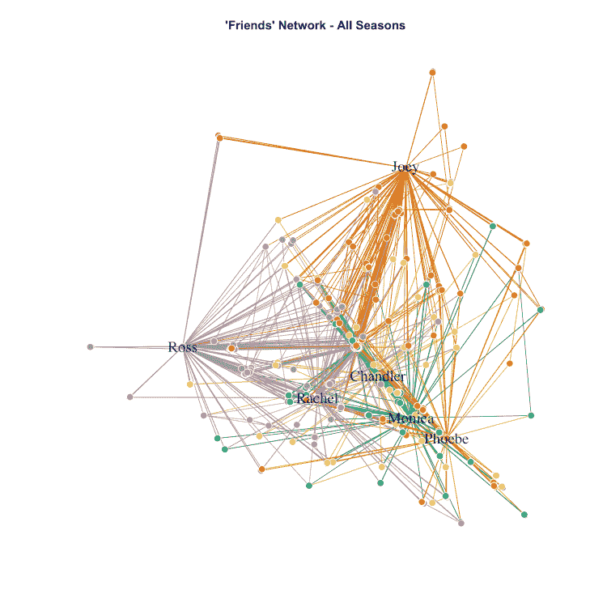
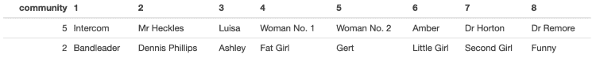

# 基于朋友社区特征的 R 语言社区检测

> 原文：<https://towardsdatascience.com/community-detection-in-r-using-communities-of-friends-characters-2161e845c198?source=collection_archive---------39----------------------->

## 每个角色都有自己的迷你网络，但是它是什么样子的呢？

在本文中，我将使用 R 中的`igraph`包中的社区检测功能来展示如何检测网络中的社区。在文章结束时，我们将能够看到 Louvain 社区检测算法如何将*朋友*角色分成不同的社区(忽略六个主要角色的明显社区)，如果你是该剧的粉丝，你可以决定这个分析对你是否有意义。

***读者注意:*** *如果你发现在中等格式的环境中很难理解代码，你也可以在这里* *以降价格式* [*重新阅读。*](https://github.com/keithmcnulty/friends_analysis/blob/master/Rmd/friends_character_networks.md)

# 用于组合朋友角色网络的数据

在我之前的文章中，我展示了如何使用迭代编程为《老友记》的整个系列生成一个网络边缘列表。网络边列表是一个简单的数据集，包含以下内容:

1.  `from`和`to`列为了确定我们的(无向)网络中字符对之间的连接，每个字符将是一个节点，每个连接将是一条边。
2.  一个`weight`列(这是边的一个属性),表示线对之间的连接强度。在这种情况下，这是由这对搭档一起出现在不同场景中的次数决定的。

我使用的 edgelist 是使用前两篇文章中的技术生成的，并在这个项目的 [repo](https://github.com/keithmcnulty/friends_analysis) 中加载到 Github。我现在将所有十个季节的数据集拉下来，我们可以看看它。

```
library(tidyverse) 
library(readr) 
library(igraph) # get friends full series edgelist 
edgefile_url <- "https://github.com/keithmcnulty/friends_analysis/blob/master/data/friends_full_series_edgelist.RDS?raw=true" download.file(edgefile_url, "edgelist.RDS") 
edgelist <- readRDS("edgelist.RDS") knitr::kable(edgelist %>% head(10))
```



这看起来和我们预期的一样。所以我们准备开始一些工作。

# 在`igraph`使用鲁文算法寻找社区

现在，首先，我们要假装六个主要人物彼此不认识，并删除我们网络中他们之间的所有边。这是因为我们对其他角色如何围绕主要角色形成社区感兴趣。如果我们让主要角色的联系保持完整，我们知道他们会在他们之间形成一个非常强大的社区，这当然是这部剧的全部意义。

```
friends <- c("Phoebe", "Monica", "Rachel", "Joey", "Ross", "Chandler") edgelist_without <- edgelist %>% 
  dplyr::filter(!(from %in% friends & to %in% friends))
```

现在，我们将把新的 edgelist 转换成一个矩阵，然后用它来构建一个 graph 对象，该对象将`weight`列作为边的属性:

```
edgelist_matrix <- as.matrix(edgelist_without[ ,c("from", "to")]) friends_graph <- igraph::graph_from_edgelist(edgelist_matrix, directed = FALSE) %>% 
  igraph::set.edge.attribute("weight", value = edgelist_without$weight)
```

我们现在可以快速浏览一下我们的*朋友*图表:



真是一团糟

好吧，真是一团糟——考虑到这个网络中有 650 个顶点(字符)和 2961 条边(连接)，这并不奇怪。我们将不得不在稍后为一些好的情节做一些格式化。但是现在我们准备要求 Louvain 算法将这个网络分成不同的社区。该算法将尝试最大化社区内部的连接强度，并最小化不同社区之间的连接。

```
# run louvain with edge weights 
louvain_partition <- igraph::cluster_louvain(friends_graph, weights = E(friends_graph)$weight) # assign communities to graph 
friends_graph$community <- louvain_partition$membership # see how many communities there are 
unique(friends_graph$community) ## [1] 4 6 1 7 3 8 5 2
```

看起来算法找到了 8 个社区。但是我们不知道谁在里面。我们可以做一些事情来更好地了解每个社区。

1.  我们可以看看每个社区有多大。有时，社区可能很小，代表着网络中几乎完全不相连的部分(就像一些角色之间的随机场景，再也不会出现)。
2.  我们可以看看每个社区中“最重要”的人(顶点)。这样做的一种方式是寻找具有最高中间中心性的顶点，即连接该社区中最多角色的人。

```
communities <- data.frame() for (i in unique(friends_graph$community)) { # create subgraphs for each community subgraph <- induced_subgraph(friends_graph, v = which(friends_graph$community == i)) # get size of each subgraph 
size <- igraph::gorder(subgraph) # get betweenness centrality 
btwn <- igraph::betweenness(subgraph) communities <- communities %>% 
  dplyr::bind_rows(data.frame(
    community = i, 
    n_characters = size, 
    most_important = names(which(btwn == max(btwn))) 
    ) 
  ) 
} knitr::kable(
  communities %>% 
    dplyr::select(community, n_characters, most_important)
)
```



好的——我们看到有几个社区看起来很小，可能很不相关(我们将在附录中查看这些社区),但主要的六个社区都围绕着六个朋友，这是我们所期望的。这证实了六个角色中的每一个，尽管他们彼此很接近，但也在整个系列中培养了相当独立的社区。

我们可以通过查看每个社区(不包括小社区)中最重要的五个角色来了解这些社区。这一次，我们将着眼于一个更简单的性能指标——每个角色拥有的连接数，或者他们在网络中的*度*。

```
top_five <- data.frame() for (i in unique(friends_graph$community)) {   # create subgraphs for each community 
  subgraph <- induced_subgraph(friends_graph, v =       which(friends_graph$community == i))   # for larger communities 
  if (igraph::gorder(subgraph) > 20) {     # get degree 
    degree <- igraph::degree(subgraph)     # get top five degrees 
    top <- names(head(sort(degree, decreasing = TRUE), 5))     result <- data.frame(community = i, rank = 1:5, character = top) 
  } else { 
    result <- data.frame(community = NULL, rank = NULL, character = NULL) 
  } top_five <- top_five %>% 
    dplyr::bind_rows(result) 
} knitr::kable(
top_five %>% 
  tidyr::pivot_wider(names_from = rank, values_from = character) 
)
```



我们在这里看到一些通用的角色名字，如“男”或“女”。如果我们忽略这些，我们可以看到以下人物群体:

*   菲比和她生命中的男人:她最终的丈夫迈克，她吸毒成瘾的按摩客户史蒂夫，以及她同父异母的弟弟弗兰克(也是她父亲的名字)
*   莫妮卡，她的父母和男朋友们:钱德勒在这里失踪了，当然是因为施工！
*   钱德勒和珍妮丝:在《六人行》之外，钱德勒限制了与珍妮丝之外的重复角色的联系。
*   **乔伊和他的演艺人脉**:除了巩特尔——他属于乔伊的圈子——乔伊大部分时间都和导演和经纪人在一起。
*   **瑞秋，她的孩子和她的妹妹**:瑞秋的社区主要围绕着她在第八季的孩子的出生。
*   罗斯、卡罗尔和苏珊:罗斯的社区被他的前妻卡罗尔和她的女友苏珊，以及他的古生物学教授女友查理·惠勒的场景所占据。

# 可视化社区

我们现在可以试着把这些社区想象成整个网络的一部分。为了更容易理解，我们将去掉除了六个朋友以外的所有人的标签，然后我们将按社区对顶点和边进行颜色编码。

```
# give our nodes some properties, incl scaling them by degree and coloring them by community V(friends_graph)$size <- 3 V(friends_graph)$frame.color <- "white" V(friends_graph)$color <- friends_graph$community V(friends_graph)$label <- V(friends_graph)$name V(friends_graph)$label.cex <- 1.5 # also color edges according to their starting node edge.start <- ends(friends_graph, es = E(friends_graph), names = F)[,1] 
E(friends_graph)$color <- V(friends_graph)$color[edge.start] E(friends_graph)$arrow.mode <- 0 # only label central characters v_labels <- which(V(friends_graph)$name %in% friends) for (i in 1:length(V(friends_graph))) { 
  if (!(i %in% v_labels)) { V(friends_graph)$label[i] <- "" } 
}
```

现在我们可以绘制图表了。“最漂亮”的地块可能是球形布局:

```
l1 <- layout_on_sphere(friends_graph)
plot(friends_graph, rescale = T, layout = l1, main = "'Friends' Network - All Seasons")
```



球形布局

但是为了更好地从视觉上区分社区，武力导向的情节是合适的:

```
l2 <- layout_with_mds(friends_graph) 
plot(friends_graph, rescale = T, layout = l2, main = "'Friends' Network - All Seasons")
```



力导向布局

第二张图片更有帮助，因为它暗示乔伊和罗斯可能会过着更“独立”的生活，与其他四个角色相比，他们有更多自己的社区，因为力导向算法使他们与其他人的距离更远。

# 附录:谁是较小的社区？

让我们看看在我们之前的分析中出现的两个较小的社区。我们来看看这些社区都有哪些人。

```
small_communities <- data.frame() for (i in unique(friends_graph$community)) {   # create subgraphs for each community 
  subgraph <- induced_subgraph(friends_graph, v =   which(friends_graph$community == i))   # for larger communities 
  if (igraph::gorder(subgraph) < 20) { 
    # get degree 
    degree <- igraph::degree(subgraph)     # get top ten degrees 
    top <- names(sort(degree, decreasing = TRUE))     result <- data.frame(community = i, rank = 1:length(top), character = top) 
  } else { 
    result <- data.frame(community = NULL, rank = NULL, character = NULL) 
  } small_communities <- small_communities %>%  
    dplyr::bind_rows(result) 
} knitr::kable( 
  small_communities %>% 
    tidyr::pivot_wider(names_from = rank, values_from = character) 
)
```



有趣的是，我们的算法似乎已经选取了几个特定的剧集，并将其中的场景视为它们自己的断开网络。

*   第一个社区似乎来自*雷莫尔博士去世的地方*
*   第二个似乎是来自*在我做*之后的那个

最初我是一名纯粹的数学家，后来我成为了一名心理计量学家和数据科学家。我热衷于将所有这些学科的严谨性应用到复杂的人的问题上。我也是一个编码极客和日本 RPG 的超级粉丝。在[*LinkedIn*](https://www.linkedin.com/in/keith-mcnulty/)*或*[*Twitter*](https://twitter.com/dr_keithmcnulty)*上找我。也可以看看我在*[*drkeithmcnulty.com*](http://drkeithmcnulty.com/)*上的博客。*