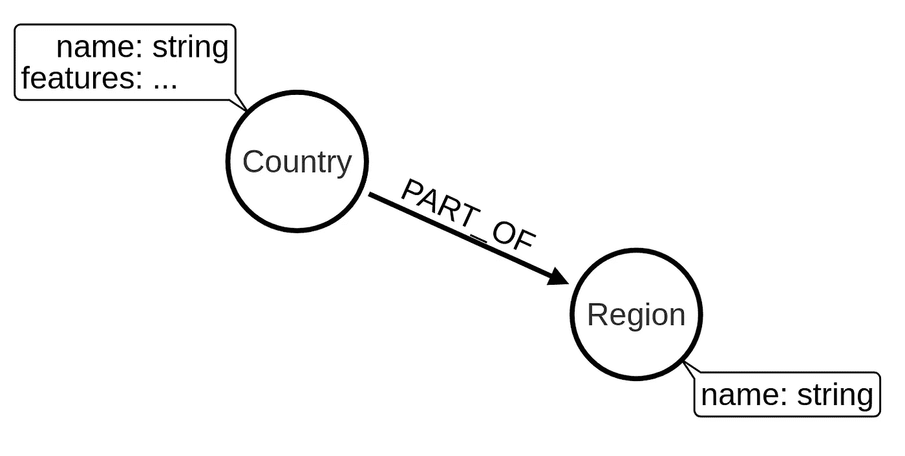
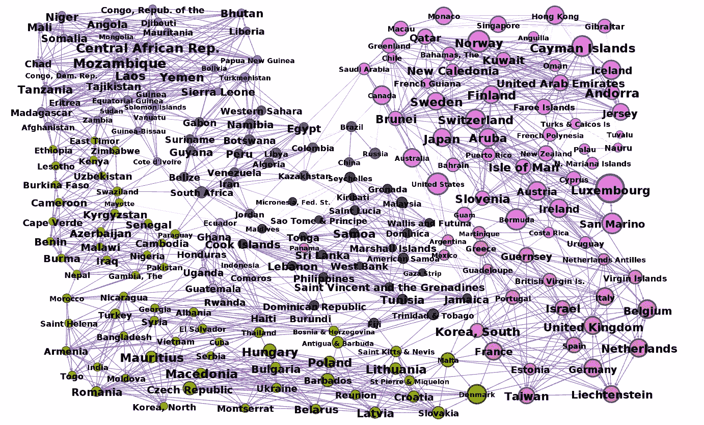
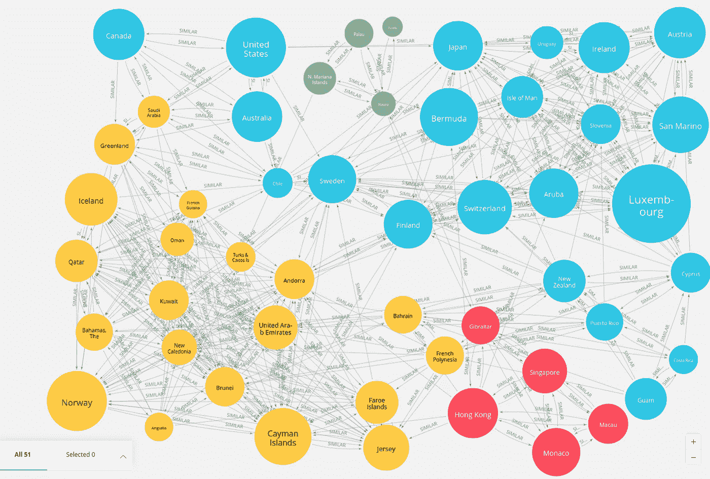

# Neo4j 图形数据科学对世界各国的社区检测

> 原文：<https://towardsdatascience.com/community-detection-of-the-countries-of-the-world-with-neo4j-graph-data-science-4d3a022f8399?source=collection_archive---------15----------------------->

## 使用 Neo4j 图形数据科学库进行网络分析，包括要素缩减技术、相似性网络推理和社区检测

在我等待发面的时候，我想，消磨时间的最好方式是使用 [Neo4j 图形数据科学库](https://github.com/neo4j/graph-data-science)进行网络分析。嗯，也许还可以试着画一幅丙烯画，但我不会让你厌烦的。如果这是你第一次听说 GDS 图书馆，我可以推荐一些我以前的博客文章，试图解释基本知识:

*   GDS [原生投影](/exploring-the-graph-catalog-feature-of-neo4j-graph-data-science-plugin-on-a-lord-of-the-rings-d2de0d0a023)
*   GDS [赛佛投影](/how-to-use-cypher-projection-in-neo4j-graph-data-science-library-on-a-lord-of-the-rings-social-b3459138c4f1)
*   GDS [多图投影](/analyzing-multigraphs-in-neo4j-graph-data-science-library-35c9b6d20099)

如果你准备好了，是时候戴上我们的图形数据科学的帽子，进入正题了。

## 要求:

*   [Neo4j](https://neo4j.com/)
*   [Neo4j APOC 插件](https://github.com/neo4j-contrib/neo4j-apoc-procedures)
*   [Neo4j 图形数据科学插件](https://github.com/neo4j/graph-data-science)

## 图表模式

我们将使用由 [Fernando Lasso](https://www.kaggle.com/fernandol) 在 Kaggle 上提供的[世界各国](https://www.kaggle.com/fernandol/countries-of-the-world/data)数据集。看一下致谢，数据来源于中情局的世界概况。不幸的是，贡献者没有提供数据汇编的年份。我的猜测是 2013 年，但我可能是错的。该数据集包含各种指标，如面积大小、人口、婴儿死亡率以及世界上约 227 个国家的数据。



图表模式

图表模式由标记为*国家*的节点组成，这些节点将它们的特征存储为属性。一个*国家*也是一个*地区*的一部分。

## 图形导入

首先，我们需要下载数据集，并将其复制到`$Neo4j/import`文件夹中。出于某种原因，CSV 文件中的数字使用逗号作为浮点，而不是点( *0，1* 而不是 *0.1* )。我们需要对数据进行预处理，以便能够将数字转换为 Neo4j 中的浮点数。在 APOC 过程`apoc.cypher.run`的帮助下，我们可以在一个 cypher 查询中预处理和存储数据。`apoc.cypher.run`允许我们在主 cypher 查询中运行独立的子查询，非常适合各种用例。

```
LOAD CSV WITH HEADERS FROM "file:///countries%20of%20the%20world.csv" as row
// cleanup the data and replace comma floating point with a dot
CALL apoc.cypher.run(
    "UNWIND keys($row) as key 
     WITH row,
          key,
          toFloat(replace(row[key],',','.')) as clean_value
          // exclude string properties
          WHERE NOT key in ['Country','Region'] 
          RETURN collect([key,clean_value]) as keys", 
     {row:row}) YIELD value
MERGE (c:Country{name:trim(row.Country)})
SET c+= apoc.map.fromPairs(value.keys)
MERGE (r:Region{name:trim(row.Region)})
MERGE (c)-[:PART_OF]->(r)
```

## 识别缺失值

另一个有用的 APOC 程序是`apoc.meta.nodeTypeProperties`。有了它，我们可以检查图的节点属性模式。我们将使用它来确定国家的每个要素有多少个缺失值。

```
// Only look at properties of nodes labeled "Country"
CALL apoc.meta.nodeTypeProperties({labels:['Country']})
YIELD propertyName, propertyObservations, totalObservations
RETURN propertyName,
       (totalObservations - propertyObservations) as missing_value,
       (totalObservations - propertyObservations) / toFloat(totalObservations) as pct_missing_value
ORDER BY pct_missing_value DESC LIMIT 10
```

结果

看起来我们没有太多缺失的值。然而，为了简单起见，我们将在进一步的分析中忽略缺失值超过四个的特性。

## 高相关滤波器

高相关滤波是一种简单的数据降维技术。具有高相关性的特征可能携带相似的信息，并且更加线性相关。使用具有相关信息的多个特征会降低各种模型的性能，可以通过删除两个相关特征中的一个来避免。

```
// Only look at properties of nodes labeled "Country"
CALL apoc.meta.nodeTypeProperties({labels:['Country']})
YIELD propertyName, propertyObservations, totalObservations
WITH propertyName,
       (totalObservations - propertyObservations) as missing_value// filter our features with more than 5 missing values
WHERE missing_value < 5 AND propertyName <> 'name'
WITH collect(propertyName) as features
MATCH (c:Country)
UNWIND features as feature
UNWIND features as compare_feature
WITH feature,
     compare_feature,
     collect(coalesce(c[feature],0)) as vector_1,
     collect(coalesce(c[compare_feature],0)) as vector_2
// avoid comparing with a feature with itself
WHERE feature < compare_feature
RETURN feature,
       compare_feature,
       gds.alpha.similarity.pearson(vector_1, vector_2) AS correlation
ORDER BY correlation DESC LIMIT 10
```

结果:

有趣的是出生率和婴儿死亡率密切相关。死亡率也与婴儿死亡率密切相关，因此我们将降低出生率和死亡率，但保持婴儿死亡率。手机数量和净移民似乎与国内生产总值相关。我们也将放弃这两项，保持 GDP 不变。我们还将减少人口，保留面积和人口密度，这两者携带类似的信息。

## 特征统计

至此，我们只剩下八个特征。我们将用`apoc.agg.statistics`函数来检验它们的分布。它计算数值统计，例如一组值的最小值、最大值和百分位数。

```
// define excluded features
WITH ['name', 
      'Deathrate', 
      'Birthrate',
      'Phones (per 1000)',
      'Net migration', 
      'Population'] as excluded_features
CALL apoc.meta.nodeTypeProperties({labels:['Country']})
YIELD propertyName, propertyObservations, totalObservations
WITH propertyName,
       (totalObservations - propertyObservations) as missing_value
WHERE missing_value < 5 AND 
      NOT propertyName in excluded_features
// Reduce to a single row
WITH collect(propertyName) as potential_features
MATCH (c:Country)
UNWIND potential_features as potential_feature
WITH potential_feature, 
     apoc.agg.statistics(c[potential_feature],
                        [0.5,0.75,0.9,0.95,0.99]) as stats
RETURN potential_feature, 
       apoc.math.round(stats.min,2) as min, 
       apoc.math.round(stats.max,2) as max, 
       apoc.math.round(stats.mean,2) as mean, 
       apoc.math.round(stats.stdev,2) as stdev,
       apoc.math.round(stats.`0.5`,2) as p50,
       apoc.math.round(stats.`0.75`,2) as p75,
       apoc.math.round(stats.`0.95`,2) as p95,
       apoc.math.round(stats.`0.99`,2) as p99
```

结果

密克罗尼西亚联邦的海岸与面积之比为 870，令人印象深刻。另一方面，世界上共有 44 个国家的海岸线为零。另一个有趣的事实是，格陵兰有 56361 名居民和 2166086 平方英里的人口密度约为每平方英里 0。这可能是一个进行社交距离的好地方。

我们可以观察到，大多数特征似乎是描述性的，除了其他的(%)，大多数在 80 到 100 之间。由于低方差，我们将在进一步的分析中忽略它。

## 填充缺少的值

我们只剩下七个特征，我们将用它们来推断国家之间的相似性网络。在此之前，我们需要做的一件事是填充缺失的值。我们将使用一种简单的方法，用国家所在地区的平均值来填充要素的缺失值。

```
UNWIND ["Arable (%)",
        "Crops (%)",
        "Infant mortality (per 1000 births)",
        "GDP ($ per capita)"] as feature
MATCH (c:Country)
WHERE c[feature] IS null
MATCH (c)-[:PART_OF]->(r:Region)<-[:PART_OF]-(other:Country)
WHERE other[feature] IS NOT null
WITH c,feature,avg(other[feature]) as avg_value
CALL apoc.create.setProperty(c, feature, avg_value) 
YIELD node
RETURN distinct 'missing values populated'
```

## 最小最大归一化

最后但同样重要的是，我们必须将我们的特征标准化，以防止任何单一特征由于较大的规模而支配其他特征。我们将使用标准化的简单的[最小最大方法](https://en.wikipedia.org/wiki/Feature_scaling#Rescaling_(min-max_normalization))在 0 和 1 之间重新调整特征。

```
UNWIND ["Arable (%)",
        "Crops (%)",
        "Infant mortality (per 1000 births)",
        "GDP ($ per capita)",
        "Coastline (coast/area ratio)",
        "Pop. Density (per sq. mi.)",
        "Area (sq. mi.)"] as feature
MATCH (c:Country)
// Calculate the min and the max value for each feature
WITH max(c[feature]) as max,
     min(c[feature]) as min,
     feature
MATCH (c1:Country)
WITH c1,
    // define property name to store back results 
    "n_" + feature AS newKey,
    // normalize values
    (toFloat(c1[feature]) - min) / (max - min) as normalized_value// store results to properties
CALL apoc.create.setProperty(c1, newKey, normalized_value) 
YIELD node
RETURN distinct 'normalization done'
```

## 余弦相似的相似网络

我们已经完成了数据预处理，可以专注于数据分析部分。分析的第一步是借助于[余弦相似性算法](https://neo4j.com/docs/graph-data-science/1.0/alpha-algorithms/cosine/)推断相似性网络。我们基于所选特征为每个国家构建一个向量，并比较每对国家之间的余弦相似性。如果相似性高于预定义的阈值，我们以相似节点对之间的关系的形式存储回结果。定义一个最佳阈值是艺术和科学的结合，通过实践你会做得更好。理想情况下，您想要推断一个稀疏图，因为社区检测算法在[完整](https://en.wikipedia.org/wiki/Complete_graph)或[密集](https://en.wikipedia.org/wiki/Dense_graph)图上表现不佳。在这个例子中，我们将使用 0.8 的`similarityCutoff`值(范围在-1 和 1 之间)。除了相似性阈值，我们还将使用`topK`参数来仅存储前 10 个相似的邻居。我们这样做是为了确保图形更稀疏。

```
MATCH (c:Country)// build the vector from features
WITH id(c) as id, [c["n_Arable (%)"],
                   c["n_Crops (%)"],
                   c["n_Infant mortality (per 1000 births)"],
                   c["n_GDP ($ per capita)"],
                   c["n_Coastline (coast/area ratio)"],
                   c["n_Pop. Density (per sq. mi.)"],
                   c["n_Area (sq. mi.)"]] as weights
WITH {item:id, weights: weights} as countryData
WITH collect(countryData) as data
CALL gds.alpha.similarity.cosine.write({
    nodeProjection: '*',
    relationshipProjection: '*',
    similarityCutoff:0.8,
    topK:10,
    data: data})
YIELD nodes, similarityPairs
RETURN nodes, similarityPairs
```

## 图形数据科学图书馆

借助 Neo4j 的[图形数据科学库](https://github.com/neo4j/graph-data-science)，我们可以直接在 Neo4j 中运行 30 多种不同的图形算法。算法被公开为密码程序，类似于我们上面看到的 APOC 程序。

GDS 使用存储图形的投影，这完全是在内存中实现更快的执行时间。我们可以利用`gdn.graph.create`过程来投影存储图的视图。关于 GDS 图形投影的更多细节，请查看我在[之前的博文](/exploring-the-graph-catalog-feature-of-neo4j-graph-data-science-plugin-on-a-lord-of-the-rings-d2de0d0a023)。在本例中，我们将投影标签为 Country 且关系类型为 SIMILAR 的节点。

```
CALL gds.graph.create('similarity_network','Country','SIMILAR');
```

## 弱连通分量

通常，我们用[弱连接成分](https://neo4j.com/docs/graph-data-science/1.0/algorithms/wcc/)算法开始图形分析。这是一种社区检测算法，用于在我们的图中找到断开的网络或孤岛。因为我们只对断开组件的计数感兴趣，所以我们可以运行算法的`stats`变体。

```
CALL gds.wcc.stats('similarity_network')
YIELD componentCount, componentDistribution
RETURN componentCount, 
       componentDistribution.min as min,
       componentDistribution.max as max,
       componentDistribution.mean as mean,
       componentDistribution.p50 as p50,
       componentDistribution.p75 as p75,
       componentDistribution.p90 as p90
```

结果

该算法在我们的图中只找到了一个组件。这是一个有利的结果，因为断开的岛会扭曲各种其他图算法的结果。

## 卢万算法

另一种社区检测算法是 [Louvain 算法](https://neo4j.com/docs/graph-data-science/1.0/algorithms/louvain/)。用基本术语来说，密集连接的节点更有可能形成社区。它依靠模块化优化来提取社区。模块化优化分两步进行。第一步包括局部优化模块化。在第二步中，它将属于同一社区的节点聚合到单个节点中，并从这些聚合的节点构建新的网络。这两个步骤反复重复，直到获得最大的模块化。这些迭代的一个微妙的副作用是，我们可以在每次迭代结束时查看社区结构，因此 Louvain 算法被视为分层社区检测算法。要包含分层社区结果，我们必须将`includeIntermediateCommunities`参数值设置为 true。

```
CALL gds.louvain.write('similarity_network',  
    {maxIterations:20,
     includeIntermediateCommunities:true,
     writeProperty:'louvain'})
YIELD ranLevels, communityCount,modularity,modularities
```

结果

我们可以通过`ranLevels`值观察到，Louvain 算法在我们的网络中发现了两个层次的社区。在最后一层，它发现了八个组。我们现在可以检查最后一级的提取社区，并比较它们的特征平均值。

```
MATCH (c:Country)
RETURN c.louvain[-1] as community,
       count(*) as community_size,
       avg(c['Arable (%)']) as pct_arable,
       avg(c['Crops (%)']) as pct_crops, 
       avg(c['Infant mortality (per 1000 births)']) as infant_mortality,
       avg(c['GDP ($ per capita)']) as gdp,
       avg(c['Coastline (coast/area ratio)']) as coastline,
       avg(c['Pop. Density (per sq. mi.)']) as population_density,
       avg(c['Area (sq. mi.)']) as area_size,
       collect(c['name'])[..3] as example_members
ORDER BY gdp DESC
```

结果

Louvain 算法在相似性网络中找到了八个不同的社区。最大的组织有 51 个成员国，平均 GDP 最高，接近 22，000 美元。它们在婴儿死亡率和海岸线比例上位居第二，但在人口密度上遥遥领先。有两个社区的平均 GDP 在 2 万美元左右，然后我们可以观察到第三名的 GDP 急剧下降到 7000 美元。随着 GDP 的下降，我们还可以发现婴儿死亡率的上升几乎是线性的。另一个有趣的发现是，大多数更贫困的社区几乎没有海岸线。

## 使用 PageRank 查找社区代表

我们可以使用 PageRank 算法来评估最终级别社区的顶级代表。如果我们假设每个*相似的*关系都是国家间相似度的投票， [PageRank](https://neo4j.com/docs/graph-data-science/1.0/algorithms/page-rank/) 算法会给社区内最相似的国家分配最高分。我们将对每个社区分别执行 PageRank 算法，并且只考虑给定社区中的节点和关系。这可以通过[密码投影](https://neo4j.com/docs/graph-data-science/1.0/management-ops/cypher-projection/)轻松实现，无需任何额外的变换。

```
WITH 'MATCH (c:Country) WHERE c.louvain[-1] = $community 
      RETURN id(c) as id' as nodeQuery,
     'MATCH (s:Country)-[:SIMILAR]->(t:Country) 
      RETURN id(s) as source, id(t) as target' as relQuery
MATCH (c:Country)
WITH distinct c.louvain[-1] as community, nodeQuery, relQuery
CALL gds.pageRank.stream({nodeQuery:nodeQuery,
                          relationshipQuery:relQuery, 
                          parameters:{community:community},
                          validateRelationships:False})
YIELD nodeId, score
WITH community, nodeId,score
ORDER BY score DESC
RETURN community, 
       collect(gds.util.asNode(nodeId).name)[..5] as top_5_representatives
```

结果

## 使用 Gephi 实现网络可视化

优秀的可视化胜过千言万语。Gephi 是一个创建网络可视化的伟大工具。正如我们现在可能预期的那样，APOC 提供了一个方便的程序`apoc.gephi.add`,可以将网络数据从 Neo4j 无缝地传输到 Gephi。在[文档](https://neo4j.com/docs/labs/apoc/current/export/gephi/)或我的[前一篇博文](https://tbgraph.wordpress.com/2017/04/01/neo4j-to-gephi/)中找到更多信息。



节点颜色表示社区，节点大小表示 GDP，文本大小表示社区 PageRank 值

正如我们之前观察到的，我们的网络中有八个不同的社区。平均 GDP 最高的社区在右上角，平均 GDP 最高到最低的国家按顺时针方向排列。我发现一个有趣的三角形正好位于俄罗斯、中国和巴西形成的图像中间。此外，如果你仔细观察，你会发现巴拿马是红色社区的一部分，但位于中间。这是因为它与大多数社区中的一两个国家有类似的关系，但与红色社区中的三个国家有关系，因此属于红色社区。

## 基于 Louvain 算法的层次社区

我们之前提到过，Louvain 算法可用于查找带有`includeIntermediateCommunities`参数的分层社区，在我们的示例中，它找到了两个级别的社区。我们现在将考察第一层次的国家集团。一条经验法则是，较低级别的社区将更细粒度、更小。

```
MATCH (c:Country)
RETURN c.louvain[0] as community,
       count(*) as community_size,
       avg(c['Arable (%)']) as pct_arable,
       avg(c['Crops (%)']) as pct_crops, 
       avg(c['Infant mortality (per 1000 births)']) as infant_mortality,
       avg(c['GDP ($ per capita)']) as gdp,
       avg(c['Coastline (coast/area ratio)']) as coastline,
       avg(c['Pop. Density (per sq. mi.)']) as population_density,
       avg(c['Area (sq. mi.)']) as area_size,
       collect(c['name'])[..3] as example_members
ORDER BY gdp DESC
```

结果

不出所料，第一层的社区数量几乎是第二层(也是最后一层)的两倍。一个激动人心的社区由平均 GDP 排在第二位。它只包含五个国家，这些国家很小，平均面积只有 364 平方英里。另一方面，他们有很高的人口密度，大约每平方英里 10000 人。例如澳门、摩纳哥和香港。

## Neo4j Bloom 的图形探索

另一个非常好的网络可视化工具是 [Neo4j Bloom](https://neo4j.com/bloom/) 。它提供了定制图形透视图和搜索查询的能力，没有任何 cypher 查询语言技能的人可以使用它来探索和搜索图形中的见解。如果你有兴趣了解更多，可以查看[威廉·里昂](https://twitter.com/lyonwj)写的[这篇博文](https://medium.com/neo4j/hands-on-with-the-neo4j-graph-data-science-sandbox-7b780be5a44f)。

我们将看看最后一组 GDP 最高的国家。它是一个由 51 个国家组成的共同体，在第一层级上有四个不同的共同体。



节点颜色表示一级社区，节点大小表示 GDP

之前，我们提到了一个令人兴奋的社区，由五个人口密度极高的小国组成。在这个图像中，它们被涂成红色。蓝色社区的平均 GDP 比黄色社区高 25%左右，婴儿死亡率几乎是黄色社区的一半。另一方面，黄色社区平均比蓝色社区有更多的海岸线。

# 结论

Neo4j 生态系统非常适合执行和可视化网络分析。[图形数据科学库](https://github.com/neo4j/graph-data-science)是生态系统的一个实用补充，允许我们运行各种图形算法并执行图形分析，而没有太多麻烦。你可以在你的电脑上试用，也可以创建一个 [Neo4j 沙盒](https://neo4j.com/sandbox/)账户，几分钟内就可以开始使用。

和往常一样，代码可以在 [GitHub](https://github.com/tomasonjo/blogs/blob/master/Countries_of_the_world/Countries%20of%20the%20world%20analysis.ipynb) 上获得。