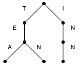
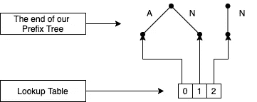
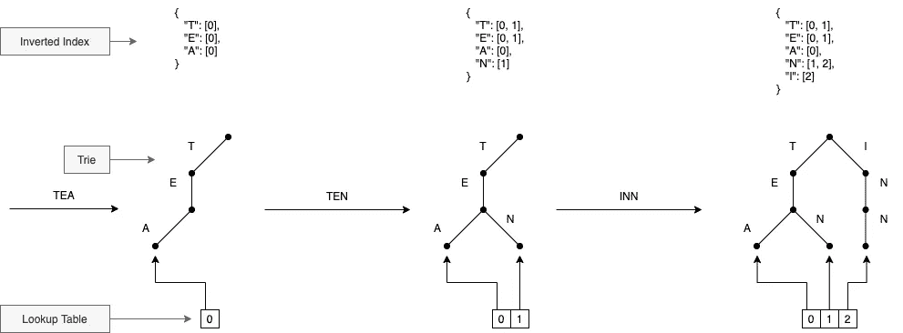
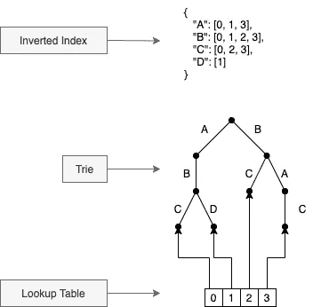

# 紧凑预测树

> 原文：<https://towardsdatascience.com/compact-prediction-tree-af8d23b6b9a0?source=collection_archive---------22----------------------->

## [实践教程](https://towardsdatascience.com/tagged/hands-on-tutorials)

## **有限字母表上精确序列预测的无损模型**


图片来自 [Pixabay](https://pixabay.com/?utm_source=link-attribution&amp;utm_medium=referral&amp;utm_campaign=image&amp;utm_content=683437) 的 [Bela Geletneky](https://pixabay.com/users/photoshopper24-81349/?utm_source=link-attribution&amp;utm_medium=referral&amp;utm_campaign=image&amp;utm_content=683437)

# **什么是序列预测问题？**

序列预测问题包括仅通过查看序列的项目来查找有序序列的下一个元素。

这个问题涵盖了各种领域中的许多应用。它包括产品推荐、预测和网页预取等应用程序。

许多不同的方法被用来解决这个问题，流行的方法包括 PPM(部分匹配预测)，马尔可夫链，以及最近的 LSTM(长短期记忆)。

紧凑预测树(CPT)是 2015 年发布的一种方法，旨在通过对整个训练集进行无损压缩来匹配精度并超越流行算法的性能(训练和预测的时间)。
我们现在将详细介绍训练和预测的方法，以及这种方法的优缺点。

# 紧凑预测树定义

在进入如何使用它进行预测的细节之前，让我们描述一下组成紧凑预测树(CPT)的不同元素:

*   一个 *trie* ，用于序列的有效存储。
*   一个*倒排索引*，用于恒定时间检索包含某个单词的序列。
*   一个*查找表*，用于从序列 Id 中检索序列。

## **特里**

trie 通常称为前缀树，是一种基于有序树的数据结构，用于存储序列(如字符串)。序列的元素存储在边中，因此给定节点的每个后代都有相同的前缀。

在这个众所周知的例子中，我们希望存储`["tea", "ten", "inn"]`。我们先把“茶”放在空树上。这棵树的每一根树枝对应一个字母。然后我们添加“ten”:因为“tea”和“ten”共享同一个“te”前缀，所以我们只是在“te”前缀之后创建一个新的分支。最后，我们将“inn”添加到与前两个序列没有共同前缀的树中。



Trie 通常用于获取，对每个以前缀开头的单词进行树搜索。在我们的例子中，我们使用它来压缩和有效地存储我们的训练集。

## **倒排索引**

倒排索引是用于存储从元素到其位置的映射的索引。这里我们用它来存储从序列元素到序列 id 的映射。

再次考虑我们之前的示例，我们注意到“T”出现在序列 0 和 1 中，“E”出现在序列 0 和 1 中，“A”出现在序列 0 中，“N”出现在序列 1 和 2 中，而“I”仅出现在序列 2 中。
因此，我们有以下反向索引:

```
{
  "T": [0, 1],
  "E": [0, 1],
  "A": [0],
  "N": [1, 2],
  "I": [2]
}
```

为了提高效率，我们将使用位集来存储倒排索引(这也有助于高效地找到“相似序列”)。

## **查找表**

查找表是一种数据结构(通常是一个数组),用于存储每个序列的最后一个节点(叶)的指针。



这种数据结构对于迭代给定序列的元素来说是必不可少的。
例如，如果我们想要检索 id 为 0 的序列，我们可以简单地迭代它的父序列。在我们的例子中，id 0 序列的叶的父代与“A”链接，然后与“E”链接，最后与“T”链接。这倒过来给了我们第一个序列:“茶”。

# 紧凑预测树使用

## **训练**

训练时间与训练集中的序列数成线性关系。
对于每个训练序列，我们需要执行 3 个步骤:

*   在 trie 中插入序列。
*   添加倒排索引中的元素。
*   添加查找表中最后一个节点的位置。

一张图胜过千言万语，这里是一个经过充分训练的紧凑预测树一步一步来。



## **预测**

为了预测序列 S，我们需要做这三个步骤:

*   寻找相似序列(包含 S 的每个元素的序列)。
*   计算每个相似序列的后续序列(从与 S 相同的最后一项之后开始的子序列)。
*   计算每个元素在所有后续序列中的出现次数。

对于这一部分，让我们举一个稍微复杂一点的例子，我们的模型在`["ABC", "ABD", "BC", "BAC"]`进行训练。我们应该将算法训练成:



让我们试着预测一下`"AB"`之后会发生什么。

首先，让我们计算相似的序列。
与 S 相似的序列是包含 S 中任意顺序、任意位置的每一项的序列。为了计算相似的序列，我们可以简单地使用我们的倒排索引并计算交集。对于我们的例子，我们需要相交`[0, 1, 3]`(A 出现的序列的 id)和`[0, 1, 2, 3]`(B 出现的位置)。这就给了`[0, 1, 3]`。

然后，我们需要计算`consequent sequences`。
序列 Y 相对于序列 S 的后件是从与 S 相同的最后一项之后开始直到 Y 结束的 Y 的子序列。
我们例子的后件序列应该是`"C"`、`"D"`和`"C"`。(对于我们相对于`"AB"`的序列 0、1 和 3)。

最后，我们简单地计算每个元素在所有后续序列中出现的次数，并预测出现次数最多的字母。
在我们的例子中是`"C"` (2 次出现)。

# 紧凑预测树性能

## **测试框架**

简而言之，作者用几种算法(包括 CPT、依赖图、类马尔可夫算法……)在几个[公共数据集](http://www.philippe-fournier-viger.com/spmf/index.php?link=datasets.php)上预测了下一个元素。
要看结果(要慎用)，建议你看一下原论文， [*紧凑预测树:精确序列预测的无损模型*](https://www.philippe-fournier-viger.com/spmf/ADMA2013_Compact_Prediction_tree) *。*

另一篇论文， [*从智能卡数据预测火车行程:序列预测问题的现实应用*](https://dspace.library.uu.nl/bitstream/handle/1874/327511/thesis-jelte-hoekstra-20150121.pdf) *，*展示了解决序列预测问题的步骤。从字母表的构建到模型的选择。在这篇论文中，Hoekstra 博士将 CPT 与 PPM 和 AKOM 等不同方法进行了比较。根据您的需要，它还显示 CPT 可以是一个具有相对较好准确性的相关解决方案。

## **利弊**

紧凑预测树的优点是:

*   CPT 是一种无损存储来自训练集的所有数据的算法。
*   该算法是高度可解释的(容易追溯相似序列，后续序列…)
*   快速预测。一些基准可以在原论文或者[这里](https://github.com/bluesheeptoken/CPT/tree/master/benchmark)找到。

紧凑预测树的缺点是:

*   CPT 忽略序列中的顺序，因此 CPT 倾向于预测最频繁出现的项目。(如果您准备好了考虑顺序的稍微慢一点的预测。我建议你去看看由一个共同作者开发的[子序列](https://github.com/bluesheeptoken/subseq)算法。)
*   CPT 对噪音相当敏感。如果一个新元素在要预测的序列中，CPT 将无法找到任何相似的序列。CPT+已经解决了这个问题，您可以在“更进一步”一节中找到详细信息。

# 走得更远

## Python 示例

对于这个小例子，我们将使用[这个](https://github.com/bluesheeptoken/CPT)实现。在合著者之一的[官网](http://www.philippe-fournier-viger.com/publications.php)上引用为 CPT 的实现。还包括了降噪等 CPT+的一些特性。

```
from cpt.cpt import Cptmodel = Cpt()# training
model.fit([['hello', 'world'],
           ['hello', 'this', 'is', 'me'],
           ['hello', 'me']
          ])# predictions
model.predict([['hello'], ['hello', 'this']])# Output: ['me', 'is']
```

有关`predict`方法的参数或超参数的更多信息，您可以查看[文档](https://cpt.readthedocs.io/en/latest/)。

## 进一步阅读

如果你对这个主题感兴趣，我强烈建议你阅读以下论文:

*   [*【CPT+】:降低紧凑预测树的时间/空间复杂度*](https://www.philippe-fournier-viger.com/spmf/PAKDD2015_Compact_Prediction_tree+.pdf) 这增加了噪声降低技术和训练集策略的两次压缩。
*   [*基于序列预测和 Pagerank 算法改进网页访问预测*](https://pdfs.semanticscholar.org/5792/01b89b39715cf3b6ea4ecd54ead13d3aef69.pdf)本文的思路是增加一个 Pagerank 算法，只在相关序列上训练 CPT。总体上有很好的改善。
*   [*简洁的基于 BWT 的序列预测(subseq)*](https://www.researchgate.net/publication/335231805_Succinct_BWT-Based_Sequence_Prediction) *CPT 的合著者之一开发的算法。这种算法需要更多的时间来预测，需要更多的空间来存储整个训练集，但更重视序列的顺序。你可以看看这个实现。*

*特别感谢约瑟夫·罗卡的所有帮助。感谢我的朋友们也校对了这篇文章。*