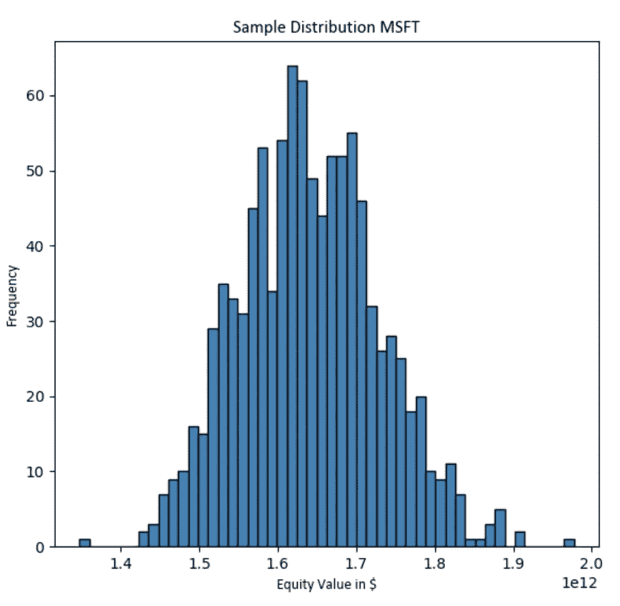
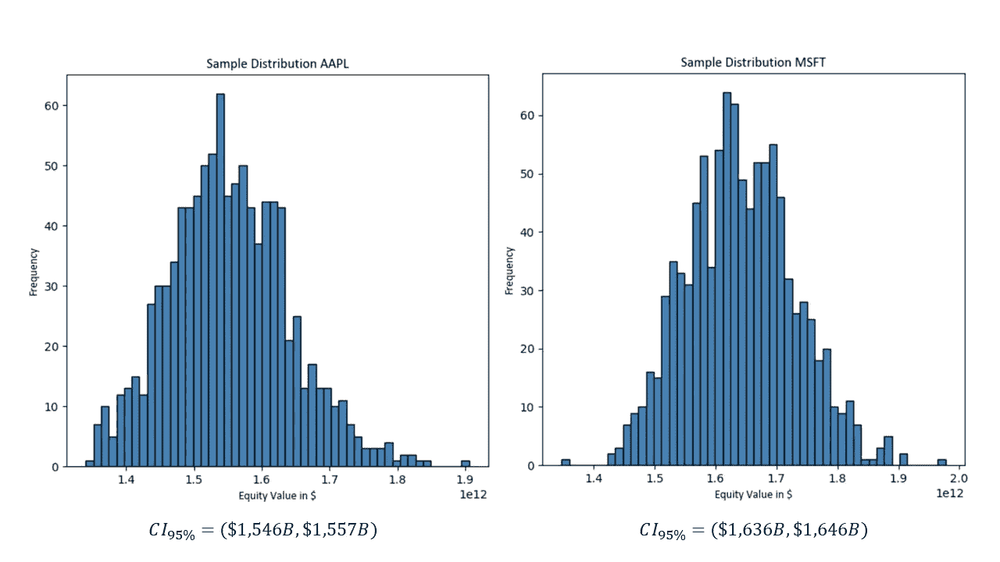
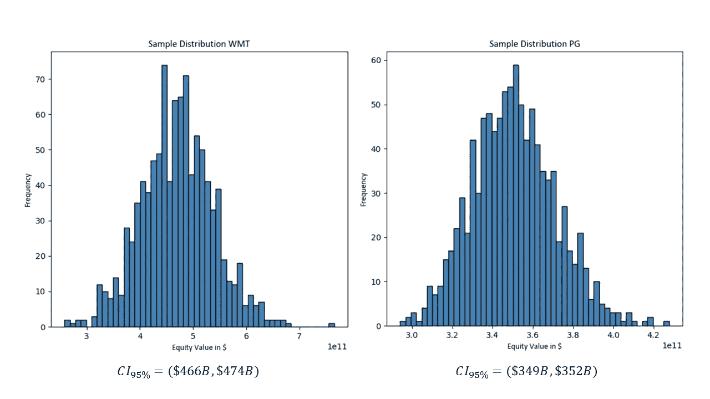
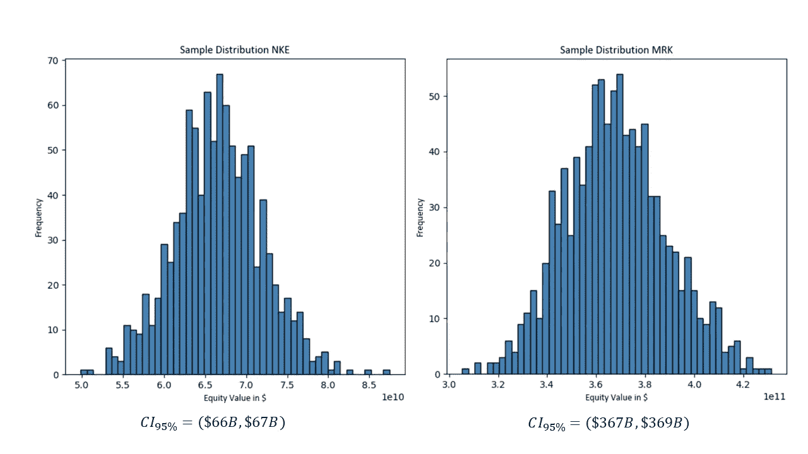

# 使用 Python 的概率模型进行公司估值

> 原文：<https://towardsdatascience.com/company-valuation-using-probabilistic-models-with-python-712e325964b7?source=collection_archive---------16----------------------->

## **采用蒙特卡洛模拟确定上市公司的股权价值**


***来自《走向数据科学》编辑的提示:*** *虽然我们允许独立作者根据我们的* [*规则和指导方针*](/questions-96667b06af5) *发表文章，但我们不认可每个作者的贡献。你不应该在没有寻求专业建议的情况下依赖一个作者的作品。详见我们的* [*读者术语*](/readers-terms-b5d780a700a4) *。*

在一个完全可预测的世界中，我们将拥有关于企业未来增长率和现金流的准确信息，这将导致该公司单一准确的内在价值。然而现实中，事情的不确定性更大。事实上，虽然一些分析师给出了准确的股价目标，但金融模型的各种输入实际上是随机分布的变量。由此产生的复杂性加剧了寻找合适的公司价值的挑战。虽然在随机输入的情况下不再有“单一版本的真相”，但如果我们的输入遵守某些规则，就有可能找到可能包含我们公司真实平均值的一系列值。在编写下面的模型时，我借鉴了 NYU 大学教授 Aswath Damodaran 在他关于使用概率方法进行公司估值的论文[1]中提供的见解。

# 一.统计迂回

假设我们只有四个随机变量作为股票估值模型的输入:收入 CAGR、EBIT 利润率、加权平均资本成本(WACC)和公司的长期增长率(假设微软)。我们可以进一步假设这些值有一个确定的平均值，并且是正态分布的。这需要这些变量的分布遵循一套规则，例如，关于它们的传播。

鉴于这些随机变量，有一些“真正的”平均公司价值，我们试图确定。这个真实均值是基于我们随机输入变量的无限多内在价值预测的均值。因为不可能找到这个精确的总体平均值，所以我们需要限制自己创建一个值的单一样本，并从这个样本中推断总体平均值。

## I.1 抽样分布

为了理解样本相对于公司价值总体的表现，首先设想一个假设场景是有意义的，在这个场景中，我们知道真实的平均公司价值及其标准差。如果我们现在从公司价值总体中抽取重复样本，这些样本的平均值将遵循一个抽样分布，该分布可以用正态分布来近似。该分布的平均值是公司价值的真实平均值，其标准偏差是公司价值的标准偏差除以样本中观察值数量的平方根。利用这个标准差，我们可以预测某些事件发生的概率。例如，我们知道 68%的样本均值将落在总体均值的一个标准差内，大约 95%将落在两个标准差内，等等。

## I.2 推断

那么这对我们有什么帮助呢？如果我们知道总体均值及其抽样分布的标准差，我们就可以从理论上生成一个样本，并推断出真实的总体均值。例如，如果我们取样本的平均值，并创建一个从该平均值向任一侧延伸两个标准差的范围，我们可以有 95%的把握认为真正的平均值将位于该区间内。唯一的问题是我们不知道总体标准偏差。

事实证明，我们可以将样本标准差作为真实总体值的近似值，并通过扩大置信区间的宽度(通过使用 t 值)来说明这一点。如果从总体中抽取足够大的样本，这将提高我们总体标准差估计的准确性，因此我们可以使用 z 分数来代替。

本质上，所有这些意味着我们可以预测我们公司的价值一定次数，这将导致从公司价值的人口样本。然后，我们可以为真实平均值创建 95%的置信区间，以获得真实平均值(基于四个随机输入变量)可能位于何处的指示。

# 二。用 Python 实现

尽管基础理论有些复杂，但用 Python 实现该模型实际上相当简单，这将在随后的章节中解释。

## II.1 计算公司的公允价值

使用 yahoo_fin 库，可以获得上市公司的财务数据。我们可以使用此信息来导出在以下模拟中使用的正态分布变量的平均值。在模拟的每次迭代中，我们根据随机变量的值预测一个特定的公司价值。我用来获取这个值的代码和我前段时间写的代码很相似(除了 yahoo_fin 让我不用手动抓取所有的财务数据)。因为这里的重点是从蒙特卡罗模拟生成的样本数据中进行推断，所以我不会详细讨论代码和它背后的简化假设。重要的是，在给定公司收入 CAGR、EBIT 利润率、WACC 和长期增长率的特定输入的情况下，下面的代码块将(希望)返回对公司内在价值的较为准确的估计。

```
from yahoo_fin import stock_info as si
from matplotlib import pyplot as plt 
import pandas_datareader as dr
import numpy as np
import pandas as pd

'''----// General input variables //----'''

company_ticker = 'MSFT'
market_risk_premium = 0.059
debt_return = 0.01
long_term_growth = 0.01
tax_rate = 0.3
iterations = 1000

'''----// Get financial information from yahoo finance //----'''

income_statement_df = si.get_income_statement(company_ticker)

pars_df = income_statement_df.loc[['totalRevenue', 'ebit']]

input_df = pars_df.iloc[:, ::-1]

'''----// Calculate average revenue CAGR & EBIT margin //----'''

def get_cagr(past_revs):
    CAGR = (past_revs.iloc[0,3]/past_revs.iloc[0,0])**(1/4)-1
    return(CAGR)

def get_average_margin(past_ebit):
    margin = 0
    margin_lst = []
    for i in range(len(past_ebit.columns)):
        margin = past_ebit.iloc[1,i]/past_ebit.iloc[0,i]
    margin_lst.append(margin)
    return(sum(margin_lst)/len(margin_lst))

mean_cagr = get_cagr(input_df)
mean_margin = get_average_margin(input_df)

'''----// Create forecast function through which random variables will flow //----'''

def get_forecast(input_df, cagr, margin, long_term_growth):
    forecast_lst = []
    for i in range(6):
        if i < 5:
            forecast_lst.append(input_df.iloc[0,3]*(1+cagr)**(i+1)*margin)
        else:
            forecast_lst.append(input_df.iloc[0,3]*(1+cagr)**(i)*(1+long_term_growth)*margin)
    return forecast_lst

'''----// Get WACC and net debt //----'''

def get_wacc(company_ticker, market_risk_premium, debt_return, tax_rate):
    risk_free_rate_df = dr.DataReader('^TNX', 'yahoo') 
    risk_free_rate = (risk_free_rate_df.iloc[len(risk_free_rate_df)-1,5])/100
    equity_beta = si.get_quote_table('msft')['Beta (5Y Monthly)']
    equity_return = risk_free_rate+equity_beta*(market_risk_premium)
    balance_sheet_df = si.get_balance_sheet(company_ticker)
    short_term_debt_series = balance_sheet_df.loc['shortLongTermDebt']
    long_term_debt_series = balance_sheet_df.loc['longTermDebt']
    cash_series = balance_sheet_df.loc['cash']
    net_debt = short_term_debt_series.iloc[0] +  + long_term_debt_series.iloc[0] - cash_series.iloc[0]
    market_cap_str = si.get_quote_table(company_ticker)['Market Cap']
    market_cap_lst = market_cap_str.split('.')

    if market_cap_str[len(market_cap_str)-1] == 'T':
        market_cap_length = len(market_cap_lst[1])-1
        market_cap_lst[1] = market_cap_lst[1].replace('T',(12-market_cap_length)*'0')
        market_cap = int(''.join(market_cap_lst))

    if market_cap_str[len(market_cap_str)-1] == 'B':
        market_cap_length = len(market_cap_lst[1])-1
        market_cap_lst[1] = market_cap_lst[1].replace('B',(9-market_cap_length)*'0')
        market_cap = int(''.join(market_cap_lst))

    company_value = market_cap + net_debt
    WACC = market_cap/company_value * equity_return + net_debt/company_value * debt_return * (1-tax_rate)
    return WACC

def get_net_debt():

    balance_sheet_df = si.get_balance_sheet(company_ticker)
    short_term_debt_series = balance_sheet_df.loc['shortLongTermDebt']
    long_term_debt_series = balance_sheet_df.loc['longTermDebt']
    cash_series = balance_sheet_df.loc['cash']

    return short_term_debt_series.iloc[0] + long_term_debt_series.iloc[0] - cash_series.iloc[0]

mean_wacc = get_wacc(company_ticker, market_risk_premium, debt_return, tax_rate)

net_debt = get_net_debt()

'''----// Discount EBIT figures to arrive at the PV of the firm's cash flows //----'''

def discount(forecast, discount_rate, long_term_rate):
    discount_lst = []
    for x,i in enumerate(forecast):
        if x < 5:
            discount_lst.append(i/(1+discount_rate)**(x+1))
        else:
            discount_lst.append(i/(discount_rate-long_term_rate)*(1/(1+discount_rate)**5))
    return sum(discount_lst)forecast = get_forecast(input_df, cagr, margin, long_term_rate)
present_value = discount(forecast, discount_rate, long_term_rate)-net_debt
```

其思想是使用循环反复预测公司价值，并将结果模型输出存储在一个列表中，该列表稍后用于确定样本均值和标准差。

## II.2 用 Python 生成正态分布的随机变量

我通过假设这些变量的过去值是未来值的准确预测值，得出了平均 CAGR 值、EBIT 边际值和 WACC 值。公司的长期增长率更难确定，应根据具体情况输入。四个变量的标准差也是如此。给定四个变量中每一个的平均值和标准偏差，很容易用 numpy 从随机分布中得出结论。实际上，导入库后我们只需要一行代码。

```
cagr = np.random.normal(mean_cagr, 0.01)
```

对 EBIT 边际利润、WACC 和长期增长率做同样的处理，我们可以用得到的数字来计算公司价值。这样做一次需要从公司价值观中抽取一个单一的价值观。使用一个循环，我们可以重复这个过程几次(在本例中是 1000 次)，并将结果公司值存储在一个列表中。

```
'''----// Run simulation //----'''

hist_lst = []

for i in range(iterations):
    cagr = np.random.normal(mean_cagr, 0.01)
    margin = np.random.normal(mean_margin, 0.005)
    long_term_rate = np.random.normal(long_term_growth, 0.001)
    discount_rate = np.random.normal(mean_wacc, 0.001)
    forecast = get_forecast(input_df, cagr, margin, long_term_rate)
    hist_lst.append(discount(forecast, discount_rate, long_term_rate)-net_debt)
hist_array = np.array(hist_lst)
```

使用 numpy，我们可以很容易地找到这个列表的均值和标准差。随后，可以计算出我们 95%置信区间的上下界。

```
mean = hist_array.mean()
standard_error = hist_array.std()/(iterations**(1/2))

lower_bound = mean-1.96*standard_error
upper_bound = mean+1.96*standard_error
```

## 二. 3 绘制产出图

使用 matplotlib，我们还可以图形化地显示样本数据。这有助于更好地理解样本数据的分布，也使我们能够验证推断的正态性假设。

```
plt.hist(hist_array, bins=50, align='mid', color = 'steelblue', edgecolor='black')
plt.title('Sample Distribution ' + company_ticker, {'fontname':'Calibri'})
plt.xlabel('Equity Value in $', {'fontname':'Calibri'})
plt.ylabel('Frequency', {'fontname':'Calibri'})

plt.show()
```



图 1:预测公司价值的分布直方图。由于数据近似正态分布，我们能够如上所述计算置信区间。

## II.4 模型性能

为了了解模型的表现，我计算了不同公司真实平均值的置信区间，并随后将区间与实际公司市值进行了比较。结果如下所示。



图 2:AAPL 的模型输出(实际市场。cap = 19.41 亿美元)和 MSFT(实际市场。上限= 1，554 美元)



图 3:WMT 的模型输出(实际市场。cap = 388 b 美元)和 PG(实际市场。上限= 3400 亿美元)



图 4:NKE 的模型输出(实际市场。cap = 179 亿美元)和 MRK(实际市场。上限= 211 亿美元)

当将置信区间与公司的实际市值进行比较时，该模型似乎有些偏差。虽然该程序肯定不是真实世界的完美代表，但我们仍然必须考虑到置信区间为公司的真实*均值* *值*提供了一个范围，而不是为单个*点估计提供了一个范围。*

# 三。结束语

像我之前建立的计算公司公允价值的模型一样，这个程序也做了几个简化的假设。例如，我隐含地假设四个随机输入变量的过去值是它们未来总体均值的适当近似值。然而，这种假设可能是没有根据的，即使允许这些输入变量有一些随机性也不能解决这个问题。尽管如此，我相信将随机性纳入模型会使它更接近于成为真实世界动态的充分代表。

## III.1 免责声明

该模型和代码只是将 Python 编程应用于公司估值的一个练习。因此，该代码显然不应用于投资决策。此外，从雅虎财经获得的信息不应用于任何商业目的。

## III.2 最终代码

下面是运行模拟并从结果样本数据中得出推论所需的全部代码。它的工作只需要 Python(我用的是 3.7.8)和几个包，即 yahoo_fin、matplotlib、pandas-datareader、numpy 和 pandas。

```
from yahoo_fin import stock_info as si
from matplotlib import pyplot as plt 
import pandas_datareader as dr
import numpy as np
import pandas as pd

'''----// General input variables //----'''

company_ticker = 'MSFT'
market_risk_premium = 0.059
debt_return = 0.01
long_term_growth = 0.01
tax_rate = 0.3
iterations = 1000

'''----// Get financial information from yahoo finance //----'''

income_statement_df = si.get_income_statement(company_ticker)

pars_df = income_statement_df.loc[['totalRevenue', 'ebit']]

input_df = pars_df.iloc[:, ::-1]

'''----// Calculate average revenue CAGR & EBIT margin //----'''

def get_cagr(past_revs):
    CAGR = (past_revs.iloc[0,3]/past_revs.iloc[0,0])**(1/4)-1
    return(CAGR)

def get_average_margin(past_ebit):
    margin = 0
    margin_lst = []
    for i in range(len(past_ebit.columns)):
        margin = past_ebit.iloc[1,i]/past_ebit.iloc[0,i]
    margin_lst.append(margin)
    return(sum(margin_lst)/len(margin_lst))

mean_cagr = get_cagr(input_df)
mean_margin = get_average_margin(input_df)

'''----// Create forecast function through which random variables will flow //----'''

def get_forecast(input_df, cagr, margin, long_term_growth):
    forecast_lst = []
    for i in range(6):
        if i < 5:
            forecast_lst.append(input_df.iloc[0,3]*(1+cagr)**(i+1)*margin)
        else:
            forecast_lst.append(input_df.iloc[0,3]*(1+cagr)**(i)*(1+long_term_growth)*margin)
    return forecast_lst

'''----// Get WACC and net debt //----'''

def get_wacc(company_ticker, market_risk_premium, debt_return, tax_rate):
    risk_free_rate_df = dr.DataReader('^TNX', 'yahoo') 
    risk_free_rate = (risk_free_rate_df.iloc[len(risk_free_rate_df)-1,5])/100
    equity_beta = si.get_quote_table('msft')['Beta (5Y Monthly)']
    equity_return = risk_free_rate+equity_beta*(market_risk_premium)
    balance_sheet_df = si.get_balance_sheet(company_ticker)
    short_term_debt_series = balance_sheet_df.loc['shortLongTermDebt']
    long_term_debt_series = balance_sheet_df.loc['longTermDebt']
    cash_series = balance_sheet_df.loc['cash']
    net_debt = short_term_debt_series.iloc[0] +  + long_term_debt_series.iloc[0] - cash_series.iloc[0]
    market_cap_str = si.get_quote_table(company_ticker)['Market Cap']
    market_cap_lst = market_cap_str.split('.')

    if market_cap_str[len(market_cap_str)-1] == 'T':
        market_cap_length = len(market_cap_lst[1])-1
        market_cap_lst[1] = market_cap_lst[1].replace('T',(12-market_cap_length)*'0')
        market_cap = int(''.join(market_cap_lst))

    if market_cap_str[len(market_cap_str)-1] == 'B':
        market_cap_length = len(market_cap_lst[1])-1
        market_cap_lst[1] = market_cap_lst[1].replace('B',(9-market_cap_length)*'0')
        market_cap = int(''.join(market_cap_lst))

    company_value = market_cap + net_debt
    WACC = market_cap/company_value * equity_return + net_debt/company_value * debt_return * (1-tax_rate)
    return WACC

def get_net_debt():

    balance_sheet_df = si.get_balance_sheet(company_ticker)
    short_term_debt_series = balance_sheet_df.loc['shortLongTermDebt']
    long_term_debt_series = balance_sheet_df.loc['longTermDebt']
    cash_series = balance_sheet_df.loc['cash']

    return short_term_debt_series.iloc[0] + long_term_debt_series.iloc[0] - cash_series.iloc[0]

mean_wacc = get_wacc(company_ticker, market_risk_premium, debt_return, tax_rate)

net_debt = get_net_debt()

'''----// Discount EBIT figures to arrive at the PV of the firm's cash flows //----'''

def discount(forecast, discount_rate, long_term_rate):
    discount_lst = []
    for x,i in enumerate(forecast):
        if x < 5:
            discount_lst.append(i/(1+discount_rate)**(x+1))
        else:
            discount_lst.append(i/(discount_rate-long_term_rate)*(1/(1+discount_rate)**5))
    return sum(discount_lst)

'''----// Run simulation and plot distribution of model forecasts //----'''

hist_lst = []

for i in range(iterations):
    cagr = np.random.normal(mean_cagr, 0.01)
    margin = np.random.normal(mean_margin, 0.005)
    long_term_rate = np.random.normal(long_term_growth, 0.001)
    discount_rate = np.random.normal(mean_wacc, 0.001)
    forecast = get_forecast(input_df, cagr, margin, long_term_rate)
    hist_lst.append(discount(forecast, discount_rate, long_term_rate)-net_debt)
hist_array = np.array(hist_lst)
plt.hist(hist_array, bins=50, align='mid', color = 'steelblue', edgecolor='black')
plt.title('Sample Distribution ' + company_ticker, {'fontname':'Calibri'})
plt.xlabel('Equity Value in $', {'fontname':'Calibri'})
plt.ylabel('Frequency', {'fontname':'Calibri'})

plt.show()

mean = hist_array.mean()
standard_error = hist_array.std()/(iterations**(1/2))

lower_bound = mean-1.96*standard_error
upper_bound = mean+1.96*standard_error 

print(lower_bound)
print(upper_bound)
```

参考资料:

[1] A. Damodaran，[直面不确定性:在估值中使用概率方法](https://papers.ssrn.com/sol3/papers.cfm?abstract_id=3237778) (2018)，SSRN