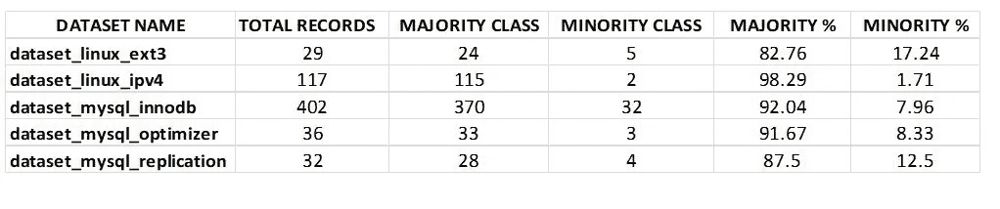
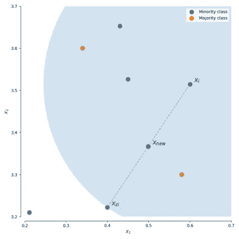
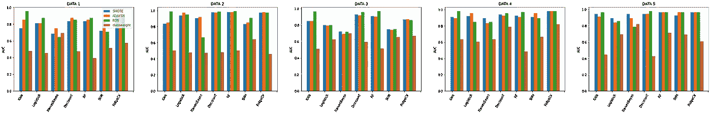
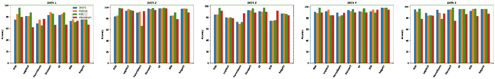
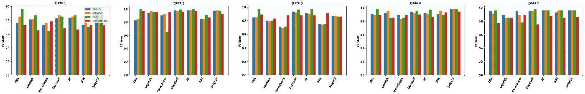

# 不平衡数据过采样技术的比较分析

> 原文：<https://towardsdatascience.com/comparative-analysis-of-oversampling-techniques-on-imbalanced-data-cd46f172d49d?source=collection_archive---------35----------------------->

## **关键词** -不平衡数据，过采样，对比分析

由[卢克·切瑟](https://unsplash.com/@lukechesser?utm_source=medium&utm_medium=referral)在 [Unsplash](https://unsplash.com?utm_source=medium&utm_medium=referral) 上拍摄的照片

# **简介**

对不平衡数据建模是我们在训练模型时面临的主要挑战。我的项目的主要目标是找到最佳的过采样技术，我将应用于五个与老化相关的 bug 问题相关的数据集。我会用七个机器学习分类模型来训练模型。

不平衡数据通常指的是分类问题，其中每个类别的观察值数量不是均匀分布的；通常，一个类别(称为*多数类别*)会有大量数据/观察值，而一个或多个其他类别(称为*少数类别*)的观察值会少得多。

# **数据**

我使用的数据集与老化相关的错误(ARB)有关，这些错误发生在长期运行的系统中，是由于内存泄漏或未释放的文件和锁等问题的积累而导致的错误条件。与衰老有关。在软件测试过程中，bug 很难被发现，复制起来也很困难。下面是表 1 中每个数据集的描述。

表 1:实验数据集描述

# **使用的平衡方法**

## **1。类别重量**

首先，我使用了一种最简单的方法来解决类不平衡的问题，即简单地为每个类提供一个权重，这个权重更多地强调少数类，这样最终的结果是一个分类器可以从所有类中平等地学习。

## 2.过采样

其次，我使用了三种过采样技术来消除这种不平衡。对于*过采样*，少数类将增加少数观察的数量，直到我们达到一个平衡的数据集。

## 2.1 随机过采样

这是最简单的过采样方法。它随机采样少数类，并简单地复制采样的观察值。通过这种技术，我们人为地减少了数据集的方差。

## 2.2 SMOTE

然而，我们也可以使用现有的数据集为少数类综合生成新的数据点。合成少数过采样技术(SMOTE)是一种通过在原始数据集中的观测值之间进行插值来生成新观测值的技术。

对于给定的观测值 xi，通过在 k 个最近邻之一 xzi 之间进行插值来生成新的(合成)观测值。

xnew = Xi+λ(xzi Xi)xnew = Xi+λ(xzi Xi)

其中λ是在[0，1][0，1]范围内的随机数。这个插值将在 xi 和 xzi 之间的线上创建一个样本。

## 2.3 ADASYN

自适应合成(ADASYN)采样与 SMOTE 相同，但是，为给定 xi 生成的样本数量与附近与 xi 不属于同一类别的样本数量成比例。因此，ADASYN 在生成新的合成训练样本时往往只关注离群值。

# **使用的分类模型**

1. ***K 最近邻—*** 首先，我使用了一个简单的分类模型，即 KNN 分类器。在这个模型中，分类是根据每个点的 k 个最近邻的简单多数投票来计算的。

***2。逻辑回归-*** 其次我用的是逻辑回归。在该算法中，描述单次试验可能结果的概率使用逻辑函数(即 sigmoid 函数)建模。

***3。朴素贝叶斯-*** 接下来我使用了朴素贝叶斯算法，它基于贝叶斯定理，假设每对特征之间是独立的。朴素贝叶斯分类器在许多现实情况下工作良好，例如文档分类和垃圾邮件过滤。

***4。决策树-*** 然后我用了决策树分类器。决策树产生一系列可用于对数据进行分类的规则。这个分类器易于理解和可视化，可以处理数字和分类数据。

***5。*随机森林-**接下来我用的是随机森林分类器。它是一种元估计器，可以在数据集的各种子样本上拟合许多决策树，并使用平均值来提高模型的预测准确性，并控制过度拟合。子样本大小始终与原始输入样本大小相同，但样本是替换绘制的。

**6*6。*支持向量机-**接下来我用的是 SVM。它将训练数据表示为空间中的点，这些点被尽可能宽的明显间隙分成不同的类别。然后，新的例子被映射到相同的空间，并根据它们落在差距的哪一边来预测属于哪个类别。

***7。山脊 CV-*** 最后我用的是山脊 CV。该分类器首先将目标值转换为{-1，1}，然后将问题视为回归任务(多类情况下的多输出回归)。

# **观察分析**

## ***1。调谐模式***

我超调了每个数据集上的每个模型，以找到模型可以预测的最佳精度。我使用 GridSearchCV 和 K-Fold 来优化模型。我将不同的 K 值设置为 5、10、15 和 20，发现 10 倍的效果最好。

你可以在文章末尾我提供的 GitHub 链接中看到代码

## ***2。*技术相对比较**

我使用了 AUC 指标来比较模型，因为当我们必须比较分类模型时，ROC AUC 是最好的。AUC 值越大，模型越好。从我的结果中，我发现平均 AUC 值，即 0.89 的 ***随机抽样*** 与其他不平衡学习策略相比是最好的。 ***SMOTE*** 和 ***ADAYSN*** 的平均 AUC 值次之，为 0.88。 ***类权重*** t 的平均 AUC 值为 0.58。精度和 f 值显示出相同的趋势。根据 f-measure 值和精确度两者， ***随机超过采样器*** 性能最好，其次是*和 ***ADASYN*** 。*

*我们还推断出 ***脊分类器*** 是最好的，并且具有 0.93 的平均 AUC 值。其次是平均 AUC 值为 0.83 的 ***随机森林*** 和平均 AUC 值为 0.80 的 ***决策树******KNN***各为 0.80。 ***Logistic 回归*** 和 ***SVM*** 的平均 AUC 值各为 0.79。 ***朴素贝叶斯*** 表现最差，平均 AUC 为 0.76。根据 F-测度，脊分类器的平均 F-测度值为 0.916。决策树和随机森林的平均 F-测度值分别为 0.90 和 0.91，高于 SVM 和 Logistic 回归的平均 F-测度值 0.85。朴素贝叶斯表现最差，平均 F 值为 0.81*

*此外，我绘制了条形图，显示了过采样技术和分类模型的比较。从可视化结果中，我们还可以看到，在大多数情况下，由绿色条表示的随机过采样技术比其他技术高。*

*你可以在文章末尾提供的我的 GitHub 链接中查看可视化代码。*

**

*AUC 分数的条形图*

**

*准确性得分条形图*

**

*F1-度量的条形图*

# ***结果***

*在这篇文章中，我通过应用 7 种机器学习算法，对 5 个老化相关错误的不平衡数据集进行了过采样技术的比较分析。从我的项目，我们得出结论，随机过采样器被证明是最好的过采样技术相比，其他和岭分类器，最好的机器学习算法。*

*我的 GitHub 链接-[https://github.com/vanisinghal0201/Comparative_Analysis](https://github.com/vanisinghal0201/Comparative_Analysis)*

***我也将很快在**[**geeks forgeeks**](https://www.geeksforgeeks.org/)**上发表。***

# ***参考文献***

*[1] Lov Kumar，Ashish Sureka，实验结果，结论，针对老化相关错误预测的类不平衡问题的特征选择技术，2018*

*[2]双吉，预测职称分类中的等级关系，2020*

*[3]从不平衡数据中学习。检索自 https[://www . Jeremy Jordan . me/unbalanced-data/](https://www.jeremyjordan.me/imbalanced-data/)*

*[4]不平衡数据[https://github . com/vanising Hal 0201/unbalanced Data/blob/master/Learning % 20 from % 20 unbalanced % 20 Data . ipynb](https://github.com/vanisinghal0201/imbalanceddata/blob/master/Learning%20from%20imbalanced%20data.ipynb)*