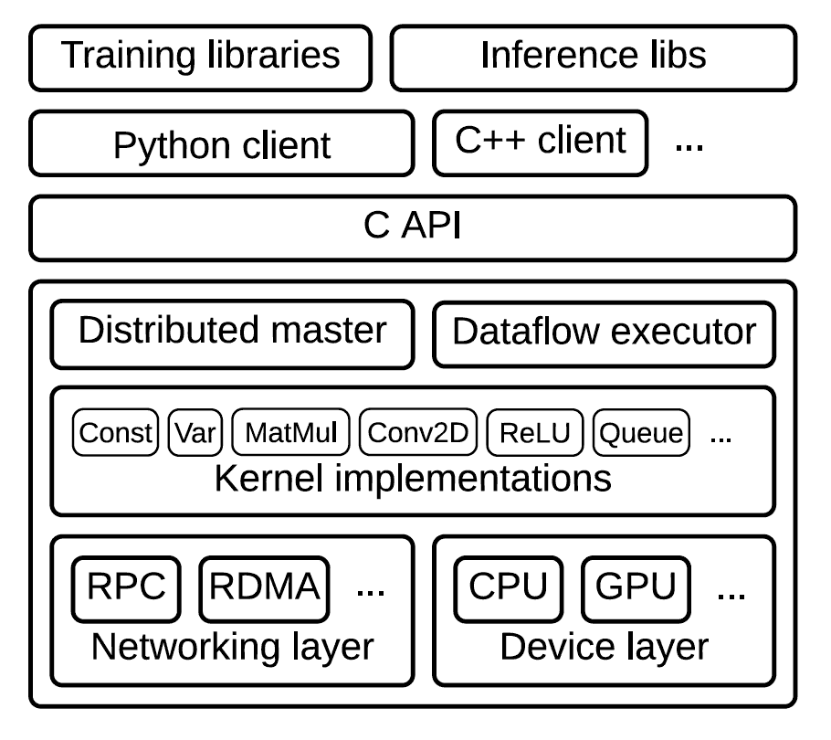
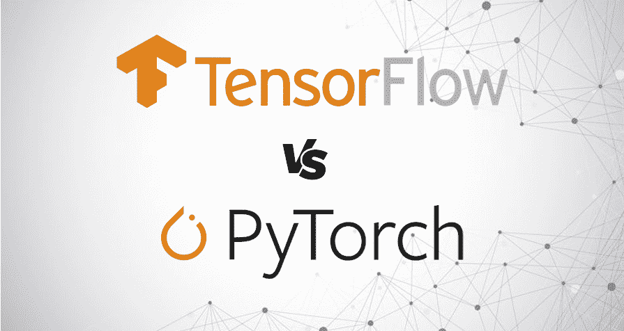

# ML 系统的比较案例研究:Tensorflow 与 PyTorch

> 原文：<https://towardsdatascience.com/comparative-case-study-of-ml-systems-tensorflow-vs-pytorch-a554dce5f585?source=collection_archive---------33----------------------->

[张杰瑞](https://unsplash.com/@z734923105?utm_source=unsplash&utm_medium=referral&utm_content=creditCopyText)在 [Unsplash](https://unsplash.com/t/nature?utm_source=unsplash&utm_medium=referral&utm_content=creditCopyText) 上拍照

在这篇文章中，我将对 [TensorFlow:一个用于大规模机器学习的系统](https://www.usenix.org/system/files/conference/osdi16/osdi16-abadi.pdf)和 [PyTorch:一个命令式的高性能深度学习库](https://papers.nips.cc/paper/9015-pytorch-an-imperative-style-high-performance-deep-learning-library)的背景架构进行一个小的比较研究

下面提到的信息是从这两篇论文中摘录的。

我选择了 [TensorFlow](https://www.tensorflow.org/) 和 [PyTorch](https://pytorch.org/) 来进行比较研究，因为我已经使用了这两个系统，理解它们的基本设计原理让我着迷。我想知道这些系统如何在幕后处理模型，使它们成为行业标准。解决以行业为中心的机器学习问题所需的速度和复杂架构很难实现，这两个系统都设法做到了这一点。

这篇文章旨在提供两个系统的架构差异。为了更深入地了解每个人的背景工作，请阅读他们的学术论文！它们信息量大，易于阅读。

# 张量流

## 好处:

**数据流图:** Tensorflow 是对[dist faith](https://static.googleusercontent.com/media/research.google.com/en//pubs/archive/40565.pdf)的改进，它是以前使用[参数服务器](http://www.cs.cornell.edu/courses/cs6453/2017sp/slides/paramserver.pdf)模型的 Google ML 平台。Tensorflow 结合了*数据流*的高级编程模型和参数服务器的低级效率，因此比它的前身强大得多。它结合了在基于参数服务器的架构中由单独的工作线程完成的计算和状态管理。它还使用在提供性能方面比 CPU 和 GPU 更好的 TPU。这使得研究人员开发复杂(和新颖)的深度学习模型变得相对容易。

> 数据流图是一个神经网络，由占位符和更新规则组成。它可以用于确定操作的顺序，以估计内存消耗等。

**高 GPU 利用率:**它提供了一个单语言平台来开发新的 ML 架构，速度很快，并使用单个数据流图来表示算法中的所有计算和状态。通过推迟执行直到程序完成，它提高了整体执行性能，即高 GPU 利用率。Tensorflow 的主要功能在于并发和分布式执行整个图的重叠子图。

**社区支持:** Tensorflow 也有巨大的社区支持，在生产中表现相当不错。所以很多大公司像 Google，Twitter，Airbnb，Open AI 等等。为他们的 ML 项目使用 Tensorflow 后端。

**移动接口:**它还提供跨集群的分布式执行和动态工作流，允许复杂的 ML 程序在 CPU、GPU 和 TPU 上运行，同时在移动设备上拥有一个接口。Tensorflow-Lite 的推出考虑到了移动设备。

**大规模 ML:** 对于密集的大规模任务，如图像分类和语言建模，Tensorflow 提供了一个非常容错、分布式和优化的架构，可用于训练非常大的 ML 模型，如通过谷歌的 ML 聚焦应用程序可见。

Tensorflow 架构([来源](https://www.usenix.org/system/files/conference/osdi16/osdi16-abadi.pdf))

## 缺点:

**陡峭的学习曲线:** Tensorflow 有一个学习曲线，旨在使研究人员更容易开发 ML 模型，它增加了理解其架构的难度。它也不像 Spark 的 RDDs 那样为单个操作提供容错。

**调试和动态执行:**调试 ML 程序的容易程度并不是 Tensorflow design 关注的重点。它也不支持早期的动态计算图，模型只能在已经定义了计算图的情况下运行。尽管它在最新版本中增加了对此的支持。

虽然它的架构非常可扩展和高效，但随着 Python 用户花一些时间来习惯它，可以做出更多努力来改善用户体验。

来源:[活动状态](https://www.activestate.com/blog/neural-network-showdown-tensorflow-vs-pytorch/)

# PyTorch

## 好处:

**易用性:** PyTorch 是一个专注于 python 的 ML 框架，开发它是为了让用户牢记在心。它侧重于维护性能，同时保持最终用户的高易用性。PyTorch 的“一切都是程序”的方法使它成为一个非常用户友好的平台。

**C++核心:**由于大多数深度学习研究人员都熟悉 python，所以它的开发者开发了这个 python 库，尽管它的核心是用 C++编写的，以提高速度和性能。与 Tensorflow 不同，它不使用静态数据流方法，因此为了克服 Python 的全局解释器锁(确保一次只有一个线程运行)问题，它的核心“libtorch”库(用 C++编写)实现了张量数据结构、自动 diff 集成等。多线程环境中的功能。

**Python 库支持:** PyTorch 保持简单高于性能，因此做出了折衷。所有的 Python 功能:打印语句、调试器、Numpy、Matplotlib 等的使用。使用 PyTorch 轻松工作。

从论文本身来看:

> 用 10%的速度换取一个简单得多的模型是可以接受的；100%不是。

**CPU-GPU 同步:**它具有高度的互操作性和可扩展性，可以很好地与其他使用库的 GPU 配合使用。它使用 CUDA 在 GPU 上异步执行操作符，这有助于获得高性能，即使对于 Python 这样的语言也是如此。这样，它通过 CPU 在 Python 中运行模型的控制流，并在 GPU 上运行张量运算，一切都在 CPU-GPU 同步中进行。

**多重处理:**它使用多重处理模块(torch.multiprocessing)来允许并发线程加速程序。它还通过引用计数(计算每个张量的使用次数)和删除不再使用的张量来仔细管理内存。

PyTorch 中的一个简单神经网络程序([来源](https://papers.nips.cc/paper/9015-pytorch-an-imperative-style-high-performance-deep-learning-library.pdf)

**动态执行:** PyTorch 还支持动态计算图，这有助于用户随时开发和运行模型。这在像 RNN 这样使用运行时可变长度输入的模型中非常有用。

## 缺点:

**性能:**由于 PyTorch 是为 Python 打造的，所以不得不在性能上做一些取舍。它不使用其他 ML 系统中流行的数据流图，如 TensorFlow、Theano 等。以提高性能著称。

依赖:它还必须依赖许多其他独立的库来克服 Python 的限制，比如使用 CUDA 流。由于 CUDA 流遵循 FIFO 方法，PyTorch 需要保持 CPU 和 GPU 周期之间的同步，因为它遵循“每个流一个池”的设计。这可能会导致碎片，同步开销和一些奇怪的角落情况，但 PyTorch 确保用户可能永远不会遇到它们。

# 共享的共同特征

*   这两个系统都使用高效的 C++内核来实现高性能。由于计算损失函数的梯度，而使用 SGD 是由所有 ML 程序完成的，PyTorch 和 Tensorflow 都提供了有效的自动微分算法。
*   两者都利用工作线程/子计算中的分布式执行和多重处理来提高性能。这两个系统都是开源的，在 ML 研究社区中很受欢迎。两者都使用异步参数更新来执行算法。

# 差异

> *py torch 比 TensorFlow 来得晚，它覆盖了 tensor flow 的很多弱点。*

*   PyTorch 提供了数据并行性以及调试功能，而这两者对于 TensorFlow 来说都是一个问题。相比 Tensorflow，PyTorch 对研究人员来说更容易学习。
*   PyTorch 保持了控制和数据流之间的分离，而 Tensorflow 将其合并到一个数据流图中。
*   PyTorch 执行反向模式自动微分，TensorFlow 也执行反向微分，尽管区别在于 Tensorflow 提供的消除开销的优化算法。
*   TensorFlow 利用延迟执行直到整个程序可用，而这在 PyTorch 的情况下是不可能的，因此使用其他方法来提高效率，如自定义缓存张量收集器和引用计数。

# 结论

总的来说，PyTorch 在很多方面都比 Tensorflow 表现得更好，包括易用性，同时又不牺牲性能。

考虑到 PyTorch 论文中的基准测试，它比 Tensorflow 实现所有主要的 ML 算法(如 AlexNet、VGG-19 等)的性能都要好。尽管对于大规模生产系统，Tensorflow 由于其社区支持和强大的架构仍然是主要选择。

没有一种方法可以设计大型系统。每个 ML 平台在设计其特性时都考虑到了一些核心方面。对于 TensorFlow，它是性能，而对于 PyTorch，它是用户体验。

【http://adityarohilla.com】原载于 2020 年 4 月 11 日**。**