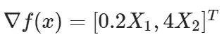

# 使用 Numpy 的深度学习优化算法的性能比较

> 原文：<https://towardsdatascience.com/comparative-performance-of-deep-learning-optimization-algorithms-using-numpy-24ce25c2f5e2?source=collection_archive---------46----------------------->

在本文中，我们将通过计算二次凸函数的最优点，从数值上比较主要深度学习优化算法的性能。

# **简介:**

深度学习被称为人工智能的未来。如今，神经网络被称为通用函数逼近器，即它们有能力表示这个宇宙中的任何复杂函数。计算这个具有数百万个参数的通用函数背后的想法来自优化的基础数学。优化可以通过多种方式完成，但对于本文，我们将重点关注基于梯度下降的优化技术。

非凸函数的优化是主要的研究领域。多年来，不同的科学家提出了不同的优化算法来优化神经网络的成本函数。这些算法中的大多数都是基于基于梯度的方法，只是稍加修改。在这篇文章中，我们将讨论五个主要的基于下降的算法-梯度下降，动量，Adagrad，RMSprop，Adam。

# **进场-**

为了了解每个算法在实际中是如何工作的，我们将使用一个凸二次函数。我们将每种算法运行固定的迭代次数(20 次),以比较它们在达到最佳点时的收敛速度和轨迹。下面给出了该任务所选函数的方程，以及使用 Matplotlib 绘制的该函数的三维图形和水平集。

**函数方程**

**功能的 3D 图**

**3D 绘图的数字实现**

**二次函数的水平集**

最初，我们将从最基本的算法梯度下降开始，然后我们将跟随他们发展的趋势，以支持每个算法发展背后的思想。所以趋势会是这样的-

**1-梯度下降**

**2-动量**

**3-阿达格勒**

**4-RMSprop**

5-亚当

因为所有这些算法在更新规则的每次迭代中都需要梯度。因此，下面给出了函数的梯度，它将用于在每次迭代中更新两个变量。对于所有算法，我们将使用学习率的固定值=0.4。

**渐变矢量**

# **1-梯度下降:**

梯度下降是寻找最优解的最传统的技术。在该算法中，使用当前梯度(gt)乘以某个称为学习率的因子来更新当前权重， *α。*更新规则的等式如下所示。

**更新梯度下降规则**

梯度下降的数值实现

**轨迹使用梯度下降**

正如我们在上面的图中看到的，梯度下降经历了许多振荡，收敛非常缓慢。因此，在后面的部分，我们将研究梯度下降的修改，帮助我们实现稳定和更快的收敛。

# **2-势头:**

带动量的梯度下降是一种非常常用的优化器，它消除了由标准梯度下降引起的振荡，并加速了收敛到最佳点。当它加速水平方向时，它减慢垂直方向。在这种杰出行为的帮助下，它使我们在学习率方向上迈出了一大步。除此之外，动量比标准梯度下降稳定得多。

它不是在当前时间步长计算梯度，而是通过参数动量更新权重，动量是当前和过去梯度的指数移动平均值的集合。下面给出的等式解释了更新规则

动量更新规则

**Numpy 实现的动量**

**梯度下降 vs 动量**

# **3-阿达格拉德**

自适应梯度下降算法是一种学习梯度下降算法。它的主要区别是 Adagrad 根据网络中参数的重要性对每个权重使用不同的学习率。换句话说，当不必要的参数以较高的学习率训练时，重要的参数以较小的学习率训练以更稳定地收敛。这导致在不允许失真的情况下加速算法。更新公式类似于动量公式，这里每一步的动量都是用先前的动量和梯度的平方来计算的。下面的等式显示了 Adagrad 中的更新规则。

这里，Gt 是由过去梯度的平方和组成的对角矩阵， **ϵ是**平滑项。此外,⊙表示矩阵-矢量积运算。

**Adagrad 的 Numpy 实现**

**动量 vs 阿达格拉德**

从上图可以看出，虽然阿达格拉德呈现出平滑的运动，没有振荡，但是收敛能力不足。为了解决这个问题，Geoffrey Hinton 引入了一个更有效的优化器 RMSprop。

# **4-RMSprop**

Rmsprop 是由著名计算机科学家 Geoffrey Hinton ( [Hinton et al .，2012](http://www.cs.toronto.edu/~tijmen/csc321/slides/lecture_slides_lec6.pdf) )提出的另一种高效优化算法。这种算法的工作原理与 Adagrad 相似，只是稍加修改。我们采用这些梯度的指数移动平均值，而不是像 AdaGrad 那样采用梯度平方的累积和。使用指数平均的原因是，较新的梯度更新比不太新的梯度更新更重要。下面的等式显示了 Rmsprop 的更新规则。

RMSprop 的 Numpy 实现

**动量 vs 阿达格拉德 vs RMSprop**

可以明显看出，当向最优点收敛时，梯度下降算法在垂直方向上产生巨大的振荡，RMSprop 限制垂直方向的运动并加速水平方向的运动。此外，尽管动量减少了振荡，RMSprop 提供了更可靠和更快的收敛。

# **5-亚当**

自适应矩估计是为每个参数计算自适应学习率的另一种类型的优化器。与其他优化器相比，它表现得更加鲁棒和可靠，因为它基本上结合了动量和 RMSprop(即，类似梯度的动量的移动平均和使用平方梯度来调整类似 RMSprop 的学习速率)。更准确地说，Adam 算法执行如下

Adam 的 Numpy 实现

**动量 vs Adagrad vs RMSprop 和 Adam 收敛期间的轨迹**

如最后一幅图所示，Adam 优化器在直线路径上实现了最快的收敛。对于 Adam，它通过累加之前梯度的总和来抑制振荡，并且由于与 RMSprop 类似的平方梯度项，它遵循一条直线。这导致了一个明显的结论，即 Adam 是 momentum 和 RMSprop 的组合版本。从上图我们不难看出，为什么 Adam 是深度学习中最受欢迎的优化器。即使从远离最优(-6，-6)的点开始，Adam 也能以最少的迭代收敛得最快。

如需了解详情，请访问—[https://github.com/Saket-Uoft/Deep-Learning-Optimizers](https://github.com/Saket-Uoft/Deep-Learning-Optimizers)

**感谢阅读！**

如果你喜欢我的工作，想支持我。支持我的最好方式是在**媒体上关注我。**

## 参考资料:

[https://medium . com/@ sdoshi 579/optimizer-for-training-neural-network-59450d 71 caf 6](https://medium.com/@sdoshi579/optimizers-for-training-neural-network-59450d71caf6)