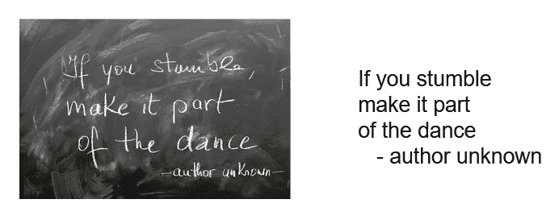
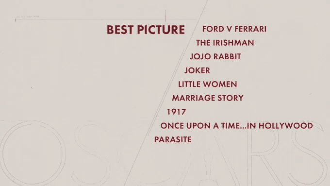
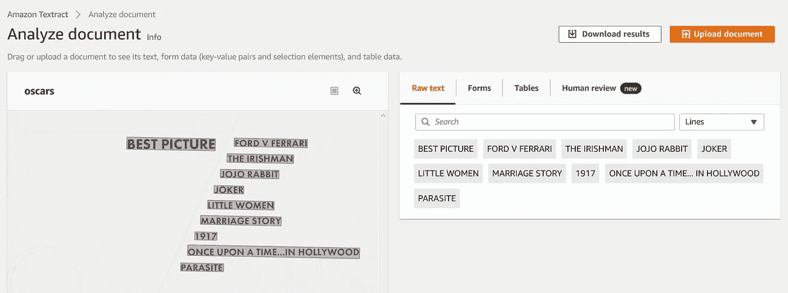
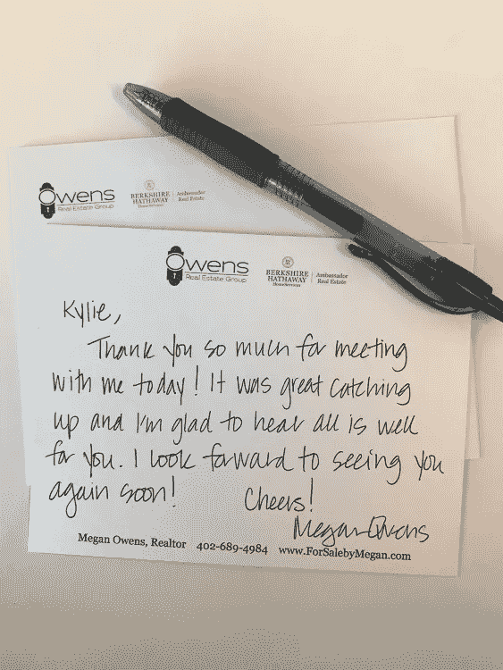
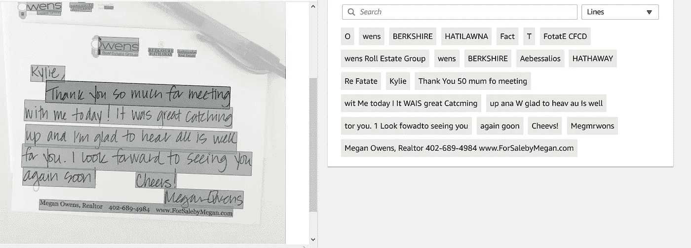
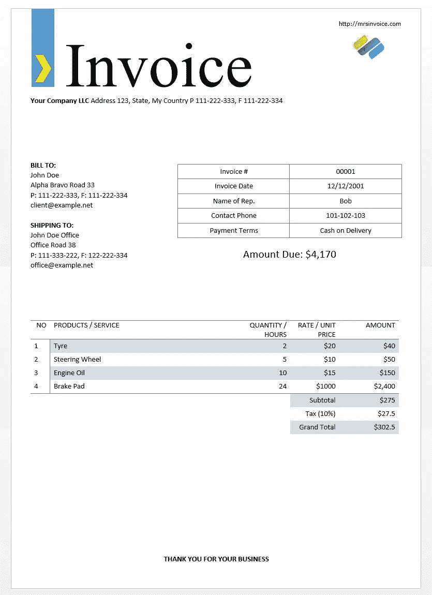
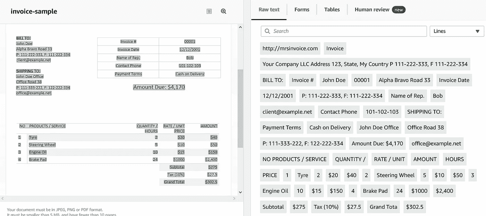
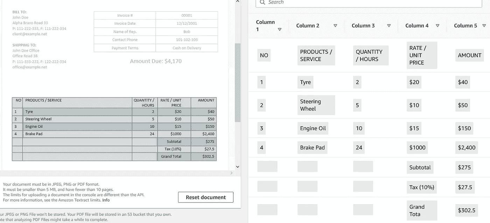
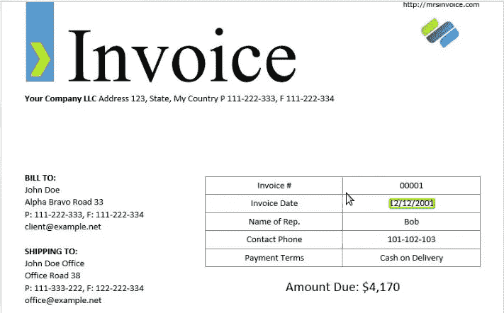

# 比较 Amazon Textract 和 tesserract OCR—OCR 和 NLP 用例

> 原文：<https://towardsdatascience.com/compare-amazon-textract-with-tesseract-ocr-ocr-nlp-use-case-43ad7cd48748?source=collection_archive---------12----------------------->

## 用于光学字符识别(OCR)和自然语言处理的两种已知引擎的比较


图片由[菲利克斯·沃尔夫](https://pixabay.com/users/felix_w-6547745/?utm_source=link-attribution&utm_medium=referral&utm_campaign=image&utm_content=3089857)从[皮克斯拜](https://pixabay.com/?utm_source=link-attribution&utm_medium=referral&utm_campaign=image&utm_content=3089857)拍摄

OCR 到底是什么，为什么这么热门？人工智能(AI)使具有人类智能(us)的实体能够大规模处理数据——更快、更便宜。毫无疑问，很大一部分数据是以数字形式保存的，易于阅读和分析。然而，有很大一部分数据存储在物理文档中，既有打字的也有手写的。如何分析这类数据？这就是引人入胜的光学字符识别(OCR)技术的用武之地。使用 OCR，您可以将文档转换为适合编辑和搜索的文本格式的数据。这就是 OCR 能够做到的。



图片由 [Gerd Altmann](https://pixabay.com/users/geralt-9301/?utm_source=link-attribution&utm_medium=referral&utm_campaign=image&utm_content=1754932) 从 [Pixabay](https://pixabay.com/?utm_source=link-attribution&utm_medium=referral&utm_campaign=image&utm_content=1754932) 拍摄

在本文中，我们将关注两个众所周知的 OCR 框架:

1.  Tesseract OCR —在 Apache 许可下发布的自由软件，版本 2.0——自 2006 年以来一直由谷歌赞助开发。
2.  **Amazon Textract OCR —** 来自 Amazon 的完全托管服务，使用机器学习来自动提取文本和数据

我们将比较这两个框架的 OCR 能力。让我们从一个简单的图像开始，如下图所示:



作者图片—typewritten.jpg

```
$ git clone https://github.com/mkukreja1/blogs.git
```

下载并安装笔记本 **blogs/ocr/OCR.ipynb**

```
!pip install opencv-python
!pip install pytesseract
!pip install pyenchantimport cv2
import pytesseract
import re
from pytesseract import Outputimg_typewritten = cv2.imread('typewritten.jpg')
custom_config = r'--oem 3 --psm 6'
txt_typewritten=pytesseract.image_to_string(img_typewritten, config=custom_config)
print(txt_typewritten)
```

使用**镶嵌 OCR 的 OCR 输出**:

最佳影片福特 V 法拉利
爱尔兰人
乔乔兔子
小丑
小女人
婚姻故事
1917
从前……在好莱坞
寄生虫

使用 **Amazon Textract OCR** 的 OCR 输出:



两个框架的表现完全相同。让我们看看手写文本是如何比较的。



作者图片—handwritten.jpg

```
img_handwritten = cv2.imread('handwritten.jpg')
txt_handwritten=pytesseract.image_to_string(img_handwritten)
print(txt_handwritten)
```

使用**镶嵌 OCR 的 OCR 输出**:

<>

疮

&&.一)
哎哟！NS ané
Lp 房地产集团

大使 ATH。远离|房地产
洛美服务

我很高兴今天能和我见面，我也很高兴听到我的声音。再见
AA aiv Go|干杯|

梅根·欧文斯，房产经纪人 402–689–4984[www。ForSalebyMegan](http://www.ForSalebyMegan) 。

多媒体短信服务

com

使用 **Amazon Textract OCR** 的 OCR 输出:



作者图片

对于手写文本，亚马逊 Textract OCR 的表现略好于 **Tesseract OCR** 。

现在我们将尝试一个繁忙的图像。



作者图片—invoice-sample.jpg

```
img_invoice = cv2.imread('invoice-sample.jpg')
custom_config = r'--oem 3 --psm 6'
txt_invoice=pytesseract.image_to_string(img_invoice, config=custom_config)
print(txt_invoice)
```

使用**镶嵌 OCR 的 OCR 输出**:

[http://mrsinvoice.com](http://mrsinvoice.com)i7
贵公司 LLC 地址 123，州，我的国家 P 111–222–333，F 111–222–334
收单人:
P:111–222–333，F:111–222–334 a . z
cient @ eromplent
联系电话 101–102–103
f:122–222–334 应付金额:4170 美元
[office@example.net](mailto:office@example.net)
无产品/服务数量/费率/单位金额
小时:价格
1 赞成 2 20 美元 40 美元
2 |方向盘 5 10 美元 50 美元
3 |机油 10 美元 15 美元 150 美元
4 |刹车片 24 美元 1000 美元 2400 美元
小计 20 美元

使用 **Amazon Textract OCR** 的 OCR 输出:



作者图片

**亚马逊 Textract** 识别文档中的表格和表单。这是*整齐的*。



作者图片

# 高级功能—拼写检查

OCR 扫描的结果通常被输入到 NLP 模型中。因此，结果文本的高度准确性非常重要。我们可以用两种方式处理:

通过拼写检查模块像**附魔**传递每一个作品

**选项 1** —如果拼写检查失败—从结果文本中屏蔽/删除该单词

**选项 2**——如果拼写检查失败——使用拼写检查建议并编辑结果文本

Python 中经常使用 Enchant 模块来根据字典检查单词的拼写。除了拼写检查之外，enchant 还可以给出纠正单词的建议。

```
img = cv2.imread('invoice-sample.jpg')
text = pytesseract.image_to_data(img, output_type='data.frame')
text = text[text.conf != -1]
lines = text.groupby('block_num')['text'].apply(list)
print(lines[25])
```

[**‘‘感谢’**，‘你’，‘为’，‘你的’，‘生意。]

请注意，第一个单词似乎有拼写问题。

```
import enchant
dict_check = enchant.Dict("en_US")for word in lines[25]:
    if (dict_check.check(word)):
        print(word+ ' - Dictionary Check Valid')
    else:
        print(word+ ' - Dictionary Check Valid Invalid')
        print('Valid Suggestions')
        print(dict_check.suggest(word))
```

**【感谢—字典检查有效无效
有效建议
【感谢】**
你—字典检查有效
为—字典检查有效
你—字典检查有效
业务。—字典检查有效

请注意，enchant 发现第一个单词无效，并能够提供替代建议。

## 为 NLP 使用正则表达式

我在 IT 行业的早期(大约 25 年前)充满了起起落落。有一天，我会学到一些新的东西，感觉自己站在世界之巅。其他日子就没那么多了。我记得有一天，我的经理让我解决一个模式匹配问题。我必须在 Oracle 中对数据进行模式匹配。因为我以前从来没有这样做过，所以我请求他指点一下。我得到的答案是*“使用 REGEX 可以非常容易地做到这一点”。*我是一个很好的追随者，除了使用正则表达式模式匹配并不容易。我过了一会儿才意识到我的经理是在开玩笑。

我仍然害怕使用正则表达式，但无法逃避它…..它仍然广泛应用于数据科学，尤其是 NLP。学习正则表达式需要时间。我经常使用像 https://regex101.com/[这样的网站进行练习。](https://regex101.com/)

例如，如果您想从文档中提取所有日期字段。

```
d = pytesseract.image_to_data(img, output_type=Output.DICT)
keys = list(d.keys())date_pattern = '^(0[1-9]|[12][0-9]|3[01])/(0[1-9]|1[012])/(19|20)\d\d$'n_boxes = len(d['text'])
for i in range(n_boxes):
    if int(d['conf'][i]) > 60:
        if re.match(date_pattern, d['text'][i]):
            (x, y, w, h) = (d['left'][i], d['top'][i], d['width'][i], d['height'][i])
            img_date = cv2.rectangle(img, (x, y), (x + w, y + h), (0, 255, 0), 2)
            print(d['text'][i])
```

产出:2001 年 12 月 12 日

您甚至可以突出显示给定文档中的日期字段

```
cv2.imwrite('aimg_date.png', img_date)
```



作者图片

我希望这篇文章有助于启动您的 OCR 和 NLP 知识。像这样的主题是由 [Datafence 云学院](http://www.datafence.com)提供的 AWS 大数据分析课程的一部分。课程是周末自己在网上教的。