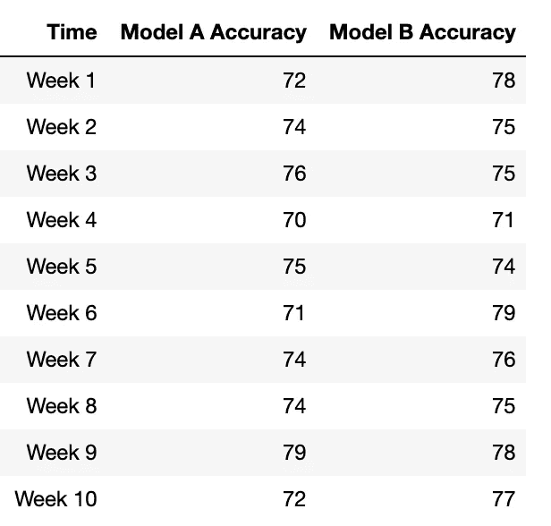
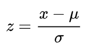
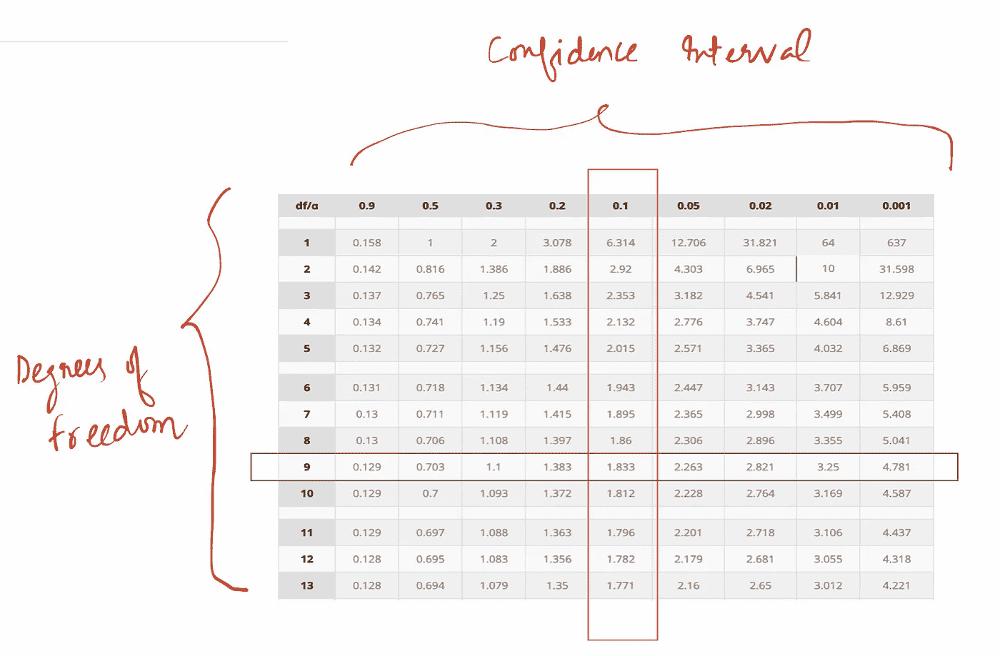
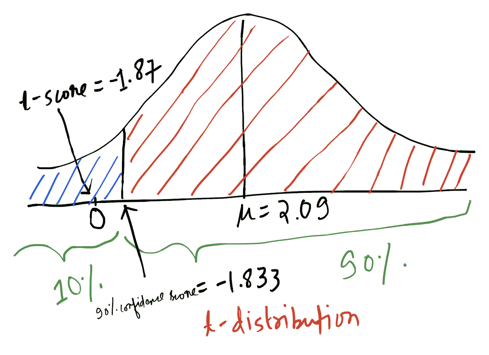

# 比较哪种机器学习模型性能更好

> 原文：<https://towardsdatascience.com/compare-which-machine-learning-model-performs-better-4912b2ed597d?source=collection_archive---------17----------------------->

## 自信地比较机器学习模型

[图像来源](https://images.unsplash.com/photo-1518644730709-0835105d9daa?ixlib=rb-1.2.1&ixid=eyJhcHBfaWQiOjEyMDd9&auto=format&fit=crop&w=1650&q=80)

一旦您理解了要解决的业务问题并确定了可用的数据集，您是否曾经对使用哪种机器学习技术感到困惑？

说真的，有这么多机器学习技术可用:线性模型，如逻辑回归，非线性模型，如基于树的，神经网络，支持向量机，在线和强化学习，贝叶斯模型，图形模型等。即使我们能够决定一个，也有大量的特征工程是可能的，这使得一个模型与其他模型非常不同。有一些可用的集成技术试图结合所有世界(模型)的精华，但它们是有成本的。这里的成本可能是时间、精力和把事情复杂化。一个好的机器学习建模者总是喜欢保持事情简单。

***这个帖子是关于如何在高置信度的机器学习模型之间进行比较***

# 方案

假设我们建立了两个机器学习模型，模型‘A’和模型‘B’。这两个模型都在验证集上进行了适当的训练和测试。现在，企业想知道哪种模式性能更好，因为在计算和时间方面资源有限。

> 经理给你分配了这个任务，挑选置信度较高的更好模型，**假设置信度为 90%或** [**显著性水平**](https://en.wikipedia.org/wiki/Statistical_significance) **(α=0.10)** 。或者报告，如果很难宣布一个明确的赢家，集合似乎是唯一的办法。你的策略是什么？

# 战略

模型每周都会生成值。我们有 10 周的时间来得出结论。我们开始注意模型预测的准确性和未来 10 周的实际情况。下表总结了这两种模型的准确性得分。

模型在 10 周时间内的准确性

设μ表示[均值](https://en.wikipedia.org/wiki/Mean)σ表示[方差](https://en.wikipedia.org/wiki/Variance)。

μ(A) = 73.70，σ(A)= 6.90[[RV](https://en.wikipedia.org/wiki/Random_variable)A】的均值和方差]]

μ(B) = 75.80，σ(B)= 5.51[[RV](https://en.wikipedia.org/wiki/Random_variable)B 的均值和方差]]

从两个[随机变量](https://en.wikipedia.org/wiki/Random_variable)的平均值和标准偏差来看，似乎模型‘B’表现更好。 ***但是我们有多大的信心或把握呢？***

# 创建假设检验框架

让我们首先定义无效假设和替代假设。

*   ***H₀:“两款车型表现同样出色。”***
*   ***h₁:“b 型表现更好。”***

## 继续之前快速复习一下概念(可选)

*   中心极限定理:抽样分布的样本均值，给定我们取足够的样本(n ≥ 30)，无论总体遵循什么分布，都将具有正态分布。

> 此外，对于采样分布
> 
> μ(X̄) = μ(X)和σ(X̄) = σ(X)/√n
> 
> 这里，x 是表示总体的随机变量，X̄表示抽样分布，μ表示平均值和σ标准差(√方差)

*   Z-Score/Z-statistics:
    “Z-Score 是一种数值度量，用于统计一个值与一组值的平均值(平均值)之间的关系，根据平均值的标准偏差进行测量。如果 Z 分数为 0，则表明数据点的分数等于平均分数。Z 值为 1.0 表示该值是平均值的一个标准差。z 分数可以是正值，也可以是负值，正值表示分数高于平均值，负值表示分数低于平均值。(此处抄袭[此处](https://www.investopedia.com/terms/z/zscore.asp))

> 一旦我们有了 Z 分数，我们就可以查看 [Z 表](http://www.z-table.com/)并对事件的发生赋予正确的置信度。

z 分数计算公式

*   T-score/T-statistics/T-distribution
    “T 分布，又称学生 T 分布，是一种概率分布类型，类似于正态分布，具有钟形，但尾部较重。t 分布比正态分布出现极值的机会更大，因此尾部更厚。”(从这里复制)

> t-score 的公式与 z-score 类似，不同之处在于，它在样本量< 30.

*   [增加随机变量](http://www.milefoot.com/math/stat/rv-sums.htm)时使用

> 对于任意两个随机变量 X 和 Y，这些变量之和的期望值将等于它们的期望值之和。
> **E(X+Y)=E(X)+E(Y)**
> 
> 对于任意两个随机变量 X 和 Y，这些变量之和的方差等于方差之和加上协方差的两倍。
> **Var(X+Y)= Var(X)+Var(Y)+2Cov(X，Y)**
> 
> 如果 X 和 Y 是独立的，那么
> **Var(X+Y)= Var(X)+Var(Y)**

# 回到真正的问题

我们创建了假设框架

H₀ =这两种型号的表现一样好。

H₁ =模型的表现不一样(模型 b 表现更好)。

E(B-A)= E(B)-E(A)=μ(B)-μ(A)= 2.09

Var(B-A)= Var(A)+Var(B)=σ(A)+σ(B)= 12.41

对于，H₀为真，E(B-A)应该为 0

使用 CLT，我们可以计算抽样分布的样本均值的 t 得分，即它为 0 的可能性有多大。

t 得分= 0-E(B-A)/√(Var(B-A)/n)

这里 n = 10，E(B-A) = 2.09，Var(B-A)= 12.41

**t-score =-2.09/√( 12.41/10)=-1.87，自由度= 10-1 = 9**

*   自由度总是 n-1。(为什么？[参考此](https://blog.minitab.com/blog/statistics-and-quality-data-analysis/what-are-degrees-of-freedom-in-statistics)

接下来，我们可以看看 t 表。为了达到 90%的置信度或[显著性水平](https://en.wikipedia.org/wiki/Statistical_significance) (α=0.10)，即两个模型在自由度= 9 的情况下表现相同，我们的 t 得分应≥ -1.833。但是，事实并非如此，t 值为-1.87 ( < -1.833)

[t 表](http://www.sthda.com/english/wiki/t-distribution-table)(单侧)和 90%置信度 t 分数值

t 分布，90%的置信度得分和我们的 t 分布得分

我们有 90%以上的把握 0 不在这个区间内下跌。换句话说，在 90%的置信度下，模型 B 和模型 A 的平均准确度之差大于 0。因此，我们拒绝零假设，并赞成替代假设。

# 结论

我们可以通知经理和企业，我们已经从统计上发现 B 型比 A 型表现得更好，因此我们可以继续生产 B 型。

在这里，我们证明了模型 B 优于 A，但如果让我们以 90%的置信度证明模型 B 至少比 A 好 2%，你的策略会是什么？你会在假设框架上做哪些改变？请评论您的想法:)

***我的 Youtube 频道获取更多内容:***

 [## 阿布舍克·蒙戈利

### 嗨，伙计们，欢迎来到频道。该频道旨在涵盖各种主题，从机器学习，数据科学…

www.youtube.com](https://www.youtube.com/channel/UCg0PxC9ThQrbD9nM_FU1vWA) 

> **关于作者-:**
> 
> Abhishek Mungoli 是一位经验丰富的数据科学家，拥有 ML 领域的经验和计算机科学背景，跨越多个领域并具有解决问题的思维方式。擅长各种机器学习和零售业特有的优化问题。热衷于大规模实现机器学习模型，并通过博客、讲座、聚会和论文等方式分享知识。
> 
> 我的动机总是把最困难的事情简化成最简单的版本。我喜欢解决问题、数据科学、产品开发和扩展解决方案。我喜欢在闲暇时间探索新的地方和健身。在 [**中**](https://medium.com/@mungoliabhishek81) 、**[**Linkedin**](https://www.linkedin.com/in/abhishek-mungoli-39048355/)**或**[**insta gram**](https://www.instagram.com/simplyspartanx/)**关注我，查看我[以前的帖子](https://medium.com/@mungoliabhishek81)。我欢迎反馈和建设性的批评。我的一些博客-********

*   ******[以简单&直观的方式分解时间序列](/decomposing-a-time-series-in-a-simple-and-intuitive-way-19d3213c420b?source=---------7------------------)******
*   ******[GPU 计算如何在工作中真正拯救了我？](https://medium.com/walmartlabs/how-gpu-computing-literally-saved-me-at-work-fc1dc70f48b6)******
*   ******信息论& KL 分歧[第一部分](/part-i-a-new-tool-to-your-toolkit-kl-divergence-5b887b5b420e)和[第二部分](/part-2-a-new-tool-to-your-toolkit-kl-divergence-736c134baa3d)******
*   ******[使用 Apache Spark 处理维基百科，创建热点数据集](/process-wikipedia-using-apache-spark-to-create-spicy-hot-datasets-1a59720e6e25)******
*   ******[基于半监督嵌入的模糊聚类](/a-semi-supervised-embedding-based-fuzzy-clustering-b2023c0fde7c)******