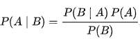
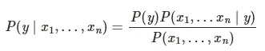
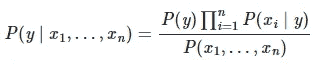
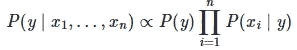
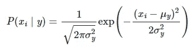
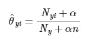
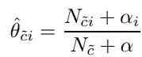
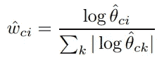
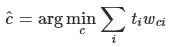
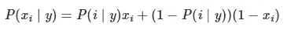

# 比较各种朴素贝叶斯分类算法

> 原文：<https://towardsdatascience.com/comparing-a-variety-of-naive-bayes-classification-algorithms-fc5fa298379e?source=collection_archive---------6----------------------->

## 数据科学模型

## 文本分类公式的综合列表


在 [Unsplash](https://unsplash.com?utm_source=medium&utm_medium=referral) 上 [Leone Venter](https://unsplash.com/@fempreneurstyledstock?utm_source=medium&utm_medium=referral) 拍摄的照片

N aive Bayes 算法是著名的监督分类算法之一。它基于[贝叶斯定理](https://en.wikipedia.org/wiki/Bayes%27_theorem)，速度非常快，对于文本分类来说足够好。我认为没有必要描述[背后的理论](https://en.wikipedia.org/wiki/Naive_Bayes_classifier)，尽管如此，我们将介绍一些概念，然后将重点放在不同实现的比较上。

# 1.概念

首先，我们采用贝叶斯公式本身:



这是什么意思？既然可能会混淆，我们就换个眼神。我们将从垃圾邮件的角度讨论事件的类别。所以现在我们有两类事件:垃圾邮件和非垃圾邮件。

让我们将 A 改为收到垃圾邮件的事件( **y** )，将 B 改为由一组单词(x1，x2，…)组成的消息。所以:



现在更明显了:包含单词(x1，x2，…)的消息是垃圾邮件的概率等于收到垃圾邮件的一般概率，乘以垃圾邮件包含上述单词的概率，再除以任何传入消息包含给定单词的概率。

朴素贝叶斯定理说，集合(x1，x2，…)中所有事件的概率可以被视为独立的，所以:



这仍然是一个有点复杂的公式，但我们可以简化它。显然，我们需要计算邮件是垃圾邮件的概率和邮件不是垃圾邮件的概率。因为我们需要比较这两个值，而且它们在同一个字段中，并且具有相同的除法器( **P(x1，x2，…)** )，所以我们只能使用分子:



我们可以从分布中找到从数据集获取垃圾邮件的一般概率。所以，主要的问题是找到每个单词出现在垃圾消息中的条件概率( **P(xi | y)** )。这几乎是朴素贝叶斯算法实现之间的唯一区别。

# 2.履行

我已经从头开始构建了一个算法的实现:

[](/how-to-build-and-apply-naive-bayes-classification-for-spam-filtering-2b8d3308501) [## 如何建立和应用朴素贝叶斯分类进行垃圾邮件过滤

### 有效模型的简单实现

towardsdatascience.com](/how-to-build-and-apply-naive-bayes-classification-for-spam-filtering-2b8d3308501) 

不过，现在让我们研究一下 [sklearn 库](https://scikit-learn.org/stable/modules/naive_bayes.html)的能力。出于我们的目的，我们将使用 Tiago A. Almeida 和 José María Gómez Hidalgo 收集的短信。它是免费的，可以从[UCI 机器学习库](https://archive.ics.uci.edu/ml/datasets/sms+spam+collection)下载。它包含 5572 条不同消息的记录以及 747 条垃圾消息。


我们将每条信息拆分成一组单词，并对标签进行编码。之后，我们将数据集分为训练和测试部分。

下一步是最重要的:我们将训练部分转向词汇，并计算每个消息中每个词汇的重复次数(在训练和测试部分):

现在数据集已经为模型创建做好了准备。

## 2.1.高斯朴素贝叶斯

这种方法建立在概率正态分布的假设上。也就是说，垃圾邮件和非垃圾邮件类别的消息中，词汇的出现频率符合高斯定律:



该公式基于消息类中每个词的频率的平均值( **μ** 和贝塞尔校正方差( **σ** )。

```
cl_gauss = **sklearn**.naive_bayes.**GaussianNB**()
res_gauss = cl_gauss.fit(X_train_voc, y_train).predict(X_test_voc)
metrics.accuracy_score(y_test, res_gauss) * 100
```

结果是模型精度 **91.03%** 。这已经足够好了，但是说明了单词并不完全是高斯分布。

## 2.2.多项式朴素贝叶斯

多项式分类最适合离散值，如字数。所以我们希望它能表现出最好的准确性。在这种情况下，每个事件的概率分布基于以下公式:



**Ny** 是事件的特征总数 **y** (所有垃圾短信中的总字数) **Nyi** —每个特征的计数(一个词在所有垃圾短信中重复的汇总数) **n** —特征数(词汇中的字数) **α** 是一个平滑拉普拉斯参数，用于丢弃词汇中不存在的词的影响。同样的公式也适用于非垃圾邮件消息集。

```
cl_multi = **sklearn**.naive_bayes.**MultinomialNB**()
res_multi = cl_multi.fit(X_train_voc, y_train).predict(X_test_voc)
metrics.accuracy_score(y_test, res_multi) * 100
```

模型精度 **99.19%** ，是(剧透)包括定制款在内的测试模型中最高的。

## 2.3.互补朴素贝叶斯

这种方法几乎与多项式相同，尽管现在我们计算一个单词在该类补集中的出现次数。例如，对于垃圾邮件，我们将计算每个单词在所有非垃圾邮件中的重复次数:



Nc —相反类别中的总字数(对于垃圾邮件参数—非垃圾邮件字数)，Nci —相反类别中某个单词的重复次数(对于垃圾邮件中的某个单词—在所有非垃圾邮件中的重复次数)。我们也使用相同的平滑参数。计算基本值后，我们开始处理实际参数:



它是 k 个单词的消息中每个单词的权重。最终决策由以下公式计算得出:



因此，分类结果是邮件中每个单词的权重之和的最小值。

```
cl_compl = **sklearn**.naive_bayes.**ComplementNB**()
res_compl = cl_compl.fit(X_train_voc, y_train).predict(X_test_voc)
metrics.accuracy_score(y_test, res_compl) * 100
```

我们得到了 98.12%的正确预测，这是一个非常高的结果。

## 2.4.伯努利朴素贝叶斯

伯努利公式接近于多项式公式，尽管输入是一组布尔值(该词是否出现在消息中)而不是一组频率。



因此，该算法明确地惩罚特征的不出现(消息中的单词在词汇表中不存在)，而多项式方法对不存在的值使用平滑参数。`sklearn`伯努利算法将输入值二进制化，因此无需额外操作。

```
cl_bern = **sklearn**.naive_bayes.**BernoulliNB**()
res_bern = cl_bern.fit(X_train_voc, y_train).predict(X_test_voc)
metrics.accuracy_score(y_test, res_bern) * 100
```

我们已经得到了 **98.30%** 的正确预测

## 2.5.分类朴素贝叶斯

分类朴素贝叶斯适用于分类值-无论示例是否具有特征集。在我们的例子中，这意味着词汇表被视为一组特征，而一个单词在消息中的出现被视为与该特征的匹配。所有公式都与多项式方法相同，只是出现次数不同于重复次数。

由于算法需要分类值，我们将单词的频率转换为单词的存在:1-消息包含该单词，0-该单词不在消息中。

```
X_train_voc_cat= X_train_voc.applymap(**lambda** el: 1 **if** el > 0 **else** 0)
X_test_voc_cat = X_test_voc.applymap(**lambda** el: 1 **if** el > 0 **else** 0)
```

现在，我们将模型应用于更新的数据集:

```
cl_cat = **sklearn**.naive_bayes.**CategoricalNB**()
res_cat=cl_cat.fit(X_train_voc_cat,y_train).predict(X_test_voc_cat)
metrics.accuracy_score(y_test, res_cat) * 100
```

准确率相当高: **98.30%** 。

在本文中，我们熟悉了几种朴素贝叶斯算法，理解了它们背后的数学原理，并测试了公式。结果自说自话。您可以在我的 Github 上找到包含所有工作模式的 Jupyter 笔记本:

[](https://github.com/Midvel/medium_jupyter_notes/blob/master/scikit_bayes/scikit-bayes.ipynb) [## 中级/中等 _jupyter_notes

### permalink dissolve GitHub 是 4000 多万开发人员的家园，他们一起工作来托管和审查代码，管理…

github.com](https://github.com/Midvel/medium_jupyter_notes/blob/master/scikit_bayes/scikit-bayes.ipynb) 

此外，看看一个自定义算法的实现，从头开始，没有任何带模型的库:

[](/how-to-build-and-apply-naive-bayes-classification-for-spam-filtering-2b8d3308501) [## 如何建立和应用朴素贝叶斯分类进行垃圾邮件过滤

### 有效模型的简单实现

towardsdatascience.com](/how-to-build-and-apply-naive-bayes-classification-for-spam-filtering-2b8d3308501)