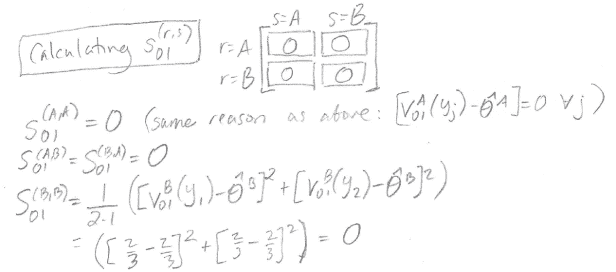

# 机器学习模型的 AUC 与德隆检验的比较

> 原文：<https://towardsdatascience.com/comparing-aucs-of-machine-learning-models-with-delongs-test-21a88bed9a56?source=collection_archive---------40----------------------->

根据卡洛斯·德尔加多的照片修改。此处有原始照片[。](https://en.wikipedia.org/wiki/File:Neophron_percnopterus_-_01.jpg)

你有没有想过如何证明一个机器学习模型的测试集性能与另一个模型的测试集性能有显著差异？本文将描述如何使用 DeLong 检验来获得一个模型的 AUC 是否与另一个模型有显著差异的 p 值，其中 AUC 是指受试者操作特征下的面积。这篇文章包括一个手工计算的例子来说明德隆对一个小数据集测试的所有步骤。它还包括 DeLong 测试的一个示例 R 实现，以支持大型数据集上的高效计算。

德隆测试的一个用例:模型 A 预测心脏病风险，AUC 为 0.92，模型 B 预测心脏病风险，AUC 为 0.87，我们使用德隆测试证明模型 A 的 AUC 与模型 B 有显著差异，p < 0.05.

# **参考**

[伊丽莎白·雷·德隆](https://en.wikipedia.org/wiki/Elizabeth_DeLong)是杜克大学的统计学家和教授。1988 年，她发表了一项测试，以确定两个模型的 AUC 在统计学上是否有显著差异。这个测试被称为“德隆测试”

这篇文章的主要参考资料是:

*   Elizabeth DeLong 等人，“比较两条或多条相关接收机工作特性曲线下的面积:一种非参数方法。”生物统计学 1988 年。
*   [孙旭等人，“德龙算法的快速实现，用于比较相关接收机工作特性曲线下的面积。”IEEE 信号处理快报 2014。](https://ieeexplore.ieee.org/document/6851192)

方便的是，两篇论文都使用了相似的符号，这也是我们将在本文中使用的符号。

# **灵敏度和特异性的定义**

为了理解德隆的测试是如何工作的，我们需要从一些符号开始。我们将通过用它来定义敏感性、特异性和 AUC 来习惯这种符号。

考虑这样一种情况，我们建立了一个模型来预测一个人是否患有疾病。我们对总共有 *N* 名患者的测试数据集进行预测，其中 *m* 名患者真正患病，而 *n* 名患者真正健康。我们的模型为第*位*患病患者产生预测概率 *X* ，为第*位*健康患者产生预测概率 *Y* :

使用这种符号，我们可以写出灵敏度和特异性的定义:

敏感度也称为回忆率或真实阳性率。它是被模型正确识别为阳性(患病)的真阳性(患病人)的比例。我们将特定决策阈值 *z* 下的灵敏度定义如下:

特异性也被称为真阴性率。是真阴性(健康人)被模型正确识别为阴性(健康)的比例。我们将特定决策阈值 *z* 下的特异性定义如下:

这意味着当我们改变决策阈值 *z* 时，我们将改变灵敏度和特异性。

# **AUC 的定义和经验 AUC 的计算**

受试者工作特性(ROC)提供了不同阈值 *z* 的灵敏度和特异性汇总。我们通过改变阈值 *z* 并在每个 *z* 值处绘制灵敏度对(1 —特异性)的曲线来构建 ROC 曲线。

ROC 曲线下的面积(或 AUC)提供了一个数字来总结模型在所有不同决策阈值下的表现。

在[的论文](https://www.jstor.org/stable/pdf/2531595.pdf?seq=1)中，DeLong 等人描述了一种方法，其中经验 AUC“通过对构成 ROC 曲线的连接点下方形成的梯形面积求和来计算”([参考](https://ncss-wpengine.netdna-ssl.com/wp-content/themes/ncss/pdf/Procedures/NCSS/Comparing_Two_ROC_Curves-Paired_Design.pdf))。

就上下文而言，DeLong 的经验 AUC 方法不同于二项式 AUC 方法。二项式 ROC 曲线是“基于对应于阳性条件的诊断测试分数和对应于阴性条件的分数均可由正态分布表示的假设”而构建的(“T18”参考)。

经验 AUC 方法比二项式 AUC 方法更受欢迎，因为经验 AUC 不依赖于二项式 AUC 所要求的强正态假设。

我们可以使用梯形规则计算经验 AUC(表示为“theta hat”)，如下所示:

AUC 的这一定义具有直观意义:

*   当 Y < X, this means that the predicted disease probability of a healthy individual is less than the predicted disease probability of a sick individual, which is good: we want actually healthy people to have lower predicted disease risk than actually sick people. So, we reward the model for its good prediction and make a contribution to the model’s AUC of +1/mn.
*   When Y = X, this means that the predicted disease probability of a healthy individual is equal to the predicted disease probability of a sick individual, which isn’t awesome but isn’t horrible, so we make a contribution to the model’s AUC of (+1/2)/mn.
*   When Y > X 时，这意味着健康个体的预测疾病概率大于患病个体的预测疾病概率，这是不好的:该模型认为实际健康的人比实际患病的人具有更高的疾病风险。在这里，我们不对模型的 AUC 添加任何东西(+0)。

函数 psi(X，Y)也称为[heav iside 函数(具有半最大值约定)。](https://en.wikipedia.org/wiki/Heaviside_step_function)

关于敏感性、特异性以及如何构建 ROC 曲线的更多背景信息，请参见[这篇文章](https://glassboxmedicine.com/2019/02/23/measuring-performance-auc-auroc/)。

# **AUC 和 Mann-Whitney 统计之间的联系**

在[之前的一篇文章](https://glassboxmedicine.com/2019/02/23/measuring-performance-auc-auroc/)中，我描述了 AUC 如下:

> AUROC 告诉您您的模型是否能够正确地对示例进行排序:对于临床风险预测模型，AUROC 告诉您随机选择的经历了某个事件的患者比随机选择的未经历该事件的患者具有更高的预测风险评分的概率。

事实证明，这个定义是正确的，因为经验 AUC 等于 Mann-Whitney U 统计量。引用德隆等人的话，

> *当使用梯形法则计算时，包含经验 ROC 曲线的点下的面积等于比较两个样本值分布的 Mann-Whitney U 统计量。[……]Mann-Whitney 统计估计从 C2[健康人]代表的人群中随机选择的观察值小于或等于从 C1[病人]代表的人群中随机选择的观察值的概率θ。*

用另一种方式表述同一观点，[维基百科](https://en.wikipedia.org/wiki/Mann%E2%80%93Whitney_U_test)将曼-惠特尼 U 检验描述为:

> 零假设的非参数检验，即从一个总体中随机选择的值小于或大于从第二个总体中随机选择的值的可能性相等。

因此，总结一下，

请注意:

# **比较两种模型 AUC 的德隆试验**

## **示例设置**

既然我们已经完成了经验 AUC 和所有符号的定义，我们可以继续描述德隆检验如何确定一个模型是否具有与另一个模型在统计上显著不同的 AUC。

这是一个玩具测试集，由五名患者组成，预测来自两个模型。我们将在工作示例中使用这个玩具测试集:

该数据集包括两名真正健康的患者和三名真正患病的患者，他们的健康状况是以某种明确的方式确定的，因此我们可以将其视为“基本事实”模型 A 的列显示了根据模型 A 预测的所有患者的疾病概率。按照前面介绍的符号，这些预测概率由健康患者的 a *Y* 和患病患者的 *X* 表示。模型 B 的列显示了根据模型 B 预测的所有患者的疾病概率

请注意，模型 A 是一个具有完美 AUC 的分类器(稍后将明确演示)，因为所有健康患者的患病概率都低于所有患病患者。模型 B 没有完美的 AUC。

根据论文的注释，正在考虑的模型总数是 1 <= r <= k where k = 2 (because we are only considering 2 models here.) n = 2 (the number of healthy patients) and m = 3 (the number of sick patients.)

## **德隆测试的目标**

我们想知道就 AUC 而言，模型 A 还是模型 B 更好，其中θ-hat(A)是模型 A 的 AUC，θ-hat(B)是模型 B 的 AUC。为了回答这个问题，我们将计算一个 *z* 分数:

引用孙等人的话，

> *在零假设下，* z *可以很好的近似为标准正态分布。因此，如果* z *的值偏离零太多，例如*z*1.96，则认为显著性水平 p <为 0.05 的[theta(A) > theta(B)]是合理的。*

换句话说，如果 *z* 偏离零太多，那么我们可以得出结论，模型 A 与 p <为 0.05 的模型 B 具有统计上不同的 AUC。

为了找到 *z* 分数，我们需要计算经验 AUC、方差 V 和协方差 c。以下部分将展示如何计算这些量。

(旁注:此处“z 得分”中“z”的使用与前面讨论“z 作为决策阈值”中“z”的使用完全无关。)

## **计算模型 A 和模型 B 的经验 AUC**

根据前面提供的经验 AUC 的定义，我们计算模型 A 的经验 AUC:

类似地，我们计算模型 B 的经验 AUC:

注意，模型 A 的 AUC 为 1.0，因为它完美地将所有患病患者归类为比所有健康患者具有更高的患病概率。模型 B 的 AUC 为 2/3，因为它不能完美地对所有患者进行排序。

## **结构部件 V10 和 V01**

德龙测试需要的下一步是计算 V10 和 V01，它们被孙等人称为“结构组件”。

V10 和 V01 将帮助我们找到计算 *z* 分数所需的方差和协方差。V10 和 V01 定义如下:

回想一下,“r”代表我们正在考虑的型号，因此我们对 r = A(型号 A)和 r = B(型号 B)有不同的结构组件计算。

对于我们的小示例数据集，模型 A 和 B 的结构组件计算如下:

## **矩阵 S10 和 S01**

接下来，我们将使用结构成分 V10 和 V01，结合我们的经验 AUC，来计算矩阵 S10 和 S01，其定义如下:

矩阵 S10 和 S01 是 k×k 矩阵，其中 k 是我们正在考虑的模型总数。因为我们只考虑两个模型(模型 A 和模型 B ),所以每个矩阵都是 2 x 2。

以下是矩阵 S10 中条目的计算:

结果，对于矩阵 S10，除了(B，B)项之外，所有的项都是零。

以下是矩阵 S01 中条目的计算:

矩阵 S01 以该特定示例的所有零条目结束。

## **计算方差和协方差**

现在，我们将使用 S10 和 S01 来获得矩阵 S，其中矩阵 S 包含我们需要的方差和协方差，以便获得德隆测试的 z 分数。我们所要做的就是将 S10 和 S01 相加，分别基于 1/ m=3(患病人数)和 1/ n=2(健康人数)进行加权:

从上面的计算中可以看出，我们最终的 S 矩阵包含模型 A 的经验 AUC 方差、模型 B 的经验 AUC 方差以及模型 A 和 B 的 AUC 协方差。这些是我们获得 *z* 分数所需的关键量。

## **Z 分数的计算**

为了计算 *z* 得分，我们插入刚刚计算的经验 AUC、方差和协方差的值:

## **使用 Z 分数获得 P 值**

我们算出来的 *z* 分数是 1。我们如何由此获得 p 值？

我们正在进行[“双尾检验”](http://sphweb.bumc.bu.edu/otlt/MPH-Modules/BS/BS704_HypothesisTest-Means-Proportions/BS704_HypothesisTest-Means-Proportions3.html)，因为我们试图宣称模型 A 的 AUC 不同于(“不等于”)模型 b 的 AUC。

我们可以使用[一个 z 统计量的双尾 P 值的查找表](https://www.sjsu.edu/faculty/gerstman/StatPrimer/z-two-tails.pdf)。在表中，在“十分之一”(垂直)下我们定位为 1.0，在“百分之一”(水平)下我们定位为 0.00，因为我们的 Z 值是 1.00。表中这个位置的条目是 0.31731，这是我们的 p 值。

或者，为了避免在一大堆数字中搜索，我们可以使用[像这样的在线计算器](https://www.socscistatistics.com/pvalues/normaldistribution.aspx)。我们需要选择“双尾假设”并输入我们的 *z* 得分 1，这将产生 p 值 0.317311(与我们从查找表中得到的结果一致。)

# **计算 R 中的德龙测试**

手工计算对于微小的玩具数据集来说很好，但对于任何真实的数据集，我们都希望使用软件来计算德龙的测试。一种选择是使用 r 中的 [pROC 包](https://cran.r-project.org/web/packages/pROC/pROC.pdf)。

使用 pROC 包，我们首先使用 [roc 函数](https://www.rdocumentation.org/packages/pROC/versions/1.16.1/topics/roc)创建两条 ROC 曲线进行比较。roc 函数可以作为 roc(响应，预测值)在“响应”(基本事实)和“预测值”(预测概率)上调用。

对于我们的模型 A 和模型 B 示例，我们有:

*   响应
*   modela
*   modelb
*   roca
*   rocb

Now that we have built our ROC curves, we can apply the [pROC roc.test 函数](https://www.rdocumentation.org/packages/pROC/versions/1.16.1/topics/roc.test)比较两条 ROC 曲线的 AUC。

输出:

两条相关 ROC 曲线的德隆检验

数据:roca 和 rocb
Z = 1，p 值= 0.3173
替代假设:AUC 的真实差异不等于 0
样本估计:
roc 1 的 AUC roc 2 的 AUC
1.0000000 0.666667

这与我们上面手动获得的结果相匹配。

## **R 中德隆测试的另一个例子**

下面是德隆在 R 中的测试的另一个例子，显示了当使用不同的基本事实和预测概率时，结果是如何不同的:

响应 modela < -c(0.1，0.2，0.05，0.3，0.1，0.6，0.6，0.7，0.8，0.99，0.8，0.67，0.5)
modelb < -c(0.3，0.6，0.2，0.1，0.1，0.9，0.23，0.7，0.9，0.4，0.77，

roc.test(roca，rocb，method=c("delong "))

两条相关 ROC 曲线的德隆检验

数据:roca 和 rocb
Z = 1.672，p 值= 0.09453
替代假设:AUC 的真实差异不等于 0
样本估计:
roc 1 的 AUC roc 2 的 AUC
0.9642857 0.7380952

# **总结**

*   德隆检验可用于显示两个模型的 AUC 在统计上显著不同。
*   ROC 曲线总结了不同决策阈值下的敏感性和(1-特异性)。AUC 是 ROC 曲线下的面积。
*   使用 ROC 曲线上的梯形规则计算经验 AUC。
*   德隆检验需要计算经验 AUC、AUC 方差和 AUC 协方差。
*   pROC 包中的 R 实现可以快速计算 DeLong 的测试。

## **关于特色图片**

特色图片是一只埃及秃鹰。最初的秃鹫照片是由 Carlos Delgado CC-BY-SA 拍摄的，可以在维基百科[这里](https://en.wikipedia.org/wiki/File:Neophron_percnopterus_-_01.jpg)找到。这篇文章中显示的照片已经被修改，以包括 AUC 图和与德隆测试相关的方程。修改后的照片在与原始照片相同的许可下分发。

*原载于 2020 年 2 月 4 日*[*http://glassboxmedicine.com*](https://glassboxmedicine.com/2020/02/04/comparing-aucs-of-machine-learning-models-with-delongs-test/)*。*