# 葡萄酒质量预测分类模型的比较

> 原文：<https://towardsdatascience.com/comparing-classification-models-for-wine-quality-prediction-6c5f26669a4f?source=collection_archive---------12----------------------->

## 选择监督机器学习模型预测葡萄酒质量的项目演练


Matthieu Joannon 在 [Unsplash](https://unsplash.com?utm_source=medium&utm_medium=referral) 上拍摄的照片

# 目录

1.  [简介](#c68e)
2.  [探索性分析](#4fb5)
3.  [数据预处理](#79c6)
4.  [验证和模型选择](#e4de)
5.  [结论](#51fc)

# *简介*

这是我的第一篇博文！由于我决定将职业从化学工程转向数据科学，所以我将自己置于一个持续的、永无止境的学习过程中，我决定以博客帖子的形式分享我在项目中所学到和应用的东西。

在这个项目中，我想比较几个分类算法来预测葡萄酒质量，得分在 0 到 10 之间。由于我更喜欢白葡萄酒而不是红葡萄酒，我决定通过使用来自 [UCI 机器学习库](http://archive.ics.uci.edu/ml/datasets/Wine+Quality)的 winequality-white.csv 数据来比较和选择一种算法，以找出是什么造就了一种好酒。该数据集中的属性包括:

*   固定酸度
*   挥发性酸度
*   柠檬酸
*   残糖
*   氯化物
*   游离二氧化硫
*   二氧化硫总量
*   密度
*   pH 值
*   硫酸盐化
*   酒精
*   质量

# 探索性分析

探索性数据分析是一个非常重要的步骤，有助于了解数据集是什么样的，以及我们需要做什么样的修改。我开始导入库和模块，并将我将使用的数据读入 pandas dataframe。

## 导入库和模块

```
import matplotlib.pyplot as plt
from scipy import stats
import seaborn as sns
import pandas as pd
import numpy as np
from sklearn import metrics
```

## **读取数据**

```
white_wines = pd.read_csv('winequality/winequality-white.csv')
```

## 理解数据

为了理解这些数据，我查看了前几行。它看起来很干净，但是它有 4898 行数据，仅仅通过查看来检查所有的行以确定数据是否有问题是不明智的。所以我将在下一步中立刻检查所有丢失的值。

```
print(white_wines.shape)
white_wines.head()
```

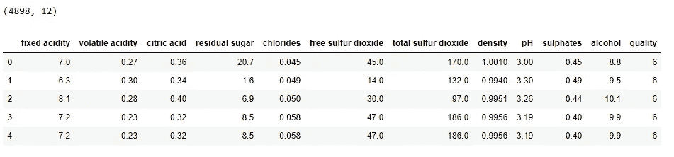

**检查缺失值**

数据中没有缺失值，因此可以进行分析，但在建模步骤之前，必须首先检测并消除异常值。

```
white_wines.isnull().any() fixed acidity           False
volatile acidity        False
citric acid             False
residual sugar          False
chlorides               False
free sulfur dioxide     False
total sulfur dioxide    False
density                 False
pH                      False
sulphates               False
alcohol                 False
quality                 False
dtype: bool
```

**检测异常值**

我应用了 df.describe()方法来了解数据集的描述性统计信息。对数据集中的问题有一个直观的了解是一个非常好的方法。快速浏览一下，我可以看到有一些异常值。

让我们看看‘残糖’一栏。 *count* 表示这一列有 4898 行。*表示*,*STD*分别表示该列的平均值和标准偏差值，其中 *25%* 小于 1.70， *75%* 小于 9.90。有趣的是，平均值为 6.39，最小值为 0.60，最大值为 65.80。它看起来像一个离群值。

```
white_wines.describe()
```

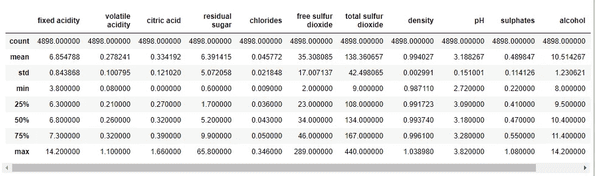

我使用箱线图来可视化“残余糖”列中的值的分布，以获得更好的洞察力。实际最大值约为 20，大于该值的值为异常值，因为它们不包括在观察范围内。

```
sns.boxplot(white_wines[‘residual sugar’])
```

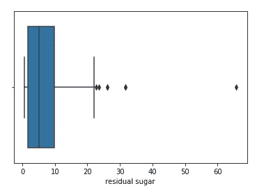

**使用 Z 值消除异常值**

大多数时候，删除离群值很重要，因为它们很可能会影响机器学习模型的性能。但是假设你的数据集有 30%是异常值。那么将它们全部移除可能是不明智的，因为可能有更多的问题需要进一步检查。为了找到并去除异常值，我使用了 z-score。

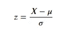

z 分数的数学公式

它的解释是取数据点或观察值，减去总体的平均值，然后除以标准差。它表示一个数据点距离平均值有多少标准差。离平均值太远的数据点被认为是异常值。在大多数情况下，异常值检测的阈值是 z 得分> 3 或 z 得分

```
z = np.abs(stats.zscore(white_wines))
white_wines = white_wines[(z < 3).all(axis=1)]
white_wines.shape(4487, 12)
```

**检查属性之间的相关性**

当我检查列之间的相关性时，我可以看到一些特性与质量有很强的相关性，而另一些则没有。

```
plt.subplots(figsize=(15, 10))
sns.heatmap(white_wines.corr(), annot = True, cmap = ‘coolwarm’)
```

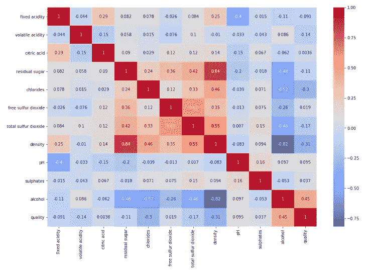

**检查班级不平衡**

作为探索性数据分析的最后一步，我想检查班级的不平衡。似乎存在着严重的阶级不平衡，少数阶级的代表性低于多数阶级。这将是后面步骤中建模的关键部分。

```
white_wines[‘quality’].value_counts()6    2038
5    1309
7     855
8     161
4     124
Name: quality, dtype: int64
```

# 数据预处理

在这一步的分析中，我定义了训练和测试机器学习模型的特征以及预测“质量”的目标。然后我对这些特征进行了标准化(也称为 z 分数标准化)，因为不同规模的特征可能会影响机器学习模型的性能。为此，我使用了 Scikit-learn 中定义的 StandardScaler()函数。最后，我将数据集分成 80%的训练集和 20%的测试集。

**定义特征和目标**

```
# Define features X
X = np.asarray(white_wines.iloc[:,:-1])# Define target y
y = np.asarray(white_wines[‘quality’])
```

**标准化数据集**

```
from sklearn import preprocessingX = preprocessing.StandardScaler().fit(X).transform(X)
```

**训练和测试集分离**

```
from sklearn.model_selection import train_test_splitX_train, X_test, y_train, y_test = train_test_split( X, y, test_size=0.2, random_state=0)
print (‘Train set:’, X_train.shape, y_train.shape)
print (‘Test set:’, X_test.shape, y_test.shape)Train set: (3589, 11) (3589,)
Test set: (898, 11) (898,)
```

# 验证和模型选择

在这一部分中，我训练了几种分类算法，以找到最适合我所使用的数据集的算法。

## k-最近邻

我从 K-最近邻分类算法开始。该算法所做的是获取一个数据点，并在训练数据中选择 K 个最接近该数据点的观察值，然后根据来自 K 个最近邻居的最受欢迎的响应值来预测该数据点的响应。

***KNN*精准剧情**

我画了一个图，看看精度是如何随着 k 的数量而变化的。

```
from sklearn.neighbors import KNeighborsClassifier
from sklearn.model_selection import cross_val_score# Number of k from 1 to 26
k_range = range(1, 26)k_scores = []# Calculate cross validation score for every k number from 1 to 26
for k in k_range:
 knn = KNeighborsClassifier(n_neighbors=k)# It’s 10 fold cross validation with ‘accuracy’ scoring 
scores = cross_val_score(knn, X, y, cv=10, scoring=’accuracy’) 
 k_scores.append(scores.mean())%matplotlib inline# Plot accuracy for every k number between 1 and 26
plt.plot(k_range, k_scores)
plt.xlabel('Value of K for KNN')
plt.ylabel('Cross-validated accuracy')
```

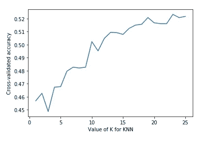

***交叉验证为 KNN***

我决定用 k=19，因为用它可以获得最高的精度。并用不同的验证方法对模型进行训练并计算精度。

```
# Train the model and predict for k=19knn = KNeighborsClassifier(n_neighbors=19)
knn.fit(X_train, y_train)
y_pred = knn.predict(X_test)from sklearn.metrics import accuracy_score
from sklearn.metrics import roc_auc_score# classification report for test set
print(metrics.classification_report(y_test, y_pred, digits=3, zero_division = 1))# Calculate cv score with 'accuracy' scoring and 10 folds
accuracy = cross_val_score(knn, X, y, scoring = 'accuracy',cv=10)
print('cross validation score',accuracy.mean())# Calculate cv score with 'roc_auc_ovr' scoring and 10 folds
accuracy = cross_val_score(knn, X, y, scoring = 'roc_auc_ovr',cv=10)
print('cross validation score with roc_auc',accuracy.mean())# Calculate roc_auc score with multiclass parameter
print('roc_auc_score',roc_auc_score(y_test,knn.predict_proba(X_test), multi_class='ovr'))
```

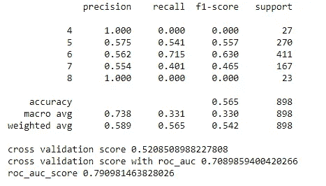

KNN 的分类表和验证分数

当我查看分类报告时，我立即发现训练时没有考虑类别 4 和类别 8，因为它们的回忆结果为零。这意味着，在所有第 4 类和第 8 类成员中，它没有正确预测任何一个。所以，对于我们的数据集来说，这不是一个好的模型。

## 逻辑回归

逻辑回归实际上是一种二元分类算法，可用于是/否、真/假等问题。

在这种情况下，它允许我们将它用于多类分类问题，如我们的问题。因为在我们的数据集中，有 5 类质量被预测为。为了将其用作多类分类算法，我使用了 multi_class= '多项式'，solver = '牛顿-cg '参数。

考虑到这是一个多类分类问题，我在计算交叉验证分数时使用了“roc_auc_ovr”评分参数，而不是“准确性”。我还用 multi_class='ovr '参数计算了 roc_auc_score。我将在后面的结论中解释这些。

```
# import module
from sklearn.linear_model import LogisticRegression# Train and fit model
logreg = LogisticRegression(multi_class=’multinomial’,solver =’newton-cg’)
logreg.fit(X_train, y_train)# Predict out-of-sample test set
y_pred = logreg.predict(X_test)# classification report
print(metrics.classification_report(y_test, y_pred, digits=3, zero_division = 1))print(‘accuracy’,accuracy_score(y_test, y_pred))# Calculate cv score with ‘roc_auc_ovr’ scoring and 10 folds
accuracy = cross_val_score(logreg, X, y, scoring = ‘roc_auc_ovr’,cv=10)
print(‘cross validation score with roc_auc’,accuracy.mean())# Calculate roc_auc score with multiclass parameter
print(‘roc_auc_score’,roc_auc_score(y_test,logreg.predict_proba(X_test), multi_class=’ovr’))
```

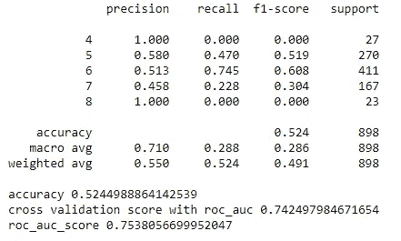

逻辑回归的分类表和验证分数

即使交叉验证分数稍微高一点，一些召回结果仍然是零。让我们看看如果我们添加一些多项式特征会发生什么。

**向逻辑回归添加多项式特征**

```
from sklearn.preprocessing import PolynomialFeatures
from sklearn.pipeline import make_pipeline# Add polynomial features to the logistic regression modeldef PolynomialRegression(degree=2, **kwargs):
 return make_pipeline(PolynomialFeatures(degree),
 LogisticRegression(multi_class=’multinomial’,solver =’newton-cg’, **kwargs))
```

现在，我尝试向逻辑回归模型添加三次多项式特征。

```
# Train and fit the 3rd degree polynomial regression model
poly = PolynomialRegression(3)
poly.fit(X_train,y_train)# Test out-of-sample test set
y_pred = poly.predict(X_test)# Classification report
print(metrics.classification_report(y_test, y_pred, digits=3))# Calculate cv score with 'roc_auc_ovr' scoring and 10 folds
accuracy = cross_val_score(poly, X, y, scoring = 'roc_auc_ovr',cv=10)
print('cross validation score with roc_auc_ovr scoring',accuracy.mean())# Calculate roc_auc score with multiclass parameter
print('roc_auc_score',roc_auc_score(y_test,poly.predict_proba(X_test), multi_class='ovr'))
```

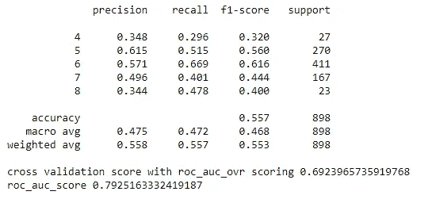

三次多项式回归的分类表和验证分数

最后，在预测时，我有一些少数类的代表，但它们非常低，交叉验证分数也比以前低。

## 决策图表

决策树是数据科学领域中最常用的分类算法之一。当我将其应用到我的数据集时，召回结果有所增加，但交叉验证分数下降了。

```
from sklearn.tree import DecisionTreeClassifier# Train and fit the Decision Tree Classification model
tree = DecisionTreeClassifier(random_state=0)
tree.fit(X_train, y_train)# Evaluate the model with out-of-sample test set
y_pred = tree.predict(X_test)# Classification report
print(metrics.classification_report(y_test, y_pred.round(), digits=3))# Calculate cv score with ‘roc_auc_ovr’ scoring and 10 folds
accuracy = cross_val_score(tree, X, y,scoring = ‘roc_auc_ovr’,cv=10)
print(‘cross validation score with roc_auc_ovr scoring’,accuracy.mean())# Calculate roc_auc score with multiclass parameter
print(‘roc_auc_score’,roc_auc_score(y_test,tree.predict_proba(X_test), multi_class=’ovr’))
```

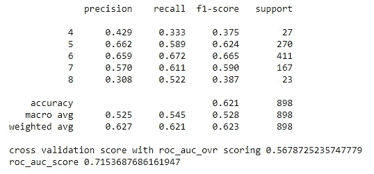

决策树的分类表和验证分数

## 随机森林

随机森林是一种集成学习方法，它构建多个决策树，然后根据大多数决策树的预测结果进行预测。我喜欢把它想象成为了一个健康问题去看多个医生，然后根据大多数医生的意见决定你是否应该做手术。

所以让我们看看随机森林模型的结果。

```
from sklearn.ensemble import RandomForestClassifier# Train and fit the Random Forest Classification model
forest = RandomForestClassifier(n_estimators=100,random_state = 0)
forest.fit(X_train, y_train)# Test out-of-sample test set
y_pred = forest.predict(X_test)# Classification report
print(metrics.classification_report(y_test, y_pred.round(), digits=3))# Calculate cv score with 'roc_auc_ovr' scoring and 10 folds
accuracy = cross_val_score(forest, X, y,scoring = 'roc_auc_ovr',cv=10)
print('cross validation score with roc_auc_ovr scoring',accuracy.mean())# Calculate roc_auc score with multiclass parameter
print('roc_auc_score',roc_auc_score(y_test,forest.predict_proba(X_test), multi_class='ovr'))
```

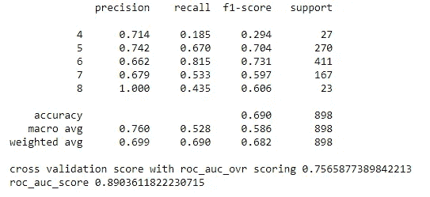

决策树的分类表和验证分数

是目前为止最好的！roc_auc_score 非常好，交叉验证分数是目前为止最好的，甚至对于少数类也有一些召回结果。但这还不够。因此，可以提高召回率的一个方法是*过度采样*少数类。为此，我使用了随机森林算法和 SMOTE 算法实现。

**添加 SMOTE 算法**

SMOTE(合成少数过采样)算法创建合成少数类样本，以增加少数类的代表性。

```
# Import SMOTE module
from imblearn.over_sampling import SMOTE# Create model and fit the training set to create a new training set
sm = SMOTE(random_state = 2) 
X_train_res, y_train_res = sm.fit_sample(X_train, y_train.ravel())# Create random forest model
forest = RandomForestClassifier(n_estimators=100,random_state = 0)# Fit the model to the new train set
forest.fit(X_train_res, y_train_res.ravel())# # Test out-of-sample test set
y_pred = forest.predict(X_test)# Classification report
print(metrics.classification_report(y_test, y_pred.round(), digits=3))# Calculate cv score with 'roc_auc_ovr' scoring and 10 folds
accuracy = cross_val_score(forest, X, y,scoring = 'roc_auc_ovr',cv=10)print('cross validation score with roc_auc_ovr scoring',accuracy.mean())# Calculate roc_auc score with multiclass parameter
print('roc_auc_score',roc_auc_score(y_test,forest.predict_proba(X_test), multi_class='ovr'))
```

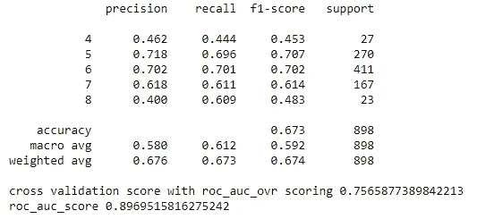

SMOTE 随机森林的分类表和验证分数

即使准确率几乎与前一个相同，少数民族班级的召回结果也显著增加。

# 结论

在这个项目中，我使用了 K 近邻、多项式特征的逻辑回归、决策树和随机森林。利用 Scikit-learn 中的`roc_auc_score`,我计算了每个模型的 AUC 分数。同样使用`cross_val_score`方法，我通过传递`roc_auc_ovr`参数使用交叉验证方法找到 AUC 分数。尽管它通常用于二进制分类中的性能评估，但通过一对多的方法，我将其应用于多类分类问题。当存在高等级不平衡时，用这种方法评估模型是有利的。也不需要设置分类阈值。

如果我们比较所有模型的交叉验证分数和召回结果，我们可以看到使用**随机森林分类器**和 SMOTE 方法得到的结果最好，交叉验证分数**为 0.7565**。由于我们的班级高度不平衡，SMOTE 创建了合成少数抽样来平衡样本。并训练模型，就好像我们的数据集中有平衡的类一样。

尽管我们得到了最高的交叉验证分数，大约为 0.75，但它仍然不是一个理想的模型，因为召回结果对于任何类别都没有足够的代表性。在这种情况下，为了改进模型，我们需要更多的数据来训练它。

感谢您的阅读！

如果您有任何反馈或更正，请随时通过我的 [LinkedIn](https://www.linkedin.com/in/guldenturgay/) 联系我！