# 比较冠状病毒对各国经济和健康的影响

> 原文：<https://towardsdatascience.com/comparing-coronavirus-economic-and-health-impacts-across-nations-ef8e4ea52741?source=collection_archive---------34----------------------->

## Covid 疫情的简单多元分析


[粘土银行](https://unsplash.com/@claybanks?utm_source=medium&utm_medium=referral)在 [Unsplash](https://unsplash.com?utm_source=medium&utm_medium=referral) 拍摄的照片

***来自《走向数据科学》编辑的提示:*** *虽然我们允许独立作者根据我们的* [*规则和指导方针*](/questions-96667b06af5) *发表文章，但我们并不认可每个作者的贡献。你不应该在没有寻求专业建议的情况下依赖一个作者的作品。详见我们的* [*读者术语*](/readers-terms-b5d780a700a4) *。*

几周前，国际货币基金组织发布了 2020 年 6 月的《世界经济展望》( T23 ),这份报告令人沮丧。该机构预测，今年全球国内生产总值(GDP)将下降 4.9%。我们应该关心吗？毕竟，人们一直批评 GDP 是衡量一个国家健康状况的糟糕指标。当人们生病或濒临死亡时，GDP 的下降真的重要吗？

幸运的是，我们并不局限于根据单一变量来分析全球健康状况，甚至经济学家也意识到了这一事实。他们现在有[另一个度量](https://www.worldbank.org/en/who-we-are/news/coronavirus-covid19)到[轨道](https://www.imf.org/en/Topics/imf-and-covid19)。像我们一样，国际货币基金组织的工作人员可能每天早上都会打开仪表板，记录冠状病毒感染和死亡人数。正如 2007 年金融危机让每个人都成了业余经济学家一样，这场危机让我们都成了业余流行病学家。而且，就像一个国家的股市或 GDP 一样，冠状病毒感染率可以代表一个国家的实力和健康。


我们今天跟踪哪个指标？—由[奥斯汀·迪斯特尔](https://unsplash.com/@austindistel?utm_source=medium&utm_medium=referral)在 [Unsplash](https://unsplash.com?utm_source=medium&utm_medium=referral) 上拍摄

为了更好地了解世界是如何面对这种病毒的，我收集了各国的经济和卫生数据。一个主要的输入将是以每 100 万人感染人数衡量的病毒传播。另一个是一个国家的经济增长率，以 GDP 增长的百分比来衡量。很简单，让我们开始吧。

# 1 —收集数据

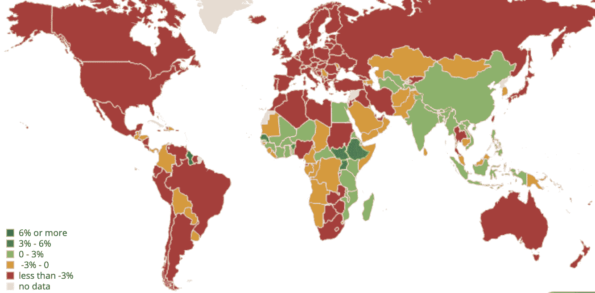

2020 年 4 月全球 GDP 增长预测—[https://www . IMF . org/external/data mapper/NGDP _ RPCH @ WEO/OEMDC/ADVEC/WEO world/WEQ](https://www.imf.org/external/datamapper/NGDP_RPCH@WEO/OEMDC/ADVEC/WEOWORLD/WEQ)

年的经济数据来自国际货币基金组织。该组织于 4 月在 T2 发布了每个国家的增长预测，并于 6 月再次发布了大多数国家的增长预测。当然，这些只是投射，在平时很难做出。不能保证它们会实现，但这是我能找到的最好的了。

作为参考，我还抓取了 2019 年 10 月[的经济预测，在 Covid 袭击之前。在那些平静的日子里，美国国内生产总值预计增长 2%，失业率为 3.7%，创历史新低。我将所有这些预测放入一个简单的表格中，如下图所示。](https://www.imf.org/external/pubs/ft/weo/2019/02/weodata/index.aspx)


对于冠状病毒病例，数据更容易获得，有几十个好的来源。我选择了来自 [worldometers](https://www.worldometers.info/coronavirus/) 的漂亮的表格记录，因为它们是最新的，并且格式良好，如下所示。

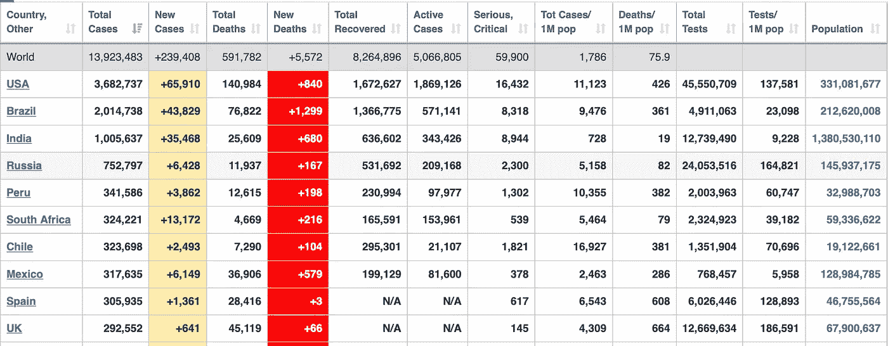

2016 年 7 月的数据

# 2——增加一些有趣的变量

我知道我说过我只看 GDP，但是我忍不住为这个分析添加了一些其他的数据。最好留着它们，以防我们需要。

## 失业

IMF 也在今年 4 月公布了预期就业数据。它们甚至比 GDP 数据更加黯淡。利用国际货币基金组织的网站，我们可以导出 2020 年每个国家的失业率的[表](https://www.imf.org/external/pubs/ft/weo/2020/01/weodata/weorept.aspx?pr.x=56&pr.y=9&sy=2020&ey=2020&ssd=1&sort=country&ds=.&br=1&c=512%2C668%2C914%2C672%2C612%2C946%2C614%2C137%2C311%2C546%2C213%2C674%2C911%2C676%2C314%2C548%2C193%2C556%2C122%2C678%2C912%2C181%2C313%2C867%2C419%2C682%2C513%2C684%2C316%2C273%2C913%2C868%2C124%2C921%2C339%2C948%2C638%2C943%2C514%2C686%2C218%2C688%2C963%2C518%2C616%2C728%2C223%2C836%2C516%2C558%2C918%2C138%2C748%2C196%2C618%2C278%2C624%2C692%2C522%2C694%2C622%2C962%2C156%2C142%2C626%2C449%2C628%2C564%2C228%2C565%2C924%2C283%2C233%2C853%2C632%2C288%2C636%2C293%2C634%2C566%2C238%2C964%2C662%2C182%2C960%2C359%2C423%2C453%2C935%2C968%2C128%2C922%2C611%2C714%2C321%2C862%2C243%2C135%2C248%2C716%2C469%2C456%2C253%2C722%2C642%2C942%2C643%2C718%2C939%2C724%2C734%2C576%2C644%2C936%2C819%2C961%2C172%2C813%2C132%2C726%2C646%2C199%2C648%2C733%2C915%2C184%2C134%2C524%2C652%2C361%2C174%2C362%2C328%2C364%2C258%2C732%2C656%2C366%2C654%2C144%2C336%2C146%2C263%2C463%2C268%2C528%2C532%2C923%2C944%2C738%2C176%2C578%2C534%2C537%2C536%2C742%2C429%2C866%2C433%2C369%2C178%2C744%2C436%2C186%2C136%2C925%2C343%2C869%2C158%2C746%2C439%2C926%2C916%2C466%2C664%2C112%2C826%2C111%2C542%2C298%2C967%2C927%2C443%2C846%2C917%2C299%2C544%2C582%2C941%2C474%2C446%2C754%2C666%2C698&s=LUR&grp=0&a=)。

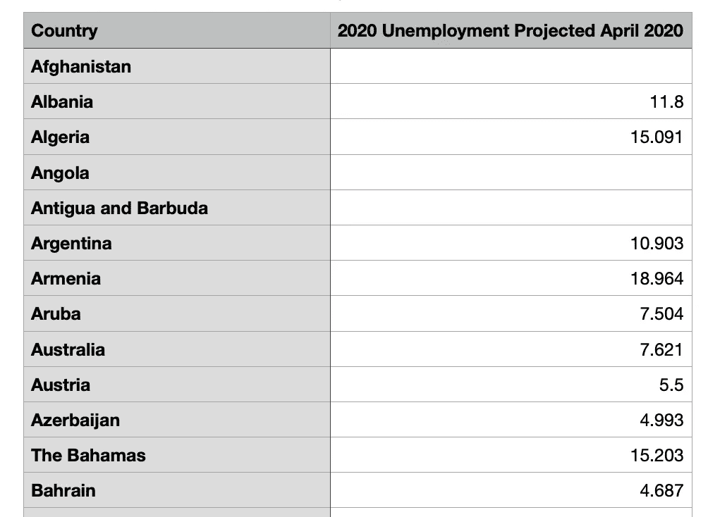

## 国内生产总值总额

每个国家的 GDP 总量也是由国际货币基金组织发布的[，它有助于了解 GDP 增长/损失的大小。](https://worldpopulationreview.com/countries/countries-by-gdp/)

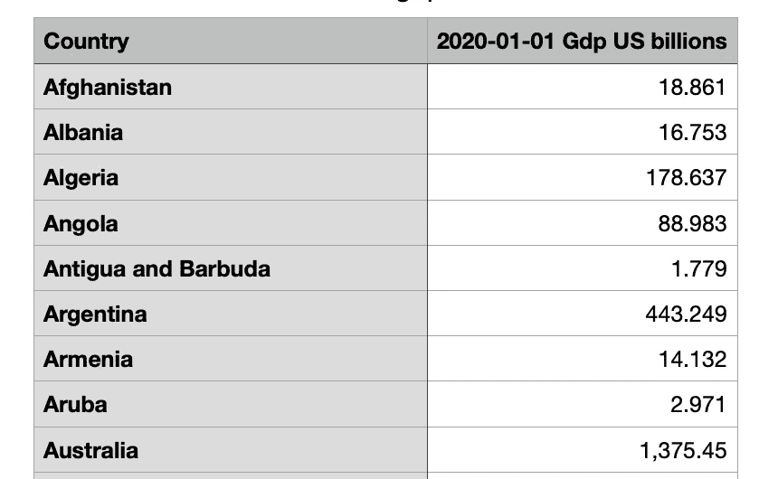

## 全球区域数据

最后，我想我可能想要比较世界上不同的地区，所以我也从 statisticstimes.com 获取了地区数据

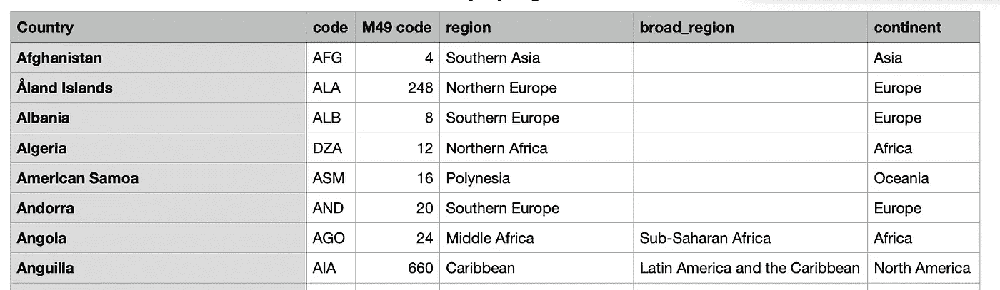

# 3-合并数据源

用多个数据源做任何有趣的事情都意味着将它们放入一个单一的[数据框架](https://pandas.pydata.org/pandas-docs/stable/reference/api/pandas.DataFrame.html)。幸运的是，python Pandas 库允许轻松合并不同的数据集。在这种情况下，我只用 4 行代码就可以合并不同国家的表！

```
import pandas as pdimf_data = pd.read_csv(‘imf_merged.csv’, sep=’,’)
corona_data = pd.read_csv(‘corona.csv’, sep=’,’)
inner_merged_total = pd.merge(imf_data, corona_data, on=[“Country”])
inner_merged_total.to_csv( “merged_data.csv”)
```

就是这样。在清理了国家名称(例如“大韩民国”与“韩国”)后，我们可以合并任意多的数据源。

合并后，一切都在一个整洁的数据框架中，包含了分析所需的所有关键信息。数据帧的示例如下所示。

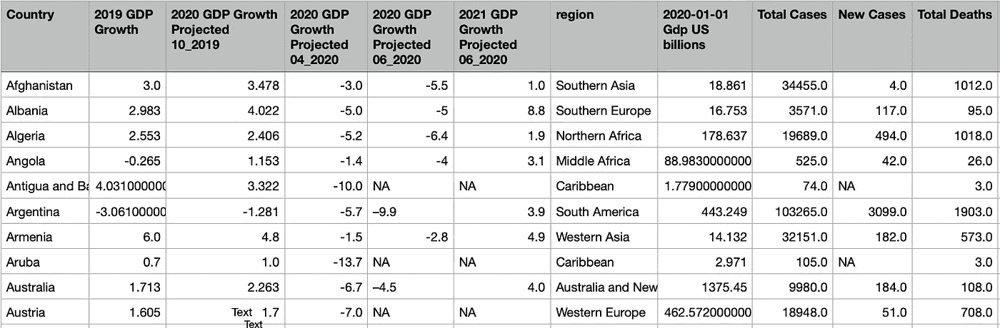

最终数据帧的一部分

# 4 —分析结果

我喜欢用 R 进行分析和探索，因为它是交互式的，并且允许数据操作而不需要太多代码。下面是一个简单的代码片段。我们用 python 生成的 csv 文件。很容易用任何变量来排序，比如国家人口

```
dt = read.csv(“all_data2.csv”, strip.white=TRUE)dt = dt[order(dt$Population, decreasing=TRUE),]
```

有了干净的数据，就很容易调查病毒的经济影响问题。下面是其中的一些问题。

## 富裕国家能更好地应对病毒吗？

看待国家财富和新冠肺炎之间关系的一种东方方式是将这两个变量对立起来。使用 R ggplot 包完成这项工作的代码如下所示。

```
dt$gdp_per_capita = as.numeric(as.character(dt$X2020.01.01.Gdp.US.billions))/dt$Population * 1000000000p = ggplot(dt, aes(y = Tot.Cases.per.1M.pop, x = gdp_per_capita)) + geom_point(aes(color = region, size=Total.Cases))
p = p + theme_classic() 
p = p + theme(legend.position = "none")
p = p + labs(title="Infections vs GDP per Capita")
p = p + geom_text(aes(label=CountryChart),hjust=0, vjust=0,size=4.5)
p = p + theme(axis.text=element_text(size=14,face="bold"), axis.title=element_text(size=18))
p = p + xlab("GDP per Capita") + guides(fill=FALSE)
p = p + ylab("Total Cases per 1M People") + guides(fill=FALSE)
```

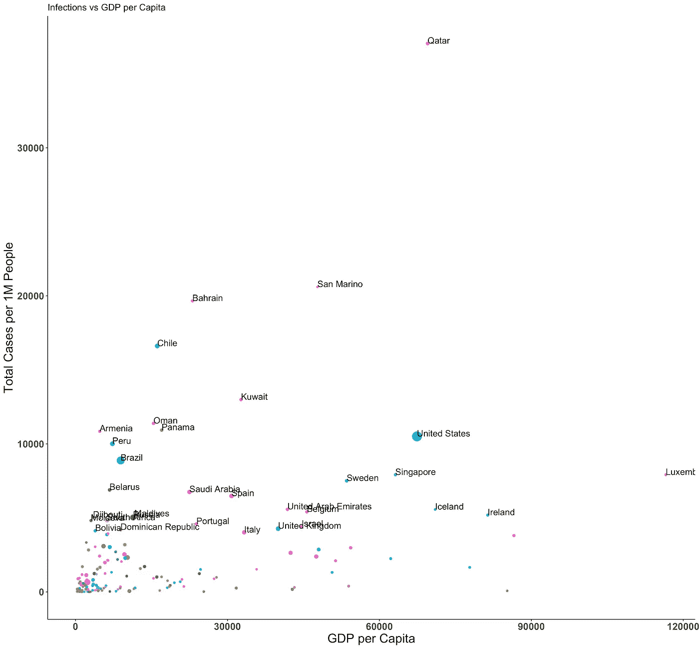

当绘制 Covid 病例(每 100 万人)与国家财富(人均 GDP)的对比图时，一个观察结果引人注目。看起来富裕国家并不比贫穷国家更好地应对危机。事实上，一些最富裕的国家，如卡塔尔、美国、瑞典和新加坡的感染率非常高。事实上，国家人均国内生产总值和人均感染之间的关系是正相关的。

```
correlation = cor(dt$Tot.Cases.per.1M.pop, dt$gdp_per_capita)
```

每百万人口超过 5000 例的国家人均 GDP 高达 36233.19 美元，远远高于贫困国家。计算代码如下。

```
high_cases = dt[dt$Tot.Cases.per.1M.pop > 5000,]
mean(high_cases$gdp_per_capita)
```

## 富裕国家测试的多吗？

富裕国家结果不佳的一个可能解释是更好的 Covid 测试。事实上，川普总统[已经声称](https://www.factcheck.org/2020/06/trump-falsely-says-covid-19-surge-only-due-to-testing-misleads-on-deaths/)美国的大量病例完全是因为优越的检测制度。如果我们将总测试数(每 100 万人)与总案例数(每 100 万人)进行对比，我们会发现相关性并不完美。事实上，像美国这样的国家并没有比许多欧洲国家测试更多的人。

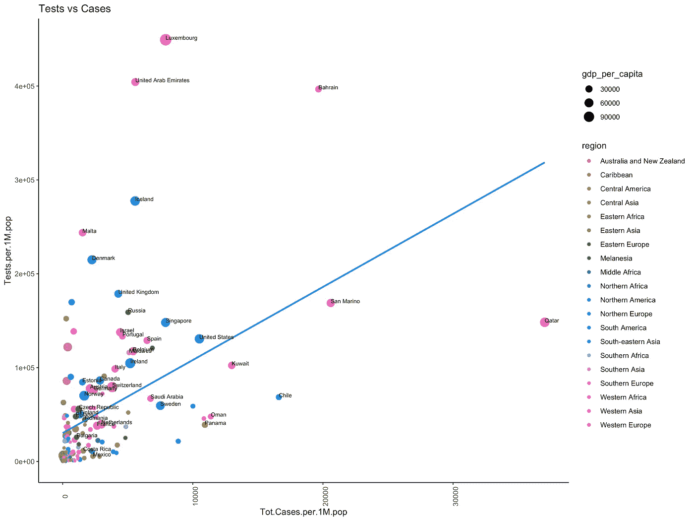

蓝线是一个简单的线性回归，它给了我们一个很好的指标，表明哪些国家测试得很好。贫困线以下的国家应该进行更多的检测，以跟上具有相似财富/感染率的国家。在 R 中，线性回归线很容易用单个语句添加。请参见下面的粗体行。

```
p = ggplot(dt, aes(x = Tot.Cases.per.1M.pop, y = Tests.per.1M.pop)) + geom_point(aes(color = region, size=gdp_per_capita))
p = p + theme_classic() 
p = p + labs(title="Tests vs Cases")
p = p + theme(axis.text.x = element_text(angle = 90))
***p = p + geom_smooth(method='lm', formula= y~x, se = FALSE)*** p = p + geom_text(aes(label=CountryChart),hjust=0, vjust=0,size=2.5)
ggsave(filename = "tests_vs_cases.png" , plot=p, width=12, height=9)
```

## 哪些地区受灾最严重？

在绘制冠状病毒病例与 GDP 的对比图时，有一点很突出，那就是东亚国家的表现。在第一张图中，这些国家用挂在 y 轴下方的大绿点表示。也许更容易的方法是按地区做一个柱状图，以确切了解病毒是如何影响世界各地的。下面是条形图的 r 代码。

```
# Aggregate by region
regions = aggregate( Tot.Cases.per.1M.pop ~ region, dt, mean )# Create Factor for plotting
regions$region = factor(regions$region, levels = regions$region[order(regions$Tot.Cases.per.1M.pop, decreasing=FALSE)])p = ggplot(regions, aes(x=region, y=Tot.Cases.per.1M.pop, fill="#1dcaff")) + geom_bar(stat="identity") 
p = p + ggtitle("Average Number of Coronavirus Cases per 1M Population")
p = p + theme(plot.title = element_text(hjust = 0.5))
p = p + theme(axis.text=element_text(size=13,face="bold"), axis.title=element_text(size=13), axis.title.y=element_blank())
p = p + theme(plot.title = element_text(size=14,face="bold"))
p = p + ylab("Cases per 1M Population") + guides(fill=FALSE)
p = p + coord_flip()
```

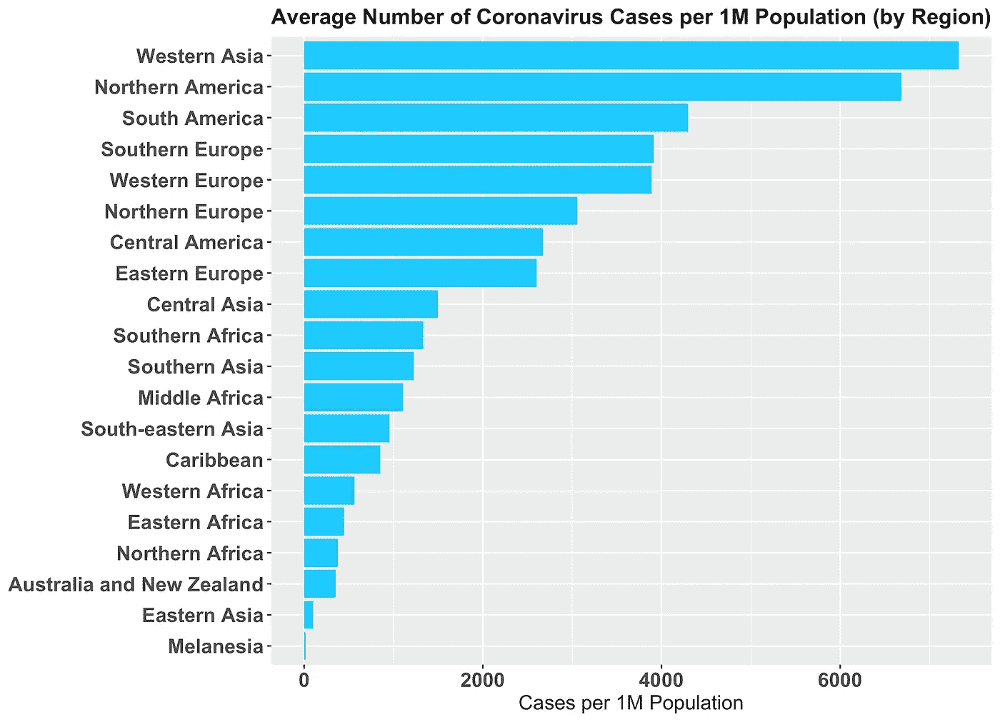

按地区绘制平均感染率图，我们确认东亚国家(中国、日本、韩国、台湾等)的平均感染率非常低。相比之下，西亚(或中东)国家受到的冲击最大。最后，南欧(西班牙、意大利等)、南美(巴西、智利等)和北美(美国)的人均 Covid 病例数最多。

## Covid 病例与经济衰退相关吗？

好的，所以富裕国家通常比贫穷国家(东亚除外)有更多的感染者。一个简单的问题是，这场健康危机是否会在遭受重创的国家转化为经济危机。或者，全球经济是如此相互关联，以至于每个国家都面临衰退？将 2020 年各国的预计 GDP 与其冠状病毒病例(每百万人)进行对比，没有明显的相关性。许多病例较少的国家今年仍有望大幅萎缩。

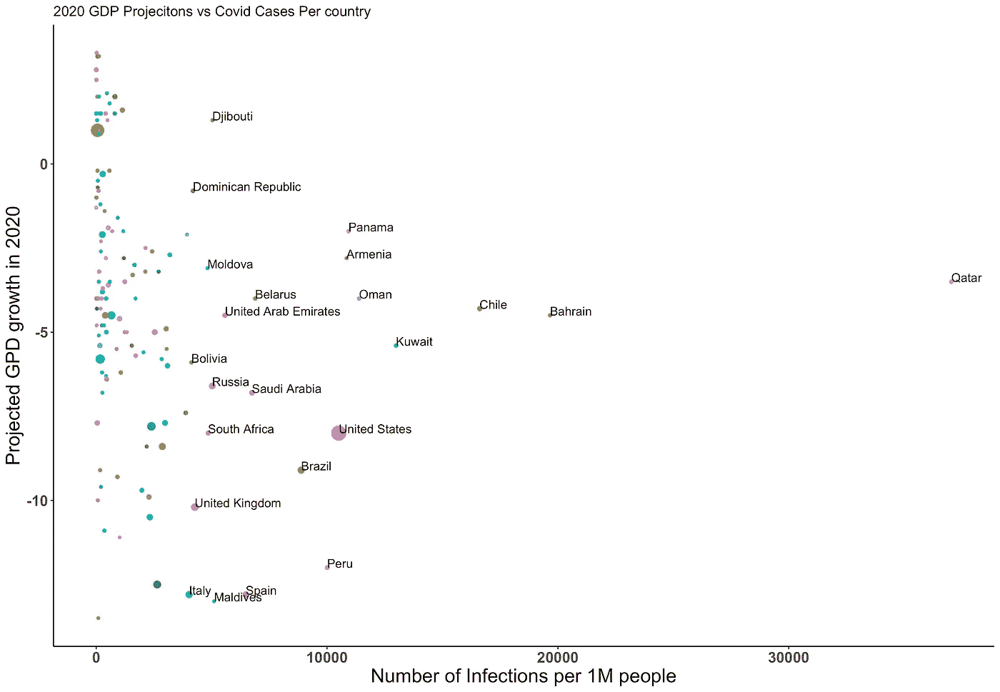

上面的图使用 GDP 来确定点的大小。因此，我们可以看到 2020 年中国的病例很少，增长率为 1%。我们也看到美国有许多病例，预计经济将收缩 8%。

```
p = ggplot(dt, aes(x = Tot.Cases.per.1M.pop, y = X2020.GDP.Growth.Projected.06_2020)) + geom_point(aes(color = Country, size=X2020.01.01.Gdp.US.billions))
```

当然，以 2019 年 10 月份所做的经济预测作为参考，再检查一遍可能会更好。如果我们从冠状病毒袭击前的预测中减去 2020 年 6 月的预测，我们可以得到一个更好的指标，我称之为“GDP 损失”。

```
dt$june_gdp_loss = dt$X2020.GDP.Growth.Projected.06_2020 - dt$X2020.GDP.Growth.Projected.10_2019
```

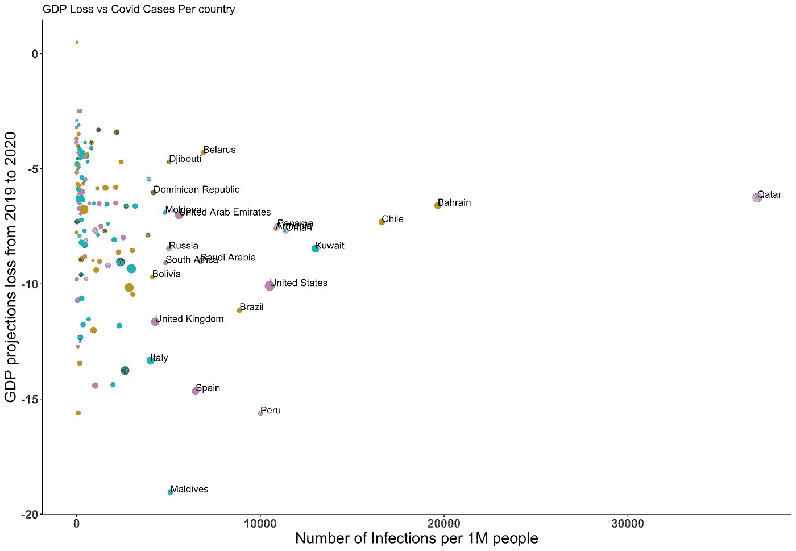

这个图也好不到哪里去，但我们确实看到，像英国、美国和西班牙这样大规模爆发的国家现在受到了更大的打击。总的来说，不管目前的感染率如何，东亚以外的每个地区在 2020 年都将经历重大的经济影响。这可能是由于对未来疫情的预期，或者是因为今年全球需求(尤其是来自美国的需求)将非常低迷。

## Covid 病例与失业相关吗？

从失业数据中可以更清楚地看出冠状病毒造成的经济损失。下面，我从 2020 年 4 月的测量数据中减去了 2020 年的预期失业数据(2019 年 10 月的数据)。在这方面，更明显的是，受冲击最严重的国家失业率上升幅度更大。

```
dt$uneployment_loss = dt$X2020.Unemployment.Projected.04_2020 - dt$X2020.Unemployment.Projected.10_2019
```

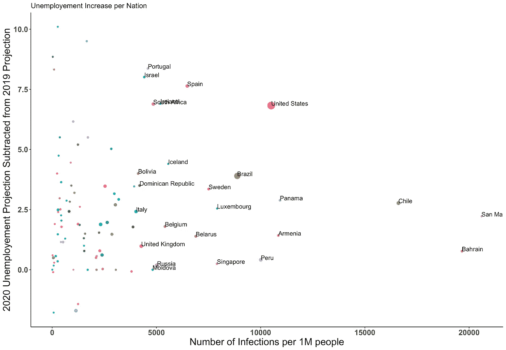

# 最后的想法

在我生活的美国，新冠肺炎危机令人遗憾地将许多人分成对立和激进的阵营。一些人认为必须不惜一切代价控制病毒，还有一些人认为我们应该考虑 T2 因长时间关闭造成的人员和经济损失。不幸的是，这些意见已经沿着政党路线分裂，并导致了阻碍美国政治的同样愚蠢的二分法和基本思想。

就我个人而言，我一直渴望一份从医学和经济两方面考虑一个国家健康状况的分析报告。尽管国际货币基金组织的经济预测并不完美，但它们可以开始表明受 Covid 影响的国家遭受了重大的经济损失。为了全世界的利益，抗击和控制这种病毒符合所有国家的利益。