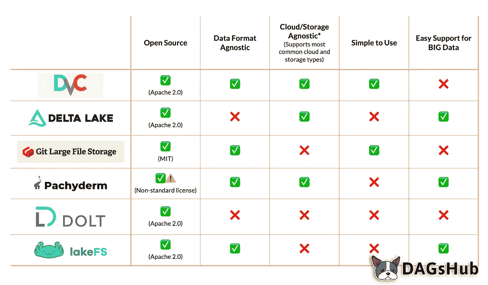

# 比较数据版本控制工具— 2020 年

> 原文：<https://towardsdatascience.com/comparing-data-version-control-tools-2020-c11ef1c80ea7?source=collection_archive---------18----------------------->

Alexander Schimmeck 在 [Unsplash](https://unsplash.com?utm_source=medium&utm_medium=referral) 上的照片

无论您使用逻辑回归还是神经网络，所有模型都需要数据来进行训练、测试和部署。管理和创建用于这些模型的数据集需要大量的时间和空间，并且由于多个用户更改和更新数据，可能会很快变得混乱。

这可能导致意想不到的结果，因为数据科学家继续发布新版本的模型，但针对不同的数据集进行测试。许多数据科学家可能在相同的几组训练数据上训练和开发模型。这可能会导致对数据集进行许多微妙的更改，一旦部署了模型，这可能会导致意想不到的结果。

这篇博客文章讨论了管理数据带来的许多挑战，并概述了用于机器学习和数据版本控制的**顶级工具**。

汇总表—请进一步阅读，了解更详细的比较。作者图片

# 数据管理的挑战

管理数据科学和机器学习模型的数据集和表格需要数据科学家和工程师投入大量时间。从管理存储、数据版本到访问，一切都需要大量的手动干预。

## 储存空间

训练数据会占用 Git 存储库的大量空间。这是因为开发 Git 是为了跟踪文本文件中的变化，而不是大型二进制文件。因此，如果一个团队的训练数据集涉及大型音频或视频文件，这可能会给下游带来很多问题。对训练数据集的每次更改通常会在存储库的历史中产生一个重复的数据集。这不仅创建了一个大的存储库，而且使得克隆和重置非常慢。

## 数据版本管理

当试图管理版本时，无论是代码还是 ui，都有一种普遍的趋势——甚至在技术人员中——通过在文件名的末尾添加版本号或单词来“管理版本”。在数据的上下文中，这意味着项目可能包括 data.csv、data_v1.csv、data_v2.csv、data_v3_finalversion.csv 等。这个坏习惯已经不是老生常谈了，事实上大多数开发人员、数据科学家和 UI 专家都是从坏的版本控制习惯开始的。

照片由[斯蒂夫·约翰森](https://unsplash.com/@steve_j?utm_source=medium&utm_medium=referral)在 [Unsplash](https://unsplash.com?utm_source=medium&utm_medium=referral) 上拍摄

## 多用户

在生产环境中工作时，最大的挑战之一是与其他数据科学家打交道。如果您在协作环境中没有使用某种形式的版本控制，文件将被删除、更改和移动；你永远不会知道谁做了什么。此外，很难将您的数据恢复到原始状态。这是管理模型和数据集的最大障碍之一。

数据版本化是团队机器学习模型开发自动化的关键之一。虽然如果你的团队试图开发自己的系统来管理过程会非常复杂，但情况并非如此。

让我们探索六个伟大的开源工具，您的团队可以使用它们来简化数据管理和版本控制。

# DVC

[DVC](https://dvc.org/) ，或数据版本控制，是许多可用的开源工具之一，可以帮助简化您的数据科学和机器学习项目。该工具采用 Git 方法，因为它提供了一个简单的命令行，只需几个简单的步骤就可以设置好。顾名思义，DVC 不仅仅关注数据版本。它还帮助团队管理他们的管道和机器学习模型。最后，DVC 将帮助提高你的团队的一致性和你的模型的[再现性](https://thegradient.pub/independently-reproducible-machine-learning/)。

## 赞成的意见

*   轻量级、开源，可用于所有主要的云平台和存储类型。
*   灵活，格式和框架无关，易于实现。

## 骗局

*   DVC 版本控制与管道管理紧密结合。这意味着如果你的团队已经在使用另一个数据管道工具，就会有冗余。
*   DVC 是轻量级的，这意味着您的团队可能需要手动开发额外的功能，使其易于使用。

# 三角洲湖

[Delta Lake](https://delta.io) 是一个帮助改进数据湖的开源存储层。它通过提供 ACID 事务、数据版本化、元数据管理和管理数据版本来实现这一点。

该工具更接近于数据湖抽象层，填补了大多数数据湖有限的空白。

## 赞成的意见

*   提供了许多您当前的数据存储系统中可能没有的功能，例如 ACID 事务或有效的元数据管理。
*   减少了手动数据版本管理和处理其他数据问题的需要，使开发人员能够专注于在其数据湖之上构建产品。

## 骗局

*   对于大多数项目来说，Delta Lake 往往是多余的，因为它是基于 Spark 和大数据开发的。
*   需要使用专用的数据格式，这意味着它不太灵活，并且与您当前的格式无关。
*   工具的主要目的是更像一个数据抽象层，这可能不是你的团队所需要的，可能会让开发人员需要一个更轻便的解决方案。

# 吉特 LFS

Git LFS 是由许多开源贡献者开发的 Git 扩展。该软件旨在通过使用指针来消除可能添加到您的存储库中的大文件(例如，照片和数据集)。

指针较轻，指向 LFS 商店。因此，当您将回购放入主存储库时，更新时间不会太长，也不会占用太多空间。

对于管理数据来说，这是一个非常轻量级的选项。

## 赞成的意见

*   轻松集成到大多数公司的开发工作流程中。
*   利用与 Git 存储库相同的权限，因此不需要额外的权限管理。

## 骗局

*   Git LFS 需要专门的服务器来存储你的数据。反过来，这最终会导致您的数据科学团队陷入困境，并增加工程工作量。
*   Git LFS 服务器不像 DVC 那样可以扩展，它将数据存储到更通用的易于扩展的对象存储器中，比如 S3。
*   非常具体，可能需要在数据科学工作流的其他步骤中使用许多其他工具。

# 迟钝的人

[Pachyderm](https://pachyderm.io/) 是该榜单上为数不多的数据科学平台之一。Pachyderm 的目标是创建一个平台，通过管理整个数据工作流，轻松再现机器学习模型的结果。在这方面，厚皮动物是“数据的码头工人”。

Pachyderm 利用 Docker 容器来打包您的执行环境。这使得重现相同的输出变得容易。版本化数据和 Docker 的结合使得数据科学家和 DevOps 团队可以轻松部署模型并确保它们的一致性。

Pachyderm 致力于其[数据科学权利法案](https://www.pachyderm.com/dsbor/)，该法案概述了该产品的主要目标:可再现性、数据来源、协作、增量、自治和基础设施抽象。

这些支柱驱动了它的许多特性，并允许团队充分利用这个工具。

## 赞成的意见

*   基于容器，这使得您的数据环境可移植，并易于迁移到不同的云提供商。
*   健壮，可以从相对较小的系统扩展到非常大的系统。

## 骗局

*   由于有如此多的移动部件，比如管理 Pachyderm 的免费版本所需的 Kubernetes 服务器，所以需要更多的学习曲线。
*   由于各种各样的技术组件，很难将 Pachyderm 集成到公司现有的基础架构中。

# 傻瓜

就数据版本化而言，Dolt 是一个独特的解决方案。与其他一些简单的版本数据不同，Dolt 是一个数据库。

Dolt 是一个具有 Git 风格版本的 SQL 数据库。与 Git 不同，在 Git 中，您可以对文件进行版本控制，而 Dolt 则是版本表。这意味着您可以更新和更改数据，而不必担心丢失更改。

虽然这款应用还是新的，但有计划在不久的将来让它 100%兼容 Git 和 MySQL。

## 赞成的意见

*   轻量级和部分开源。
*   SQL 接口，与更模糊的选项相比，使数据分析师更容易访问它。

## 骗局

*   与其他数据库版本选项相比，Dolt 仍然是一个成熟的产品。
*   Dolt 是一个数据库，这意味着您必须将您的数据迁移到 Dolt 中才能获得好处。
*   为版本控制表而构建。这意味着它不包括其他类型的数据(例如图像、自由格式的文本)。

# 莱克夫斯

[LakeFS](https://lakefs.io/) 让团队构建可重复的、原子的和版本化的数据湖操作。这是一个新来的人，但它有很强的冲击力。它提供了一个类似 Git 的分支和版本控制模型，旨在处理您的数据湖，扩展到数 Pb 的数据。

与 Delta Lake 类似，它为您的数据湖提供 ACID 合规性。然而，LakeFS 支持 AWS S3 和谷歌云存储作为后端，这意味着它不需要使用 Spark 来享受所有的好处。

## 赞成的意见

*   为易于使用的云存储(如 S3 和 GCS)提供高级功能，如 ACID 事务，同时与格式无关。
*   易于扩展，支持非常大的数据湖。能够为开发和生产环境提供版本控制。

## 骗局

*   LakeFS 是一个相对较新的产品，因此与其他解决方案相比，其特性和文档可能会变化得更快。
*   侧重于数据版本化，这意味着您将需要为数据科学工作流的其他步骤使用许多其他工具。

# 你真的需要数据版本控制吗？

尽管数据版本化有诸多好处，但您并不总是需要在管理数据方面投入大量精力。例如，大部分数据版本控制都是为了帮助跟踪随时间变化很大的数据集。

照片由[艾米丽·莫特](https://unsplash.com/@emilymorter?utm_source=medium&utm_medium=referral)在 [Unsplash](https://unsplash.com?utm_source=medium&utm_medium=referral) 拍摄

有些数据，如网络流量，只是附加到。这意味着添加了数据，但很少更改。这意味着创建可重现结果所需的数据版本是开始和结束日期。注意这一点很重要，因为在这种情况下，您可能能够避免上面提到的所有工具的设置。您仍然需要管理开始和结束日期，以确保您每次都测试相同的数据，以及您正在创建的模型。然而，在这些情况下，您不一定需要将所有数据提交到您的版本控制系统。

# 摘要

管理数据版本是数据科学团队避免输出不一致的必要步骤。

无论您使用 Git-LFS、DVC，还是其他讨论过的工具，都需要某种数据版本控制。这些数据版本化工具有助于减少管理数据集所需的存储空间，同时还有助于跟踪不同团队成员所做的更改。如果没有数据版本控制工具，随叫随到的数据科学家可能会在凌晨 3 点起床调试由不一致的模型输出导致的模型问题。

然而，所有这些都可以通过确保您的数据科学团队实施数据版本管理流程来避免。

*原载于 2020 年 10 月 31 日*[*【https://dagshub.com】*](https://dagshub.com/blog/data-version-control-tools/)*。*