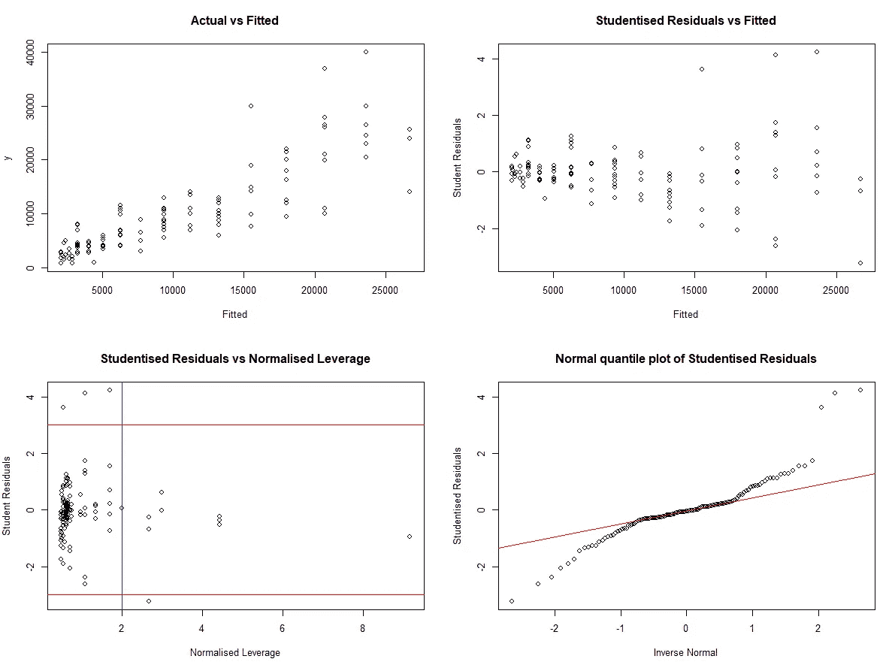
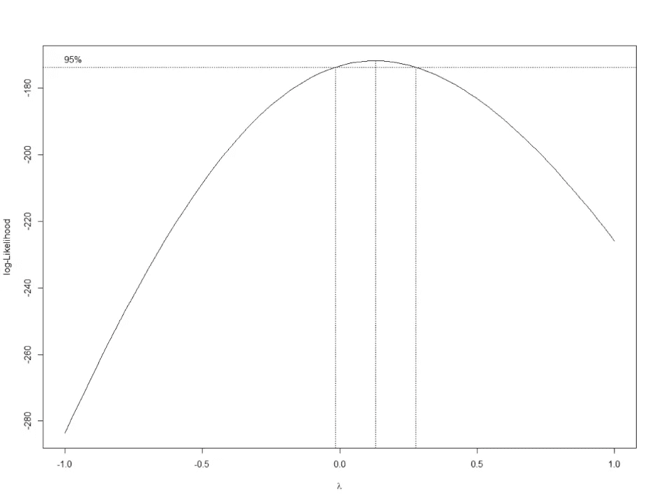
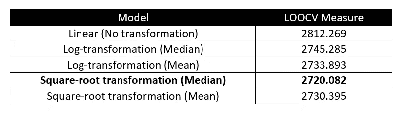
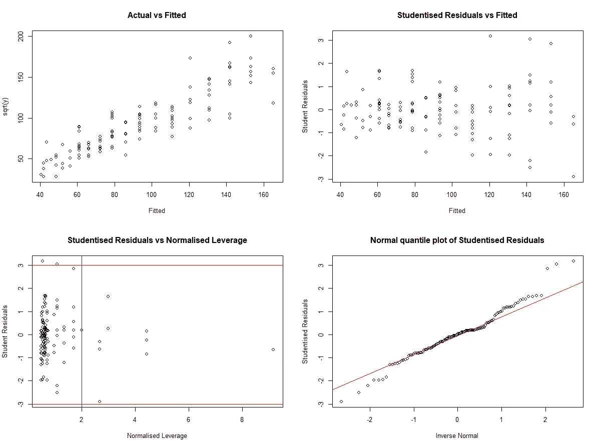

# R 中留一交叉验证法比较因变量变换

> 原文：<https://towardsdatascience.com/comparing-dependent-variable-model-transformations-by-leave-one-out-cross-validation-in-r-b63945b73b2?source=collection_archive---------52----------------------->

## 通过转换因变量和利用交叉验证优化线性回归模型的预测能力。

在决定因变量变换以实现最佳预测能力时，一个关键问题是 R 平方值(通常用于测量不同模型的预测拟合度)不再具有可比性。由于 R 平方是因变量中方差的比例，该比例由自变量的变化来解释，通过对因变量进行变换，我们也变换了它们的方差结构。因此，我们不再能够通过比较它们的 R 平方值来洞察不同模型的相对预测能力。

**Box-Cox 幂变换**

虽然可以使用 Box-Cox 幂变换来指示哪种变换将有助于我们的模型拟合数据，但这种方法不会帮助我们衡量变换后的模型在预测方面的表现，也不会指示在倒带变换时使用平均值或中值预测值是否会产生最佳预测。以下示例通过采用留一交叉验证来计算可比较的预测能力度量，突出了过于依赖 Box-Cox 变换本身的问题。

**留一交叉验证**

交叉验证可作为一种手段，用于比较不同的因变量转换。交叉验证的留一法使用样本数据集中的一个观察值作为验证数据，使用其余的观察值作为训练数据。每个模型用于通过拟合训练数据来预测验证数据点的值，然后通过从验证数据观测值中减去预测值来计算预测误差。

为了确保我们获得可比较的测量值，必须将转换模型产生的拟合值转换回“水平”形式，以获得与原始观察数据单位相同的预测值。使用不同的方法进行这种转换能够比较平均值和中位数预测值。重复该过程，直到来自原始样本的每个观察值都被用作验证数据点，然后通过对预测误差的绝对值*求和，我们获得所讨论的转换模型进行样本外预测的程度的度量。

一旦为每个变换(和适用的预测器类型)计算了交叉验证度量，则产生最低度量的模型被认为具有最大的预测能力。

**人们可能希望使用预测误差的平方和来计算比较。*

**工作示例**

借助所附的 mazda.csv 数据集，我们希望开发一个模型，在给定车龄的情况下，预测汽车的价格。根据初步观察，确定将年龄平方项作为模型中的第二个变量将有助于减轻非线性问题。然后产生以下诊断图。

型号: ***价格=α+β*年龄+δ*年龄***



```
# LOAD & ORGANISE DATA #####################################
original_data <- rio::import("mazda.csv")

data <- original_data
names(data) <- c("Year", "y", "x")

# Inclusion of Age^2 variable
x_sq <- data$x^2                      
data <- tibble::add_column(data, x_sq, .after = 100)

# MODEL DEVELOPMENT ########################################
reg1 <- glm(y ~ x + x_sq,
            data ​= data)

fitted.1 <- stats::fitted(reg1)
resid.1 <- stats::resid(reg1)     
stu.resid.1 <- MASS::studres(reg1)   
leverage.1 <- sur::leverage(reg1)     
norm_lev.1 <- (nrow(data)*leverage.1)/(length(coef(reg1)))  

# Diagnostic Plots
par(mfrow = c(2, 2))                    
plot(fitted.1, data$y, main = "Actual vs Fitted", ylab = "y", xlab = "Fitted")
plot(fitted.1, stu.resid.1, main = "Studentised Residuals vs Fitted", ylab = "Student Residuals", xlab = "Fitted")
plot(norm_lev.1, stu.resid.1, main = "Studentised Residuals vs Normalised Leverage", ylab = "Student Residuals", xlab = "Normalised Leverage")
abline(v=2, col="blue")
abline(h=3, col="red")
abline(h=-3, col="red")
qqnorm(stu.resid.1, , main = "Normal quantile plot of Studentised Residuals",
       xlab = "Inverse Normal", ylab = "Studentised Residuals",
       plot.it = TRUE, datax = FALSE,)
qqline(stu.resid.1 , col="red")
par(mfrow=c(1, 1))
```

尽管包含此项有助于将诊断图线性化，但我们仍有两个问题，即较大拟合值的方差增加(异方差)和非正态残差。我们知道，这两个问题都可以通过转换因变量来解决，并执行 Box-Cox 幂转换来查看哪种类型的因变量转换可能是合适的。



Box-Cox 幂变换

上面的 Box-Cox 幂变换图表明，通过对数变换来变换我们的价格变量是合适的(因为 0 位于*λ*， *λ* 的 95%置信区间内)。然而，我们知道平方根变换也有助于减轻异方差，并获得更接近正态分布的残差。因此，我们决定使用留一交叉验证来测试价格的对数转换和平方根转换(以及作为控制的初始线性模型),以确定哪个模型可能产生最佳的样本外拟合。

```
# BOX-COX TRANSFORMATION ###################################
box_cox <- MASS::boxcox(reg1, optimise = T, lambda = seq(-1,1, by=.1), main = "Box-Cox Power Transformation")
lamda_bc <- box_cox$x[which.max(box_cox$y)]
roundlamda_bc <- plyr::round_any(lamda_bc, .5) # We see the Box-Cox transformation suggests a Log-transformation is most appropriate
# However lamda is close enough to 0.5 to also consider a square-root transformation.
```

使用附带的 R 脚本，我们为三个模型执行 LOO 交叉验证。为了确保我们的交叉验证方法的可比性，我们必须将预测值转换回它们的“水平”值(即 *ln* (价格)对价格和 *sqrt* (价格)对价格)，然后将它们与用作验证数据的原始观察值进行比较。这里我们可以选择均值或中值预测值。对于没有进行变换的模型，均值和中值预测值将是相同的，但是对于对数和平方根模型，它们是不同的。因此，当我们将拟合值转换回“水平”预测值时，我们也可以通过交叉验证来测试这些，以查看哪个预测值通过使用以下公式获得了最低的交叉验证测量值。随附的 R 脚本在计算可比预测功效指标时，在相应的交叉验证循环中执行这些转换。

**日志转换:**

*   平均预测值(对数)=预期值(拟合值)*预期值(1/2 *均方误差)
*   中位数预测值(对数)=预期值(拟合)

**平方根变换:**

*   平均预测值(sqrt) =(拟合)+ MSE
*   中位数预测值(sqrt) =(拟合)

*拟合的是我们的预测值，MSE 是模型的均方误差。

然后，我们可以比较计算出的测量值，看哪个模型和预测值在交叉验证方面表现最好。从下表中，我们可以看到，实际上平方根转换模型在交叉验证方面表现最佳，中值预测值获得了最低的 LOOCV 度量。



```
# LEAVE-ONE-OUT CV #########################################

dep.cv.glm <- function(x, data, mean.pred = TRUE, trans = "no"){
  if(trans == "no"){
    devn.1 <- list()
    for(i in 1:nrow(data)) {
      reg1.cv <- glm(formula(x),
                     data = dplyr::slice(data,-i))
      fitted.cv1 <- predict(reg1.cv, newdata = data)
      devn.1[i] <- ((data$y[i])-(fitted.cv1[i]))
    }
    devn.1 <- as.numeric(devn.1)
    devn.1 <- abs(devn.1)
    cv.lin <- mean(devn.1)
    cv.lin
  }
  else if((mean.pred == TRUE) & (trans == "log")){
    devn.1 <- list()
    for(i in 1:nrow(data)) {
      reg1l.cv <- glm(formula(x),
                      data ​= dplyr::slice(data,-i))
      logfitted.cv1l <- predict(reg1l.cv, newdata = data)
      mse <- summary(reg1l.cv)$dispersion
      fitted.cv1l <- exp(logfitted.cv1l)*exp(0.5*mse)
      devn.1[i] <- ((data$y[i])-(fitted.cv1l[i]))
    }
    devn.1 <- as.numeric(devn.1)
    devn.1 <- abs(devn.1)
    cv.log.mean <- mean(devn.1)
    cv.log.mean
  }
  else if((mean.pred == FALSE) & (trans == "log")){
    devn.1 <- list()
    for(i in 1:nrow(data)) {
      reg1l.cv <- glm(formula(x),
                      data ​= dplyr::slice(data,-i))
      logfitted.cv1l <- predict(reg1l.cv, newdata = data)
      mse <- summary(reg1l.cv)$dispersion
      fitted.cv1l <- exp(logfitted.cv1l)
      devn.1[i] <- ((data$y[i])-(fitted.cv1l[i]))
    }
    devn.1 <- as.numeric(devn.1)
    devn.1 <- abs(devn.1)
    cv.log.mean <- mean(devn.1)
    cv.log.mean
  }
  else if((mean.pred == TRUE) & (trans == "sqrt")){
    devn.1 <- list()
    for(i in 1:nrow(data)) {
      reg1s.cv <- glm(sqrt(y) ~ x + x_sq,
                      data ​= dplyr::slice(data,-i))
      sqrtfitted.cv1s <- predict(reg1s.cv, newdata = data)
      mse <- summary(reg1s.cv)$dispersion
      fitted.cv1s <- ((sqrtfitted.cv1s)^2)+mse
      devn.1[i] <- ((data$y[i])-(fitted.cv1s[i]))
    }
    devn.1 <- as.numeric(devn.1)
    devn.1 <- abs(devn.1)
    cv.sqrt.mean <- mean(devn.1)
    cv.sqrt.mean
  }
  else if((mean.pred == FALSE) & (trans == "sqrt")){
    devn.1 <- list()
    for(i in 1:nrow(data)) {
      reg1s.cv <- glm(sqrt(y) ~ x + x_sq,
                      data ​= dplyr::slice(data,-i))
      sqrtfitted.cv1s <- predict(reg1s.cv, newdata = data)
      mse <- summary(reg1s.cv)$dispersion
      fitted.cv1s <- ((sqrtfitted.cv1s)^2)
      devn.1[i] <- ((data$y[i])-(fitted.cv1s[i]))
    }
    devn.1 <- as.numeric(devn.1)
    devn.1 <- abs(devn.1)
    cv.sqrt.median <- mean(devn.1)
    cv.sqrt.median
  }    
}# RESULTS ##################################################
MSE.LOO.cv <- list()
MSE.LOO.cv[1] <- dep.cv.glm(y ~ x + x_sq, data, mean.pred = TRUE, trans = "no")
MSE.LOO.cv[2] <- dep.cv.glm(log(y) ~ x + x_sq, data, mean.pred = FALSE, trans = "log")
MSE.LOO.cv[3] <- dep.cv.glm(log(y) ~ x + x_sq, data, mean.pred = TRUE, trans = "log")
MSE.LOO.cv[4] <- dep.cv.glm(sqrt(y) ~ x + x_sq, data, mean.pred = FALSE, trans = "sqrt")
MSE.LOO.cv[5] <- dep.cv.glm(sqrt(y) ~ x + x_sq, data, mean.pred = TRUE, trans = "sqrt")

names(MSE.LOO.cv) <- c("Linear", "Log-Median", "Log-Mean", "Sqrt-Median", "Sqrt-Mean")

MSE.LOO.cv
```

最后看一下首选模型的诊断图，我们可以看到平方根变换大大减轻了我们对异方差和非正态残差的担忧。因此，我们可以使用平方根转换模型和中值预测值来相对轻松地生成预测和预测区间。

型号: ***sqrt(价格)=α+β*年龄+δ*年龄***



```
# PREFERRED MODEL ##################################################
reg1 <- glm(sqrt(y) ~ x + x_sq,
            data    ​= data)

fitted.1 <- stats::fitted(reg1)     
resid.1 <- stats::resid(reg1)         
stu.resid.1 <- MASS::studres(reg1)    
leverage.1 <- sur::leverage(reg1)   
norm_lev.1 <- (nrow(data)*leverage.1)/(length(coef(reg1)))     

# Diagnostic Plots (Preferred Model)
par(mfrow = c(2, 2))                    
plot(fitted.1, sqrt(data$y), main = "Actual vs Fitted", ylab = "sqrt(y)", xlab = "Fitted")
plot(fitted.1, stu.resid.1, main = "Studentised Residuals vs Fitted", ylab = "Student Residuals", xlab = "Fitted")
plot(norm_lev.1, stu.resid.1, main = "Studentised Residuals vs Normalised Leverage", ylab = "Student Residuals", xlab = "Normalised Leverage")
abline(v=2, col="blue")
abline(h=3, col="red")
abline(h=-3, col="red")
qqnorm(stu.resid.1, , main = "Normal quantile plot of Studentised Residuals",
       xlab = "Inverse Normal", ylab = "Studentised Residuals",
       plot.it = TRUE, datax = FALSE,)
qqline(stu.resid.1 , col="red")
par(mfrow=c(1, 1))
```

**结论**

本指南概述了在比较因变量的不同变换的模型时，比较 R 平方值无效的原因。该指南建议使用 Box-Cox 幂变换可以帮助确定因变量的合适变换，但是，Box-Cox 变换本身并不能确保我们的模型在进行样本外预测时表现最佳。本指南和随附的 R 脚本将使用户能够执行留一法交叉验证，以测试和比较因变量不同转换的模型的预测能力，并指出平均值或中位数预测值是否最合适。

*感谢一路阅读到文章结尾！很想听听大家对以上的评论。欢迎随时留言，或者通过*[*LinkedIn*](https://www.linkedin.com/in/davidharristunks/)*联系我。*

附件 A —马自达. csv 数据文件

 [## 马自达. csv

### 用于示例分析的数据文件](https://drive.google.com/file/d/1REMXRT8wvyR3pPgpbIjdSRr2GtwjGgsh/view?usp=drive_open&usp=embed_facebook) 

附件 B — R 包装清单

```
# Packages #############################pacman::p_load(pacman, dplyr, MASS, plyr, rio, tidyverse)
```