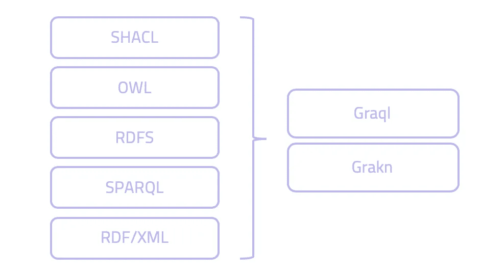
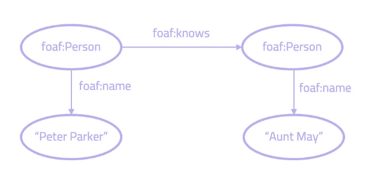
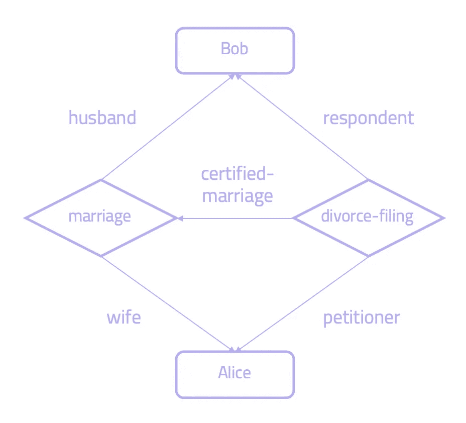

# 比较 Grakn 和语义 Web 技术—第 1/3 部分

> 原文：<https://towardsdatascience.com/comparing-grakn-to-semantic-web-technologies-part-1-3-3558c447214a?source=collection_archive---------31----------------------->

## 探索共同的概念和差异


观看本次网络研讨会，了解更多信息

本文探讨了 Grakn 与语义 Web 标准的比较，特别关注 RDF、XML、RDFS、OWL、SPARQL 和 SHACL。这两套技术之间有一些关键的相似之处——主要是因为它们都植根于符号人工智能、知识表示和自动推理领域。这些相似之处包括:

1.  两者都允许开发人员表示和查询复杂和异构的数据集。
2.  两者都提供了向复杂数据集添加语义的能力。
3.  两者都使用户能够对大量数据进行自动演绎推理。

然而，这些技术之间存在核心差异，因为它们是为不同类型的应用程序设计的。具体来说，*语义网*是为 Web 而构建的，不完整的数据来自许多来源，在这里任何人都可以对信息源之间的定义和映射做出贡献。相比之下，Grakn 不是为了在网络上共享数据而构建的，而是作为封闭世界组织的交易数据库。正因为如此，比较这两种技术有时感觉就像比较苹果和橘子。

这些差异可以总结如下:

1.  与语义网相比， **Grakn 降低了复杂性，同时保持了高度的表达能力**。有了 Grakn，我们不必学习不同的语义 Web 标准，每个标准都有很高的复杂性。这降低了进入的门槛。
2.  **Grakn 为处理复杂数据提供了比语义网标准更高层次的抽象。使用 RDF，我们用三元组来建模世界，这是一个比 Grakn 的实体-关系概念级模式更低级的数据模型。对高阶关系和复杂数据的建模和查询是 Grakn 的原生功能。**
3.  语义网标准是为网络而建立的，Grakn 适用于封闭世界系统。前者旨在处理开放网络上不完整数据的链接数据，而 Grakn 的工作方式类似于封闭环境中的传统数据库管理系统。

该文档显示，这两种技术在如何提供知识表示和自动推理工具方面有很大的重叠，并且在高层次上涵盖了最重要的概念，而没有涉及太多的细节。目标是帮助具有 RDF/OWL 背景的用户熟悉 Grakn。

# 语义网栈

语义网开始于 20 世纪 90 年代末，用一层形式语义来扩展 Web 的现有架构。它由许多标准组成，这些标准共同构成了语义 Web 栈。本文涉及的技术包括:XML、RDF、RDFS、OWL、SPARQL 和 SHACL。

*   RDF 是一种在 web 和 XML 上交换数据的标准。
*   RDFS 提供了一个模式和一些基本的本体论结构。
*   OWL 用描述逻辑的构造进一步增强了这一点。SPARQL 是查询和插入 RDF 数据的语言。
*   SHACL 提供了一组验证约束来逻辑验证数据。

除了这些标准，还有不同的库和实现可供用户选择，以便在实践中真正使用这些标准。例如，有几个库允许用户使用 RDF 或 SHACL(仅对于 Java，您可以在这两个库中选择: [TopBraid](https://github.com/TopQuadrant/shacl) 和 [Apache Jena](https://jena.apache.org/documentation/shacl/) )，但是它们都与标准略有不同，并且有各自的细微差别。

然而，尽管有很多可用的教育材料，语义网还没有在学术界之外被广泛采用。由于用户需要学习大量的技术，再加上它们固有的复杂性，用户在开始学习之前要花很长时间在语义网上自学。进入的门槛很高。这让大部分开发者很难入门。

相反，Grakn 只为用户提供了一种可以替代语义网中许多标准的技术(在本文中，我们将介绍 RDF、RDFS、OWL、SPARQL 和 SHACL)。这意味着，例如，构建应用程序的用户不需要学习使用什么类型的推理机、什么验证系统或什么查询语言。有了 Graql，所有这些都发生在同一技术中，用户只需要学习一次。

*Grakn 工作在更高的层次，更容易学习，降低了进入门槛，使数百万开发者能够接触到以前无法接触到的语义技术。在 Grakn 中，易用性是首要原则。*



我们用 Grakn 和 Graql 代替 RDF、SPARQL、RDFS、OWL 和 SHACL。

简而言之，Grakn 是一个知识图形式的分布式逻辑数据库，它实现了概念级的模式。该知识表示系统然后由自动推理引擎解释，该自动推理引擎在查询运行时执行自动演绎推理。查询、模式和推理都是通过 Grakn 的查询语言 Graql 进行的。

Grakn 的概念级模式的正式基础由*超图*提供，它与关系数据库的关系模型、语义网中的有向图以及图形数据库的属性图起着相同的作用。超图概括了边是什么的一般概念。在 RDF 和属性图中，边只是一对顶点。相反，*超图*是顶点的*集合*，它可以被进一步结构化。有向图模型的优势包括:

1.  **以关系方式将相关信息**分组的自然机制，这在很大程度上迷失在有向图中。
2.  **统一处理所有 n 元关系**，与有向图相反，在有向图中，与两个以上角色的关系需要对建模方法(n 元)进行彻底的改变。
3.  一种表达高阶信息的自然方式**(关系之间的关系，信息的嵌套)，在有向图中需要专门的建模技术(即具体化)。**

# 无线电测向

## **RDF 三元组**

RDF 是一个对数据建模并在网络上分发数据的系统。它是由带标签的有向多重图构成的，有顶点和带标签的边。这些由 URIs(事物)、文字(数据值)和空白节点(虚拟节点)组成。

RDF 以主-谓-宾的形式存储三元组，即一个接一个声明的原子语句。下面是一个人“Peter Parker”的例子，他知道另一个人“Aunt May”的 XML 符号。

```
<rdf:RDF xmlns:rdf="http://www.w3.org/1999/02/22-rdf-syntax-ns#"
         xmlns:foaf="http://xmlns.com/foaf/0.1/"
         xmlns:rdfs="http://www.w3.org/2000/01/rdf-schema#">
 <foaf:Person>
   <foaf:name>Peter Parker</foaf:name>  
   <foaf:knows>
       <foaf:Person>
         <foaf:name>Aunt May</foaf:name>
       </foaf:Person>   
   </foaf:knows>
 </foaf:Person>
</rdf:RDF>
```

正如我们所看到的，RDF 放弃了它在灵活性上获得的紧凑性。这意味着它可以是富于表现力的，同时又是极其精细的。数据点之间的每个关系都是显式声明的——关系要么存在，要么不存在。与传统的关系数据库相比，这使得合并不同来源的数据变得更加容易。上面的三元组构成了这个图:



*RDF 三元组的图形表示。*

Grakn 不支持三元组。相反，它公开了一个概念级的实体关系模型。因此，Grakn 不是以主-谓-对象的形式建模，而是在更高的层次上用实体、关系、角色和属性来表示我们的数据。对于上面的例子，我们会说有两个`person`实体，它们具有`name`属性，并且通过`knows`关系相关联。

```
$p isa person, has name "Peter Parker";
$p2 isa person, has name "Aunt May"; 
($p, $p2) isa knows;
```


*具有两个实体(“Peter Parker”和“May 阿姨”)和一个关系(“knows”)的 Grakn 模型。*

## 超关系

如前所述，Grakn 的数据模型是基于超图的。在 RDF 中，边只是一对顶点，而超边是一组顶点。Grakn 的数据模型的正式基础基于三个前提:

1.  超图由一组非空的顶点和一组超边组成
2.  超边是顶点的有限集合(通过它们在超边中扮演的特定角色来区分)
3.  超边本身也是一个顶点，并且可以由其他超边连接

*注意:*虽然 Grakn 利用了超边缘，但是 Grakn 实际上并没有暴露*边缘*或者*超边缘*。相反，它与*关系*或*超关系*一起工作。下图描述了这是如何工作的。该示例显示了两个*超级关系*:

*   *婚姻*，描述了分别扮演*丈夫*和*妻子*的*鲍勃*和*爱丽丝*之间的二元*婚姻*关系
*   *离婚申请*描述了一个三元*离婚申请*关系，涉及三个角色的角色扮演者*认证婚姻，申请人*和*答辩人*



*Grakn 中的超关系示例。*

超关系可以简单地看作任意基数的角色和角色扮演者对的集合。由于超关系不能在带标签的有向图中自然地表示，RDF 中的上述例子可能看起来像这样:


*RDF 中超关系的表示。*

如图所示，Grakn 中的每个*超关系*都可以映射到 RDF 模型中相应的有向图。例如，在这个模型中，实体和关系类型也被显式编码为 RDF 风格的 RDF 资源。因此，超关系可以在 RDF 三元组存储上实现。因此，就建模而言，超关系提供了一种非常自然和直接的数据表示形式，允许使用实体关系图在概念层次上建模。

然而，不同之处在于，在 Grakn 中，超关系成为一流的建模构造。这一点很重要，因为在现实生活中，当完整的概念模型在开始时不能完全预见时，实际的建模结果可能会产生许多不必要的复杂性。此外，与二进制有向边相比，本地模拟超关系导致查询规划和查询优化的改进，因为在相同结构“容器”中分组在一起的数据也经常由用户和应用程序在类似分组中检索。并且通过在查询之前确认它们的结构，可以更好地计划和执行检索过程。

## 名称空间

由于 Web 的公共性质，RDF 使用名称空间来解释和识别不同的本体，通常在文档的开头给出名称空间，以使其更具可读性。RDF 中的每个资源都有一个唯一的标识符。标签告诉它这是一个 RDF 文档:

```
rdf:RDF xmlns:rdf="http://www.w3.org/1999/02/22-rdf-syntax-ns#
```

由于 Grakn 不在网络上运行，因此不需要 URIs。一个相关的概念是`keyspaces`，它们是 Grakn 实例中逻辑上独立的数据库。与 RDF `namespace`不同的是，它们不能互相交谈。

## 连载

用文本形式表达 RDF 有很多种方法。一种常见的方法是用 XML 格式表示三元组(W3C 推荐):

```
<http://example.org/#spiderman>
  <http://www.perceive.net/schemas/relationship/enemyOf>
    <http://example.org/#green-goblin> .
<http://example.org/#green-goblin>
  <http://www.perceive.net/schemas/relationship/enemyOf>
    <http://example.org/#spiderman> .
```

然而，由于 XML 可能变得难以阅读， [*Turtle*](https://www.w3.org/TR/turtle/) 也可以用作更紧凑的序列化(其他流行的序列化格式包括 JSON-LD 和 N-triples)。有了*海龟*，我们用 qnames 代替本地 URIs。下面的例子代表了来自`foaf`名称空间的两个`Person`:“绿魔”和“蜘蛛侠”。它们通过来自`rel`名称空间的一个叫做`enemyOf`的关系连接在一起。

```
@base <http://example.org/> .
@prefix rdf: <http://www.w3.org/1999/02/22-rdf-syntax-ns#> .
@prefix rdfs: <http://www.w3.org/2000/01/rdf-schema#> .
@prefix foaf: <http://xmlns.com/foaf/0.1/> .
@prefix rel: <http://www.perceive.net/schemas/relationship/> .<#green-goblin>
    rel:enemyOf <#spiderman> ;
    a foaf:Person ;
    foaf:name "Green Goblin" .<#spiderman>
    rel:enemyOf <#green-goblin> ;
    a foaf:Person ;
    foaf:name "Spiderman" .
```

在 Grakn 中，我们不需要在多个序列化之间进行选择，而是使用 Graql。这个例子可以这样表示:

```
$g isa person, has name "Green Goblin"; 
$s isa person, has name "Spiderman"; 
(enemy: $g, enemy: $s) isa enemyship;
```

这里，我们有两个`person`实体，属性为`name`“绿魔”和“蜘蛛侠”。它们通过类型`enemyship`的关系连接在一起，两者都扮演`enemy`的角色。

## 高阶关系

给定三元组的主语/谓语/宾语形式，RDF 中的建模在表示更高阶的关系时会变得有限。举个例子，让我们看看这个三元组:

```
lit:HarryPotter bio:author lit:JKRowling .
```

这表明 JK 罗琳写了《哈利·波特》。然而，我们可能想通过说 JK 罗琳在 2000 年写了《哈利波特》来修饰这个说法。在 RDF 中，要做到这一点，我们需要经历一个称为具体化的过程，为每个语句创建一个三元组，其中三元组的主题是同一个节点:

```
bio:n1 bio:author lit:JKRowling .
bio:n1 bio:title "Harry Potter" .
bio:n1 bio:publicationDate 2000 .
```

在 Grakn 中，考虑到它的概念级模式，具体化的需要并不存在，我们可以自然地表示更高阶的关系。 *JK 罗琳写的《哈利·波特》*会这样表述:

```
$a isa person, has name "JK Rowling"; 
$b isa book, has name "Harry Potter"; 
(author: $a, publication: $b) isa authorship;
```

然后，如果我们想限定这一点，说 JK 罗琳在 2000 年写了《哈利·波特》，我们可以简单地给关系添加一个属性:

```
$a isa person, has name "JK Rowling"; 
$b isa book, has name "Harry Potter"; 
(author: $a, publication: $b) isa authorship, has date 2000;
```

## 空白节点

有时在 RDF 中，我们不想给出 URI 或字面量。在这种情况下，我们处理的是空白节点，即没有 Web 标识的匿名资源。一个例子是这样一种说法:哈利·波特的灵感来自于一个住在英国的人

```
lit: HarryPotter bio:name lit:"Harry Potter" .
lit:HarryPotter lit:hasInspiration [a :Man; 
			bio:livesIn geo:England] .
```

由于 Grakn 并不存在于 web 上，所以空白节点的概念并不能直接转化为 Grakn。虽然在 RDF 中我们使用空白节点来表示没有 URI 的*事物*的存在，但是在 Grakn 中有多种方法可以做到这一点。如果像上面的例子一样，我们使用一个空白节点来表示我们除了知道这个人住在英国之外，对他的其他情况一无所知，我们就这样表示:

```
$b isa book, has name "Harry Potter"; 
$m isa man; ($b, $m) isa inspiration; 
$l isa location, has name "England";
($m, $l) isa lives-in;
```

我们可以看到的是，变量`$m`被分配给实体类型`man`，除了他通过一个`lives-in`关系类型连接到实体类型`location`和`name`“英国】之外，没有给出进一步的信息。

*在第 2 部分(* [*链接此处*](https://medium.com/@tasabat/comparing-grakn-to-semantic-web-technologies-part-2-3-4602b56969fc) *)，我们看看 Grakn 是如何比较 SPARQL 和 RDFS 的。要了解更多信息，请务必通过* [*此链接*](https://discuss.grakn.ai/t/were-taking-our-summer-tour-online/1947/2) *参加我们即将举办的网络研讨会。*