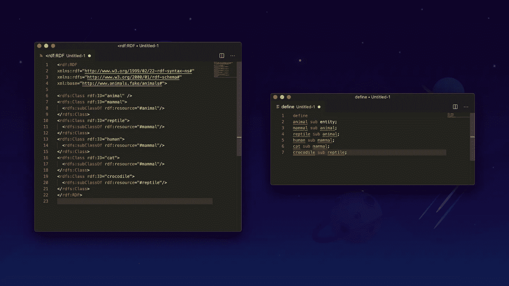
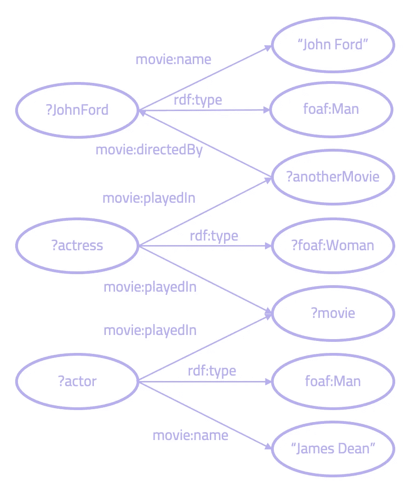
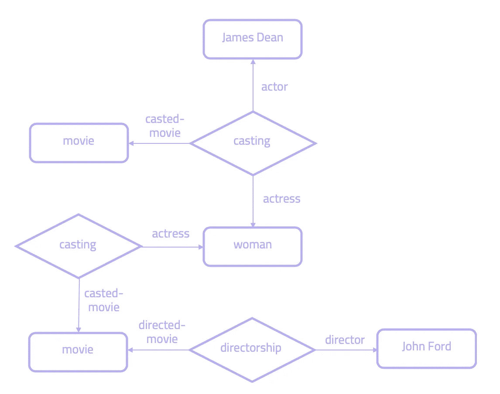

# 比较 Grakn 和语义 Web 技术—第 2/3 部分

> 原文：<https://towardsdatascience.com/comparing-grakn-to-semantic-web-technologies-part-2-3-4602b56969fc?source=collection_archive---------42----------------------->

## 探索共同的概念和差异



这是比较语义网技术和 Grakn 的第二部分。在 [*第一部分中，*](https://medium.com/@tasabat/comparing-grakn-to-semantic-web-technologies-part-1-3-3558c447214a) *我们看了 RDF 与 Grakn 的比较。在这一部分中，我们将特别关注 SPARQL 和 RDFS。如果你还没看完第 1 部分，跟着* [*这个链接*](https://medium.com/@tasabat/comparing-grakn-to-semantic-web-technologies-part-1-3-3558c447214a) *。*

*要了解更多信息，请务必通过* [*此链接*](https://discuss.grakn.ai/t/were-taking-our-summer-tour-online/1947/2) *参加我们即将举办的网络研讨会。*

# SPARQL

## 什么是 SPARQL

SPARQL 是一种 W3C 标准化语言，用于从数据库中查询可以映射到 RDF 的信息。与 SQL 类似，SPARQL 允许插入和查询数据。与 SQL 不同，查询不仅限于一个数据库，还可以跨多个 HTTP 端点进行联合。

作为 Grakn 的查询语言，Graql 是等价的查询语言。和 SPARQL 一样，Graql 允许插入和查询数据。然而，鉴于 Graql 不是作为开放的 Web 语言构建的，它不允许跨多个端点进行本地查询(这可以通过 Grakn 的一个客户端驱动程序来实现)。因此，Graql 更类似于 SQL 和其他传统的数据库管理系统。

## 使用 SPARQL 插入数据

为了将数据添加到默认的图形存储中，这个代码片段描述了如何使用 SPARQL 插入两个 RDF 三元组:

```
PREFIX dc: <http://purl.org/dc/elements/1.1/>
INSERT DATA
{ 
  <http://example/book1> dc:title "A new book" ;
                         dc:creator "A.N.Other" .
}
```

在 Graql 中，我们以`insert`语句开始，声明要插入数据。变量`$b`被分配给实体类型`book`，它有一个值为“一本新书”的`title`和一个值为“A.N.Other”的`creator`。

```
insert
$b isa book, has title "A new book", has creator "A.N.Other";
```

## 使用 SPARQL 查询

在 SPARQL 中，我们首先声明我们想要从中检索数据的端点，我们可以将这些端点附加到某个前缀上。在陈述我们想要返回的数据之前，实际的查询从`SELECT`开始。然后，在`WHERE`子句中，我们说明了 SPARQL 将找到匹配数据的图形模式。在这个查询中，我们使用名称空间`foaf`和`vCard`查找“Adam Smith”认识的所有人:

```
PREFIX foaf: <http://xmlns.com/foaf/0.1/>
PREFIX vCard: <http://www.w3.org/2001/vcard-rdf/3.0#>SELECT ?whom
WHERE {
	 ?person rdf:type  foaf:Person .
	 ?person vcard:family-name "Smith" .
    	 ?person vcard:given-name  "Adam" .
	 ?person foaf:knows ?whom .
 }
```

在 Graql 中，我们以`match`语句开始，声明我们想要检索数据。我们匹配类型为`person`的实体，它有一个`family-name`“史密斯”和一个`given-name`“亚当”。然后，我们通过一个`knows`关系类型将它连接到`$p2`。因为我们想知道“亚当·斯密”认识谁，所以我们希望返回到`$p2`，这在`get`语句中声明:

```
match $p isa person, has family-name "Smith", has given-name "Adam"; 
($p, $p2) isa knows; 
get $p2;
```

让我们来看一个不同的查询:*给我詹姆斯·迪恩演过的导演和电影，其中也有一个女人演过角色，并且那个女人在约翰·福特导演的电影中演过角色。下面是 SPARQL 代码和这个遍历类型查询的可视化表示。*

```
PREFIX  movie: <http://example.com/moviedb/0.1/>
PREFIX  rdf:  <http://www.w3.org/1999/02/22-rdf-syntax-ns#>
PREFIX  foaf: <http://xmlns.com/foaf/0.1/>

SELECT  ?director ?movie
WHERE{	
?actor    	 rdf:type             foaf:Man ;
          	 movie:name          "James Dean" ;
          	 movie:playedIn       ?movie .
?actress  	 movie:playedIn       ?movie ;
          	 rdf:type             foaf:Woman ;
          	 movie:playedIn       ?anotherMovie .
?JohnFord 	 rdf:type             foaf:Man ;
          	 movie:name           "John Ford" .
?anotherMovie	 movie:directedBy  ?JohnFord .
}
```



*Sparql 遍历查询的可视化表示。*

在 Grakn，我们可以这样问同样的问题:

```
match 
$p isa man, has name "James Dean"; 
$w isa woman; 
(actor: $p, actress: $w, casted-movie: $m) isa casting; 
(actress: $w, casted-movie: $m2) isa casting; 
$d isa man, has name "John Ford"; 
($m2, $d) isa directorship; get $d, $m;
```

这里，我们将具有属性`name`和值“James Dean”的实体类型`man`分配给变量`$p`。然后我们说`$w`是实体类型`woman`。这两个与`movie`以称为`casting`的三向关系连接。`woman`也在另一个`casting`关系中起作用，其中`movie`实体通过`directorship`关系连接到与此`movie`相关的“John Ford”。

在上面的例子中，Grakn 中的超级关系`casting`表示 SPARQL 中的两个`playedIn`属性。然而，在 SPARQL 中我们只能有两条边将`woman`和“詹姆斯·迪恩”与`movie`连接起来，而不能在它们之间。这显示了 Grakn 中的建模与 RDF 中的建模有多么根本的不同，因为 RDF 具有超图建模的能力。Grakn 允许在一个关系中自然地表示 N 个角色扮演者，而不必具体化模型。

示意性地，这是上面查询的可视化表示方式(注意三元关系`casting`):



*Grakn 中查询的可视化表示。*

## 否认

在 SPARQL 中，我们还可以使用关键字`NOT EXISTS`在查询中指定某些数据不存在。这将找到一个只有在子图不匹配时才匹配的图模式。在下面的例子中，我们寻找曾出演电影《巨人》但尚未去世的演员:

```
PREFIX movie: <http://example.com/moviedb/0.1/>SELECT ?actor
WHERE {
	  ?actor movie:playedIn movie:Giant .
	  NOT EXISTS {?actor movie:diedOn ?deathdate .
}
```

使用封闭世界假设，Grakn 支持否定。这是通过使用关键字`not`后跟要求反的模式来完成的。上面的例子表示如下:

```
match 
$m isa movie, has name "Giant"; ($a, $m) isa played-in; 
not {$a has death-date $dd;}; get $a;
```

在这里，我们寻找一个名为“Giant”的实体类型`movie`，它通过类型`played-in`的关系连接到`$a`和`actor`。在`not`子查询中，我们指定`$a`不能有带有任何值的`death-date`类型的属性。我们接着`get`演员`$a`。

# RDF 模式

由于 RDF 只是一种数据交换模型，它本身是“无模式的”。这就是为什么引入 RDF Schema (RDFS)来用基本的本体论语义扩展 RDF。例如，这些允许 RDF 数据上的简单类型层次。在 Grakn 中，Graql 被用作它的模式语言。

## RDFS 班级

RDFS 扩展了 RDF 词汇表，允许描述类和属性的分类法。RDFS 类将 RDFS 资源声明为其他资源的类。我们可以用`rdfs:Class`来简化它。使用 XML，创建一个带有子类`horse`的类`animal`，如下所示:

```
<?xml version="1.0"?><rdf:RDF
xmlns:rdf="http://www.w3.org/1999/02/22-rdf-syntax-ns#"
xmlns:rdfs="http://www.w3.org/2000/01/rdf-schema#"
xml:base="http://www.animals.fake/animals#"><rdfs:Class rdf:ID="animal" />
<rdfs:Class rdf:ID="horse">
  <rdfs:subClassOf rdf:resource="#animal"/>
</rdfs:Class>
</rdf:RDF>
```

要在 Grakn 中做同样的事情，我们应该这样写:

```
define 
animal sub entity; 
horse sub animal;
```

RDFS 还允许`Properties`的子类型:

```
<?xml version="1.0"?><rdf:RDF
xmlns:rdf="http://www.w3.org/1999/02/22-rdf-syntax-ns#"
xmlns:rdfs="http://www.w3.org/2000/01/rdf-schema#"
xml:base="http://www.animals.fake/animals#"><rdfs:Class rdf:ID="mammal" /><rdfs:Class rdf:ID="human">
  <rdfs:subClassOf rdf:resource="#mammal"/>
</rdfs:Class><rdfs:Property rdf:ID="employment" /><rdfs:Property rdf:ID="part-time-employment">
  <rdfs:subPropertyOf rdf:resource="#employment"/>
</rdfs:Property></rdf:RDF>
```

在 Grakn 中是这样的:

```
mammal sub entity; 
human sub mammal;
employment sub relation;
part-time-employment sub employment;
```

如示例所示，RDFS 主要描述了对象类型的构造(`Classes`)、相互继承(`subClasses`)、描述对象的属性(`Properties`)以及相互继承(`subProperty`)。这种子类型行为可以通过 Graql 的`sub`关键字获得，该关键字可用于创建 Grakn 中任何`thing` ( `entities`、`relations`和`attributes`)的类型层次结构。

然而，在 Grakn 中的`class`到`entity`或者在 Grakn 中的`property`到`relation`之间创建一对一的映射，尽管它们看起来很相似，但不应该总是这样做。这是因为 RDF 中的模型是使用较低级别的数据模型构建的，以三元组工作，而 Grakn 能够在较高级别建模。

## 多重遗传

Grakn 和语义网之间一个重要的建模差异是关于多重继承。在 RDFS，一个类可以有许多命名的或逻辑推断的超类。让我们举这个例子:

```
company      rdf:type  rdfs:Class
government   rdf:type  rdfs:Classemployer     rdf:type         rdfs:Class
employer     rdfs:subClassOf  company
employer     rdfs:subClassOf  government
```

这将一个`employer`建模为类`company`和`government`。然而，尽管这看起来可能是正确的，问题是多重继承，作为一个建模概念，经常没有以正确的方式使用。多重继承应该对事物进行分组，而不是对“类型”进行子类化，其中每个类型都是其他事物的定义。换句话说，我们不想表示数据的实例。这是一个常见的错误。

Grakn 支持单一类型继承，而不是多重继承，在这种情况下，我们应该分配`role`而不是多重类。一个`role`在一个`relation`的上下文中定义了一个`thing`的行为和方面，我们可以将多个`role`分配给一个`thing`(注意，当类型继承另一个类型时，角色被继承)。

比如一个`government`可以雇佣一个`person`，一个`company`可以雇佣一个`person`。有人可能会建议创建一个继承了可以使用`person`的`government`和`company`的类，并以子类化这两者的`employer`类结束(如上例所示)。

然而，这是对继承的滥用。在这种情况下，我们应该创建一个角色`employer`，它与一个`employment`关系相关联，并将一个`company`或`government`如何参与到该关系中联系起来(通过扮演`employer`的角色)。

```
company sub entity,
    plays employer;government sub entity,
    plays employer;employment sub relation,
    relates employer;
```

## rdfs:域和 rdfs:范围

`rdf:property`的两个常用实例包括`domain`和`range`。这些用于分别声明属性的成员或值是一个或多个类的实例。下面是一个`rdfs:domain`的例子:

```
:publishedOn rdfs:domain :PublishedBook
```

这里，`rdfs:domain`将类`Person`分配给`hasBrother`属性的主题。

这是一个`rdfs:range`的例子:

```
:hasBrother rdfs:range :Male
```

这里，`rdfs:range`将类`Male`分配给`hasBrother`属性的对象。

在 Grakn 中，没有直接实现`range`和`domain`。从它们中得出的基本推断要么已经通过使用`role`在 Grakn 数据模型中被本地表示，要么我们可以创建`rule`来表示我们想要推断的逻辑。

但是，请记住，在 Grakn 中使用规则可以提供更多的表达能力，允许我们表示我们想要进行的推理类型。简而言之，将`range`和`domain`翻译成 Grakn 应该根据具体情况进行。

在上面的例子中，`rdfs:domain`可以翻译成 Grakn，即当一个实体有一个属性类型`published-date`时，它在一个`publishing`关系类型中扮演`published-book`的角色。这体现在 Grakn 规则中:

```
when {
	$b has published-date $pd; 
}, then {
	(published-book: $b) is publishing; 
};
```

可以使用以下 Grakn 规则创建`rdfs:range`的示例，该规则添加值为“男性”的属性类型`gender`，前提是在任何`siblingship`关系中，a `person`扮演角色`brother`，其中其他兄弟的数量为 n

```
when {
	$r (brother: $p) isa siblingship; 
}, then {
	$p has gender "male";  
};
```

我们再来看另一个例子。在海事环境中，如果我们有一艘`DepartingVessel`级的船只，它具有指定的属性`nextDeparture`，我们可以声明:

```
ship:Vessel rdf:type rdfs:Class .
ship:DepartingVessel rdf:type rdfs:Class .
ship:nextDeparture rdf:type rdf:Property .
ship:QEII a ship:Vessel .
ship:QEII ship:nextDeparture "Mar 4, 2010" .
```

通过下面的`rdfs:Domain`，任何指定了`nextDeparture`的船只将被推断为`DepartingVessel`类的成员。在这个例子中，这意味着 QEII 被分配了`DepartingVessel`类。

```
ship:nextDeparture rdfs:domain ship:DepartingVessel .
```

为了在 Grakn 中做同样的事情，我们可以编写一个规则，找到所有具有属性`next-departure`的实体，并将它们分配给一个扮演`departing-vessel`角色的关系`departure`。

```
when {
	$s has next-departure $nd; 
}, then {
	(departing-vessel: $s) isa departure; 
};
```

然后，如果该数据被摄取:

```
$s isa vessel, has name "QEII", has next-departure "Mar 4, 2010";
```

Grakn 推断 QEII 号船在`departure`关系中扮演`departing-vessel`的角色，相当于本案例中的`nextDeparture`级。

在 web 环境中使用`rdfs:domain`和`rdfs:range`非常有用，在 web 环境中，联邦数据经常会被发现是不完整的。由于 Grakn 不存在于 web 上，所以对这些概念的需求减少了。此外，这些推断数据的大部分已经在 Grakn 的概念模型中进行了本地表示。这很大程度上是由于它的高层模型和规则的使用。因此，在 Grakn 中将`rdfs:range`和`rdfs:domain`直接映射到一个概念通常是幼稚的，会导致冗余。相反，将这些概念转换成 Grakn 应该使用规则和角色根据具体情况来完成。

*在最后的第 3 部分(* [*链接此处*](https://medium.com/@tasabat/comparing-grakn-to-semantic-web-technologies-part-3-3-cb2fb233fbd5) *)，我们看看 Grakn 是如何比较 OWL 和 SHACL 的。要了解更多信息，请务必通过* [*此链接*](https://discuss.grakn.ai/t/were-taking-our-summer-tour-online/1947/2) *参加我们即将举办的网络研讨会。*