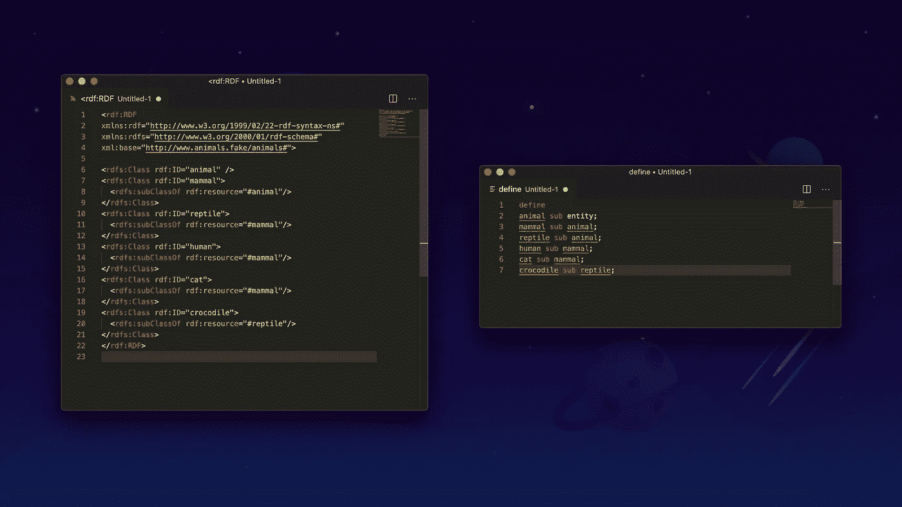

# 比较 Grakn 和语义 Web 技术—第 3/3 部分

> 原文：<https://towardsdatascience.com/comparing-grakn-to-semantic-web-technologies-part-3-3-cb2fb233fbd5?source=collection_archive---------40----------------------->

## 探索共同的概念和差异



这是比较语义网技术和 Grakn 的第三部分。在前两部分中，我们研究了 RDF、RDFS 和 SPARQL 与 Grakn 的比较。在这一部分，我们特别关注 OWL 和 SHACL。如果你还没看完第 1 部分，跟着 [*这个链接*](https://medium.com/@tasabat/comparing-grakn-to-semantic-web-technologies-part-1-3-3558c447214a) *，或者第 2 部分上* [*这个链接*](https://medium.com/@tasabat/comparing-grakn-to-semantic-web-technologies-part-2-3-4602b56969fc) *。*

*要了解更多信息，请务必通过* [*此链接*](https://discuss.grakn.ai/t/were-taking-our-summer-tour-online/1947/2) *参加我们即将举办的网络研讨会。*

# 猫头鹰

## 猫头鹰和 Grakn

OWL 是一种基于描述逻辑(DL)的本体语言，它在 RDFS 的基础上增加了本体结构来表达条件和推导新的事实。为了有意义地使用它们，OWL 提供了不同的风格:OWL QL、OWL RL、OWL DL，用户需要决定哪一个最适合他们的用例。

另一方面，Grakn 自带内置的本地推理功能。这是一个重要的区别，因为 OWL 假设用户对逻辑领域有很好的理解，而使用 Grakn 不需要用户对这个领域有广泛的研究。

结果是 OWL 在表达性和复杂性之间努力保持令人满意的平衡。仅仅为了推理两个简单的约束:*每个父母都有一个孩子*和*每个孩子都是一个人*需要使用成熟的 OWL DL 推理器。此外，OWL 不适合复杂关系的推理。它的正式基础基于树模型属性，这使它更适合树形数据，但对于更复杂的数据伸缩性较差。

OWL 采用开放世界假设，而不是 Grakn 的封闭世界假设。这意味着在 OWL 有约束的例子中:*每个父母必须至少有一个孩子*，如果我们有一个人没有孩子，这仍然符合约束，因为我们可能还不知道 John 的孩子。然而，根据 Grakn 的封闭世界假设，如果没有实际提到约翰的孩子，这意味着他真的没有任何孩子，也不是父母。

开放世界的假设非常适合于开放式网络，它包含来自多个来源的不完全信息，这就是为什么 OWL 提供了许多概念来管理和处理这种不完全性。然而，由于这种开放世界的假设，OWL 很难验证数据的一致性。这就是关系数据库维护模式约束以保证数据质量的原因。Grakn 结合了两种类型的推理:本体类型的开放世界推理和模式类型的封闭世界约束检查。

所有的东西放在一起，OWL 对于非逻辑学家来说有着非常高的入门门槛。由于它基于描述逻辑，开发人员避免使用 OWL，因为理解这种语言及其预期行为非常重要。正因为如此，Grakn 的知识表示形式仍然是轻量级的，为比 OWL 更多的受众提供了语义能力。换句话说，Grakn 比 OWL 更容易使用。

在这里，我们看看 OWL 中的一些常见公理，并将它们与 Grakn 进行比较。这不是一个详尽的列表，提供它是为了帮助用户理解如何考虑迁移到 Grakn。

## 限制

OWL 的一个关键功能是定义限制类(`owl:Restriction`)。这些未命名的类是基于该类的某些属性值的限制而定义的。OWL 允许对某个类的某些成员需要具有某些属性的情况进行建模。限制允许区分适用于一个类的所有成员的东西。通过给出一个描述来定义一个限制，该描述限制了关于该类成员的事情的种类。

一个例子是限制`AllValuesFrom`，它声明在特定类的上下文中，属性的范围应该总是特定的类。例如，如果`AllValuesFrom`已经被申请为`Person`类，并且这被应用到具有`Person`的`hasParent`的范围，那么它们只能有`Person`父类，而`Animal`不能有`Person`父类。下面的例子也表明只有`Animal` s 可以有`Animal` -parents。

```
:Person
  a owl:Class ;
  rdfs:subClassOf
    [ a owl:Restriction ;
      owl:onProperty :hasParent ;
      owl:allValuesFrom :Person
   ] .:Animal
  a owl:Class ;
  rdfs:subClassOf
    [ a owl:Restriction ;
      owl:onProperty :hasParent ;
      owl:allValuesFrom :Animal
   ] .
```

为了在 Grakn 中实现这一点，在模式定义中表示了限制。创建`person`和`animal`实体类型和两个带约束的关系:`person-parentship`和`animal-parenthship`。前者仅与`person`相关，后者与`animal`相关。

```
person sub entity, 
plays person-child,
plays person-parent;animal sub entity,
plays animal-child,
plays animal-parent;parentship sub relation, abstract;person-parentship sub parentship,
relates person-child,
relates person-parent;animal-parentship sub parentship;
relates animal-child,
relates animal-parent;
```

## 传递属性

OWL 中一个常见的推论是传递性。这说明关系 R 被说成是*传递的*，如果 A 用 R(a，B)连接到 B，B 用 R(b，C)连接到 C，这暗示 A 用 R(a，C)连接到 C。构造`owl:TransitiveProperty`用于此目的。下面的例子可以推断国王十字车站位于欧洲。

```
:isLocated rdf:type owl:TransitiveProperty.:KingsCross isLocated :London.
:London isLocated :UK.
:UK isLocated :Europe.
```

在 Grakn 中，将创建一个规则来表示传递性:

```
when {
	$r1 (located: $a, locating: $b); 
	$r2 (located: $b, locating: $c); 	
}, then {
	(located: $a, locating: $c);
};
```

一旦定义了规则，如果加载了此数据:

```
insert 
$a isa city, has name "London"; 
$b isa country, has name "Uk"; 
$c isa continent, has name "Europe"; 
(located: $a, locating: $b); (located: $b, locating: $c);
```

如果我们接着查询:

```
match  
$b isa continent, has name "Europe"; 
(located: $a, locating: $b); get $a;
```

这不仅会产生与`continent`“欧洲”有直接关系的`country`“英国”，而且还会产生与`continent`“欧洲”有过渡关系的`city`“伦敦”。

## 等效属性

OWL 还提供了一个构造来模拟等价的属性。这表明两个属性具有相同的属性扩展。一个例子:

```
:borrows owl:equivalentProperty :checkedOut .
```

这可以用 Grakn 中的规则来表示，其中可以推断出如下新关系`checked-out`:

```
when {
    (borrower: $x, borrowing: $y) isa borrowing;
}, 
then {
    (checking-out: $x, checked-out: $y) isa checked-out;
};
```

## 对称属性

对称关系表示一种具有自身反向属性的关系。例如，如果 Susan 通过一个`hasSibling`属性与 Bob 相关，那么可以推断 Bob 也通过一个`hasSibling`属性与 Susan 相关。

```
:hasSibling rdf:type owl:SymmetricProperty .
```

在 Grakn 中，对称性可以通过简单地在一个或多个关系中重复角色来建模:

```
(sibling: $p, sibling: $p2) isa siblingship;
```

换句话说，在 OWL 中需要显式构造的东西是 Grakn 模型固有的，也就是说，对称性规则不需要显式。然而，这也是 OWL 和 Grakn 比较困难的地方，因为两者服务于不同的用例。特别是，鉴于 Grakn 的封闭世界假设，OWL 中的许多问题根本不存在。

## 功能属性

这就是我们如何建模更多 OWL 结构的方法。`owl:FunctionalProperty`表示如下:

```
hasFather rdf:type owl:FunctionalProperty .
```

在 Grakn 中，可以使用一个规则:

```
when {
	(father: $x, child: $ y) isa fatherhood;
	(father: $d, child: $ y) isa fatherhood;
}, 
then {
	(father: $x, father: $y) isa same-father;
};
```

## 的交叉

如果我们在这个例子中使用`owl:intersectionOf`:

```
:Mother rdfs:subClassOf [ owl:interesctionOf ( :Female :Parent ) ]
```

如果资源既是`:Female`又是`Parent`，那么这将分配类`:Mother`。在 Grakn 中，我们可以选择使用包含连接条件的规则来表示这一点:

```
when {
	$p isa person, has gender "female"; 
	(mother: $p) isa motherhood; 
}, 
then {
	(parent: $p) isa parenthood; 
};
```

## 工会联合会

如果我们有这个`owl:unionOf`的例子:

```
:Person owl:equivalentClass [ owl:unionOf (: Woman :Man ) ]
```

如果资源是类`:Woman`或`:Man`，则分配类`:Person`。在 Grakn 中，如果我们想达到同样的目的，一种方法是使用类型继承:

```
person sub entity; 
man sub person;
woman sub person;
```

## 散列值

`owl:hasValue`限制可以规定红葡萄酒应该具有颜色“红色”作为其`color`属性的值:

```
:RedWine
  a owl:Class ;
  rdfs:subClassOf
    [ a owl:Restriction ;
      owl:onProperty :color ;
      owl:hasValue "red" 
    ] .
```

在 Grakn 中，可以使用一个规则来表示这一点:

```
when {
	$w isa red-wine; 
}, 
then {
	$w has color "red"; 
};
```

## 哈斯尔夫

限制可以说明自恋者爱自己。

```
:Narcissist rdfs:subClassOf
	[ owl:hasSelf true ; owl:onProperty :loves ]
```

这可以用 Grakn 表示:

```
when {
	$n isa narcissist; 
}, 
then {
	(loving: $n) isa loves; 
};
```

如前所述，Grakn 不是为 OWL 的相同用例而构建的。因此，无法进行一对一的直接映射。例如，当处理多个类时，需要考虑建模决策:在 Grakn 中，哪些成为实体，哪些成为角色。

# 向 SHACL 核实

传统上，RDF 不能确保接收的数据符合一组条件——即模式。这就是 SHACL 标准的作用，它在提交之前检查 RDF 是否与模式逻辑一致。还有其他检查逻辑验证的方法，只是实现略有不同。

像 SHACL 一样，Grakn 也检查有效性，并强调与数据质量有关的问题。但是尽管 SHACL 只是一个验证模式，Grakn 却实现了一个语义模式。

使用验证模式时，如果被摄取的数据源包含模式冲突，事务将失败。然后，我们会查看来源，对其进行筛选，并再次摄取。使用语义模式，我们可以加载数据，验证数据，并标记数据是否违规。然后我们可以在它们被载入的时候在线处理它们。

从这个意义上说，语义模式为您提供了额外的保证，即所有获取的数据都符合您的模式。这意味着数据库中的所有数据都与已定义的模式一致。

SHACL 中的代码片段显示了数据需要如何遵守某些限制:

```
:Person a sh:NodeShape, rdfs:Class ;
	sh:property [
	sh:path schema:worksFor ;
	sh:node :Company ;
] .:Company a sh:Shape ;
	sh:property [
	sh:path     schema:name ;
	sh:datatype xsd:string;
] .
```

在 Grakn 中，这种验证发生在 Graql 的模式语言中。`Person`实体定义为在`employment`关系中只扮演`employee`的角色，通过`employer`的角色与`company`实体相关联，包括类型`name`和值`string`的属性。

```
define 
person sub entity, 
	plays employee; 
company sub entity, 
	has name,
	plays employer; 
employment sub relation, 
	relates employer,
	relates employee;
name sub attribute, value string;
```

# 结论

总之，我们已经看到了:

1.  与语义网相比，Grakn 降低了复杂性，同时保持了高度的表达能力。有了 Grakn，我们不必学习不同的语义 Web 标准，每个标准都有很高的复杂性。这降低了进入的门槛。
2.  与语义网标准相比，Grakn 为处理复杂数据提供了更高层次的抽象。使用 RDF，我们用三元组来建模世界，这是一个比 Grakn 的实体-关系概念级模式更低级的数据模型。对高阶关系和复杂数据的建模和查询是 Grakn 的原生功能。
3.  **语义网标准是为网络构建的，Grakn 适用于封闭世界系统**。前者旨在处理开放网络上不完整数据的链接数据，而 Grakn 的工作方式类似于封闭环境中的传统数据库管理系统。

Grakn 为我们提供了一种语言，这种语言为我们提供了概念级模型、类型系统、查询语言、推理引擎和模式验证。用语义 Web 标准做同样的事情需要多种标准和它们各自的实现，每种标准都有自己固有的复杂性。特别是，OWL 的特性非常丰富，这导致了高度的复杂性，使它不适合大多数软件应用程序。相反，在处理知识表示和自动推理时，Grakn 提供了复杂性和表达性之间的适当平衡。

这种比较旨在提供两种技术之间的高层次的相似性和差异，但是，当然，Grakn 和语义 Web 还有比我们在这里试图展示的更多的东西。

*要了解更多信息，请务必通过* [*此链接*](https://discuss.grakn.ai/t/were-taking-our-summer-tour-online/1947/2) *参加我们即将举办的网络研讨会。*