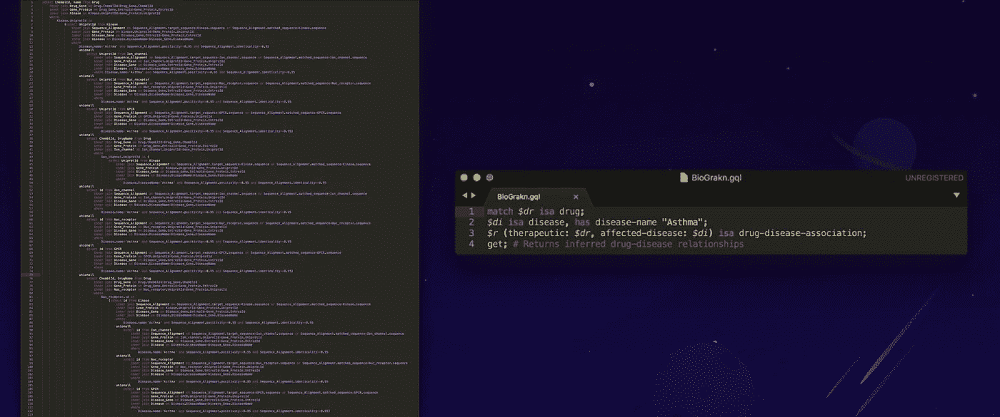
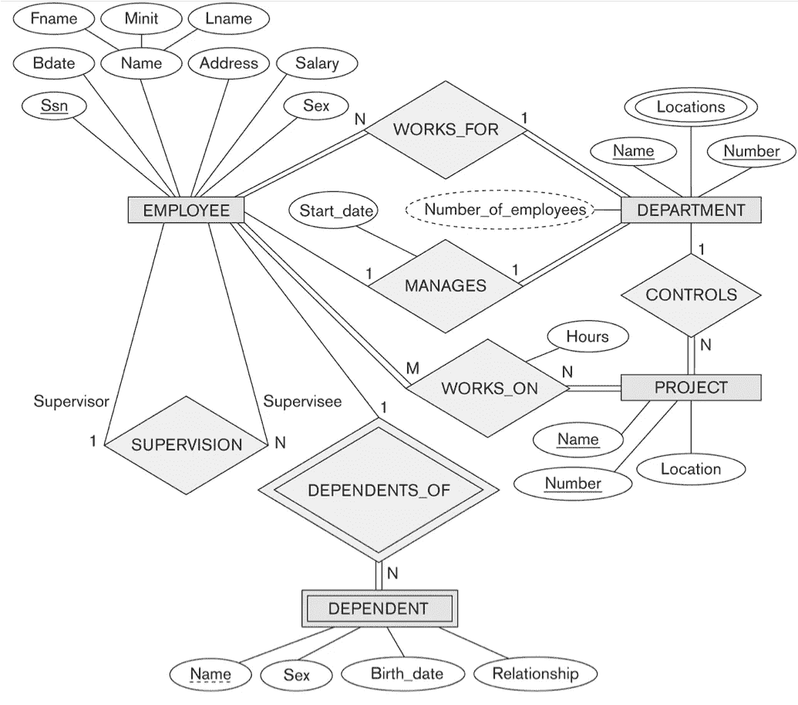
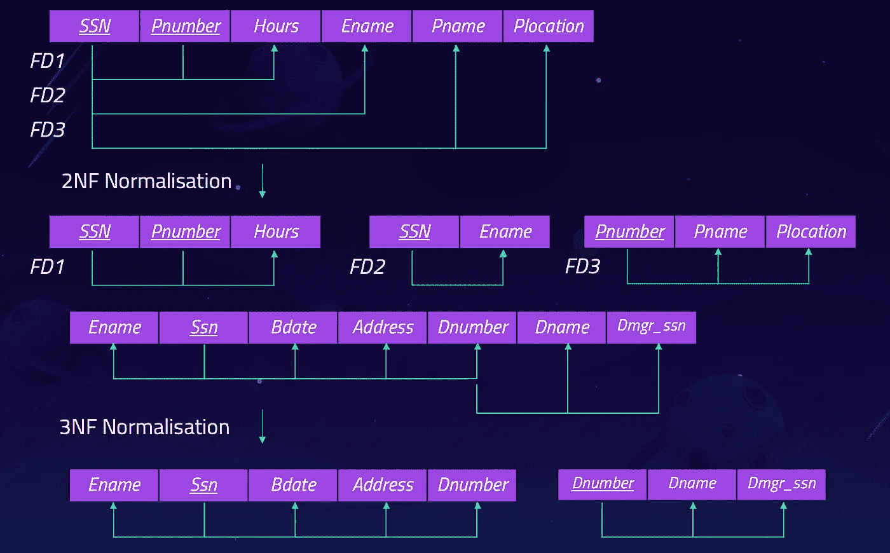
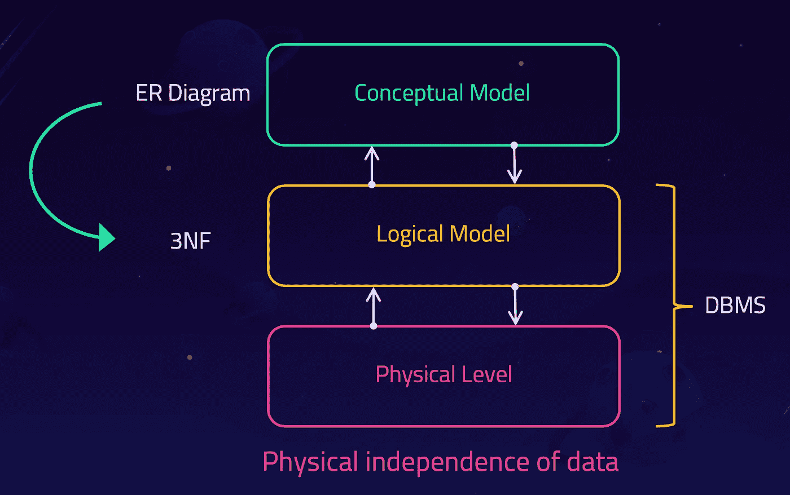
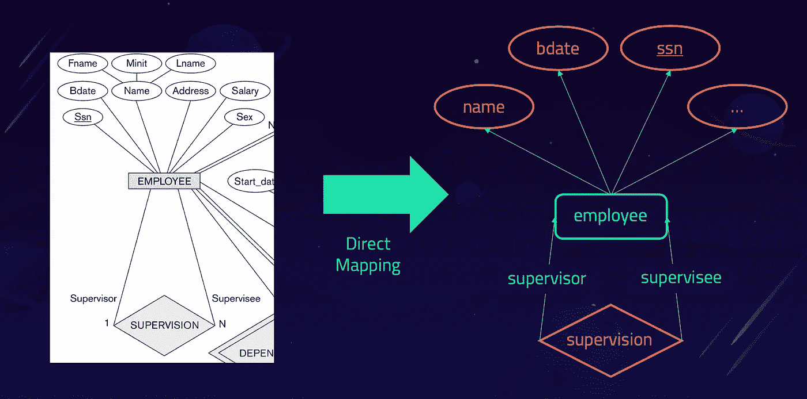
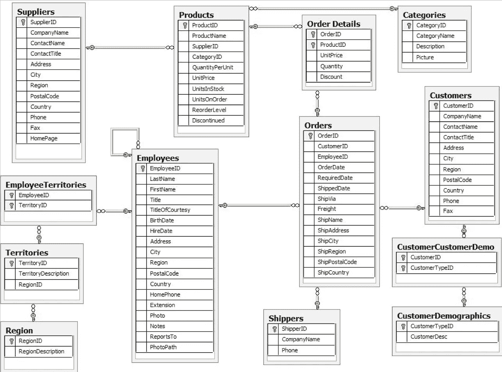

# 比较 Graql 和 SQL —第 1/2 部分

> 原文：<https://towardsdatascience.com/comparing-graql-to-sql-part-1-2-ead496130a0c?source=collection_archive---------39----------------------->

## 探索共同的概念和差异

自 20 世纪 70 年代以来，SQL 一直是处理数据库的事实语言。作为一种声明式语言，编写查询和构建强大的应用程序非常简单。然而，关系数据库在处理互连的复杂数据时会遇到困难。在 SQL 中处理这类数据时，尤其是在数据的建模和查询方面会出现挑战。

Graql 是在 [Grakn](https://github.com/graknlabs/grakn) 中使用的查询语言。就像 SQL 是关系数据库中的标准查询语言一样，Graql 是 Grakn 的查询语言。SQL 和 Graql 都是声明式查询语言，抽象出了低级操作。两者都是:

*   尝试可读性和可理解性的语言
*   试图在更高层次上提问的语言
*   系统计算出如何进行底层操作的语言

实际上，这意味着那些原本无法接触到这些语言的人群可以接触到这些语言。在本文中，当我们查看特定的通用概念时，我们将重点比较和探索这两种语言之间的差异。

# SQL 和关系模型的起源

1970 年，一位牛津毕业的数学家名叫 [Edgar Codd](https://en.wikipedia.org/wiki/Edgar_F._Codd) ，也就是所谓的“ted ”,发表了一篇[论文](https://dl.acm.org/doi/10.1145/362384.362685),在论文中，他引入了两种语言——一种关系代数和一种关系微积分来表达极其复杂的查询。当它们问世时，被认为是一种奇怪的数学符号。为了将这些想法构建到数据库管理系统中，Ted 创建了一个名为 [System R](https://en.wikipedia.org/wiki/IBM_System_R) 的研究小组，该小组基于圣何塞的 IBM 研究机构。

那时，数据库主要基于[导航](https://databasemanagement.fandom.com/wiki/Navigational_Database)、[网络](https://www.techopedia.com/definition/20971/network-database)和[层级](https://www.techopedia.com/definition/19782/hierarchical-database)模型，在我们能够编写描述我们的查询的导航计划之前，我们需要知道物理数据层。然而，Ted 看到了其中固有的复杂性，并希望使编写数据库查询变得更容易。

然而，由于 Ted 的想法是基于数学符号和数学象征的，它们很难理解，大多数人也不太容易理解，所以两位 System R 成员通过创建一种简单的查询语言来解决这个问题 based。由于这种新语言完全基于英语单词，这成为一个突破，使人们更容易理解 Ted 的简单思想。

到 20 世纪 70 年代末，关系数据库越来越受欢迎，世界开始接受 SQL 和关系模型比它的前辈优越。此后的故事众所周知——随着世界进入数字革命，关系数据库已经成为构建软件的标准。

# SQL 和 Graql 的本质

在理解 Graql 时，看看创建 SQL 的基本思想是很有用的，因为它们在概念上是密切相关的。Graql 和 SQL 的本质可以总结如下:

1.  **一种可以直观阅读和理解的语言。当一种语言看起来简单、可维护并且与自然文本有一定程度的相似性时，我们说它满足这些标准。**
2.  **一种能够提出更高层次问题的语言。**这里我们指的是一种允许用户在新的和更高的语义层次上描述操作的语言。
3.  一种语言，在这种语言中，系统计算出如何进行低级操作。当用户描述更高层次的操作时，系统会处理这些操作，而无需用户去想它们。

从这个意义上说，SQL 和 Graql 都是抽象低级操作的语言。实际上，这意味着那些原本无法接触到这些语言的人群可以接触到这些语言。这意味着它们能够创造价值，而那些已经可以使用它们的人现在可以更快地做事。Python 也有类似的情况，例如，它是一种高级编程语言，使数百万程序员能够构建软件，而不必担心被抽象掉的低级操作。

# 建模和定义模式

首先，让我们看看 SQL 和 Graql 之间的数据建模有何不同。我们使用[实体关系图](https://en.wikipedia.org/wiki/Entity%E2%80%93relationship_model) (ER 图)，因为它是最常用的建模工具。基本模型由实体类型和它们之间可能存在的关系组成。下面是一个 ER 图示例。我们称之为概念模型。

*ER 图示例。正方形是实体，菱形是关系，圆形是属性。*

# SQL 建模

如果我们在关系数据库中实现这个模型，我们首先要经历一个规范化过程。我们从[第一范式](https://en.wikipedia.org/wiki/First_normal_form) (1NF)开始，通过寻找诸如函数依赖和传递依赖之类的东西，我们最终得到我们想要的[第三范式](https://en.wikipedia.org/wiki/Third_normal_form) (3NF)。

*从 1NF 归一化到 3NF。*

在这个规范化过程之后，我们在 3NF 中得到我们的逻辑模型，并在关系数据库中实现它。我们已经从概念模型(ER 图)发展到逻辑模型(3NF)，甚至不需要深入到数据库的物理层。这正是关系模型带给我们的突破——抽象出物理层次。我们称之为数据的物理独立性。

*SQL 给了我们数据的物理独立性。*

# Graql 建模

现在让我们来看看它与 Graql 有何不同。*我们可以将任何 ER 图直接映射到我们如何在 Graql* 中实现它，这意味着我们不需要经过规范化过程。下面我们可以看到早期 er 图的特定部分是如何建模的。我们避免了进行任何标准化的需要，因为 Graql 使我们能够创建一个带有实体、关系、属性和角色的 ER 图的直接映射，以便我们稍后在代码中实现它。这与 SQL 不同，在 SQL 中，我们需要在模型上强加一个表格结构作为逻辑层(如上所述)。

*ER 图(左)到 Graql 模型(右)。*

这意味着我们完全跳过了 SQL 中所需的规范化过程，我们继续在概念模型上工作。换句话说，Graql 抽象出了逻辑和物理模型。从这个意义上说，SQL 给了我们数据的物理独立性，而 Graql 给了我们数据的逻辑独立性。

通过在概念层面建模，Graql 为我们提供了逻辑模型的抽象。

# 在 SQL 和 Graql 中定义模式

现在我们来看一些真实的数据。任何学习过 SQL 的人可能都熟悉 Northwind 数据集。它包含虚构的专业食品进出口公司 Northwind Traders 的销售数据。

北风模式。

我们如何在 Graql 和 SQL 中定义上面显示的`products`表？下面我们看到 Graql 语法定义了`product`实体，以及相应的`relation`。这也显示了创建新表的`SQL`语句和相应的属性。

Graql

结构化查询语言

几个要点:

*   这里我们可以看到 SQL 表有三个属性，每个属性都有自己的数据类型，我们也可以在 Graql 中定义。其中一个属性是`primary key`，我们在 Graql 中使用`key`关键字定义了它。
*   在 SQL 语句中，还有一个`foreign key`，根据我们的模型，我们将其建模为 Graql 中的相关`relation`。我们通过使用角色`product-assignment`将`product`实体连接到`assignment`关系来做到这一点。
*   在 Graql 中，没有`null`值的概念。如果一个概念没有属性，它就真的没有属性。这是因为在图上下文中，空属性被简单地从图中省略了。
*   最后，重要的一点是，在 Graql 模型中，属性是[一等公民](https://en.wikipedia.org/wiki/First-class_citizen)，不像在 SQL 中。

总结一下:

*   将 ER 图建模为 SQL 包含一个从 1NF 到 3NF 的规范化过程
*   ER 图自然地映射到 Graql，不需要执行任何类型的规范化

*在第 2 部分中(* [*链接此处*](https://blog.grakn.ai/comparing-graql-to-sql-part-2-2-745f79e9528d) *)，我们看看如何读/写数据，以及我们应该如何在 Graql 中利用超图和自动推理进行更高级别的建模。*