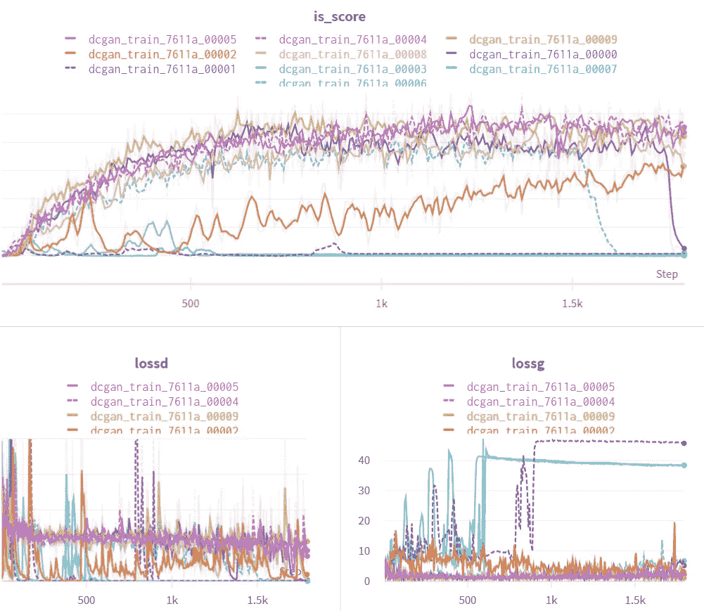
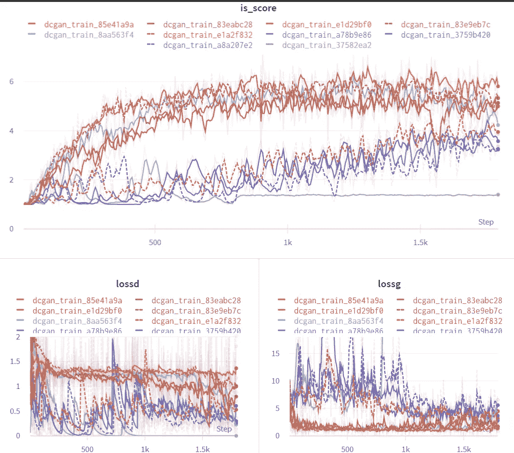
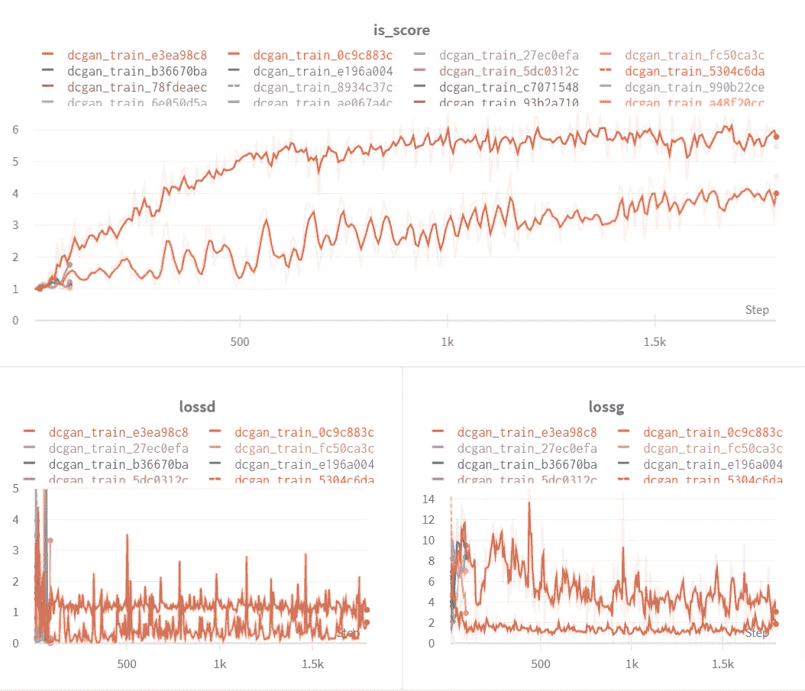
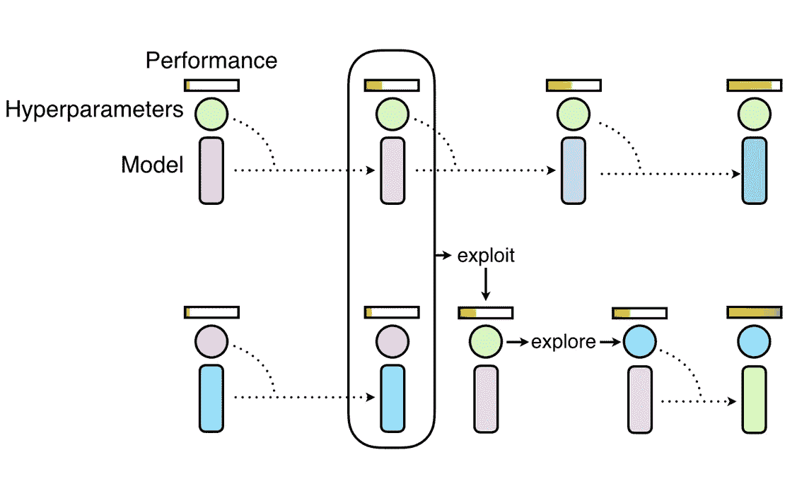
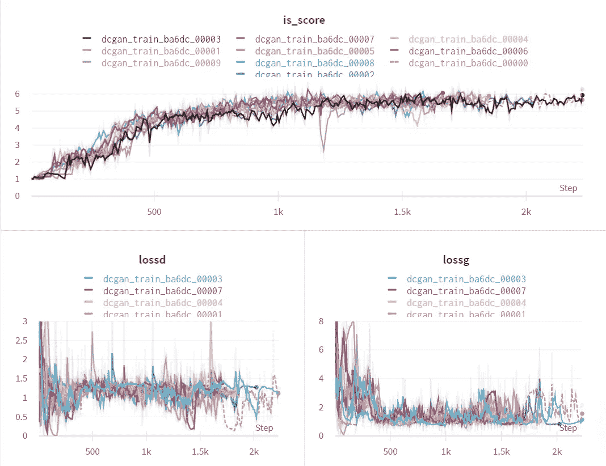
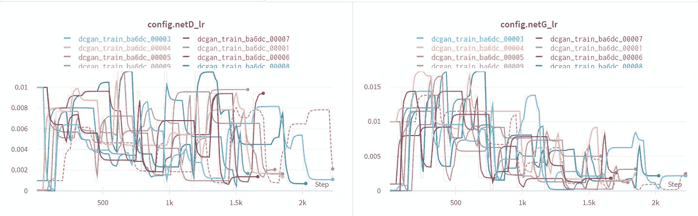
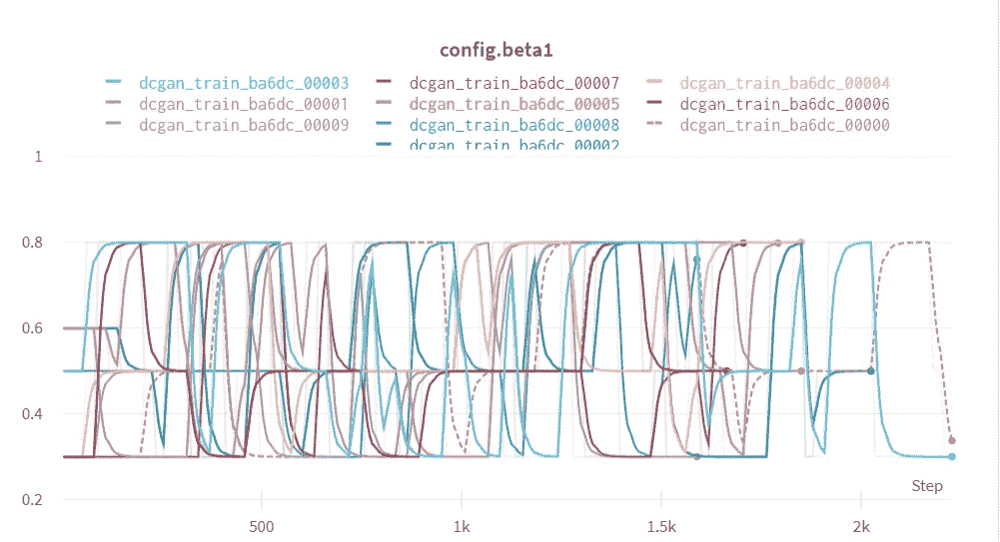
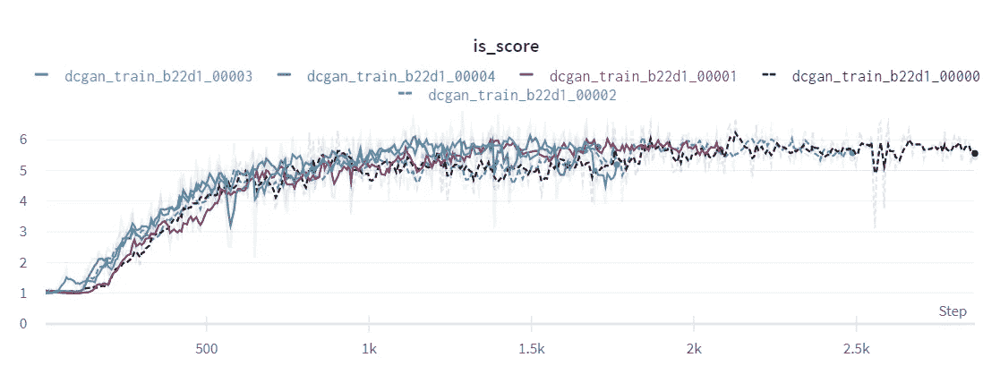
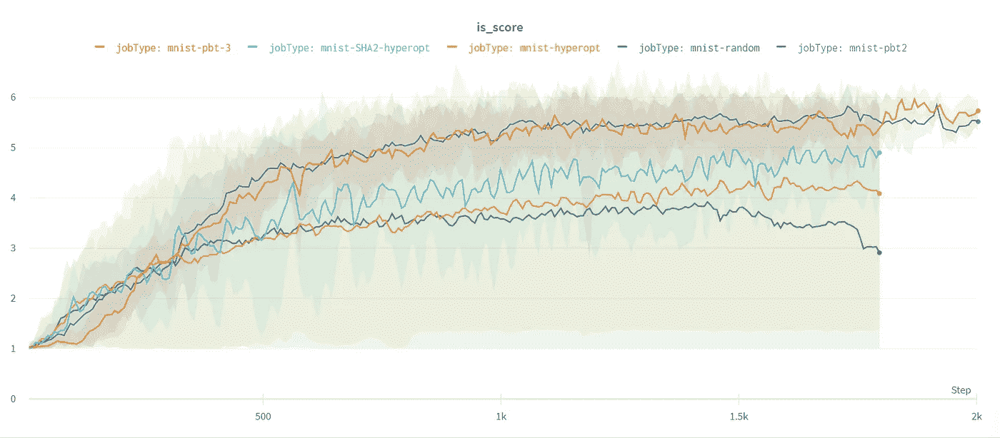

# 比较现代可扩展超参数调整方法

> 原文：<https://towardsdatascience.com/comparing-modern-scalable-hyperparameter-tuning-methods-dfe9661e947f?source=collection_archive---------23----------------------->

## 随机搜索、使用超点的贝叶斯搜索、结合异步超带的贝叶斯搜索和基于群体的训练的比较

来源—[https://pix abay . com/photos/挖掘机-铲斗-车轮-挖掘机-1050501/](https://pixabay.com/photos/excavators-bucket-wheel-excavators-1050501/)

在本帖中，我们将比较以下超参数优化方法。

*   随机搜索
*   使用超点的贝叶斯搜索
*   结合异步超带的贝叶斯搜索
*   基于人口的培训

## 实验

我们将在 MNIST 数据集上训练一个简单的 DCGAN，并优化模型以最大化初始得分。

我们将使用 Ray Tune 来执行这些实验，并在 W&B 仪表板上跟踪结果。

我还在我的频道上做了一个视频，深入解释了这个实验-

[链接到实时仪表盘](https://wandb.ai/wandb/DistHyperOpt/reports/Modern-Scalable-Hyperparameter-Tuning-Methods--VmlldzoyMTQxODM?accessToken=nsw4hlcncv7ucazd6z8zvm8amu7ltx6zkka5vsoikola3lm7m1m3zqi1r02u2hce)

## 搜索空间

为了使比较公平，我们将对所有实验使用相同的搜索空间。

# 随机搜索

让我们在搜索空间中执行随机搜索，看看它的优化效果如何。这也将作为我们比较的基准指标。我们的实验设置有 2 个 GPU 和 4 个 CPU。我们将在多个 GPU 上并行化操作。如果您指定了`resources_per_trail`，光线调节会自动为您执行此操作。

让我们看看结果

作者图片

## 推理

正如所料，我们得到了不同的结果。

*   **一些型号确实优化了**，因为调谐器运气好，选择了正确的超参数集
*   但是一些模型的**初始得分图仍然是平坦的**，因为它们由于不好的超参数值而没有优化。
*   因此，当使用随机搜索时，您可能最终会达到最优值，但是**您最终肯定会在不增加任何价值的运行中浪费大量资源**。

# 超点贝叶斯搜索

贝叶斯超参数调整背后的基本思想是**在选择超参数**时不是完全随机的，而是使用来自先前运行的**信息来选择下一次运行的超参数。Tune 支持实现贝叶斯搜索算法的 HyperOpt。这是你怎么做的。**

结果看起来是这样的

作者图片

## 推理

*   与之前的运行相比有显著的改进，因为只有一条平曲线。
*   这意味着搜索算法基于先前运行的结果选择超参数值。
*   平均而言，运行比随机搜索表现更好
*   可以通过更早地终止不良运行来避免资源浪费。

# 异步超带贝叶斯搜索

异步超带的想法是**消除或终止表现不佳的运行**。将这种方法与贝叶斯搜索结合起来是有意义的，看看我们是否可以在没有优化的运行中进一步减少资源的浪费。我们只需要在代码中做一点小小的改动来适应 Hyperband。

现在让我们看看这是如何执行的

作者图片

## 推理

*   20 次运行中只有 2 次在规定的时期内执行，而其他运行则提前终止。
*   所达到的最高精度仍然略高于没有 Hyperband 调度程序的运行。
*   因此，通过在训练过程的早期终止不良运行，我们不仅加快了调优工作，还节省了计算资源。

# 基于人口的培训

图片来源—[https://wandb . ai/wandb/distroopt/reports/Modern-Scalable-Hyperparameter-Tuning-Methods-VmlldzoyMTQxODM](https://wandb.ai/wandb/DistHyperOpt/reports/Modern-Scalable-Hyperparameter-Tuning-Methods--VmlldzoyMTQxODM?accessToken=nsw4hlcncv7ucazd6z8zvm8amu7ltx6zkka5vsoikola3lm7m1m3zqi1r02u2hce)

我们将讨论的最后一个调优算法是由 Deepmind research 引入的基于群体的训练(PBT)。通俗地说，算法背后的基本思想是:

*   对于给定的时间步长(或迭代次数)t，对一些样本运行优化过程
*   在每 T 次迭代之后，比较运行，并将良好运行的权重复制到不良运行，并改变它们的超参数值以接近良好运行的值。
*   终止表现最差的运行。尽管算法背后的想法似乎很简单，但从头开始构建它需要大量复杂的优化数学。 **Tune 提供了 SOTA PBT 算法的可扩展且易于使用的实现**

现在让我们看看结果。

作者图片

## 推理

结果看起来相当令人惊讶。这些结果有许多独特的因素。

*   几乎所有的运行都达到了最佳点
*   最高分(6.29)是由一次跑步获得的
*   随着实验的进行，开始时表现不佳或异常的运行也收敛了。
*   没有运行具有平坦的初始得分图
*   一些表现不佳的运行在过程中被停止
*   因此，**没有资源被浪费在不良运行上**

# PBT 是如何优化从错误的超参数值开始的运行的？

答案是由 PBT 调度程序完成的**超参数突变**。在每一个`T`时间步之后，该算法还变异超参数的值，以最大化期望的度量。下面是 PBT 调度程序在这个实验中是如何改变参数的。

# 超参数突变

现在让我们看看超参数是如何被 PBT 算法调整来最大化初始得分的

作者图片

作者图片

# 推理

*   超参数值在整个实验过程中不断调整。
*   以坏的超参数值开始的运行很快被更新。
*   PBT 根据**探索和利用**方法运行，探索良好参数值的空间，并通过更新不良运行来利用。

# 减少运行次数

我们现在**将运行次数减少到 5 次**，以便给 PBT 制造困难。让我们看看它在这种受限的情况下表现如何。

作者图片

# 推理

*   即使将运行次数减少到 5 次，PBT optimizer 仍然优于随机搜索和贝叶斯优化。
*   正如预期的那样，表现不佳的运行在训练过程的早期就被终止了

# 比较各次运行的平均初始得分

以下是平均盗梦分数的最终比较结果。我们对 5 次运行集进行了平均:

*   随机搜索— 10 次运行(作业类型—随机)
*   贝叶斯搜索— 10 次运行(工作类型—mnist-hyperpt)
*   使用 Hyperband 的贝叶斯搜索-20 次运行(工作类型-mnist-SHA2-hyperpt)
*   PBT 调度程序— 10 次运行(作业类型— mnist-pbt2)
*   PBT 调度程序— 5 次运行(作业类型— mnist-pbt3)

作者图片

# 结尾注释

如果你喜欢读这篇文章，你可以在[推特](https://twitter.com/ayushex)上关注我，获取更多更新。我还在我的 youtube 频道上制作深度学习视频。