# 比较 Q 级咖啡:地区、年份和加工

> 原文：<https://towardsdatascience.com/comparing-q-grades-of-coffees-regions-years-and-processing-84f3c676f093?source=collection_archive---------42----------------------->

## 咖啡数据科学

## 使用 Q 等级特征检查匹配分数

之前，我观察了 Q-grade 的每个[子指标与总分](https://link.medium.com/RPoL30ddOab)的关联程度，一些有趣的记录出现在某些年份和地区。现在，我的目的是看看如何将子指标用作特征描述符，并相互比较。这是否揭示了咖啡在地区、年份或加工方法上的相似之处？

# 类似

为了计算相似性得分，使用均方根将 10 个子指标的每个向量与所有其他向量进行比较:

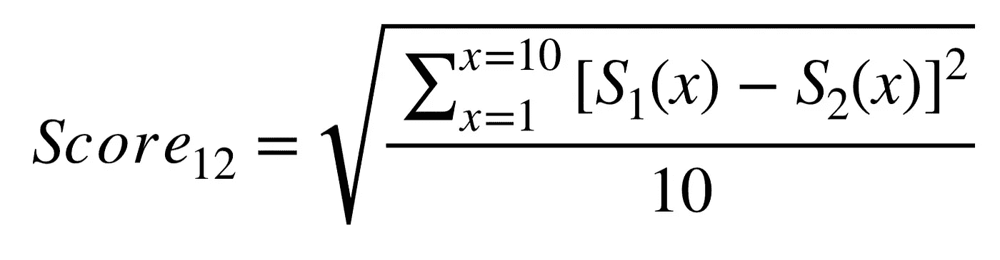

这些分数是针对所有咖啡和所有咖啡计算的，如下图所示，按分数着色并按国家排序:

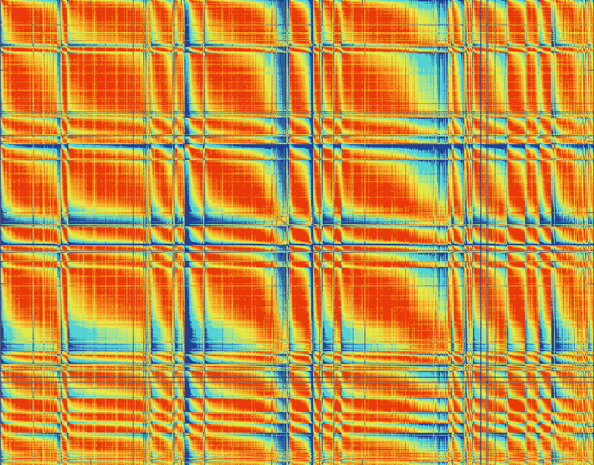

本文中的所有图片均由作者提供。

然而，在下面的细目分类中，我将每个图表调整到 0%到 100%之间。100%不代表完全匹配，0%也不代表不匹配。它相对于每个图表中的数据，其中 100%是最大相似度(最相似)，0%是最小相似度(最不相似)。

# 按地区

我们可以从查看每个地理区域开始。非洲咖啡豆比其他任何地方的咖啡豆都更像南美咖啡豆。中美洲的豆子似乎非常独特，与其他地区的豆子不同，但是南美洲的豆子与其他地区的豆子有最多的共同点。

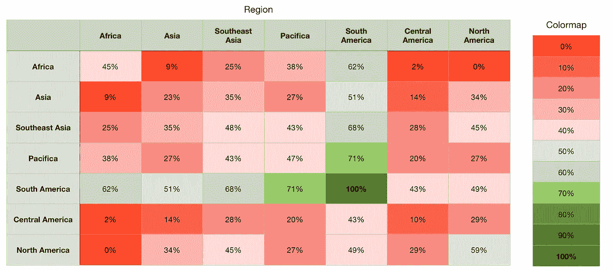

这可以按国家进一步细分，这有助于我们更好地了解这些地区。这并不是说非洲的咖啡豆和它们自己的相比不好，而是南美的咖啡豆和非洲的相比要好得多。一些中美洲的豆类比非洲的一些国家好。

结果很有趣，有多少品种和多少咖啡是彼此相似的。主要的区别在于巴布亚新几内亚和美国，它们不能与多种咖啡相提并论。

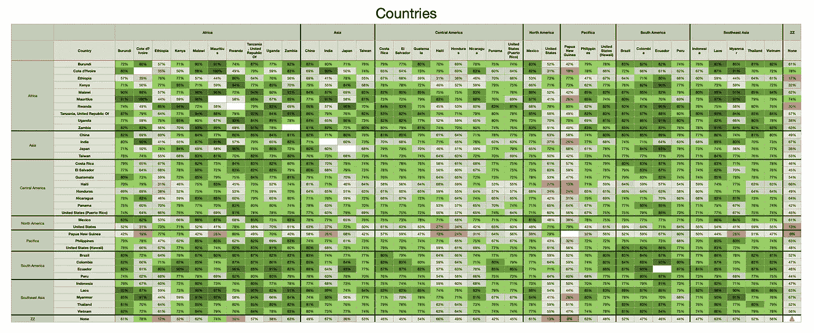

我希望这张表能有所帮助，作为参考，甚至在人们做杯子的时候进行比较。我很好奇哪些咖啡是杯装在一起的，因为这可能会影响体验。

# 按年份

在我之前使用相关性进行的分析中，2015 年脱颖而出。在这种情况下，2010 年和 2017 年似乎是疯狂的一年，因为相对而言，它们与其他年份并不相似。2018 年比什么都好，因为在这个数据集中只有 8 种 2018 年的咖啡。

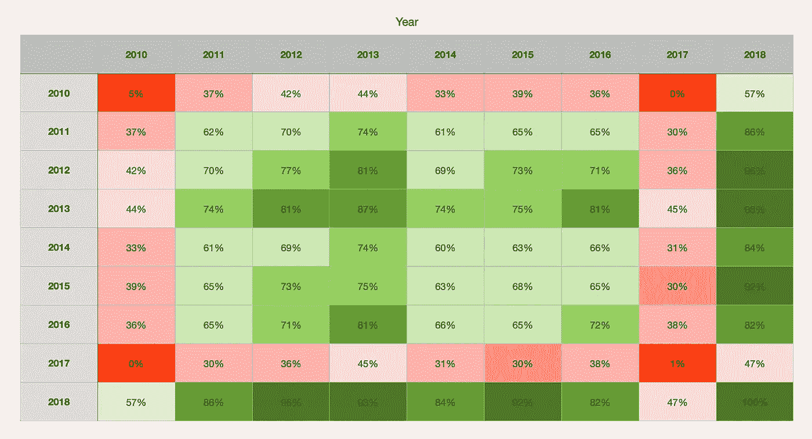

我们也可以按年查看地区，看看是否有任何有趣的趋势，因为一年中的天气对考虑作物结果很重要。这是一个非常高的水平，只有颜色编码，但如果有人好奇，我会很高兴地分享这些表进行更深入的检查。

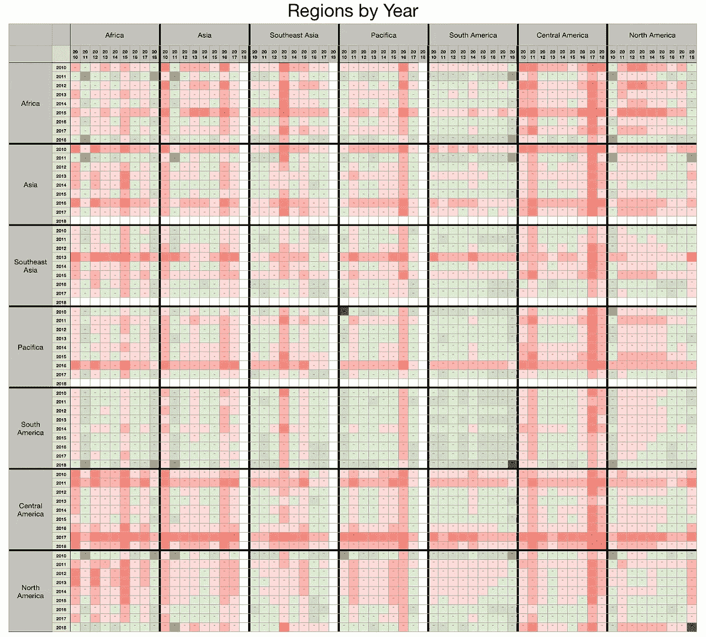

南美似乎是多年来最相似的地方，我怀疑这是因为更多的咖啡被清洗，而不是自然或干燥加工。中美洲似乎是 2010 年和 2017 年是怪异年份这一概念的关键角色。

# 通过加工

看看加工过程，我们看到了在品尝豆子时所看到的，清洗豆子在某些方面使味道变得均匀。洗豆比其他工艺更类似于其他豆类。天然加工的豆子最不像自己。

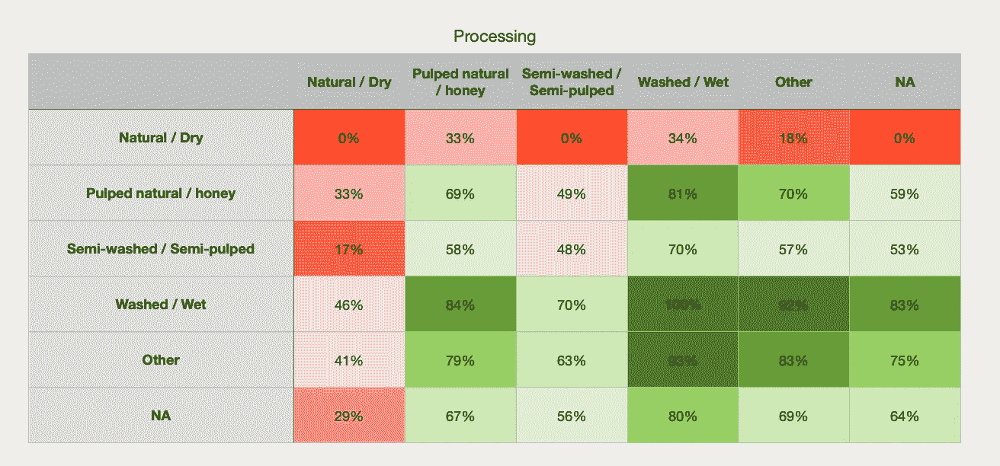

我们可以将这一过程按地区进行细分，以帮助了解它们是如何相似的。正如你所看到的，湿加工的咖啡豆在地域上比干加工的咖啡豆更相似。干加工的非洲咖啡豆似乎与其他地区/加工过程最不相似。

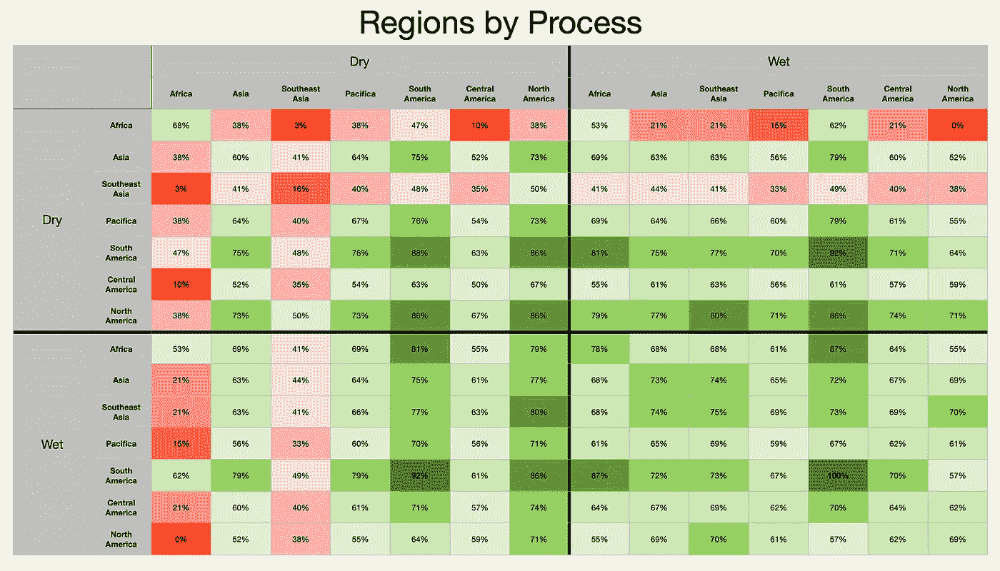

在计算干与干、干与湿、湿与湿的平均相似性时，可以看到下表的简化。

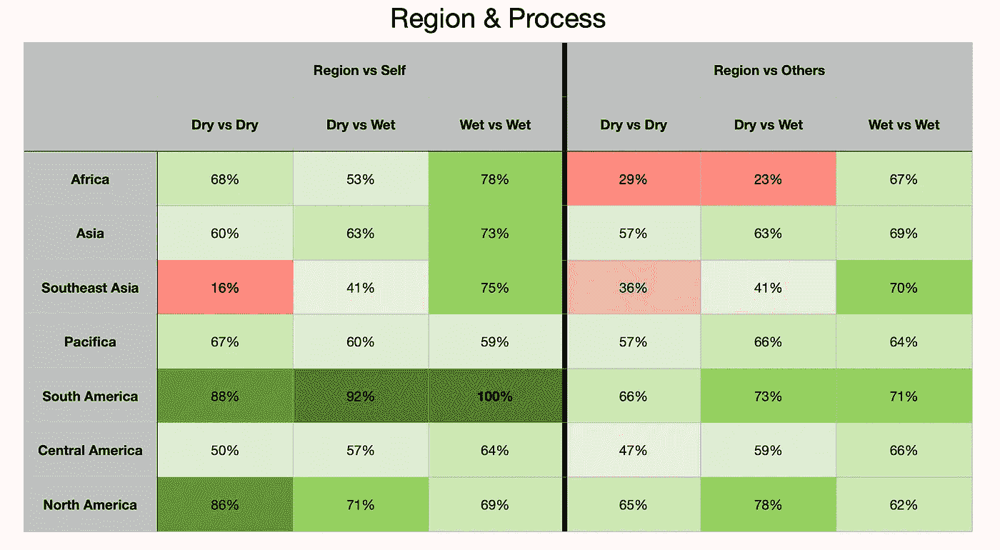

在某些情况下，干加工的分数比湿加工的好，而不是其他干加工的。这有点令人惊讶，但一个未知的变量是其他豆子在同一时间被分级。如果一个人同时给多个豆子评分，分数可能会受到类似的影响。

所以我们来看看分级协会！

# 分级员

每个分级员都属于一个分级协会，人们可以假设在一个协会内，分级员对咖啡的分级会更加相似。一些评分者有非常相似的分数，理想情况下，每个人都会给豆子打相同的分。问题总是不同的咖啡产区用不同的分级体。

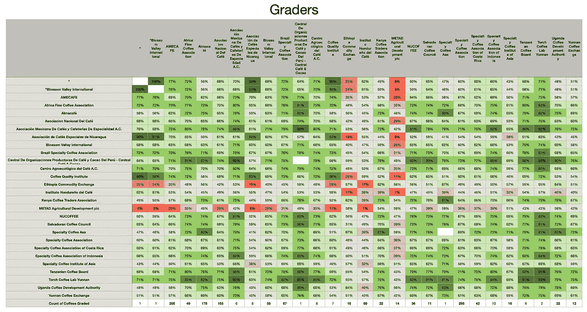

我们可以通过移除 10 级或以下咖啡的分级员来压缩这张桌子。看看这个，我们可以看到一些评级机构与其他机构非常不同，但这也可能是他们对咖啡进行评级的类型。

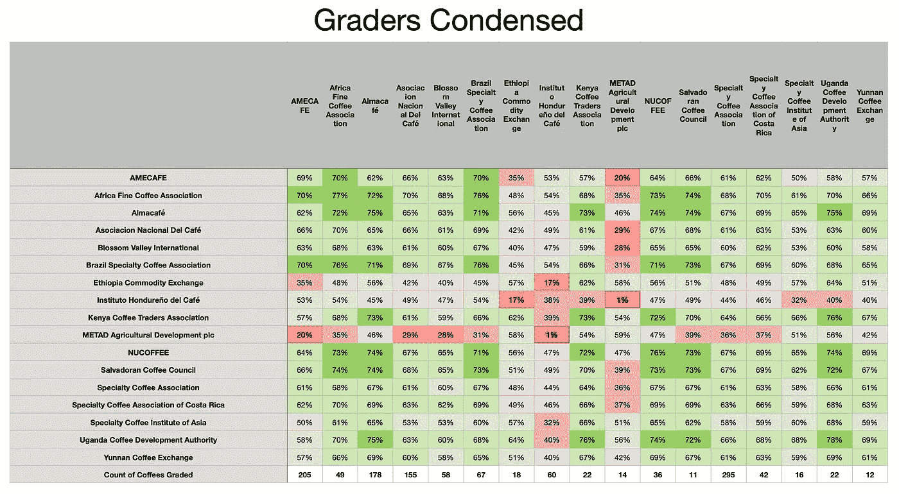

大多数协会对自己的评分和对彼此的评分相似。有一些异常值，他们的评分和其他人不一样。

这是在使用现代数据科学和模式识别技术来帮助理解咖啡如何相互分级以及通过等级来确定咖啡有多相似的方向上迈出的又一步。q-分级是主观的，但目的是有一个共同的语言，以比较/对比的方式谈论咖啡。希望随着数据在咖啡供应链中变得更加完整，看到这种类型的比较不仅会变得更加普遍，而且它们将成为影响我们制作咖啡的工具。

如果你愿意，可以在 Twitter 和 YouTube 上关注我，我会在那里发布不同机器上的浓缩咖啡视频和浓缩咖啡相关的东西。你也可以在 [LinkedIn](https://www.linkedin.com/in/robert-mckeon-aloe-01581595?source=post_page---------------------------) 上找到我。

# 我的进一步阅读:

[按地区、工艺、等级和价格分类的咖啡](/coffees-by-region-process-grade-and-price-7e17c3c44baf)

[家庭烘焙咖啡的经济学](/the-economics-of-home-roasting-coffee-93003ea31ee8)

[咖啡豆脱气](/coffee-bean-degassing-d747c8a9d4c9)

[解构咖啡:分割烘焙、研磨、分层以获得更好的浓缩咖啡](/deconstructed-coffee-split-roasting-grinding-and-layering-for-better-espresso-fd408c1ac535)

[浓缩咖啡的预浸:更好的浓缩咖啡的视觉提示](/pre-infusion-for-espresso-visual-cues-for-better-espresso-c23b2542152e)

[咖啡的形状](/the-shape-of-coffee-fa87d3a67752)

[搅拌还是旋转:更好的浓缩咖啡体验](https://towardsdatascience.com/p/8cf623ea27ef)

[香辣浓缩咖啡:热磨，冷捣以获得更好的咖啡](/spicy-espresso-grind-hot-tamp-cold-36bb547211ef)

[断续浓缩咖啡:提升浓缩咖啡](https://towardsdatascience.com/overthinking-life/staccato-espresso-leveling-up-espresso-70b68144f94)

[用纸质过滤器改进浓缩咖啡](/the-impact-of-paper-filters-on-espresso-cfaf6e047456)

[浓缩咖啡中咖啡溶解度的初步研究](/coffee-solubility-in-espresso-an-initial-study-88f78a432e2c)

[断奏捣固:不用筛子改进浓缩咖啡](/staccato-tamping-improving-espresso-without-a-sifter-b22de5db28f6)

[浓缩咖啡模拟:计算机模型的第一步](https://towardsdatascience.com/@rmckeon/espresso-simulation-first-steps-in-computer-models-56e06fc9a13c)

[更好的浓缩咖啡压力脉动](/pressure-pulsing-for-better-espresso-62f09362211d)

[咖啡数据表](https://towardsdatascience.com/@rmckeon/coffee-data-sheet-d95fd241e7f6)