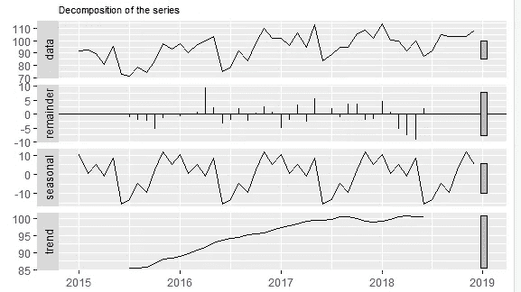
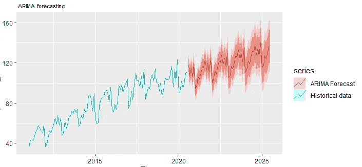
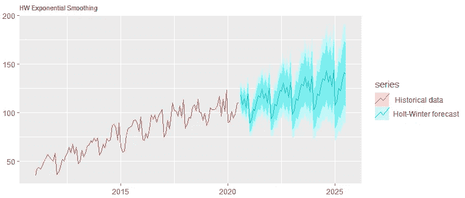
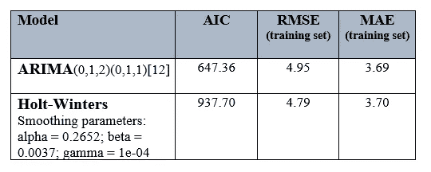

# 比较预报模式的性能:霍尔特-温特斯与 ARIMA

> 原文：<https://towardsdatascience.com/comparing-the-performance-of-forecasting-models-holt-winters-vs-arima-e226af99205f?source=collection_archive---------7----------------------->

## 如何评估模型性能以及如何选择合适的模型


菲尔·德福斯在 [Unsplash](https://unsplash.com?utm_source=medium&utm_medium=referral) 拍摄的照片

这是我写的关于时间序列预测模型的系列文章中的第三篇。第一篇文章是时间序列预测在[现实世界中的应用，我用美国住房市场数据做的，目的是展示预测是如何实施和解释的。在第二篇文章中，我概述了建立预测模型的 5 个简单步骤，目标是从未做过预测的初学者。在今天的文章中，我将展示如何将两种不同的技术应用于同一数据集，以及如何评估和比较它们的性能。](/applied-time-series-forecasting-residential-housing-in-the-us-f8ab68e63f94)

在众多不同的预测技术中，我选择了两个模型来评估:ARIMA 和霍尔特-温特斯指数平滑法。在继续之前，我将简要描述它们是什么以及它们在概念上有什么不同。

**ARIMA(自回归综合移动平均)** : ARIMA 可以说是预测中最流行、最广泛使用的统计技术。顾名思义，ARIMA 有 3 个部分:a)一个*自回归*部分模拟序列和它的滞后值之间的关系；b)*移动平均*组件预测作为滞后预测误差的函数的未来值；c)集成*组件*使系列静止。

ARIMA 模型——表示为 *ARIMA(p，q，d)*——采用以下参数:

*   定义滞后数量的 p；
*   *d* 指定使用的差异数；和
*   *q* 定义移动平均窗口的大小

霍尔特-温特斯:这是另一套同样使用历史值的技术。然而，一个关键的区别特征是所谓的“指数平滑”。

如果分解，时间序列将分解成 3 个部分:趋势、季节性和白噪声(即随机数据点)。出于预测目的，我们可以预测可预测的组成部分(即趋势和季节性)，但不能预测以随机方式出现的不可预测的项目。指数平滑可以通过消除白噪声来处理序列中的这种可变性。移动平均值可以平滑训练数据，但它是通过对过去的值取平均值并对它们进行平均加权来实现的。另一方面，在指数平滑中，过去的观察值以指数递减的顺序加权。也就是说，最近的观测值比远处的值具有更高的权重。

现在让我们开始实施、比较和评估这两种预测技术。

# 数据准备

我做这个练习的方式是，你不必寻找外部数据集。我已经在你下面包括了美国住宅数据的一个子集——一个真实世界和最近的数据集，所以你可以在你的程序中复制它们。你应该能够跟上并从这里到结尾很好地复制一切。

我在 R 编程环境中用 Rob J. Hyndman 开发的`fpp2`预测包实现了这个功能。

```
# required package
library(fpp2)#  data
values = c(92.1,  92.6,  89.5,  80.9,  95.6,  72.5,  71.2,  78.8,  73.8,  83.5,  97.9, 93.4,  98.0,  90.2,  96.7, 100.0, 103.6,  74.6,  78.9,  92.0,  83.4,  98.1, 109.9, 102.2, 102.1,  96.2, 106.9,  95.1, 113.4,  84.0,  88.6,  94.9,  94.7, 105.7, 108.6, 101.9,  113.9, 100.9, 100.2,  91.9,  99.6,  87.2,  92.1, 104.9, 103.4, 103.3, 103.9, 108.5)# time series 
time_series = ts(values, start = 2015, frequency =12)
```

# 时间序列分解

时间序列分解意味着将序列解构并可视化为这些组成部分—趋势、季节性和随机成分。

趋势和季节性在时间序列中是可预测的，并且易于预测。我对随机部分最感兴趣，因为这个部分实际上决定了预测的不确定性。随机性越小，预测性能越好。

```
# decomposition
autoplot(decompose(time_series)) + ggtitle("Decomposition of the series") + theme(plot.title = element_text(size=8))
```



时间序列分解

# 造型:ARIMA 和 HW

你可以用许多不同的方式参数化 ARIMA 和霍尔特-温特，但我保持简单。`fpp2`包有`auto.arima()`功能，可以优化参数本身，当然你也可以随意调整参数。在霍尔特-温特斯技术中，我需要说明季节性是增加的还是增加的。在这两种情况下，我都是在预测未来 60 步(h = 60)，也就是未来 5 年。

```
# ARIMA
forecast_arima = auto.arima(predictor_series, seasonal=TRUE, stepwise = FALSE, approximation = FALSE) 
forecast_arima = forecast(forecast_arima, h=60)# Holt-Winters
forecast_hw = hw(predictor_series, seasonal="multiplicative", h=60)
```

# 预测

运行模型后，您就可以检查预测结果了。你可以用数据图表来检查结果，或者用图形来显示。

`fpp2`模型具有内置的可视化功能`authoplot()`，可以创建时间序列数据和预测值的`ggplot`样式图形。它们使您可以直观地检查和确定模型的性能。

```
# ARIMA
autoplot(predictor_series, series=" Historical data") +
  autolayer(forecast_arima, series=" ARIMA Forecast") +
  ggtitle(" ARIMA forecasting") +
  theme(plot.title = element_text(size=8))# HW
autoplot(predictor_series, series=" Historical data") + 
  autolayer(forecast_hw, series="Holt-Winter forecast") +
  ggtitle("HW Exponential Smoothing") +
  theme(plot.title = element_text(size=8))
```



用模型预测:ARIMA



用模型预测:Holt-Winters

# 模型评估

模型评估时间到了。对上述预测数字的直观检查并没有显示出预测结果的很大差异，这可能是因为可预测的季节性和趋势成分。然而，Holt-Winters 确实显示出(至少在视觉上)预测值的不确定性较高。

但是我们可以超越视觉检查，使用量化指标来评估性能。如果您查看模型描述并调用`accuracy()`函数，就会弹出一堆信息。在下表中，我总结了一些您可能用来评估模型的关键指标。

```
# ARIMA
forecast_arima['model']
accuracy(forecast_arima)# HW 
forecast_hw['model']
accuracy(forecast_hw)
```



需要仔细解读这些指标。在本案例研究中，在训练数据的 RMSE 测量中存在一些差异，但是在 MAE 中的差异并不显著。就 AIC 而言，ARIMA 似乎是一个更好的模式。注意:虽然 AIC 非常擅长比较同级别车型(如 ARIMA 车型)，但它不应用于比较两个非常不同的车型级别(如 ARIMA 与硬件)。我在这里展示它们只是为了告诉大家它在实际实现中是什么样子。

尽管如此，最终确定一个合适的模型需要根据定量的模型选择标准以及使用领域知识来仔细判断和选择。

# 结论

本文的目的是展示使用相同数据集的不同预测模型实现，并演示如何评估模型性能以及选择适合问题空间的模型。在这里，我比较了两个模型——ARIMA 和霍尔特-温特斯——但是还有一整套其他的预测技术——T2——可以应用于给定的数据集。我鼓励你去找一个不同的数据集，尝试不同的预测模型，看看它们在不同的实现中表现如何。