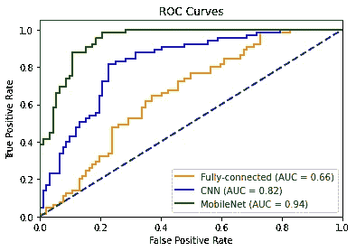

# TensorFlow 中全连接、简单 CNN 和 ResNet50 用于二值图像分类的性能比较

> 原文：<https://towardsdatascience.com/comparing-the-performance-of-fully-connected-simple-cnn-and-resnet50-for-binary-image-5dae3cea034?source=collection_archive---------41----------------------->

## 使用 TensorFlow/Keras 比较 3 个二值图像分类器模型的精确度、ROC 曲线和 AUC。你认为哪个表现最好？


梅丽莎·迪·罗科在 [Unsplash](https://unsplash.com/?utm_source=unsplash&utm_medium=referral&utm_content=creditCopyText) 上的照片

在机器学习的世界中，有三种模型可以用来执行二进制图像分类:[全连接网络](/10-minutes-to-building-a-fully-connected-binary-image-classifier-in-tensorflow-d88062e1247f)、[卷积神经网络](/10-minutes-to-building-a-cnn-binary-image-classifier-in-tensorflow-4e216b2034aa)，或[预训练网络，如应用了迁移学习的 MobileNet】。在我以前的故事中，我展示了如何实现这些模型来构建一个图像分类器，该分类器可以对蒲公英和草进行分类，并通过计算它们的准确性、ROC 曲线和 AUC 分数来评估它们的性能。在这个故事中，我将并排比较这些模型，并比较它们的性能。如果您想跟踪这些模型的整个培训、评估和比较，请](/10-minutes-to-building-a-binary-image-classifier-by-applying-transfer-learning-to-mobilenet-eab5a8719525)[跟踪](https://colab.research.google.com/drive/1HzDrML5Cmin7fDyz0HtIe9Dsacj5nae1?usp=sharing)本笔记本。您可以通过转到文件- >保存副本来保存您自己的副本，从而运行代码。

你认为哪种型号性能最好？

# 模型架构概述

首先，让我们看一下这三种模型架构，看看它们有什么不同:

```
FULLY-CONNECTED MODELLayer (type)                 Output Shape              Param #    ================================================================= flatten (Flatten)            (None, 120000)            0          _________________________________________________________________ dense (Dense)                (None, 128)               15360128   _________________________________________________________________ dense_1 (Dense)              (None, 1)                 129        ================================================================= Total params: 15,360,257 Trainable params: 15,360,257 Non-trainable params: 0CONVOLUTIONAL NEURAL NETWORK MODELLayer (type)                 Output Shape              Param #    ================================================================= conv2d (Conv2D)              (None, 198, 198, 16)      448        _________________________________________________________________ max_pooling2d (MaxPooling2D) (None, 99, 99, 16)        0          _________________________________________________________________ conv2d_1 (Conv2D)            (None, 97, 97, 32)        4640       _________________________________________________________________ max_pooling2d_1 (MaxPooling2 (None, 48, 48, 32)        0          _________________________________________________________________ conv2d_2 (Conv2D)            (None, 46, 46, 64)        18496      _________________________________________________________________ max_pooling2d_2 (MaxPooling2 (None, 23, 23, 64)        0          _________________________________________________________________ conv2d_3 (Conv2D)            (None, 21, 21, 64)        36928      _________________________________________________________________ max_pooling2d_3 (MaxPooling2 (None, 10, 10, 64)        0          _________________________________________________________________ conv2d_4 (Conv2D)            (None, 8, 8, 64)          36928      _________________________________________________________________ max_pooling2d_4 (MaxPooling2 (None, 4, 4, 64)          0          _________________________________________________________________ flatten (Flatten)            (None, 1024)              0          _________________________________________________________________ dense (Dense)                (None, 512)               524800     _________________________________________________________________ dense_1 (Dense)              (None, 1)                 513        ================================================================= Total params: 622,753 Trainable params: 622,753 Non-trainable params: 0MOBILENET w/ TRANSFER LEARNINGLayer (type)                 Output Shape              Param #    ================================================================= mobilenetv2_1.00_224 (Model) (None, 7, 7, 1280)        2257984    _________________________________________________________________ global_average_pooling2d (Gl (None, 1280)              0          _________________________________________________________________ dense (Dense)                (None, 1)                 1281       ================================================================= Total params: 2,259,265 Trainable params: 1,281 Non-trainable params: 2,257,984
```

请注意，全连接模型的可训练参数数量最多，其次是 CNN 模型，最后是 MobileNet 模型。在 FC 模型中，展平层中的每个连接都连接到密集层中的每个连接，从而产生更多的参数。在 CNN 中，需要的参数更少，因为每个卷积层通过卷积运算降低了输入的维数。与这两个模型相比，MobileNet 模型使用所谓的迁移学习:它不在预训练层上训练，只训练最终的密集层。它利用预训练层的特征提取能力来训练最后一层，因此只需要很少的参数来训练模型。

# 比较精确度

对于每个模型，我使用相同的数据集，并用 15 个时期训练模型。让我们将结果汇总在一起，并排进行比较，从精度开始:

```
FC accuracy: 0.5987
CNN accuracy: 0.7197
MobileNet accuracy: 0.8917
```

MobileNet 模型的准确性最高，其次是 CNN 模型，再其次是全连接模型。

# 比较 ROC 曲线和 AUC



ROC 曲线的组合图

准确性不是比较模型性能的最佳方式。分类任务的更好的度量包括 ROC 曲线和 AUC，它们测量我们的模型能够在多大程度上区分我们的两个类别，蒲公英和草。AUC 越高，我们的模型在分类上就越好。在上图中，MobileNet 在 AUC 中得分最高，其次是 CNN，然后是 FC。

以下是这些比较的要点:

*   就准确性和 ROC 曲线/AUC 而言，MobileNet 模型是一个优越的模型，尽管它没有最多的参数。这显示了迁移学习在强大的训练模型上的力量。
*   CNN 模式排在第二位。卷积神经网络在二值图像分类上比全连接网络表现得更好，具有更少的参数，因为它们的共享权重结构和平移不变性特征。
*   在二值图像分类中，全连接模型比机会模型表现得更好，但它不是这样做的最佳模型。