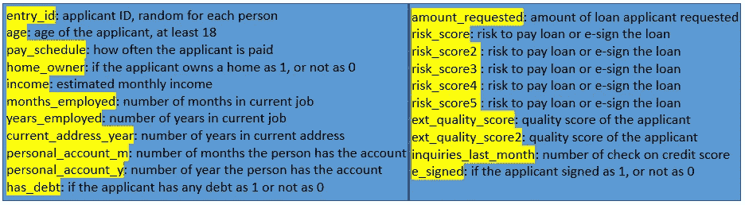
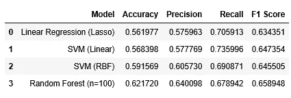
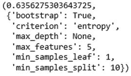
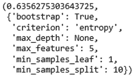
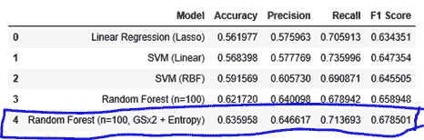
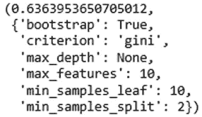
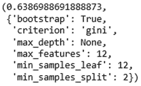
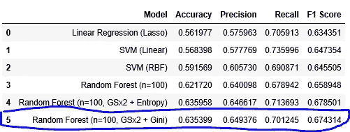

# 贷款申请预测的 ML 模型比较与优化

> 原文：<https://towardsdatascience.com/comparison-and-optimization-on-ml-models-for-loan-application-prediction-675923d83d04?source=collection_archive---------30----------------------->

## 深入研究常见的机器学习模型，以进行模型选择、验证和优化


来自 Pixabay 的 Img 通过[链接](https://pixabay.com/photos/housebuilding-house-money-expensive-1005491/)

在本文中，我们将使用在线贷款申请数据详细阐述 ML 模型的选择、验证和优化。**你将学习如何创建、评估和优化 ML 模型。**具体来说，我们将重点介绍**逻辑回归、支持向量机和随机森林**。它分为 7 个部分。

1.  商业挑战
2.  数据审查
3.  电子设计自动化(Electronic Design Automation)
4.  数据处理
5.  模型结构
6.  模型验证
7.  参数调谐
8.  外卖食品

现在，让我们开始旅程🏃‍♀️🏃‍♂️.

**1。商业挑战**

我们被一家贷款公司委派预测优质申请人的任务。这项工作是开发一个模型，通过分析申请过程中输入的申请人数据来预测申请人的兴趣。如果申请人感兴趣，他或她将对产品进行电子签名，否则不会。

**2。数据回顾**

快速查看视频中显示的数据，您会发现有 21 列 17，908 行。有了这么多特性，让我们为每个变量的解释创建一个摘要，如图 1 所示，以增强我们的理解。

视频原始数据的简要视图



图 1 变量定义汇总

**3。EDA**

EDA 是任何数据处理之前必须要做的一步。通常，它包括数据清理、数据可视化和相关性分析。这里我就不细说 EDA 了。如果你想熟悉 EDA 的步骤，请随意阅读这篇[文章](/exploratory-data-analysis-on-mobile-app-behavior-data-2777fc937973)。

**4。数据处理**

1)数据工程

在 EDA 数据可视化过程中，您可能会发现，对于变量' *months_employed* '，大多数申请人的就业时间为 0 个月。这似乎不正确，所以我们将删除这个不可靠的列。

第二，可以将两列'*个人账户 m'* 和'*个人账户 y '，*组合成一个新的变量来表示申请人账户的总月数。具体来说，

```
dataset = dataset.drop(columns = [‘months_employed’])dataset[‘personal_account_months’] = (dataset.personal_account_m + (dataset.personal_account_y * 12))dataset = dataset.drop(columns = [‘personal_account_m’, ‘personal_account_y’])
```

2)一键编码

我们需要将分类变量转换成数字变量。只有一个分类变量' *pay_schedule'* 。具体来说，

```
dataset = pd.get_dummies(dataset)
```

以上将*'付薪时间表'*转换为 4 列，*付薪时间表 _ 双周'*，*'付薪时间表 _ 月'，*付薪时间表 _ 半月'，*付薪时间表 _ 周'*。因为每一列都是互斥的，所以我们必须删除一列，使它们线性独立。具体来说，

```
dataset = dataset.drop(columns = [‘pay_schedule_semi-monthly’])
```

3)数据分割

为了给模型准备好数据，我们将自变量和响应变量分成测试集和训练集。

```
response = dataset[“e_signed”]
users = dataset[‘entry_id’]
dataset = dataset.drop(columns = [“e_signed”, “entry_id”])from sklearn.model_selection import train_test_splitX_train, X_test, y_train, y_test = train_test_split(dataset, response,test_size = 0.2, random_state = 0)
```

4)特征缩放

最后，我们需要缩放自变量。

```
from sklearn.preprocessing import StandardScalersc_X = StandardScaler()
X_train2 = pd.DataFrame(sc_X.fit_transform(X_train))
X_test2 = pd.DataFrame(sc_X.transform(X_test))
X_train2.columns = X_train.columns.values
X_test2.columns = X_test.columns.values
X_train2.index = X_train.index.values
X_test2.index = X_test.index.values
X_train = X_train2
X_test = X_test2
```

**注意，从 scaler 得到的数据是一个 Numpy 数组，我们将它转换为 Dataframe 以保留索引和列名。**同样，我们用 *X_train* 训练定标器，用训练好的定标器直接转换测试数据。

**5。模型构建**

首先，让我们试验不同的模型，找出最好的一个。

## 1)逻辑回归

让我们先创建一个线性模型。具体来说，

```
from sklearn.linear_model import LogisticRegression
classifier = LogisticRegression(random_state = 0, penalty = ‘l1’)
classifier.fit(X_train, y_train)
y_pred = classifier.predict(X_test)
```

上面的代码块将对逻辑回归模型进行定型和测试。注意我们使用了 **L1 套索正则化**来惩罚模型的系数。如果你想了解更多的细节，请查看这篇关于正规化的[文章](/logistic-regression-how-to-on-app-behavior-data-8a95802a988f)。

最终我们得到了 56%的准确率，57%的准确率，70%的召回率。**这意味着在所有积极的预测中，只有 57%是正确的，而这些正确的预测占实际预测的 70%😆。**

## 2) SVM(线性核)

让我们建立一个基于支持向量机的分类器。

> SVM 的一个关键概念是内核。**使用核进行数据转换，使得当前数据空间中不可分的数据可以在更高维空间中分离。**它接收数据作为输入，并根据选择的内核将其转换成所需的形式。显然，选择正确的内核至关重要，因为错误的转换会使模型表现不佳。如果你想深入了解 SVM 的细节，请随意阅读这篇[文章](/svm-and-kernel-svm-fed02bef1200)和这篇[文章](/support-vector-machines-svm-c9ef22815589)。

首先，让我们训练一个线性核 SVM。通常，当数据集是线性可分的，即使用单线可分时，使用线性核。它比其他任何内核都快。具体来说，

```
from sklearn.svm import SVC
classifier = SVC(random_state = 0, kernel = ‘linear’)
classifier.fit(X_train, y_train)
y_pred = classifier.predict(X_test)
```

最终我们得到了 57%的准确率，58%的准确率，73%的召回率。与逻辑回归模型相比，这是一个稍好的性能🤪。

## 3) SVM 银行

> 径向基函数是 SVM 中使用的非线性核。与线性核相比，RBF 不是一个参数模型，其复杂性随着数据的大小而增加。因此，训练模型以及进行预测的成本更高。此外，超参数越多，复杂模型越容易过度拟合。

具体来说，要实现 RBF，

```
classifier = SVC(random_state = 0, kernel = ‘rbf’)
classifier.fit(X_train, y_train)
y_pred = classifier.predict(X_test)
```

同样，经过训练和测试，我们获得了 59%准确率、60%的精确度和 69%的召回率。与线性核相比没有太大的改进😒。

4)随机森林

> **随机森林通过构建大量个体决策树并输出分类问题的模式类或回归问题的均值预测来运行。**运行许多决策树的潜在逻辑是，*最优决策来自群体的智慧*，简单而强大。

为了实现 RF，具体地说，

```
from sklearn.ensemble import RandomForestClassifier
classifier = RandomForestClassifier(random_state = 0, n_estimators = 100, criterion = ‘entropy’)
classifier.fit(X_train, y_train)
y_pred = classifier.predict(X_test)
```

如上所述，我们创建了 100 棵决策树。最终我们得到了 62%的准确率，64%的准确率，67%的召回率。总结图 2 中的所有模型性能，我们发现 RF 的性能最佳😁。



图 2 模型性能总结

**6。模型验证**

在优化随机森林模型之前，我们先验证一下它的性能。这里，我们使用训练数据应用 K 重交叉验证。具体来说，

```
from sklearn.model_selection import cross_val_score
accuracies = cross_val_score(estimator = classifier, X= X_train, y = y_train, cv = 10)
```

最后，我们得到了 63%的准确率和 3%的标准偏差。这表明随机森林模型对于训练集一直表现良好😎。

**7。参数调谐**

因为我们知道随机森林与其他模型相比性能最佳，所以让我们通过使用参数调整来优化随机森林模型。

随机森林分类器有几个参数，包括:

*   *e _ estimators】:*树的数量
*   ***判据*** ”:衡量分割质量的判据
*   " ***max_depth*** ":每棵树的最大层数
*   "***min _ samples _ split***":拆分一个节点所需的最小样本数
*   " ***max_features*** ":寻找最佳分割时要考虑的最大特征数
*   " **min_samples_leaf** ":一个叶节点需要的最小样本数
*   " ***bootstrap*** ":数据点采样的一种方法(有替换或无替换)

在这里，我们选择下面的参数，并为每个参数设置搜索范围。

```
parameters = {“**max_depth**”: [3, None],“**max_features**”: [1, 5, 10],‘**min_samples_split**’: [2, 5, 10],‘**min_samples_leaf**’: [1, 5, 10],“**bootstrap**”: [True, False],“**criterion**”: [“entropy”]}
```

我们使用**网格搜索**来遍历所有不同的参数组合以及每个组合的交叉验证。我们也可以使用**随机搜索**。具体来说，

```
from sklearn.model_selection import GridSearchCVgrid_search = GridSearchCV(estimator = classifier, param_grid = parameters, scoring = “accuracy”, cv = 10, n_jobs = -1)grid_search = grid_search.fit(X_train, y_train)
```

请注意，我们使用 10 重交叉验证。最后，网格搜索发现最佳参数如下图 3 所示，准确率为 63%😃。



图 3 使用“熵”的网格搜索第一轮结果

这样，我们可以使用这些参数在测试数据集上测试模型，或者执行第二轮网格搜索来微调参数。如果你想要第二轮，试试下面的参数。

```
parameters = {“max_depth”: [None], “max_features”: [3, 5, 7], ‘min_samples_split’: [8, 10, 12],‘min_samples_leaf’: [1, 2, 3], “bootstrap”: [True], “criterion”: [“entropy”]}
```

最终，在相同的参数下，我们得到了同样的 63%的准确率。这意味着我们从第一轮得到的结果已经是最佳的了👌。



图 4 使用“熵”的网格搜索第二轮结果

最后，让我们在测试数据上使用优化的模型。最后，我们得到了图 5 中的结果。巨大的成果。



图 5 基于熵优化射频的模型性能总结

注意上面我们使用*熵*作为分裂标准。你也可以用'*基尼'*。**熵和基尼系数是衡量一个节点不纯程度的指标。有多个类的节点是不纯的，而只有一个类的节点是纯的。一般来说，决策树是通过递归分割变量或响应变量的特征来工作的。它旨在通过最大化每个节点的纯度来优化每个拆分。**熵旨在最大化每次分裂所获得的信息内容，并且期望从分裂节点获得的信息越多，分裂就越好。另一方面，基尼系数衡量的是贴错标签的可能性。**根据使用的标准，决策树结果可能会有所不同。如果你需要更多关于这个话题的细节，请随意阅读这篇文章。**

现在让我们使用“G *ini* 作为标准执行相同的网格搜索，保持其余参数不变。第一轮之后，我们获得了 64%的准确率。



图 6 使用“基尼”的网格搜索第一轮结果

如果我们执行第二轮来微调上述参数，我们使用下面的最佳参数再次获得了 64%的准确度。



图 7 使用“基尼”的网格搜索第二轮结果

有了微调的参数，我们来测试模型。如图 8 所示，基于熵和基尼的模型之间存在微小的性能差异。



图 8 基于基尼系数优化射频的模型性能总结

**8。外卖**

> 我们使用相同的数据测试了 4 个不同的模型，逻辑回归、SVM(线性)、SVM (RBF)和随机森林。随机森林被证明具有 63%的准确率。使用网格搜索，我们将模型性能提高了 1–3%。

从商业角度来说，利用该模型的一种方法是针对那些预测不会签署定制入职流程贷款的人。这将有助于公司赢得更多客户，改善业务。

**太好了！如果你觉得这篇文章有帮助，请随意点击👏s！如果您需要源代码，请随时访问我的**[**Github**](https://github.com/luke4u/Customer_Behaviour_Prediction/tree/main/Loan-prediction)**页面🤞🤞🤞。**