# CPU 和 GPU 的集群性能比较

> 原文：<https://towardsdatascience.com/comparison-of-clustering-performance-for-both-cpu-and-gpu-3f47fb3de872?source=collection_archive---------23----------------------->

## 一个基准:Scikit-Learn 和 TensorFlow-GPU 的 K 均值算法


([来源](https://pixabay.com/illustrations/processor-cpu-computer-chip-board-2217771/))

当你想对一个现象有更深的理解时，一种方法是将他们分组，这样更容易理解。例如，您可能想按标题观看电影，而另一个人可能想按类型观看。你决定如何对它们进行分组会引导你对它们有更多的了解。

在机器学习中，将数据点分成一定数量的组称为聚类。这些数据点没有初始标签。因此，聚类是将未标记的数据点分组，以更有意义的方式找出它们。

要深入了解聚类技术，请访问 [*麻省理工学院-edu*](http://www.mit.edu/~9.54/fall14/slides/Class13.pdf) 笔记。

在这篇文章中，目的是通过*的执行时间来比较 *Scikit-Learn (random，k-means++)* 和 *TensorFlow-GPU (k-means++，Tunnel k-means)* 算法的集群性能，并通过提供相应的系统规格将它们打印在比较矩阵中。由于数据的内容不是本次基准研究的重点，因此所需的数据集将随机生成。*

*[](https://www.commencis.com/thoughts/comparison-of-clustering-performance-for-both-cpu-and-gpu/) [## CPU 和 GPU 的集群性能比较

### 当你想对一个现象有更深的理解时，一种方法是把他们分成小组来做…

www.commencis.com](https://www.commencis.com/thoughts/comparison-of-clustering-performance-for-both-cpu-and-gpu/) 

# k 均值聚类

[*k 均值聚类*](https://stanford.edu/~cpiech/cs221/handouts/kmeans.html) 的目的是以不重叠的方式将一些数量的观察值 **n** 划分成 **k** 数量的质心。数据点的数量在集群内部应该尽可能的一致，在集群外部应该尽可能的不同。更多理论解释，请访问[本网页](https://cseweb.ucsd.edu/~dasgupta/291-geom/kmeans.pdf)。

在这篇文章中，将测试三个不同的环境 *(2 个不同的 CPU 驱动系统，1 个 GPU 驱动系统)*。系统规格添加如下。

> ***第一个 CPU 供电的系统规格:***
> 
> **处理器:**英特尔(R)酷睿(TM)i7–8850h
> **处理器速度:** 2.60 GHz
> **物理核心:** 6
> **逻辑处理器:** 12
> **物理内存(RAM):** 64 GB
> 
> ***第二 CPU 供电系统规格:***
> 
> **处理器:**英特尔(R)酷睿(TM)i9–10900
> **处理器速度:** 3.70 GHz
> **物理核心:** 10
> **逻辑处理器:** 20
> **物理内存(RAM):** 256 GB (8 个 32GB DDR4 3000 MHz)
> 
> ***GPU 驱动的系统规格:***
> 
> **处理器:**英特尔(R)酷睿(TM)i9–10900
> **处理器速度:** 3.70 GHz
> **图形处理器(GPU):**NVIDIA GeForce RTX 2080 ti 352 位 11GB GDDR6 内存(2)

# 1.基于 CPU 的 K-均值聚类

中央处理器(CPU)是计算机的关键部件，大部分处理和计算都在其中进行。

对于进一步的编码部分，我们将使用 Python 编程语言*(*[*3.7 版*](https://www.python.org/downloads/release/python-370/) *)* 。 [*PyCharm*](https://www.jetbrains.com/pycharm/) 和 [*Jupyter 笔记本*](https://jupyter.org/) 都可以用来运行 Python 脚本。为了便于使用，可以安装 [*Anaconda*](https://www.anaconda.com/distribution/) ，因为它本身包含了所有必需的 IDE 和重要包。

作为第一步，我们将安装 CPU 实施所需的软件包。

```
pip install psutil
pip install numpy
pip install matplotlib
pip install scikit-learn
```

安装完[***psutil***](https://psutil.readthedocs.io/en/latest/)*[***numpy***](https://docs.scipy.org/doc/numpy/)*[***matplotlib***](https://matplotlib.org/3.1.3/api/_as_gen/matplotlib.pyplot.html)[***sk learn***](https://pypi.org/project/scikit-learn/)*我们将导入***

```
***import platform
import time
import psutil as ps
import platform
from datetime import datetime
import numpy as np
import matplotlib.pyplot as plt
from sklearn.cluster import KMeans***
```

***在开始集群之前，可以使用下面的代码片段检查 CPU 信息及其当前的 CPU 使用百分比。***

```
***print("Physical cores:", ps.cpu_count(logical=False))
print("Logical cores:", ps.cpu_count(logical=True),"\n")

print("CPU Usage Percentages:", "\n")
for i, percentage in enumerate(ps.cpu_percent(percpu=True)):
    print(f"CPU {i}: {percentage}%")

print("\n")
print(f"Current CPU Usage in Total: {ps.cpu_percent()}%")***
```

***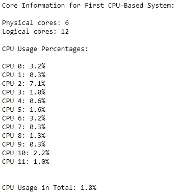***

*****第一个 CPU 系统信息**(图片作者提供)***

***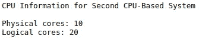******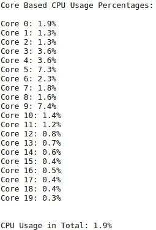***

*****第二 CPU 系统信息**(图片由作者提供)***

***在带有参数 *"init= random"* 或 *"init=kmeans++"* 的[](https://scikit-learn.org/stable/modules/generated/sklearn.cluster.KMeans.html)*函数中存在两种类型的 k-means 算法。下面首先测试*“init = random”*，代表随机选择 *k* 个观测值。****

***“n _ clusters”*参数代表算法将分割成的聚类数。当我们将“*n _ clusters”*分配到*“100”中时，*向算法发出信号，将所有数据点分配到最合适的 100 个质心中。为了能够控制每次运行的随机性，应将“ *random_state* ”参数设置为整数；否则，每次运行都会选择不同的随机组，这将很难与之前的输出进行比较。**

```
**kmeansRnd = KMeans(n_clusters=100, init='random',random_state=12345)**
```

**设置集群参数后，生成 5 列 500 K 行的随机数。**

```
**CPU_Test_1 = np.random.normal(size=(500000,5))**
```

**现在，我们有 5 列和 500 K 行随机生成的数据。使用“ *fit_predict* ”函数，将通过输入名为“ *CPU_Test_1* ”的数据来计算每个数据点的聚类中心和聚类指数。**

```
**kmeansRnd.fit_predict(CPU_Test_1)**
```

**使用 python 的“ *plotly* ”包添加样本的可视化和聚类数。在描述数据点和聚类的同时，该绘图脚本的结果被添加到帖子的后续部分中基于系统的结果的末尾。**

```
**plt.scatter(CPU_Test_1[:,0], CPU_Test_1[:,1], s=1)plt.scatter(kmeans.cluster_centers_[:,0], kmeans.cluster_centers_[:,1], s=5, c="r")plt.title("K-means (Random) with Scikit Learn", "\n")plt.show()**
```

**通过在我们的算法之外添加以下代码行，可以跟踪算法的执行时间。**

```
**start_time = time.time()# ... *clustering* *code block* end_time = time.time()
print(end_time - start_time)**
```

## **1.1.使用 Scikit-Learn 的 k 均值(随机)聚类**

**[*sci kit Learn K-means—random*](https://scikit-learn.org/stable/modules/generated/sklearn.cluster.k_means.html)算法以随机方式选择第一个中心聚类，与 *k-means++算法*相比，这可能会导致更高的聚类内方差。**

> *****第一个 CPU 驱动的系统结果:*****
> 
> ****算法执行时间:** 2505.26 秒
> **聚类可视化:**蓝点(数据点)，红点(聚类)**

****

**Scikit Learn，K-means(随机)聚类 100 个聚类(图片由作者提供)**

> *****第二次 CPU 供电系统结果:*****
> 
> ****算法执行时间:** 1395.10 秒
> **聚类可视化:**蓝点(数据点)，红点(聚类)**

**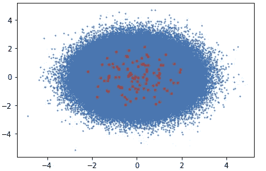**

**Scikit Learn，K-means(随机)聚类 100 个聚类(图片由作者提供)**

## **1.2.使用 Scikit-Learn 的 K-means (kmeans++)聚类**

***sci kit Learn K-means—K means++*算法以更符合逻辑的方式选择第一个中心聚类，这可以导致之后更快的聚类性能。**

> *****第一次 CPU 供电系统结果:*****
> 
> ****算法执行时间:** 2603.74 秒
> **聚类可视化:**蓝点(数据点)，红点(聚类)**

**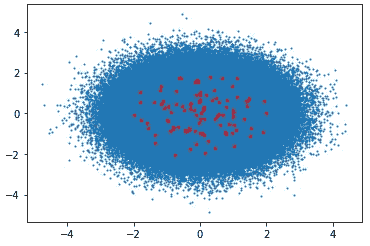**

**Scikit Learn，K-means (kmeans++)聚类 100 个聚类(图片由作者提供)**

> *****第二次 CPU 供电系统结果:*****
> 
> ****算法执行时间:** 1384.73 秒
> **聚类可视化:**蓝点(数据点)，红点(聚类)**

**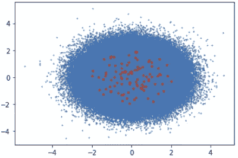**

**Scikit Learn，K-means (kmeans++)聚类 100 个聚类(图片由作者提供)**

# ****2。基于 GPU 的集群****

**[***tensor flow***](https://www.tensorflow.org/overview)库是为海量数值计算而开发的。根据您环境中安装的版本，它支持 CPU 和 GPU。如果您希望启用您的 GPU，需要安装的版本是[*tensor flow-GPU*](https://www.tensorflow.org/guide/gpu)。**

```
**pip install tensorflow-gpu**
```

**为了能够通过使用 TensorFlow 库来测试 GPU 信息的可用性，可以使用下面的代码片段。**

```
**import tensorflow as tfconfig = tf.compat.v1.ConfigProto()
tf.config.list_physical_devices('GPU')**
```

**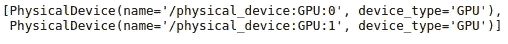**

**(图片由作者提供)**

**使用以下脚本查看 GPU 信息后，可以打印更详细的设备信息，包括 CPU。**

```
**from tensorflow.python.client import device_lib as dev_libprint (dev_lib.list_local_devices())**
```

**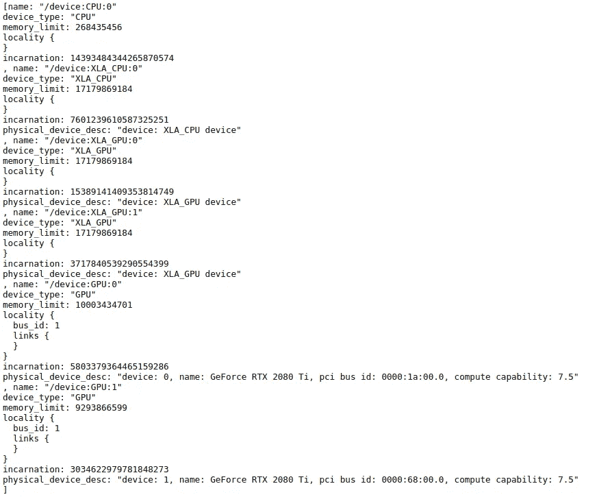**

**(图片由作者提供)**

## **2.1.使用 TensorFlow-GPU 进行 KMeansTF (kmeans++)聚类**

**[*tensor flow k-means*](https://kmeanstf.readthedocs.io/en/latest/stubs/mymod.kmeanstf.KMeansTF.html#kmeanstf.kmeanstf.KMeansTF)*算法通过迭代优化类内方差，路由随机产生的初始质心的负面影响。***

***通过安装以下 *kmeanstf* 包，可以使用支持 GPU 的 Tensorflow k-means 算法。***

```
**pip install kmeanstf**
```

**在安装了所需的包之后，下面的算法将在基于 GPU 的环境中运行。结果添加在系统规格之后。**

```
**from kmeanstf import KMeansTFstart_time = time.time()kmeanstf = KMeansTF(n_clusters=100, random_state=12345)
GPU_Test = np.random.normal(size=(500000,5))
kmeanstf.fit(GPU_Test)end_time = time.time()
print('Kmeans++ execution time in seconds: {}'.format(end_time - start_time))**
```

> *****GPU 驱动的系统规格:*****
> 
> ****算法执行时间:** 219.18 秒
> **聚类可视化:**蓝点(数据点)，红点(聚类)**

**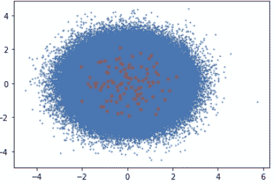**

**KMeansTF(kmeans++)100 个聚类的聚类(图片由作者提供)**

## ****2.2。** TunnelKMeansTF **使用 TensorFlow-GPU 进行聚类****

**隧道[*k-means*](https://kmeanstf.readthedocs.io/en/latest/stubs/mymod.kmeanstf.TunnelKMeansTF.html)*算法具有在聚类之间实现非局部移位的能力，以为每个数据点找到最佳质心。***

```
***start_time = time.time()kmeansTunnel = TunnelKMeansTF(n_clusters=100, random_state=12345)
GPU_Test = np.random.normal(size=(500000,5))
kmeansTunnel.fit(GPU_Test)end_time = time.time()
print('Tunnel Kmeans execution time in seconds: {}'.format(end_time - start_time))***
```

> ******GPU 驱动的系统规格:******
> 
> *****算法执行时间:** 107.38 秒**聚类可视化:**蓝点(数据点)，红点(聚类)***

***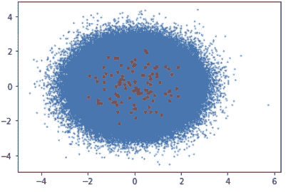***

***100 个聚类的 TunnelKMeansTF 聚类(图片由作者提供)***

## *****3。最终比较矩阵*****

***为了更清楚地理解算法的输出，生成了一个矩阵表。***

***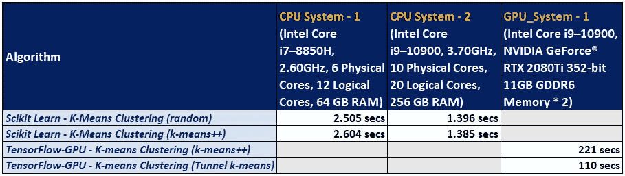***

***系统特性与算法运行时间(图片由作者提供)***

***正如我们在比较矩阵中所观察到的，GPU 驱动的系统在执行时间方面具有独特的性能优势。***

***完整的实现代码和 Jupyter 笔记本在我的 [**GitHub**](https://github.com/pinarersoy/K-means_Clustering_Performance_Comparison) **上都有。*****

***非常感谢您的提问和评论！**** 

*****参考文献:*****

1.  ***[Scikit 学习 K-means](https://scikit-learn.org/stable/modules/generated/sklearn.cluster.k_means.html)***
2.  ***[TensorFlow-GPU](https://www.tensorflow.org/install/gpu)***
3.  ***[Python 包](https://pypi.org/)***