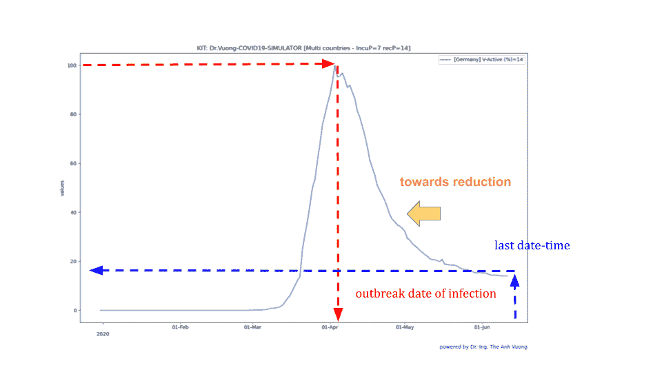

# 来自不同地点的新冠肺炎数据的比较:正常化-展示-编程

> 原文：<https://towardsdatascience.com/comparison-of-covid-19-data-from-different-locations-normalization-showcase-programming-93e7c222c56d?source=collection_archive---------49----------------------->

## 数据科学—新冠肺炎—可视化—编程


照片由 Thuy Chung Vuong 拍摄

## 有多少感染者还在我们附近的环境中，在我们国家，以及更远的邻国？

***编者按:*** [*走向数据科学*](http://towardsdatascience.com/) *是一份以数据科学和机器学习研究为主的中型刊物。我们不是健康专家或流行病学家，本文的观点不应被解释为专业建议。想了解更多关于疫情冠状病毒的信息，可以点击* [*这里*](https://www.who.int/emergencies/diseases/novel-coronavirus-2019/situation-reports) *。*

新冠肺炎疫情看起来像一场世界大战，波及全球 213 个国家和地区[worldometer.info]，给世界带来死亡、疾病、恐惧、悲伤、灾难、混乱。每天都有大量的新冠肺炎数据流作为信息从与我们看不见的敌人——新型冠状病毒病毒斗争的前线流向我们。从这些数据中，我问了自己一个问题:

**“有多少感染者还在我们附近的环境中，在我们的国家，以及更远的邻国？”**

目前受感染患者的数量很重要；它有助于我们的生活、规划、工作和预防。出于这个动机，我将我的研究兴趣从数据的[可视化，以及对未发现感染病例](/python-development-kit-for-visualizing-and-modelling-of-covid19-data-b33e7a13aace)的[估计，扩展到不同地点的活跃感染病例的比较。](/prediction-and-analysis-of-covid-19-data-model-proposal-algorithm-vuong-simulator-2b05d1bded7e)

在这篇文章中，我想和你分享我的方法“累积活跃案例的规范化”来分析来自多国的数据。

因为我的[数据资源](https://ourworldindata.org/coronavirus-source-data)提供来自许多国家的数据，我可以在“高水平”上工作:比较来自世界各国的数据。然而，您也可以使用我的方法和我用 Python 编写的开源软件包来分析来自其他地理位置的数据。

我在这里展示了一些例子来展示我的开发方法。它们不是专业报告(如在[、世卫组织](https://www.who.int/emergencies/diseases/novel-coronavirus-2019/situation-reports)、 [CDC](https://www.cdc.gov/) 、 [RKI](https://www.rki.de/DE/Content/InfAZ/N/Neuartiges_Coronavirus/Steckbrief.html) 中发现的)，但它可能有助于我们理解新冠肺炎·疫情在海量数据之外正在发生的事情。

# 比较哪些新冠肺炎数据很重要？

在我们进行数据的比较之前，我想先介绍一下不同类型的新冠肺炎数据。它们是:

*   每日确诊感染病例数，即“新病例数”。
*   目前被感染的病人数量，即“活跃病例”(这里是“T7”)
*   估计的活动案例数，包括未发现的案例，可以通过我的 [Vuong 算法](/prediction-and-analysis-of-covid-19-data-model-proposal-algorithm-vuong-simulator-2b05d1bded7e)或其他算法进行估计。
*   康复/出院患者人数。
*   死亡案例。
*   等等。

这些数据将显示为以下图表:

> 每日数据
> 
> 累积数字

**日数** y(t)是离散值，所以函数 y(t)是一个“时间序列”。我在这里使用 y[x]而不是 y (t)，因此 x 是日期时间(参见 Python 文档:" [DateTime 模块](https://docs.python.org/3/library/datetime.html)")。这使得以后的编程和绘图更加容易。

**{y[x] / x =x0，x1，…，xn，…xN；xn 是日期时间}**

**累计数 s[k]，**是 y{x]的 k 个数之和。


**表 1** 以 y[x]为例，每日新增病例数及其累计数


表 1:y[x]，s[k]的示例

**累计活跃人数**是当前感染患者的人数，重要信息，用于我们的计划、工作和预防感染。

这些数字很难找到，因为它们取决于许多参数:感染人数，由于无症状患者的问题，很难准确地检测到感染人数，康复病例和死亡病例，也很难准确地找到。但是我们可以通过多种方式获得累积的活动案例数:

*   这些数字直接来自专业机构的报告，如测试中心、医疗保健中心、疾病预防控制中心
*   可以使用 SIR 模型(例如，Brian Collins，[新冠肺炎](https://kx.com/blog/dynamic-modeling-of-covid-19/)的动态建模)从感染病例中间接估计这些数字，或者使用我的模拟器和 Vuong 算法从每日确诊的新病例和死亡人数中估计感染病例。

# 如何比较不同国家的数据？

让我们来看看图 1 中的图表！


图 1:不同国家的活动累积案例图表。数据来源:【https://ourworldindata.org/coronavirus-source-data 

它显示了来自不同国家的活动累积案例的图表。如果要把它们放在一起比较，有以下几个问题:

*   这看起来就像你在比较一头大象(世界数据)和一只熊(美国数据)或者一只兔子(德国数据)。这是比较的主要问题。
*   信号的振幅是未知的。2020 年 2 月 4 日，累计感染病例数增至 100 万，2020 年 4 月 15 日增至 200 万，2020 年 9 月 5 日增至 400 万，2020 年 6 月 15 日增至 800 万！
*   传染病例的产生是一个非线性系统。
*   每个县的 COVID 感染传播情况都不一样。

因此，我提出了一种对相关数据进行分析的方法:**对累积的活动案例数据进行规范化。**

# 对累积的活动案例数据进行规范化

该概念有以下步骤:

## 第一步:

> 每个国家的数据系列必须在同一时期，例如从 2020 年 1 月到 2020 年 6 月 30 日。

## 第二步:

> **对于每个国家，我们都会:**
> 
> -我们存储累积数据字段 s[]。


> 我们搜索 s[k]的局部最大值 A
> 
> **A = max (s[k]，k =0，…N)，** N=域 s[k]的元素个数，range (s[])
> 
> -然后我们计算原始的标准化数据
> 
> **sn[k] = s[k] /A**
> 
> -我们可以使用原始计算 sn[k]，但我建议使用百分比计算 sp{n]，这样更容易理解。
> 
> **sp[n] = 100* s[k] /A**

**表 2** 是一个示例，显示了对来自两个国家的 s[k]进行归一化的计算，因此来自 A 国的 S[k]的最大值为 10，来自 B 国的 S[k]的最大值为 500。


表 2:两个国家数据的计算

# 使用 covid 19-vuongsulator 进行数据分析

为了便于交流，我想打电话

> “归一化活动案例数据图”到“**归一化活动案例**”，
> 
> “使用 Vuong 算法估计的活动案例的归一化数据的图表”到“**归一化的 V-活动案例**”,

为了解释标准化数据的图形，我使用多国模式(s .[vuongsulator 命令](https://github.com/tavuong/covid19-datakit/wiki/VuongSimulator-Command-lines))用 vuongsulator 生成了两个展示。

*   展示 1:来自一个国家的标准化活跃案例
*   展示 2:来自多国的标准化活跃案例:德国、意大利、瑞典、美国和世界。

# 展示 1:来自一个国家的标准化 V-active 案例

您可以从展示区 1“一个国家的标准化 V-活性病例”中了解以下信息(见图 2):

1.  在 2004 年 4 月 1 日，活动案例相对于其最大值的百分比。
2.  一个国家感染的**爆发日期**是图表达到最大值 100%的日期时间(见图 2)
3.  在最近的日期和时间，你可以读到目前感染的病人的百分比，仍然存在于该国，14%。



图 2:展示案例 1:新冠肺炎数据分析【德】，数据来源:[https://ourworldindata.org/coronavirus-source-data](https://ourworldindata.org/coronavirus-source-data)

```
**VuongSimulator comand for showcase 1:****./data/vmodel_testlist.csv
Germany** **$ python ./covid19-VuongSimulator.py -c ‘World’ -o test.png -n ./data/new_cases.csv -d ./data/new_deaths.csv -g 0.98 -r 14 -t 7 -s 76**
```

# 展示 2:来自多国(德国、意大利、瑞典、美国和世界)的标准化虚拟活动案例

您可以从展示区 2(图 3)获得以下信息:

1.  不同国家的现行案例现已正常化。每个图在 100%时具有相同的最大值。
2.  每个国家/地区的活动案例与其所在国家/地区的百分比最高为 100%。
3.  我们可以在任何时间比较每个国家与其他国家的“地位”，当然只能用百分比来表示。
4.  我们可以探索每个国家的突破日期，在那里图形达到最大值 100%。
5.  我们可以发现减少的趋势，德国减少了 14%，意大利减少了 34%。百分比数字更容易理解为绝对值。
6.  我们可以发现趋势**待机**，**处于平台期**，74%是美国。
7.  我们可以发现**瑞典突破**的开始，因为图形在最近的日期时间达到了 100%的最大值。
8.  我们看到世界图表在四月中旬有一个局部最大值，图表向上增加，在图表的最后一天达到 100%。我们可以期待下一个最大值，未来的第二波。

**使用**[**Vuong-Simulator**](https://github.com/tavuong/covid19-datakit/blob/master/README_VuongSimulator.md)，您可以根据您想要的国家列表比较不同国家的数据；有 212 个国家被感染来比较！(本文中的“安装和启动”)。


图 3:展示案例 2:新冠肺炎数据分析【多国】，数据来源:[https://ourworldindata.org/coronavirus-source-data](https://ourworldindata.org/coronavirus-source-data)

```
**VuongSimulator comand for showcase 2:****./data/vmodel_testlist.csv
World,Germany,Italy,Sweden,United States****$ python ./covid19-VuongSimulator.py -c 'World' -o test.png -n ./data/new_cases.csv -d ./data/new_deaths.csv -g 0.98 -r 14 -t 7 -s 76**
```

# **多国标准化模式的 covid 19-vuongsulator**

我已经在[covid 19-vuongssimulator . py](https://github.com/tavuong/covid19-datakit/blob/master/covid19-VuongSimulator.py)中实现了来自多国的归一化累积活动案例。模拟器只有命令行来减少对话框。项目的 [wiki 中描述了命令参数。](https://github.com/tavuong/covid19-datakit/wiki/VuongSimulator-Command-lines)

VuongSimulator 需要一个国家列表来生成多图输出图表。这个列表是 CSV 文件。/data/vmodel_testlist.csv

默认设置:

```
**./data/vmodel_testlist.csv
World,Germany,France,Belgium,Sweden,United Kingdom,Russia,Brazil,United States**
```

要对其他国家的数据进行分析，您必须用普通的文本编辑器编辑国家列表

# 安装并启动

VuongSimulator 在我的帖子[ [1](/prediction-and-analysis-of-covid-19-data-model-proposal-algorithm-vuong-simulator-2b05d1bded7e) 、 [2](/python-development-kit-for-visualizing-and-modelling-of-covid19-data-b33e7a13aace) ]和项目[**tavuong/covid 19-datakit**](https://github.com/tavuong/covid19-datakit)的 [**wiki**](https://github.com/tavuong/covid19-datakit/wiki) 中有详细的描述，所以我想在这里写一个简单的安装和快速的开始来制作我所做的 showcase，这可能会给你带来动力。

```
**$ github clone** [**https://github.com/tavuong/covid19-datakit.git**](https://github.com/tavuong/covid19-datakit.git)**$ pip install numpy****$ pip install Matplotlib****$ cd ~/covid19-datakit/****$ python ./covid19-VuongSimulator.py [by PC]****$ python3 ./covid19-VuongSimulator.py [by Raspberry PI]**
```

# 快速启动

为了在安装后快速启动，您可以使用下面的命令。它将显示一个橱窗，展示来自多国的标准化累积活动案例(图 4)。要制作另一个 showcase，您需要编辑 country-list 并重新启动命令。CSV 文件(。\data\new_cases 和。\data\new_deaths.csv)在文件夹**里。\data** ，从开源下载( [**此处**](https://ourworldindata.org/coronavirus-source-data) )。

```
**VuongSimulator comand for Quick Start:****./data/vmodel_testlist.csv
World,Germany,France,Belgium,Sweden,United Kingdom,Russia,Brazil,United States****$ python ./covid19-VuongSimulator.py -c 'World' -o test.png -n ./data/new_cases.csv -d ./data/new_deaths.csv -g 0.98 -r 14 -t 7 -s 76**
```


图 4:快速入门:新冠肺炎数据分析【多国】，数据来源:[https://ourworldindata.org/coronavirus-source-data](https://ourworldindata.org/coronavirus-source-data)

# 摘要

根据用于分析的 Vuong 算法的开发，以及对新冠肺炎数据的估计，我编写了具有多国新闻功能的软件包，从而开发了一种用于将累积的活跃感染病例的**数据标准化的方法，人们可以比较来自不同地点的数据，并估计病毒的地理传播。如果我提出的方法能引起不同专业甚至专业机构用户的兴趣，那就太好了。**

请不要犹豫，联系我咨询当前的开发，也许可以通过 Github 将您的模块贡献给我的开源和麻省理工学院许可的项目[**TAV uong/covid 19-datakit**](https://github.com/tavuong/covid19-datakit)。

玩得开心！

综述鸣谢:简范博士教授

感谢支持和咖啡蛋糕的动力:我的妻子 Thi Chung Vuong