# 逻辑回归、决策树和随机森林模型预测中国红葡萄酒质量的比较

> 原文：<https://towardsdatascience.com/comparison-of-the-logistic-regression-decision-tree-and-random-forest-models-to-predict-red-wine-313d012d6953?source=collection_archive---------11----------------------->


照片由[金莎·艾利斯](https://unsplash.com/@kymellis?utm_source=medium&utm_medium=referral)在 [Unsplash](https://unsplash.com?utm_source=medium&utm_medium=referral) 上拍摄

## 有监督机器学习模型预测红酒质量的比较

在接下来的项目中，我应用了三种不同的机器学习算法来预测葡萄酒的质量。我在项目中使用的数据集叫做 ***葡萄酒质量数据集*** (具体来说就是“winequality-red.csv”文件)，取自 [UCI 机器学习库](https://archive.ics.uci.edu/ml/datasets/wine%20quality)。

该数据集包含 1，599 个观察值和 12 个与葡萄牙“Vinho Verde”葡萄酒的红色变体相关的属性。每行描述了一瓶葡萄酒的物理化学性质。前 11 个自变量显示了关于这些特征的数字信息，最后一个因变量根据感官数据以 0(质量差的葡萄酒)到 10(质量好的葡萄酒)的范围揭示了葡萄酒的质量。

由于结果变量是有序的，我选择了逻辑回归、决策树和随机森林分类算法来回答以下问题:

1.  哪种机器学习算法能够根据葡萄酒的理化性质最准确地预测葡萄酒的质量？
2.  红酒的哪些理化性质对其品质影响最大？

对于下面的项目，我使用 R 编程语言来探索、准备和建模数据。

# 导入数据集

一旦工作目录设置好，数据集下载到我们的计算机，我就导入数据。

```
#Importing the dataset
data <- read.csv('winequality-red.csv', sep = ';')
str(data)
```

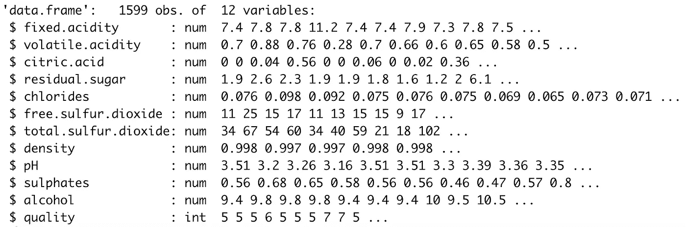

srt()函数的结果

使用 *str()* 函数，我们可以看到所有的变量类型都是数字，这是正确的格式，除了结果变量。我继续将因变量转换成二元分类响应。

```
#Format outcome variable
data$quality <- ifelse(data$quality >= 7, 1, 0)
data$quality <- factor(data$quality, levels = c(0, 1))
```

我选择的修改结果变量水平的任意标准如下:

1.  大于或等于 7 的值将被更改为 1，表示优质葡萄酒。
2.  另一方面，小于 7 的数量将被转换为 0，表示质量差或一般。

此外，我将变量“quality”的类型修改为 *factor，*表示变量是分类的。

# 探索性数据分析

现在，我着手开发一个基于数据的 EDA，以找到基本的见解，并确定变量之间的特定关系。

首先，我开发了一个描述性分析，其中我通过使用 *summary()* 函数收集了数据的五个数摘要统计信息。

```
#Descriptive statistics
summary(data)
```

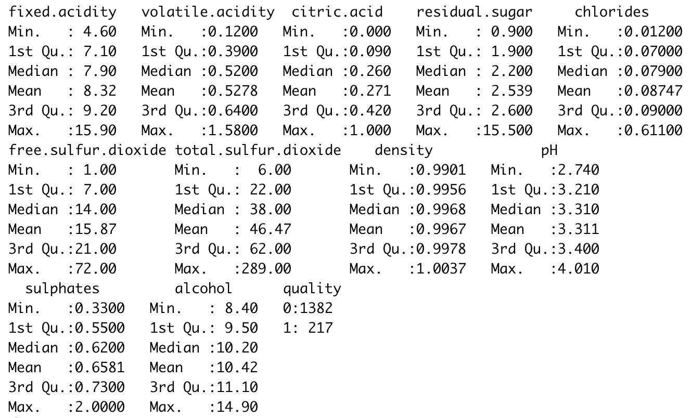

数据中每个变量的五位数汇总值

该图显示了数据中每个变量的五位数汇总值。换句话说，使用该函数，我获得了数值变量的最小值和最大值、第一个和第三个四分位数、平均值和中值。此外，摘要显示了因变量级别的频率。

接下来，我开发了一个单变量分析，包括分别检查每个变量。首先，我分析了因变量。

为了分析结果变量，我开发了一个柱状图来可视化分类水平的频率计数。此外，我生成了一个频率表，以了解每个类别中不同级别的确切数量和价值百分比。

```
#Univariate analysis
  #Dependent variable
    #Frequency plot
par(mfrow=c(1,1))
barplot(table(data[[12]]), 
        main = sprintf('Frequency plot of the variable: %s', 
                       colnames(data[12])),
        xlab = colnames(data[12]),
        ylab = 'Frequency')#Check class BIAS
table(data$quality)
round(prop.table((table(data$quality))),2)
```

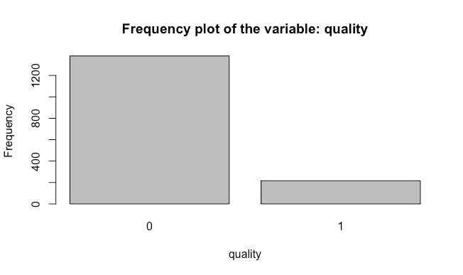

分析因变量的频率图

在分析该图时，我声明数据集有大量的 0 值，这表明数据中有更多的行表示葡萄酒质量差。换句话说，数据是有偏差的。

此外，通过分析这些表，我声明数据中有 1，382 行被认为是劣质酒，217 行被认为是优质酒。同样，数据集包含大约 86%的 0 结果值和 14%的 1 结果值。

> 从这个意义上说，有必要考虑数据集是有偏差的。这就是为什么在将数据分成训练集和测试集时，必须遵循分层抽样方法的原因。

现在，我开始分析独立变量。为了进行分析，我选择为每个变量创建箱线图和直方图。这些可视化将帮助我们识别五个数字汇总值的位置、它拥有的异常值以及变量遵循的分布。

```
#Independent variable
    #Boxplots
par(mfrow=c(3,4))
for (i in 1:(length(data)-1)){
  boxplot(x = data[i], 
          horizontal = TRUE, 
          main = sprintf('Boxplot of the variable: %s', 
                         colnames(data[i])),
          xlab = colnames(data[i]))
}#Histograms
par(mfrow=c(3,4))
for (i in 1:(length(data)-1)){
  hist(x = data[[i]], 
       main = sprintf('Histogram of the variable: %s',
                    colnames(data[i])), 
       xlab = colnames(data[i]))
}
```


用于分析数字自变量的箱线图

正如我们所见，箱线图显示了每个变量的均值、中值和四分位数测量值的位置，以及每个变量的取值范围。

通过分析箱线图，我得出结论，所有的变量都有异常值。此外，变量“残余糖”和“氯化物”是具有最大量异常值的变量。正如我们所看到的，在平均值和中间值附近有一个集中值，这反映在一个非常小的四分位范围(IQR)。

> 当我继续评估异常值时，这些信息将在数据准备阶段派上用场。

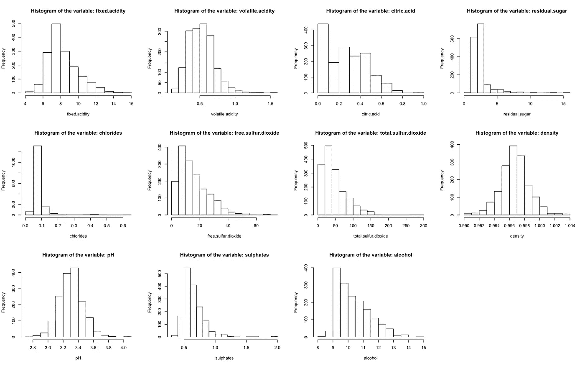

直方图用于分析数字自变量

可视化直方图，我确定了每个变量的模式。正如我们所看到的，在大多数分布中有一个右偏度。然而，变量“密度”和“pH”显示它们遵循正态分布。此外，我可以提一下，变量“残余糖”和“氯化物”的值范围很广，大多数观察结果都集中在图表的左侧。这种现象表明变量有大量的异常值。

最后，我开发了一个双变量分析来理解变量之间的关系。

```
#Bivariate analysis
  #Correlation matrix
library(ggcorrplot)
ggcorrplot(round(cor(data[-12]), 2), 
           type = "lower", 
           lab = TRUE, 
           title = 
             'Correlation matrix of the red wine quality dataset')
```

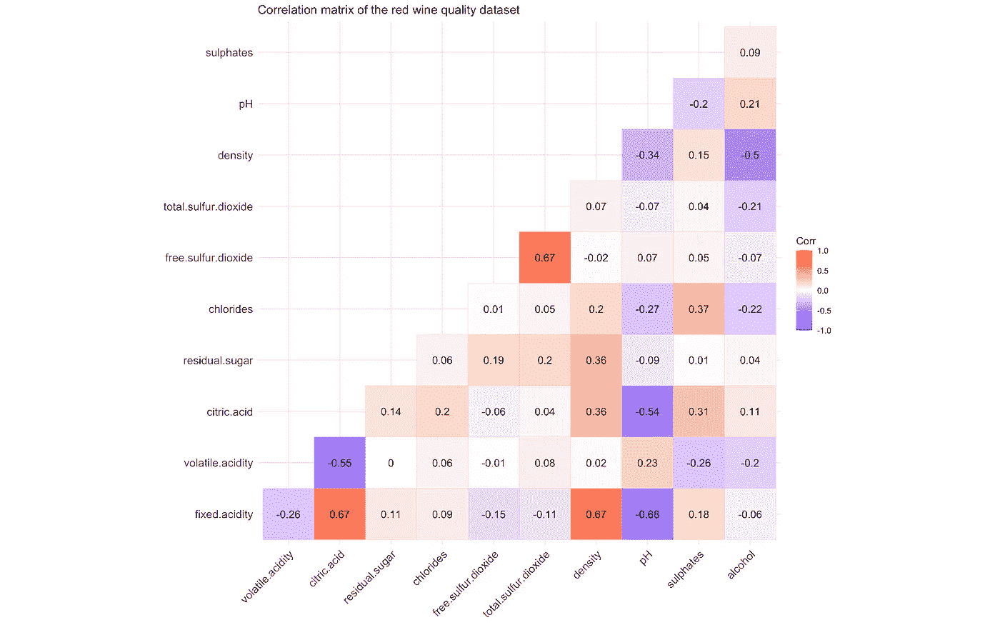

相关矩阵来分析数值变量之间的关系

在图像中，我们可以看到自变量之间的正负关系。如矩阵所示，在“固定酸度”变量和变量“柠檬酸”和“密度”之间存在 0.67 的正相关。换句话说，随着“固定酸度”变量的增加，“柠檬酸”也会增加。同样，同样的概念也适用于“游离二氧化硫”和“总二氧化硫”变量之间的关系。

此外，我可以声明变量“固定酸度”和“pH”具有负线性相关性-0.68。这种关系表明，当葡萄酒的固定酸度增加时，葡萄酒的 pH 值降低。这个假设是正确的，因为我们知道这样一个事实，当一种成分的 pH 值降低时，意味着该元素变酸了。

# 数据准备

一旦我完成了 EDA，我就开始准备数据来开发预测模型。在项目的这一步，我集中精力寻找丢失的数据并评估异常值。

```
#Missing values
sum(is.na(data))
```

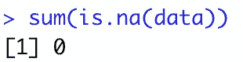

数据中缺失值数量的结果

既然我已经确定数据集不包含任何缺失值，我将继续处理异常值。

首先，我确定了每个变量的异常值数量。为了完成这一步，我创建并应用了一个识别异常值的特定函数。然后，我生成了一个数据帧来存储信息。此外，我使用 for 循环来收集和存储信息。

```
#Outliers
  #Identifing outliers
is_outlier <- function(x) {
  return(x < quantile(x, 0.25) - 1.5 * IQR(x) | 
           x > quantile(x, 0.75) + 1.5 * IQR(x))
}outlier <- data.frame(variable = character(), 
                      sum_outliers = integer(),
                      stringsAsFactors=FALSE)for (j in 1:(length(data)-1)){
  variable <- colnames(data[j])
  for (i in data[j]){
    sum_outliers <- sum(is_outlier(i))
  }
  row <- data.frame(variable,sum_outliers)
  outlier <- rbind(outlier, row)
}
```

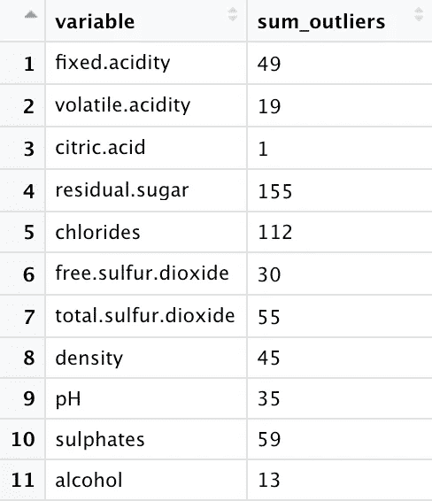

离群数据框架

正如我们所看到的，数据中的所有变量都有异常值。为了评估这些值，我遵循了一个标准，该标准规定我将接受在数据集的所有观察中异常值少于 5%的变量。

> 有必要提及的是，我并没有放弃离群值，因为它们代表并携带了关于数据集的必要信息。删除异常值会使我们的模型结果产生重大偏差。

```
#Identifying the percentage of outliers
for (i in 1:nrow(outlier)){
  if (outlier[i,2]/nrow(data) * 100 >= 5){
    print(paste(outlier[i,1], 
                '=', 
                round(outlier[i,2]/nrow(data) * 100, digits = 2),
                '%'))
  }
}
```

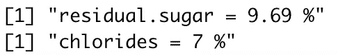

异常值百分比等于或大于 5%的变量

通过上面显示的代码，我能够识别出变量“残余糖”和“氯化物”分别有大约 10%和 7%的异常值。

此外，我继续输入这些变量的异常值。我选择用变量的平均值来改变异常值，因为正如我们在直方图中看到的，两个变量在平均值以下都有很大的集中值。因此，通过输入平均值，不会对数据的本质产生重大影响。

```
#Inputting outlier values
for (i in 4:5){
  for (j in 1:nrow(data)){
    if (data[[j, i]] > as.numeric(quantile(data[[i]], 0.75) + 
                                  1.5 * IQR(data[[i]]))){
      if (i == 4){
        data[[j, i]] <- round(mean(data[[i]]), digits = 2)
      } else{
        data[[j, i]] <- round(mean(data[[i]]), digits = 3)
      }
    }
  }
}
```

# 建模

现在，我正确地排列了数据集，我开始开发预测红酒质量的机器学习模型。第一步是将数据分为训练和测试。由于数据是不平衡的，我着手开发一个分层抽样。我使用了 80%的代表优质葡萄酒的观察值(“质量”变量的一个结果)来平衡训练集。换句话说，在训练集中，因变量将具有相同数量的观察值 0 和 1。

```
#Splitting the dataset into the Training set and Test set
  #Stratified sample
data_ones <- data[which(data$quality == 1), ]
data_zeros <- data[which(data$quality == 0), ]#Train data
set.seed(123)
train_ones_rows <- sample(1:nrow(data_ones), 0.8*nrow(data_ones))
train_zeros_rows <- sample(1:nrow(data_zeros), 0.8*nrow(data_ones))
train_ones <- data_ones[train_ones_rows, ]  
train_zeros <- data_zeros[train_zeros_rows, ]
train_set <- rbind(train_ones, train_zeros)table(train_set$quality)#Test Data
test_ones <- data_ones[-train_ones_rows, ]
test_zeros <- data_zeros[-train_zeros_rows, ]
test_set <- rbind(test_ones, test_zeros)table(test_set$quality)
```

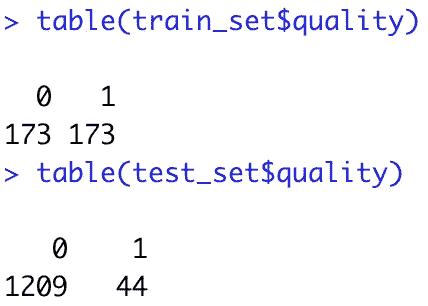

训练和测试集的因变量表

正如我们在图中看到的，训练集包含的观察值比测试集少。然而，训练集将被平衡以有效地训练模型。

现在我已经完成了这一步，我继续开发模型，并确定哪个模型可以准确预测红酒的质量。

## 逻辑回归

```
#Logistic Regression
lr = glm(formula = quality ~.,
         data = training_set,
         family = binomial)#Predictions
prob_pred = predict(lr, 
                    type = 'response', 
                    newdata = test_set[-12])library(InformationValue)
optCutOff <- optimalCutoff(test_set$quality, prob_pred)[1]y_pred = ifelse(prob_pred > optCutOff, 1, 0)
```

一旦使用训练集创建了模型，我就开始使用测试集数据预测值。

> 由于逻辑回归将提供概率值，我继续计算最佳分界点，这将把结果值分类为 1 或 0。

然后，利用获得的预测值，我继续开发一个混淆矩阵，我们可以用逻辑回归模型的预测值来可视化测试集值。

```
#Making the confusion matrix
cm_lr = table(test_set[, 12], y_pred)
cm_lr#Accuracy
accuracy_lr = (cm_lr[1,1] + cm_lr[1,1])/
  (cm_lr[1,1] + cm_lr[1,1] + cm_lr[2,1] + cm_lr[1,2])
accuracy_lr
```

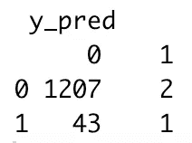

逻辑回归的混淆矩阵

可视化该表时，我声明该模型准确预测了 1，208 个值，这意味着该模型对 45 个观察值进行了错误分类。此外，我得出结论，该模型的准确率为 96.41%。

```
#ROC curve
library(ROSE)
par(mfrow = c(1, 1))
roc.curve(test_set$quality, y_pred)
```

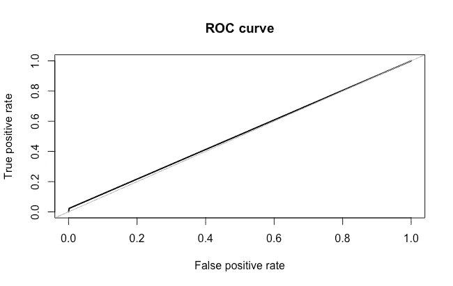

逻辑回归的 ROC 曲线

此外，我继续开发一个 ROC 曲线，以了解该模型区分结果类别的能力。最后我发现曲线下面积(AUC)是 51.1%。

## 决策图表

现在我按照和以前一样的步骤。一旦使用训练集创建了模型，我就开始使用测试集数据预测值。

```
#Decision Tree
library(rpart)
dt = rpart(formula = quality ~ .,
           data = training_set,
           method = 'class')#Predictions
y_pred = predict(dt, 
                 type = 'class', 
                 newdata = test_set[-12])
```

此外，我继续生成混淆矩阵，在这里我们可以看到测试集值和决策树模型的预测值。

```
#Making the confusion matrix
cm_dt = table(test_set[, 12], y_pred)
cm_dt#Accuracy
accuracy_dt = (cm_dt[1,1] + cm_dt[1,1])/
  (cm_dt[1,1] + cm_dt[1,1] + cm_dt[2,1] + cm_dt[1,2])
accuracy_dt
```

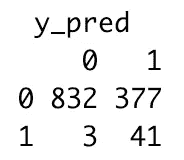

决策树的混淆矩阵

可视化该表后，我声明该模型准确预测了 873 个观察值，表明该模型错误分类了 380 个值。此外，我发现该模型的准确率为 69.67%。

```
#ROC curve
library(ROSE)
roc.curve(test_set$quality, y_pred)
```

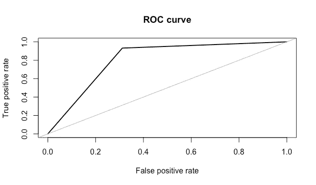

决策树的 ROC 曲线

然后，根据 ROC 曲线，我得到了曲线下面积(AUC ),其值为 81%。

## 随机森林

最后，我继续使用训练集创建随机森林模型，并使用测试集数据预测值。

```
#Random forest
library(randomForest)
rf = randomForest(x = training_set[-12],
                  y = training_set$quality,
                  ntree = 10)#Predictions
y_pred = predict(rf, 
                 type = 'class', 
                 newdata = test_set[-12])
```

现在，我通过创建一个混淆矩阵，用随机森林模型的预测值来可视化测试集值。

```
#Making the confusion matrix
cm_rf = table(test_set[, 12], y_pred)
cm_rf#Accuracy
accuracy_rf = (cm_rf[1,1] + cm_rf[1,1])/
  (cm_rf[1,1] + cm_rf[1,1] + cm_rf[2,1] + cm_rf[1,2])
accuracy_rf
```

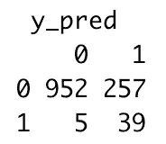

随机森林的混淆矩阵

通过评估该表，我证明了该模型准确预测了 991 个值，这意味着该模型错误分类了 262 个观察值。此外，还得出了该模型的准确率为 79.09%。

```
#ROC curve
library(ROSE)
roc.curve(test_set$quality, y_pred)
```

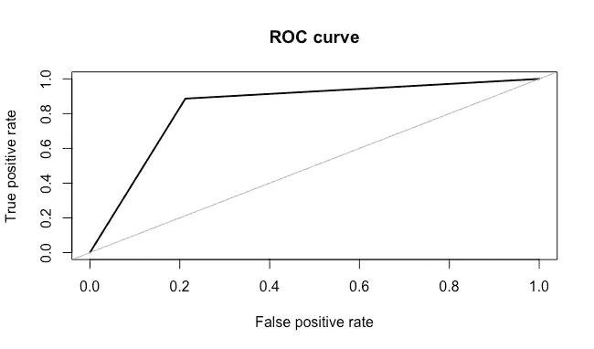

随机森林的 ROC 曲线

最后，通过 ROC 曲线，我获得了 83.7%的 AUC 值。

# 可变重要性

此外，我通过计算具有最高精确度的模型的变量重要性来回答项目的第二个问题。换句话说，我计算了逻辑回归模型的变量重要性。

```
#Variable importance
library(caret)
varImp(lr)
```

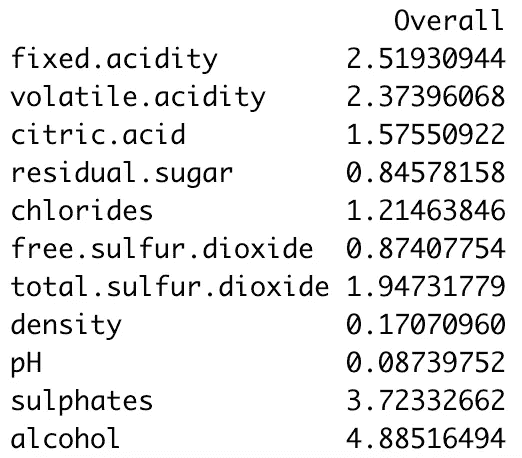

逻辑回归的可变重要性

通过分析结果，我宣布这个模型最重要的变量是“酒精”，其次是变量“硫酸盐”和“固定酸度”。

此外，我进行了一项调查，以了解这些成分对红酒质量的影响。我发现硫酸盐是葡萄酒中的一种成分，这种成分决定了饮料的新鲜度。从这个意义上来说，不含硫酸盐或含少量硫酸盐的葡萄酒通常保质期较短。换句话说，硫酸盐对葡萄酒的寿命有更多的控制，因为它有助于确保葡萄酒在打开时保持新鲜和干净。另一方面，酒精成分对葡萄酒的质量也起着重要的作用。酒精将有助于平衡葡萄酒的坚硬和酸的味道，使葡萄酒的坚硬和柔软的特性相互联系。

正如我们所分析的，逻辑回归模型解释了实际的理论事实。关于优质葡萄酒的基本成分的调查包括了模型中必要的变量。出于这个原因，变量“酒精”和“硫酸盐”对模型非常重要，因为这些元素将是指示葡萄酒质量好坏的重要组成部分。

# 结论

在获得不同机器学习算法的结果后，我声明逻辑回归模型在预测红酒质量方面显示出更高的准确性。该模型的准确率为 96.41%，能够正确预测 1209 个值，这意味着该模型的误分类误差为 3.59%。

另一方面，通过分析 ROC 曲线，我声明模型表现不如预期。通过评估曲线下面积(AUC = 51.1%)，我将 ROC 曲线标记为失败曲线。换句话说，该模型不能识别不同的类别，这表明该模型具有低性能。出于这个原因，我得出结论，即使该模型在预测测试集值方面有很好的准确性，但它在快速识别真正的正值方面的速度很慢。

此外，通过分析其他 ROC 曲线，我发现随机森林确实具有最佳性能，获得了 83.7%的曲线下面积。这意味着尽管随机森林模型在三个模型中没有显示出最高的准确性，但它通过比逻辑回归更好地检测因变量的不同类别而具有最佳性能。

此外，通过逻辑回归模型，我进一步确定了哪些理化性质对红酒的质量影响最大。我发现“酒精”、“硫酸盐”和“固定酸度”是模型中影响最大的变量。就此而言，如果这些变量之一发生变化，模型的结果将受到强烈影响。