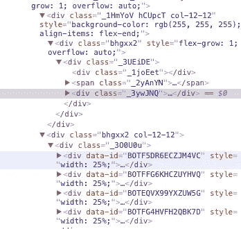
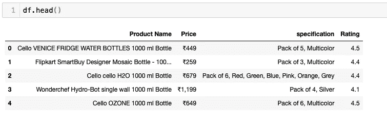
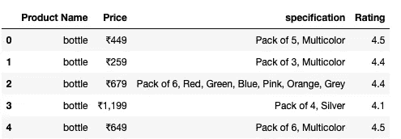
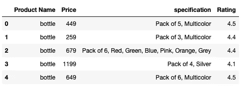
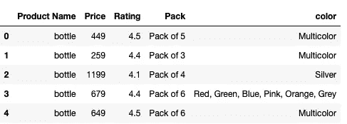
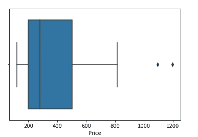
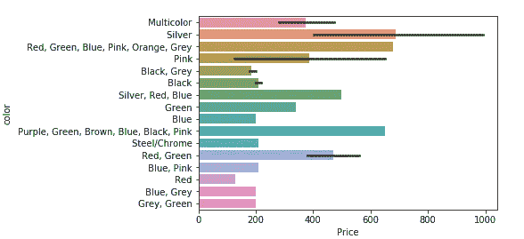
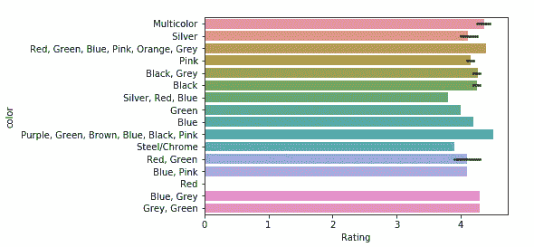
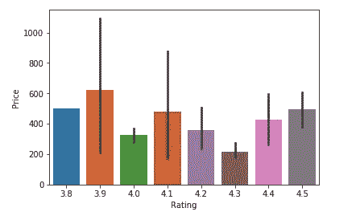
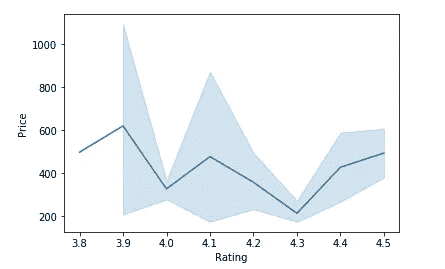

# 使用 Python 进行数据采集和分析

> 原文：<https://towardsdatascience.com/competitive-price-data-scraping-and-analysis-using-python-a1f34758155?source=collection_archive---------27----------------------->

## 使用数据收集的竞争性定价

**数据** **抓取**是一种从互联网上检索大量数据的技术。这个技巧在**竞争** **定价**中非常有用。为了确定我们产品的最佳价格，我们可以比较市场上的类似产品。这些价格变化很大。因此，在这篇博客中，我将展示我们如何丢弃关于特定产品的数据。

最常见的数据抓取技术是使用 **BeautifulSoup** 。它提取页面的 html 并将其存储为非结构化数据。我们必须把它转换成结构化的格式。

让我们导入我们将需要的所有必要的库:

```
import requests
from fake_useragent import UserAgent
import pandas as pd
import bs4
```

我们提取的数据是非结构化数据。所以我们将创建空列表，以结构化的形式存储它们，

```
products=[] #List to store name of the product
prices=[] #List to store price of the product
ratings=[] #List to store rating of the product
specifications = [] #List to store specifications of the product
df=pd.DataFrame()
```

创建用户代理。参考此链接[https://pypi.org/project/fake-useragent/](https://pypi.org/project/fake-useragent/)

```
user_agent = UserAgent()
```

将产品名称作为输入。提取的数据将与该产品相关。

```
product_name = input("Product Name- ")
```


为了从产品列表的多个页面中提取数据，我们将使用一个 for 循环。该范围将指定要提取的页数。

```
for i in range(1,11):
    url = "[https://www.flipkart.com/search?q={0}&page={1](https://www.flipkart.com/search?q={0}&page={1)}" url = url.format(product_name,i) ## getting the reponse from the page using get method of requests module
    page = requests.get(url, headers={"user-agent": user_agent.chrome}) ## storing the content of the page in a variable
    html = page.content ## creating BeautifulSoup object
    page_soup = bs4.BeautifulSoup(html, "html.parser") for containers in page_soup.findAll('div',{'class':'_3liAhj'}):
        name=containers.find('a', attrs={'class':'_2cLu-l'})
        price=containers.find('div', attrs={'class':'_1vC4OE'})
        rating=containers.find('div', attrs={'class':'hGSR34'})
        specification = containers.find('div', attrs {'class':'_1rcHFq'})
        products.append(name.text)
        prices.append(price.text)
        specifications.append(specification.text) if type(specification) == bs4.element.Tag  else specifications.append('NaN')
        ratings.append(rating.text) if type(rating) == bs4.element.Tag  else ratings.append('NaN')
    df = pd.DataFrame({'Product Name':products,'Price':prices, 'specification':specifications, 'Rating':ratings})
```

为了从 soup 中提取数据，您需要指定要从中检索数据的 html 标签。你可以在网页上使用 inspect 元素。



上述代码将以结构化格式存储数据。当您打印 df 时，您将获得:

```
df.head()
```



# 清理数据

因为所有的产品都是一样的，我们可以把它们写成“瓶子”。

```
df['Product Name'] = 'bottle'
df.head()
```



同样，我们可以找到不同产品的数据。

现在，我们将从 Price 中删除符号，并清理 specification 列。

```
df[‘Price’] = df[‘Price’].str.lstrip(‘₹’)
df[‘Price’] = df[‘Price’].replace({‘,’:’’}, regex=True)
df.head()
```



```
df[‘Pack’], df[‘color’] = df[‘specification’].str.split(‘,’, 1).str
del df[‘specification’]
df.head()
```



# **我们得到的数据的一些基本分析**

## 绘制箱线图

```
import numpy as np
import seaborn as sns
df[‘Price’] = df[‘Price’].astype(np.float)
sns.boxplot(x=df[‘Price’])
```



正如我们所看到的，在价格范围非常高的地方有一些异常值。

## 绘制条形图

```
sns.barplot(x=df[‘Price’], y=df[‘color’])
```



我们可以观察到某种颜色的价格是如何变化的。多种颜色的行是成包的，如 4 个一包或 6 个一包等。

```
df[‘Rating’] = df[‘Rating’].astype(np.float)
sns.barplot(x=df[‘Rating’], y=df[‘color’])
```



我们还可以观察到，颜色对产品的评级几乎没有影响。

```
sns.barplot(x=df[‘Rating’], y=df[‘Price’])
```



```
sns.lineplot(x=df[‘Rating’], y=df[‘Price’])
```



从这里我们可以得出结论，价格较低的产品在某种程度上有较高的收视率。

谢谢大家，我希望你们对我们如何使用数据收集来获得有竞争力的价格有所了解。除了博客中提到的，你还可以尝试不同的 EDA 技术。