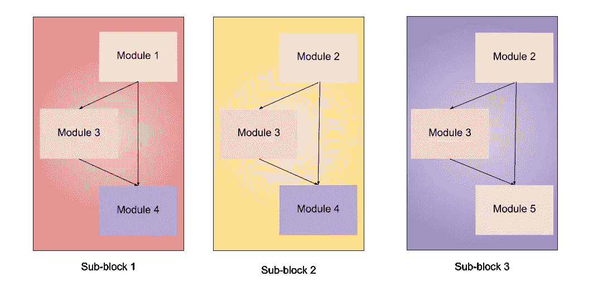

# 所有高效网络模型的完整架构细节

> 原文：<https://towardsdatascience.com/complete-architectural-details-of-all-efficientnet-models-5fd5b736142?source=collection_archive---------0----------------------->

## 让我们深入探究所有不同高效网络模型的架构细节，并找出它们之间的不同之处。


乔尔·菲利普在 [Unsplash](https://unsplash.com?utm_source=medium&utm_medium=referral) 上的照片

我在一次 Kaggle 竞赛中翻阅笔记本，发现几乎每个人都在使用 EfficientNet 作为他们的主干网，这是我之前从未听说过的。它是由谷歌人工智能在这篇[论文](https://arxiv.org/abs/1905.11946)中介绍的，他们试图提出一种如其名称所示更有效的方法，同时改善艺术效果的状态。一般来说，模型做得太宽、太深，或者分辨率太高。增加这些特征最初有助于模型，但是它很快饱和，并且所制作的模型只是具有更多的参数，因此效率不高。在 EfficientNet 中，它们以更有原则的方式进行扩展，即逐渐增加所有内容。


[模型缩放。(a)是一个基线网络示例；(b)-(d)是仅增加网络宽度、深度或分辨率的一个维度的传统缩放。(e)是我们提出的复合缩放方法，它以固定的比例统一缩放所有三个维度。](https://arxiv.org/pdf/1905.11946v3.pdf)

不明白发生了什么？别担心，一旦你看到这个建筑，你就会明白的。但首先，让我们看看他们用这个得到的结果。


[模型尺寸与 ImageNet 精度](https://arxiv.org/pdf/1905.11946v3.pdf)

由于参数数量少得多，模型系列是有效的，并且还提供了更好的结果。现在我们已经看到了为什么这些可能成为标准的预训练模型，但是缺少了一些东西。我记得[莱米·卡里姆](https://medium.com/u/c2958659896a?source=post_page-----5fd5b736142--------------------------------)的一篇文章，他展示了预训练模型的架构，这对我理解它们和创建类似的架构帮助很大。

[](/illustrated-10-cnn-architectures-95d78ace614d) [## 插图:10 个 CNN 架构

### 普通卷积神经网络的编译可视化

towardsdatascience.com](/illustrated-10-cnn-architectures-95d78ace614d) 

由于我在网上找不到这样的一个，我决定理解它并为你们所有人创建一个。

# 共有的事物

首先，任何网络都是它的主干，然后开始所有的架构实验，这在所有八个模型和最终层中都很常见。


此后，它们中的每一个都包含 7 个块。这些模块还包含不同数量的子模块，随着我们从效率 0 提高到效率 7，子模块的数量也会增加。要查看 Colab 中模型的层，请编写以下代码:

```
!pip install tf-nightly-gpuimport tensorflow as tfIMG_SHAPE = (224, 224, 3)
model0 = tf.keras.applications.EfficientNetB0(input_shape=IMG_SHAPE, include_top=False, weights="imagenet")tf.keras.utils.plot_model(model0) # to draw and visualize
model0.summary() # to see the list of layers and parameters
```

如果你计算一下 EfficientNet-B0 中的总层数，总数是 237，而在 EfficientNet-B7 中，总数是 813！！但是不要担心，所有这些层都可以由下面显示的 5 个模块和上面的茎制成。


我们将使用 5 个模块来构建架构。

*   **模块 1** —用作子模块的起点。
*   **模块 2** —该模块用作除第一个模块之外的所有 7 个主模块的第一个子模块的起点。
*   **模块 3** —该模块作为跳接连接至所有子模块。
*   **模块 4** —用于组合第一个子块中的跳跃连接。
*   **模块 5** —每个子模块以跳接方式连接到其前一个子模块，并使用该模块进行组合。

这些模块被进一步组合以形成子块，这些子块将以某种方式在块中使用。



*   **子块 1** —仅用作第一个块中的第一个子块。
*   **子块 2** —它被用作所有其它块中的第一个子块。
*   **子块 3** —用于所有块中除第一个以外的任何子块。

到目前为止，我们已经指定了将被组合以创建高效网络模型的所有内容，所以让我们开始吧。

## EfficientNet-B0


高效网络架构-B0。(x2 表示括号内的模块重复两次)

## 效率网络-B1


高效网络架构-B1

## B2 效率网

其架构与上述模型相同，它们之间的唯一区别是特征图(通道)的数量不同，这增加了参数的数量。

## B3 效率网


高效网络架构-B3

## 高效网络-B4


高效网络架构-B4

## 高效网络-B5


高效网络 B5 的架构

## B6 效率网


B6 高效网络的架构

## B7 效率网


B7 高效网络的架构

很容易看出所有模型之间的差异，他们逐渐增加了子块的数量。如果你理解这些架构，我会鼓励你选择任何一个模型，打印出它的概要，并浏览一遍以更彻底地了解它。下表显示了卷积运算的内核大小以及 EfficientNet-B0 中的分辨率、通道和层。


[内核大小、分辨率、通道和层数信息。](https://arxiv.org/pdf/1905.11946v3.pdf)

此表包含在原始文件中。这个决议对整个家庭来说是一样的。我不知道内核大小是变化还是保持不变，所以如果有人知道，请回复。层数已经在上面的图中示出。频道数量各不相同，它是根据从每个型号的摘要中看到的信息计算出来的，如下所示(*)如果您使用的是移动设备，则需要在横向模式下查看*。)

```
╔═══════╦══════╦══════╦══════╦══════╦══════╦══════╦══════╗
║ Stage ║  B1  ║  B2  ║  B3  ║  B4  ║  B5  ║  B6  ║  B7  ║
╠═══════╬══════╬══════╬══════╬══════╬══════╬══════╬══════╣
║     1 ║   32 ║   32 ║   40 ║   48 ║   48 ║   56 ║   64 ║
║     2 ║   16 ║   16 ║   24 ║   24 ║   24 ║   32 ║   32 ║
║     3 ║   24 ║   24 ║   32 ║   32 ║   40 ║   40 ║   48 ║
║     4 ║   40 ║   48 ║   48 ║   56 ║   64 ║   72 ║   80 ║
║     5 ║   80 ║   88 ║   96 ║  112 ║  128 ║  144 ║  160 ║
║     6 ║  112 ║  120 ║  136 ║  160 ║  176 ║  200 ║  224 ║
║     7 ║  192 ║  208 ║  232 ║  272 ║  304 ║  344 ║  384 ║
║     8 ║  320 ║  352 ║  384 ║  448 ║  512 ║  576 ║  640 ║
║     9 ║ 1280 ║ 1408 ║ 1536 ║ 1792 ║ 2048 ║ 2304 ║ 2560 ║
╚═══════╩══════╩══════╩══════╩══════╩══════╩══════╩══════╝
```

Medium 没有任何制作表格的格式，所以如果你想创建如上的表格，你可以从这个[站点](https://ozh.github.io/ascii-tables/)创建 ASCII 表格。

在结束之前，我再次附上了其研究论文中的另一张图片，该图片显示了其相对于其他先进技术的性能，并且还减少了所需的参数数量和触发器数量。


[来源](https://arxiv.org/pdf/1905.11946v3.pdf)

如果您想创建像这样的高级 CNN 架构，或者在理解所使用的任何层或术语方面有问题，请不要担心，我已经写了一篇文章来解决这些问题。

[](/beyond-the-standard-cnn-in-tensorflow-2-a7562d25ca2d) [## 超越 Tensorflow 2 中的标准 CNN

### 使用复杂的架构生成更深层次的模型，并了解不同的层，从而使模型更好。

towardsdatascience.com](/beyond-the-standard-cnn-in-tensorflow-2-a7562d25ca2d) 

你想看看 EfficientNet 如何在 Kaggle 挑战赛上与模特们一较高下吗，你可以看看这篇文章。

[](/efficientnet-should-be-the-goto-pre-trained-model-or-38f719cbfe60) [## EfficientNet 应该是 goto 预训练模型或…

### 比较不同预训练模型的时间和准确性，并最终创建一个集成来提高结果。

towardsdatascience.com](/efficientnet-should-be-the-goto-pre-trained-model-or-38f719cbfe60)