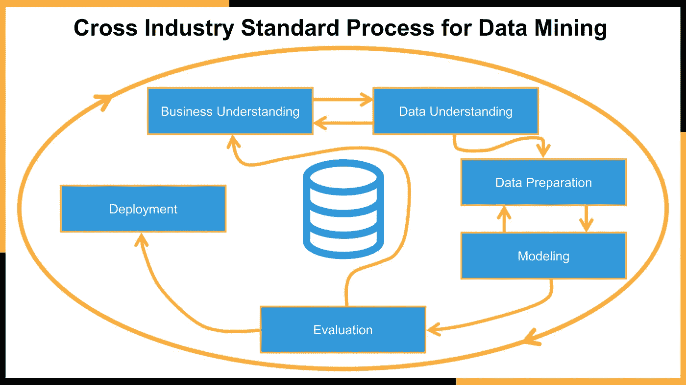
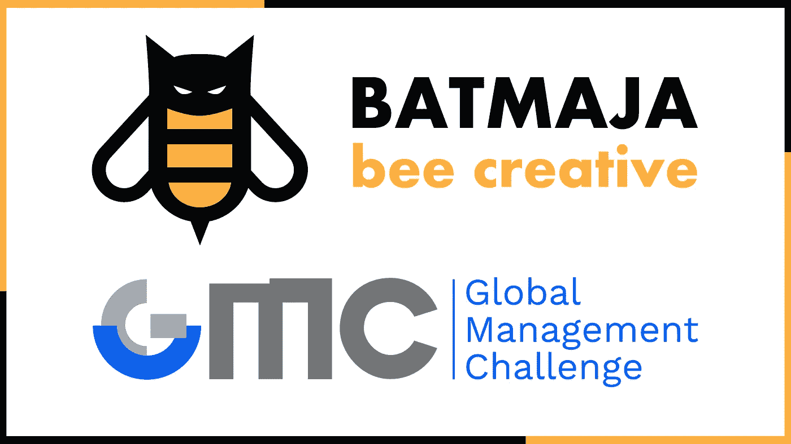
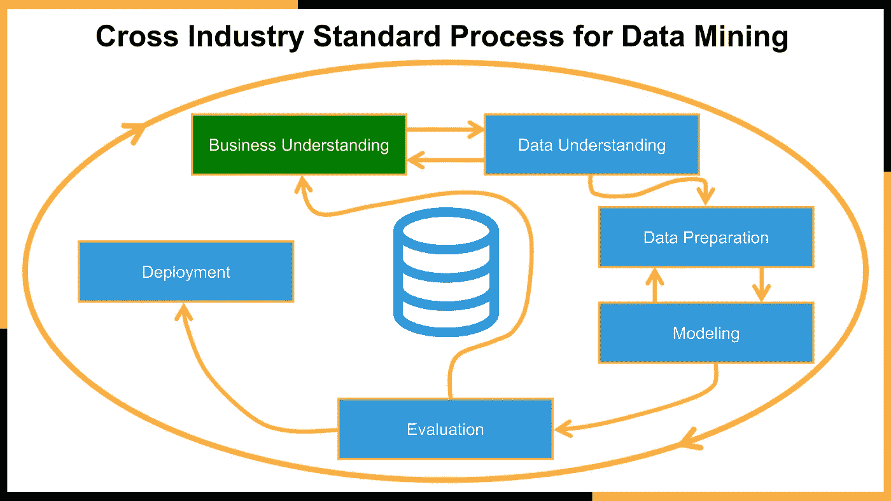
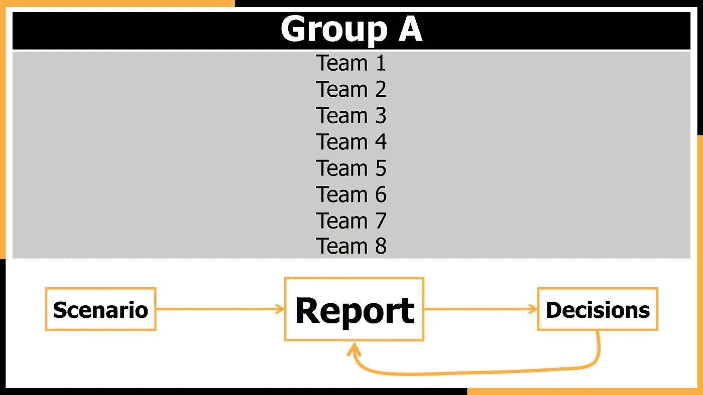
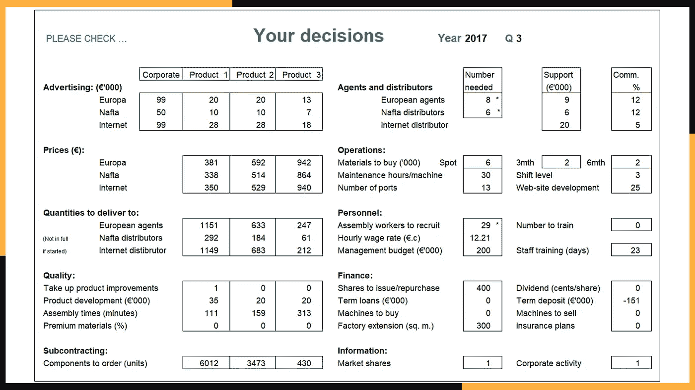
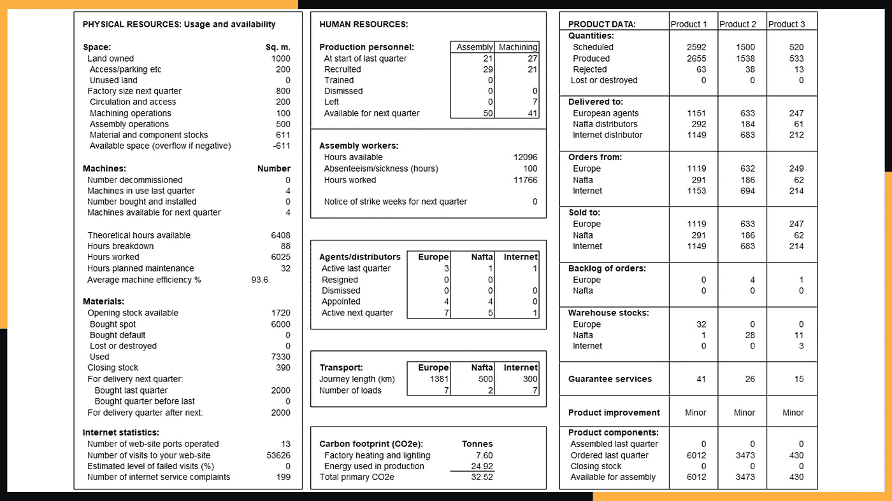
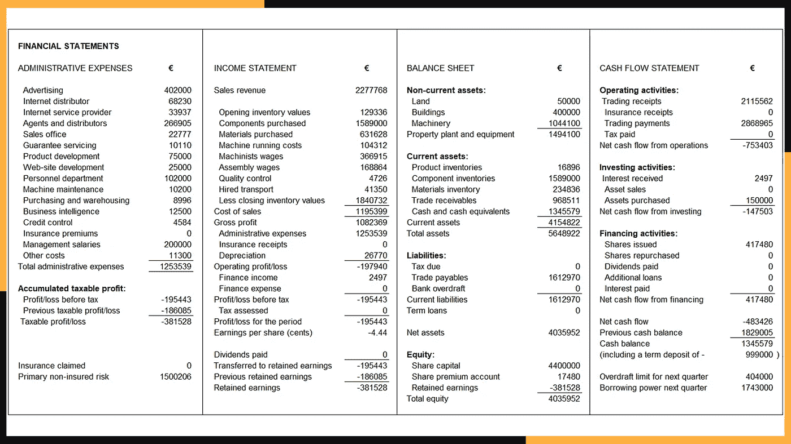
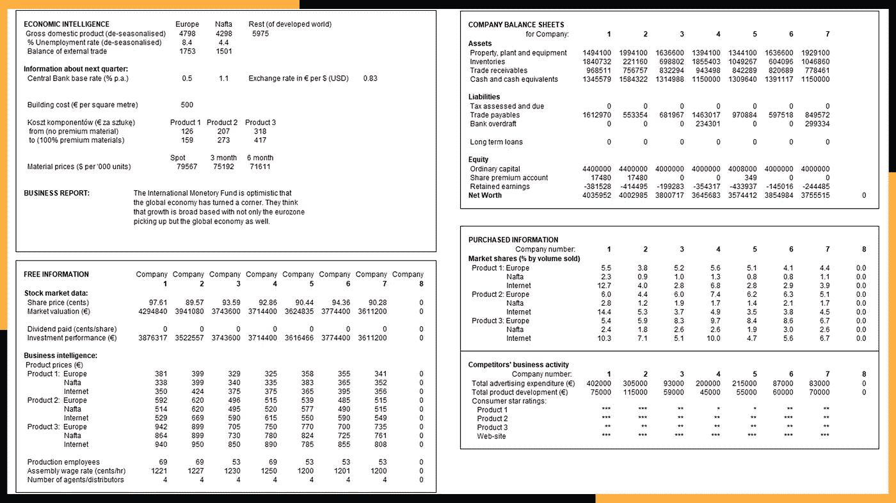
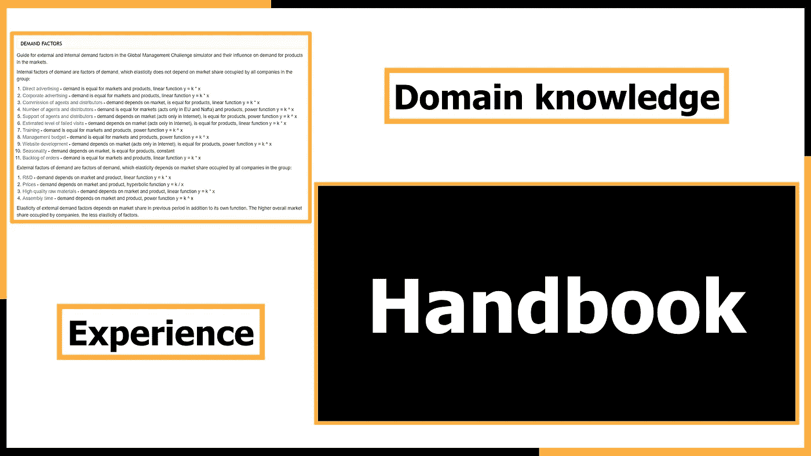

# 完整的数据科学项目:业务理解

> 原文：<https://towardsdatascience.com/complete-data-science-project-part-1-business-understanding-b8456bb14bd4?source=collection_archive---------8----------------------->

## 完整的数据科学项目

## *根据全球管理挑战预测在证券交易所上市的生产公司订单数量的项目。*

由[卢克·切瑟](https://unsplash.com/@lukechesser?utm_source=medium&utm_medium=referral)在 [Unsplash](https://unsplash.com?utm_source=medium&utm_medium=referral) 上拍摄的照片

这是**数据科学项目**系列的第一篇文章。我想介绍一个机器学习世界的指南。我将描述基本的理论假设以及实际的解决方案。无论你是一个初学者，你只是对人工智能的主题感兴趣，还是你已经是一名数据科学家，我认为我的文章将会影响到你们每个人，并激励你们继续工作。根据**跨行业数据挖掘标准流程** :
1 的方法，每篇文章都被划分为数据科学流程阶段。**业务理解** *—你在这里*
2。[数据理解](/complete-data-science-project-data-understanding-d4c937a0071c)
3。数据准备
4。造型
5。评价
6。部署

数据科学项目生命周期，图片由作者提供，灵感来自[来源](https://upload.wikimedia.org/wikipedia/commons/thumb/b/b9/CRISP-DM_Process_Diagram.png/598px-CRISP-DM_Process_Diagram.png)

数据挖掘的跨行业标准流程没有任何硬性框架。这个过程是高效的、迭代的，当我们发现我们犯了错误或者没有考虑到某些事情时，我们总是可以回到前面的步骤。你会在 [**GitHub**](https://github.com/BartoszSzablowski/Forecasting-the-number-of-orders) 上找到整个项目。

BATMAJA 团队和全球管理挑战徽标，图片由作者提供，GMC 徽标由[来源](https://gmcpoland.pl/)提供，经作者许可编辑

该项目基于国际**全球管理挑战**竞赛，预测在证券交易所上市的生产公司的订单数量。我代表 **BATMAJA** 学生队，和他们一起进入了全国决赛。这是一个基于商业模拟的竞赛。这些团队被分成不同的小组，投资结果(即市场价值和支付的股息)最高的团队进入下一阶段。该公司在欧洲市场、北美自由贸易区和互联网上生产和销售 3 种不同的产品。所有的团队都是从同一个故事开始的。许多因素会影响这些市场的订单数量。

将业务理解作为数据科学项目生命周期的一个阶段，图片由作者提供，灵感来自[来源](https://upload.wikimedia.org/wikipedia/commons/thumb/b/b9/CRISP-DM_Process_Diagram.png/598px-CRISP-DM_Process_Diagram.png)

**业务理解** —这个阶段包括对问题的非常精确的说明，以及评估目标实现情况的方法。

> Problem➜模型➜解

我们的目标是创建一个问题模型，然后用它来寻找解决方案。模型应该足够精确，以使解决方案有意义，否则，我们会做太多的假设和近似，这将使解决方案远离真实和无意义。需要补充的是，模型并不等同于问题，而只是现实的一种表象。因此，模型应该足够精确以找到解决方案，并且应该足够通用以不包括不相关的变量[ **1** ]。问题的正确解决涉及到对问题的正确认识。真正的商业问题很少是显而易见的。因此，为了使解决方案被认为是可接受的，有必要对项目采用迭代方法，对各个阶段进行多次重复。数据科学家应该有创造力和领域知识来正确地表述问题。我们应该问自己问题，这将导致预期的价值。
*~确切的商业目的是什么？*
创造一个机器学习模型本身并不是目的。该模式应该为企业增加价值，创造新的利润或降低成本。如果有任何解决方案，应该核实这个问题目前是如何解决的。提出的问题可以公式化为一个或多个机器学习模型:分类、回归或其他[ **2** ]。最后，有必要决定将使用哪些指标来评估模型。该指标还允许您比较模型，并确定模型是欠拟合还是过拟合。好了，这不是过程的结束，还有一步。写下所有的假设并检查它们。这将允许您在设计的早期阶段就发现错误。

GMC 的基本规则，授权图像

让我们继续了解全球管理挑战。参赛队伍被分成小组，最多有 **8 支队伍**参赛。每个小组从相同的场景开始，这些是公司在**前 5 个季度**的活动报告。然后，团队根据他们公司的历史，决定公司下一季度的运营方式。做出决策后，每个团队都会收到一份报告，其结构与历史报告相同。在**训练阶段**团队做出 **3 个决定**，在每个后续阶段已经 **5 个决定**。在比赛的第**第一阶段**中，两支最佳队伍**进入下一阶段。在比赛的**第二阶段**有 **8 个小组**和**最佳小组**来自**每个小组**进入**全国决赛**。**最佳队伍**进入**世界决赛**。**

表格-你的决定，作者图片

让我们转到报告结构，团队以电子表格的形式收到报告。报告的第一部分包含根据团队决策在上个季度做出的**决策**，除非并非所有决策都是可能的，并且被系统纠正(标记为*)。团队在截止日期前在专用平台上做出决策。

工作表—资源和产品，按作者分类的图片

报告的下一部分涉及**资源和产品**，因此公司在工厂和销售部门的活动。右边是这些市场的产品销售信息。这里有一个预测订购产品数量的问题。如果公司生产了太多的产品，就需要储存这些产品，这就带来了成本，或者说是为生产那些未来才销售出去的产品买单。此外，这种情况会在未来造成进一步的问题，因为必须生产的产品比以前设想的要少。问题比较多，但是这样的情况降低了公司的营业利润。相反的例子是相对于订单数量而言，生产的产品太少。客户将不得不等待产品，这将导致公司形象的损失。

工作表—财务报表，按作者分类的图像

然后我们有**财务报表**，类似于上市公司的财务报表。在这一点上，我们看到了这种竞争的要求有多高，以及它与管理层做出的实际决策有多接近。决策必须结合生产、广告、销售和财务的共同利益。

工作表-按作者分组信息、图像

报告的最后一部分是**集团的信息**。我们会发现在这个虚构的世界里情况是怎样的，在群体里情况又是怎样的。关注我们竞争对手的行动，包括他们产品的价格，这很重要。只要额外付费，我们就可以收到关于每个球队的市场份额和广告的信息。我们已经有了一些竞争的基础。

按作者分类的业务理解类型、图像

这不是我第一次参加比赛，所以我有一种直觉(**经验**)订单数量取决于什么。此外，我的团队成员拥有经济、金融、管理和生产或证券交易所运作的领域知识。我们使用了组织者网站上的**手册**和国际博客**中包含的信息，其中提出了解释变量。在下一篇文章中，我将介绍这个项目选择了哪些变量。一个现实的项目远不是一门课程的一部分，也不是 Kaggle 上的一场比赛。在这里，我们没有给定的变量，我们经常感觉自己好像是在雾里去目标。这很令人兴奋，这也是我热爱数据科学的原因。**

**下期 [**帖子**](/complete-data-science-project-data-understanding-d4c937a0071c) 见！**

# **参考**

**M. Michalewicz，Z. Michalewicz，基于难题的学习:批判性思维、数学和问题解决导论(2008)，混合出版社**

**[ **2** ] F. Provost，T. Fawcett，商业数据科学(2013)，O'Reilly，**

**[ **3** ] A. Geron，使用 Scikit-Learn、Keras 和 TensorFlow 进行机器学习(2017 年)，O'Reilly Media。**