# Adam 优化完全指南

> 原文：<https://towardsdatascience.com/complete-guide-to-adam-optimization-1e5f29532c3d?source=collection_archive---------4----------------------->

## Adam 优化算法从定义到实现

拉斐尔·比斯卡尔迪在 [Unsplash](https://unsplash.com?utm_source=medium&utm_medium=referral) 上拍摄的照片

在 20 世纪 40 年代，数学规划是最优化的同义词。一个优化问题包括一个**目标函数**，通过从一组**允许值**【1】中选择**输入值**，该目标函数将被最大化或最小化。

如今，优化是人工智能中一个非常熟悉的术语。具体来说，在深度学习问题上。而深度学习问题最值得推荐的优化算法之一就是 ***亚当*** 。

*免责声明:对神经网络优化的基本了解。如梯度下降和随机梯度下降是阅读前的首选。*

## 在这篇文章中，我将强调以下几点:

1.  Adam 优化的定义
2.  亚当之路
3.  随机优化的 Adam 算法
4.  亚当和其他优化者之间的视觉比较
5.  履行
6.  亚当的优点和缺点
7.  结论和进一步阅读
8.  参考

# 1.Adam 优化的定义

Adam 算法首先在 Diederik P. Kingma 和 Jimmy Ba 的论文 **Adam:一种随机优化方法**【2】中介绍。Adam 被定义为“一种高效**随机优化**的方法，其中**只需要一阶梯度**，几乎不需要内存”[2]。好，让我们把这个定义分解成两部分。

首先，**随机优化**是在*随机性*存在的情况下，优化一个目标函数的过程。为了更好地理解这一点，让我们考虑随机梯度下降(SGD)。当我们有很多数据和参数时，SGD 是一个很好的优化器。因为在每一步，SGD 都从数据(小批量)的*随机子集计算梯度的估计值。不像梯度下降在每一步都考虑整个数据集。*

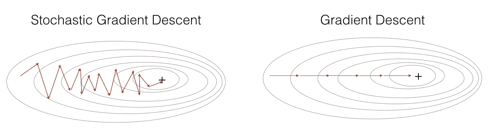

与 GD 相比，SGD 导致许多振荡。然而，SGD 要快得多，因为它不会遍历整个批处理(来源: [deeplearning.ai](https://www.deeplearning.ai/deep-learning-specialization/) )

第二，Adam 只需要**一阶梯度**。也就是说，亚当只需要参数的一阶导数。

现在，算法的名字*亚当*来源于*自适应矩估计*。随着我们对算法的研究，这一点将变得显而易见。

# 2.亚当之路

Adam 基于并结合了以前算法的优点。为了理解 Adam 算法，我们需要快速了解之前算法的背景。

## **我**。**带动量的新币**

物理学中的动量是运动中的物体，比如一个球沿着斜坡加速下降。因此，**带动量的 SGD**【3】**结合了之前更新步骤的梯度，以**加速梯度下降**。这是通过在相关方向上采取小而直接的步骤来实现的。**

**SGD 通过计算一个*****的梯度移动平均值来实现，然后**用它来更新你的参数*****【权重，偏差】。**********

*********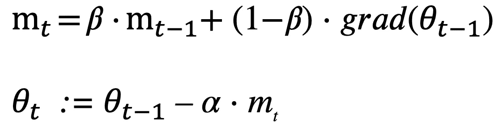*********

*********计算指数加权平均值(移动平均值)，然后更新参数*********

*   *********贝塔项( **𝛽** )控制着均线。β的值是[0，1]，一个常见的值是𝛽 = 0.9，这意味着我们对最后 10 次迭代的梯度进行平均，旧的梯度被丢弃或者被遗忘。因此，较大的β值(比如𝛽 = 0.98)意味着我们在更多的梯度上求平均值。*********
*   *******Alpha ( **α** )是决定每次迭代步长的学习率。*******

*******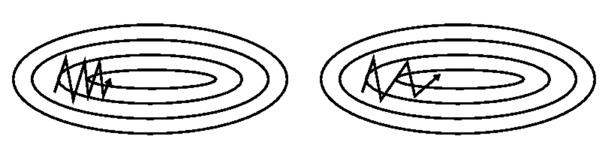*******

*********左** : SGD，**右**:带动量的 SGD(来源:[动量和学习率适应](https://www.willamette.edu/~gorr/classes/cs449/momrate.html))*******

## *******二。相关工作(AdaGrad 和 RMSProp)*******

*******好的，在我们讨论亚当之前，有两个算法需要了解。 **AdaGrad** (自适应梯度算法)【4】和 **RMSProp** (均方根传播)【5】都是 SGD 的扩展。这两种算法与 Adam 有一些相似之处。事实上，亚当结合了两种算法的优点。*******

## *********三世。自适应学习率*********

*******AdaGrad 和 RMSProp 也都是*自适应*梯度下降算法。意思是，**对于参数** (w，b)**中的每一个，学习率** (α) **被适配**。简而言之，学习率是按参数来维持的。*******

******为了更好地说明这一点，下面是对 AdaGrad 和 RMSProp 的解释:******

*   ******阿达格勒******

******阿达格拉德的**每参数学习率**帮助**增加稀疏参数的学习率**。因此， **AdaGrad 适用于稀疏梯度**，例如在自然语言处理和图像识别应用中【4】。******

*   ********RMSProp********

******RMSProp 是由 Tielemen 和 Hinton 提出来加速小批量学习的。在 RMSProp 中，**学习率基于 **最近梯度**的幅度的移动平均值来调整** *。*******

****也就是说，RMSProp 保持最近梯度平方的移动平均值，用(v)表示。因此，给予最近的梯度更多的权重。****

****这里，术语β(𝛽)被引入作为*遗忘因子*(就像在具有动量的 SGD 中一样)。****

****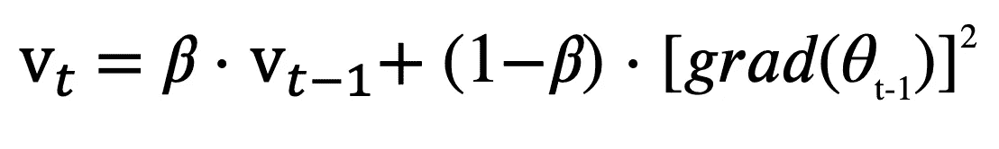****

****计算最近梯度平方的移动平均值****

****简而言之，在更新 ***θ*** (比如 ***w*** 或 ***b*** )时，将 ***θ*** *的前一个值的梯度除以*该参数*的最近梯度的平方的移动平均值，然后乘以 **α*******

*****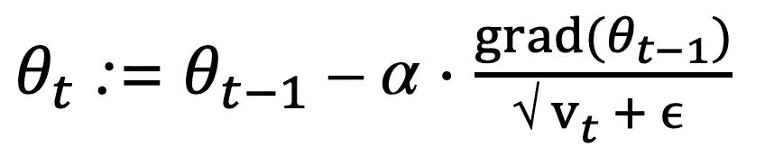*****

*****某些参数的更新步骤 *θ******

*****此外，RMSProp 在大的和冗余的数据集(例如噪声数据)上工作良好[5]。*****

*******术语(* **𝜖** ) *用于数值稳定性(避免被零除)。******

## ****以下是我们目前所学内容的视觉对比:****

********

****围绕鞍点的不同优化器(来源: [Imgur](https://imgur.com/a/Hqolp#2dKCQHh) 亚历克·拉德福德****

****在上面的 gif 中，你可以看到动量在找到正确的路径之前四处探索。至于 SGD，AdaGrad，和 RMSProp，都是走的差不多的路，但是 AdaGrad 和 RMSProp 显然更快。****

# ****3.随机优化的 Adam 算法****

****好了，现在我们已经得到了算法所需的所有部分。****

****正如[吴恩达](https://www.youtube.com/watch?v=JXQT_vxqwIs)所解释的，亚当:自适应力矩估计是动量和 RMSProp 的简单组合。****

********

****亚当算法(来源:亚当:随机优化的方法[2])****

****下面是优化目标函数 *f(θ)* 的算法，参数 *θ* (权重和偏差)。****

****Adam 包括超参数: *α* ，𝛽 *1* (来自动量)，𝛽 *2* (来自 RMSProp)。****

****初始化:****

*   *****m* = 0，这是第一个力矩矢量，按动量处理****
*   *****v* = 0，这是第二个力矩矢量，在 RMSProp 中处理****
*   *****t*:0****

****在迭代 *t* 时:****

*   ****更新 *t，t* := *t* + 1****
*   ****得到 *g* 相对于 *t 的梯度/导数，这里*的 *g* 相当于*T25【分别为 *dw* 和 *db******

***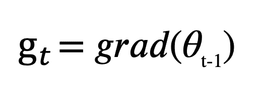***

*   ***更新第一时刻 *mt****
*   ***更新二阶矩 *vt****

***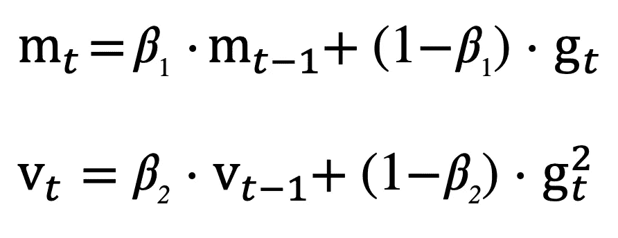***

***分别更新 mt 和 vt***

*   ***计算偏差修正后的 *mt* ( [偏差修正后的](https://youtu.be/lWzo8CajF5s)对移动平均值给出了更好的估计)***
*   ***计算偏差校正后的 v t***

***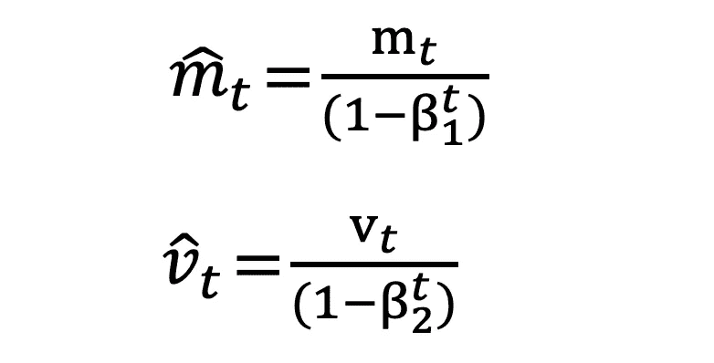***

***分别为偏差校正的 mt 和 vt***

*   ***更新参数θ***

***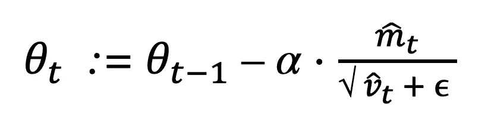***

***更新参数***

*****就这样！**循环将继续，直到 Adam 收敛到一个解。***

# ***4.优化器之间的视觉比较***

***识别前面提到的优化算法之间的差异的更好的方法是查看它们的性能的视觉比较。***

***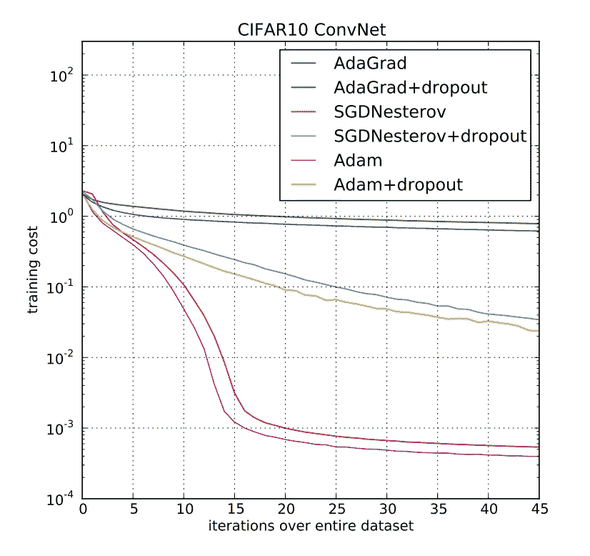***

***不同优化者的培训成本比较[2]***

***上图来自亚当[的论文](https://arxiv.org/abs/1412.6980)。它展示了超过 45 个时期的训练成本，你可以看到 CNN 的 Adam 比 AdaGrad 收敛得更快。也许值得一提的是，AdaGrad 对应于一个版本的 Adam，其超参数(α， *𝛽1，𝛽2* )为特定值[2]。为了避免混淆，我决定从这个帖子中删除 AdaGrad 的数学解释，但是如果你想了解更多，这里有 mxnet 的一个简单解释。***

***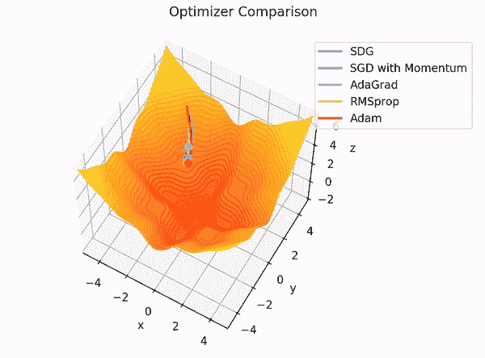***

****Gif 作者使用【7】****

***在上面的 gif 中，你可以看到亚当和 RMSProp 以相似的速度收敛，而阿达格拉德似乎在努力收敛。***

***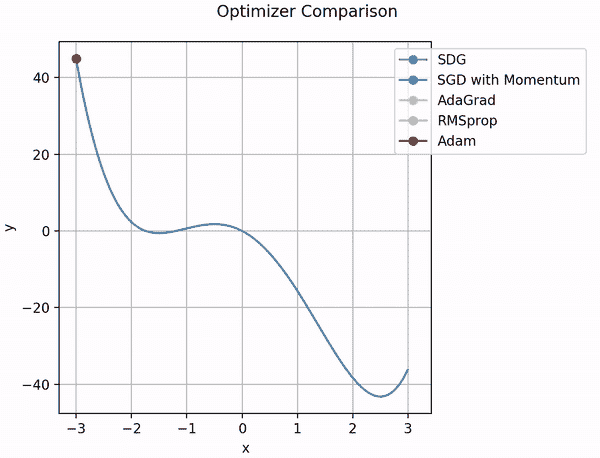***

****Gif 作者使用【7】****

***同时，在这张 gif 图中，你可以用动量将 Adam 和 SGD 收敛到一个解。而 SGD、AdaGrad 和 RMSProp 似乎陷入了局部最小值。***

# ***5.履行***

***在这里，我将展示将 Adam 合并到您的模型中的三种不同方法，分别是 TensorFlow、PyTorch 和 NumPy 实现。***

*   ***[TensorFlow 实现](https://www.tensorflow.org/api_docs/python/tf/keras/optimizers/Adam):***

*   ***[PyTorch 实现](https://pytorch.org/docs/stable/optim.html):***

*   ***仅用 NumPy 实现:***

***这个实现可能不太实用，但它会让您更好地理解 Adam 算法。***

***但正如你所猜测的，代码相当长，所以为了更好地查看，[给出了要点](https://gist.github.com/LayanCS/8bc7b0ec110487dd1e485c809954b044)。***

# ***6.亚当的优点和缺点***

***与其他算法相比，Adam 是最好的优化器之一，但它也不是完美的。所以，下面是亚当的一些优点和缺点。***

## ***优势:***

1.  ***可以处理噪声数据集上的稀疏梯度。***
2.  ***默认的超参数值在大多数问题上都做得很好。***
3.  ***计算效率高。***
4.  ***需要很少的内存，因此内存效率高。***
5.  ***适用于大型数据集。***

## ***缺点:***

1.  ***Adam 在某些领域没有收敛到最优解(这是 AMSGrad 的动机)。***
2.  ***Adam 可能会遇到体重下降的问题(这在 AdamW 中有所论述)。***
3.  ***最近的优化算法已经被证明更快更好[6]。***

# ***7.结论和进一步阅读***

***这就是 Adam 的全部内容:自适应矩估计！***

*****Adam** 是 SGD 的扩展，它结合了 AdaGrad 和 RMSProp 的优点。Adam 也是一种**自适应**梯度下降算法，因此它保持每个参数的学习速率。并且它跟踪梯度的第一和第二**时刻**的移动平均值。因此，使用第一和第二矩，Adam 可以给出参数更新的未缩放的直接估计**。最后，尽管出现了更新的优化算法，Adam(和 SGD)仍然是一个稳定的优化器。*****

***进一步阅读(和观看)的绝佳资源:***

*   ***[梯度的定义【Denis Auroux 教授(麻省理工学院)](https://ocw.mit.edu/courses/mathematics/18-02sc-multivariable-calculus-fall-2010/2.-partial-derivatives/part-b-chain-rule-gradient-and-directional-derivatives/session-35-gradient-definition-perpendicular-to-level-curves/)***
*   ***[带有动量的随机梯度下降](/stochastic-gradient-descent-with-momentum-a84097641a5d)作者 Vitaly Bushaev***
*   ***[深度学习的 Adam 优化算法简介](https://machinelearningmastery.com/adam-optimization-algorithm-for-deep-learning/)作者 Jason Brownlee***
*   ***吴恩达(deeplearning.ai)的深度学习专业化，也可以在 [YouTube](https://www.youtube.com/watch?v=1waHlpKiNyY&feature=youtu.be) 上找到***
*   ***[亚当——深度学习优化的最新趋势](/adam-latest-trends-in-deep-learning-optimization-6be9a291375c)维塔利·布沙耶夫***

# ***8.参考***

1.  ***斯蒂芬·j·赖特，[优化](https://www.britannica.com/science/optimization) (2016)，大英百科全书***
2.  ***Diederik P. Kingma，Jimmy Ba， [Adam:一种随机优化方法](https://arxiv.org/abs/1412.6980) (2015)，arxiv***
3.  ***[通过错误传播学习内部表征](https://dl.acm.org/doi/10.5555/104279.104293) (1986)，鲁梅尔哈特，辛顿和威廉姆斯，美国计算机学会***
4.  ***杜奇等人，[在线学习和随机优化的自适应次梯度方法](https://stanford.edu/~jduchi/projects/DuchiHaSi10_colt.pdf) (2011)，斯坦福***
5.  ***Geoffrey Hinton 与 Nitish Srivastava Kevin Swersky，[用于机器学习的神经网络(讲座 6)](https://www.cs.toronto.edu/~tijmen/csc321/slides/lecture_slides_lec6.pdf) (2012)，UToronto 和 Coursera***
6.  ***陈志强，[最近梯度下降算法的最新概述](https://johnchenresearch.github.io/demon/) (2020)，GitHub***
7.  ***kuroitu S，[优化方法比较](https://qiita.com/kuroitu/items/6695e0c79e888543e150) (2020)，Qiita***