# 在生产中构建和部署 Tweet Generator 应用程序的完整指南

> 原文：<https://towardsdatascience.com/complete-guide-to-build-and-deploy-a-tweet-generator-app-into-production-5006729e583c?source=collection_archive---------37----------------------->

## 学习使用代码从零开始构建一个 Tweet Generator 应用程序，从 Twitter 下载数据，在 Google Colab 上训练 GPT-2 模型，并在 AWS 上部署


🇨🇭·克劳迪奥·施瓦茨| @purzlbaum 在 [Unsplash](https://unsplash.com?utm_source=medium&utm_medium=referral) 上拍摄的照片

# 快速链接

app:【http://botbaby.in/】T4GitHub:[https://github.com/nikhilno1/bot-baby](https://github.com/nikhilno1/bot-baby)

# 目录:

- [背景与目的](#87f3)
- [大局](#9fbb)
- [构建数据集](#0f81)
- [模型训练](#236b)
- [在 AWS 上部署](#95de)
- [前端](#b939)
- [分析](#f467)-[结果](#458f)
- [挑战](#c3e0)

# 背景和目标

作为一个痴迷于数据分析的 twitter 用户，我一直想开发应用程序来分析 twitter 数据。我关心的是社交媒体话语演变的方式，尤其是。在推特上。假新闻、钓鱼、仇恨信息、虚假趋势、机器人等的扩散令人担忧，我总是有这种冲动去做些什么。

我也一直希望获得现实世界的工作经验，我相信这对我的下一份工作会有帮助。在我一年的职业生涯中期，我还有 3 个月的休息时间。由于时间不多(因为我也在找工作),我想挑选一个不太关注 ML 算法的问题，但可以让我花足够的时间学习大规模部署 ML 生产模型。

我决定开始为左翼(LW)和右翼(RW)的印度推特建立一个推特生成器应用程序。该应用背后的想法是突出两个阵营的两极分化和使用的语言。在我看来，以此为起点的好处是:

1.  允许我建立一个下载/传输 twitter 数据的框架。
2.  开发一个语言模型，我可以稍后用于其他下游任务。
3.  ML 模型培训允许我在大约一个月内建立完整的应用程序。
4.  完成 MLOps 生命周期，包括数据和模型的版本控制。
5.  使用 Elasticsearch 添加搜索功能，以获得其他有趣的见解。
6.  建立解决其他问题(假新闻/趋势、机器人、仇恨信息等)的基础

有了明确的目标后，我开始着手工作，用了大约 3 周的时间完成了这个应用。

现在让我们来看看所有的细节。

# 大局

这是我们将涉及的所有构建模块的快速快照。

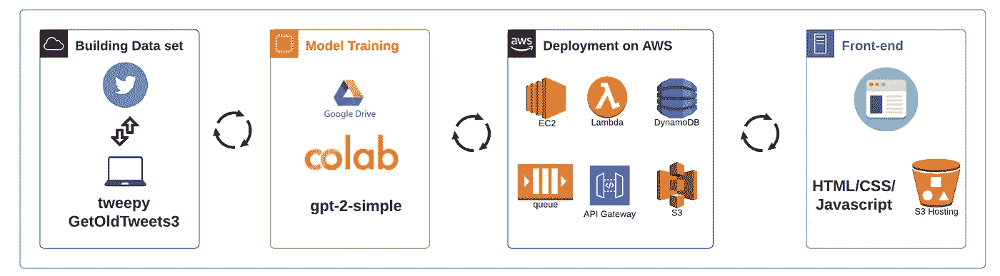

# 构建数据集

为了生成 LW & RW tweets，我需要两个语言模型，它们分别在自己的数据集上进行训练。在这种情况下，数据集是来自两个阵营的人的推文。

现在获得一份 LW & RW 帐户的列表可能有点困难，因为这些信息不会在任何地方公开。每个人都认为自己是中间派。:)

起初我想建立某种社交图或聚类算法，但后来我发现我不需要做任何复杂的事情。以下是我最后做的事情:

1.  我从少数几个经常被贴上 LW 或 RW 标签的客户开始。
2.  我利用了 Twitter 自己的推荐引擎，即“与 X 相似”的功能来寻找更多像他们一样的句柄。
3.  通过这个，我为每一方建立了一个 35-40 名用户的列表，我称他们为领导者。
4.  然后我下载了所有领导人的追随者名单。
5.  我合并了关注者列表，并按频率排序。
6.  这个想法是，任何追随大多数“领导者”的人都很可能属于同一个阵营。
7.  通过这种方式，我获得了双方排名前 15 万的 twitter 账户列表，并删除了两个列表中的共同账户。
8.  然后，我会下载所有这些用户的推文，这些推文将成为我的数据集。

从 twitter 上下载数据是一项痛苦的工作，因为存在各种速率限制。我不想冒应用程序被阻塞的风险，创建一大堆节点并下载。所以我公平地使用单个节点来下载数据。

不幸的是，当我开始构建数据集时，我并不知道 twint。我知道了 [tweepy](https://www.tweepy.org/) ，后来又知道了 [GetOldTweets3](https://pypi.org/project/GetOldTweets3/) 图书馆。由于这两个一起满足了我的要求，我与它滚动。但如果让我再来一次，我最有可能选择 *twint* 。

> ***注:Tweepy vs GetOldTweets3***
> 
> Tweepy: 7 天，每 15 分钟窗口 18000 条推文。3200 条最近的推文，每条推文都有丰富的信息。
> 
> GetOldTweets3:没有授权，信息更少，获取旧的推文

下载推文数据的步骤:

1.  使用 *tweepy，*我首先下载了所有的追随者 id。获得关注者 id 而不是用户名的好处是速度提高了 15 倍。id 的速率限制是 45000，而用户名的速率限制是 3000。
2.  一旦我有了所有的追随者 id，我就把它们合并，按降序排列，最后删除重复。
3.  然后我使用 twitter 的 HTTP GET 请求将 id 转换成用户名，这个请求没有任何速率限制。这一步是必需的，因为 [GetOldTweets3](https://pypi.org/project/GetOldTweets3/) 只对用户名有效，对 id 无效。
4.  最后，我使用 [GetOldTweets3](https://pypi.org/project/GetOldTweets3/) 为每个用户下载推文，时间可以追溯到 2014 年。为什么是 2014 年？那是选举年，许多人在那段时间开始活跃在 twitter 上。
5.  在下载了足够的数据后，我执行文本预处理，以删除超链接、非英语字符(因为我的语言模型只理解英语)和极短的推文。我将所有这些推文收集在一个文本文件中(LW 和 RW 分开)，这给了我最终的训练数据集。

# 模型训练(在 Google Colab 上)

当我开始开发这个应用程序时，我首先从零开始训练自己的语言模型。我在谷歌云上的 TPU 训练了一个 GPT-2 模型。但是结果并不像 Max Woolf 的笔记本那样吸引人。它开箱即用，效果极佳，所以我坚持使用它。为了减轻训练的痛苦，我甚至注册了 Colab Pro 订阅，这太便宜了。在 TPU 上进行一天的培训，我花了 100 多澳元，但 Colab Pro 每月花费我 10 美元。我鼓励每个人利用它。它给你更高的超时和内存。

我培训用的笔记本在这里。这与马克斯的原作十分相似。我用的是 GPT-2 的 355 米模型。根据我的数据集的大小，我训练了 2000 到 6000 步，直到我看到平均损失下降。对于我的大约 300 MB(每边)的训练数据集，我训练了 6000 步。

训练完成后，大约需要一个小时，模型输出一堆文件，很好地打包在一个归档文件中，您可以将它复制到 Google Drive 进行进一步分发。

# 在 AWS 上部署

我最初的计划是在谷歌新发布的 [AI 平台管道](https://cloud.google.com/ai-platform/pipelines/docs)上做生产部署。它看起来就像是一个全面的产品。然而，当我偶然看到这个[博客](https://francescopochetti.com/deploying-a-pretrained-gpt-2-model-on-aws/#Deploying_with_Lambda_EC2_and_DynamoDB)，它提供了在 AWS 上部署的详细说明，我想为什么我不先这样做。当你独自工作时，获得经常性的激励是很重要的。没有比尽早发布你的应用更好的激励了。所以我决定首先在 AWS 上部署它，然后再考虑在人工智能平台管道上通过适当的工作流程大规模部署它。

正如在[的博客](https://francescopochetti.com/deploying-a-pretrained-gpt-2-model-on-aws/#Why_not_going_entirely_serverless?)中所解释的，我们不能完全没有服务器，因为每个型号都接近 1.5GB，所以我需要至少 3 GB 的内存，仅用于这些型号。另外，我需要进行批量推理，为此我需要一个 GPU 实例。

以下是当前部署架构的样子:

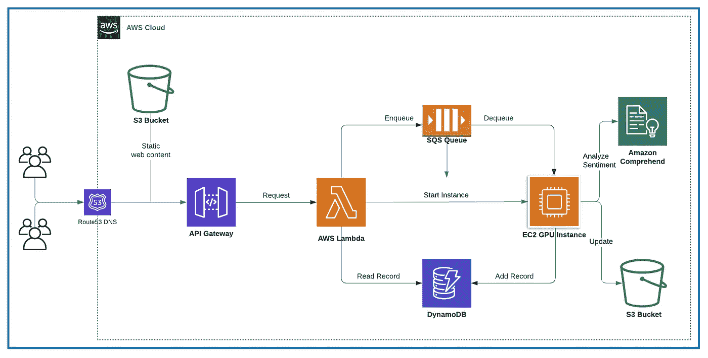

## **主持:**

该网站是静态托管在亚马逊 S3，这是一个真正的廉价和快速的方式把你的网站推向世界。

## **API 网关:**

这将创建一个 API 端点，它将接收来自前端应用程序的传入 HTTP 请求，并调用已配置的 Lambda 函数。

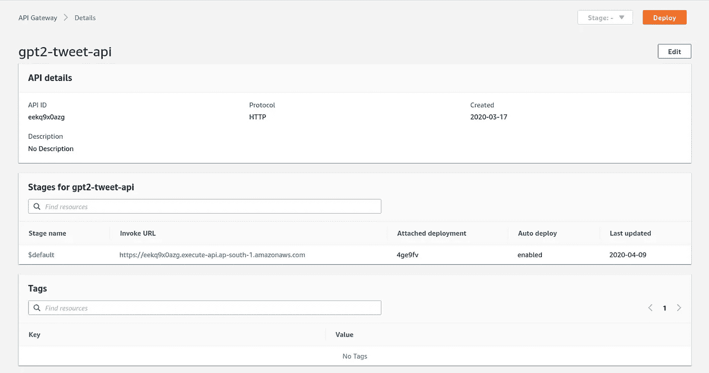

步骤 1)创建一个 API 端点

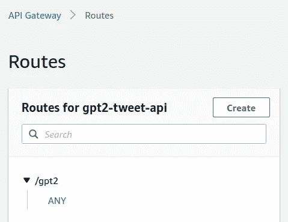

步骤 2)创建路线

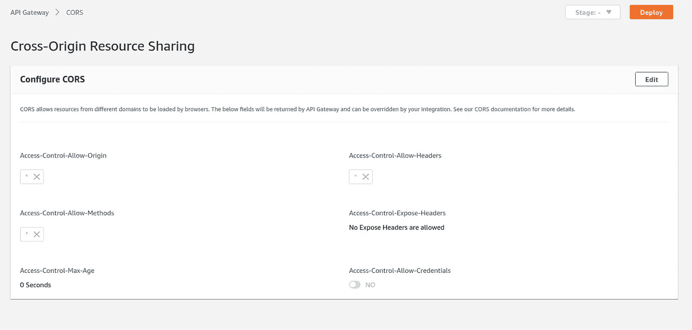

步骤 3)配置 CORS

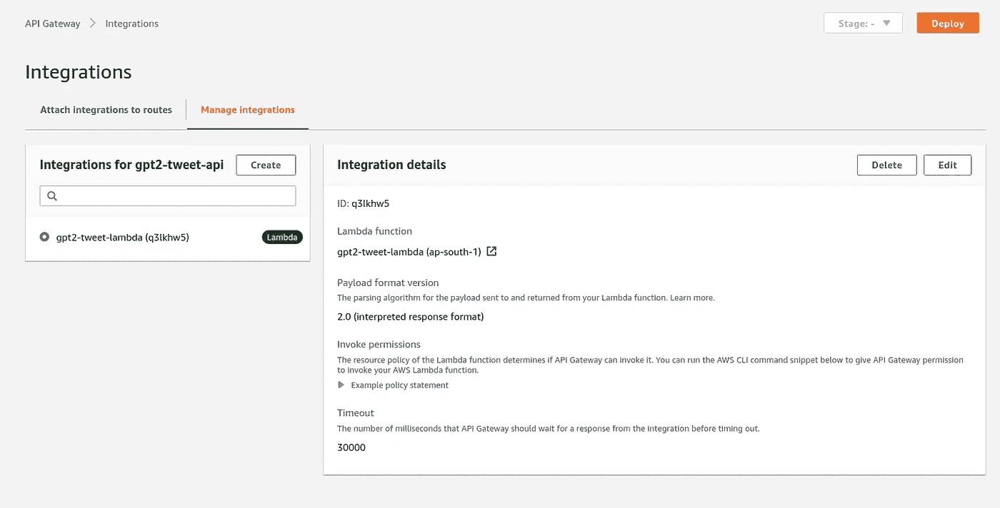

步骤 4)为 Lambda 函数配置更高的超时

任何集成的默认超时是 3 秒，因此如果您需要进行任何需要更长时间的推理，那么您需要相应地增加这个超时。

## λ函数:

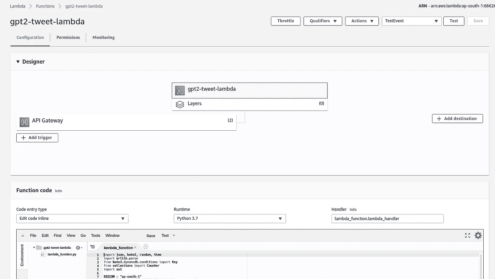

Lambda 函数从 API 网关接收 HTTP GET 请求，并执行以下操作:

1.  检查提示是否已经存在于 DynamoDB 中。如果是，那么读取记录并返回响应。此操作需要几毫秒才能完成。
2.  如果是新的提示，那么将请求添加到 SQS FIFO 队列中，并启动 EC2 g4dn.xlarge 实例。
3.  一旦实例启动，继续轮询 DynamoDB 以检查是否有新的提示可供读取。在这种情况下，它读取新添加的记录并将响应返回给 API 网关。
4.  Lambda 函数在返回响应之前做了一个额外的步骤。它选择生成的 tweets 中的大多数情绪，并只返回这些情绪。例如，如果数据库返回 10 条推文，其中 7 条是正面的，2 条是负面的，1 条是中性的。那么 lambda 函数将返回 7 条正面推文，因为这表明了大多数人的观点。请记住，语言生成本质上是概率性的，因此显示多数输出是有意义的。

像在 API 端点上一样，我们也需要增加 Lambda 上的超时。

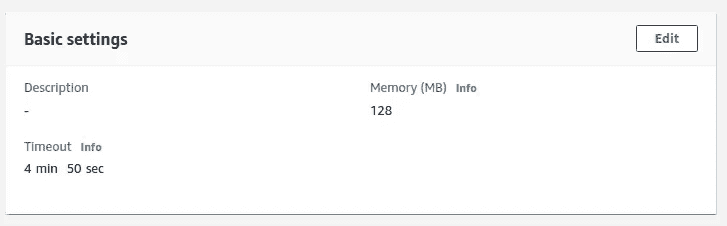

λ超时配置

提示:利用 TestEvent 来测试你的 Lambda 函数。您可以按如下方式配置测试事件:

```
{
 “queryStringParameters”: {
 “model”: “left”,
 “prompt”: “Test prompt”,
 “num_samples”: “20”,
 “length”: “80”,
 “temperature”: “0.7”,
 “top_p”: “0.9”,
 “top_k”: “40”
 }
}
```

## 简单队列服务(SQS):

为了序列化传入的 HTTP 请求，我使用了 SQS FIFO 队列。Lambda 函数将传入的请求排入该队列，并启动 EC2 GPU 实例。GPU 实例在启动时从该队列中读取数据，并逐个运行推理。这允许我用一个 EC2 实例以高性价比的方式处理并发请求。

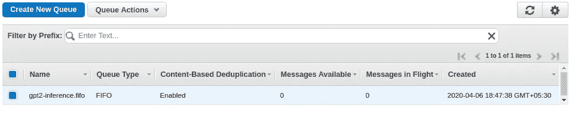

SQS 先进先出队列

## EC2 GPU 实例:

对于推理，我使用最近推出的高性价比的 G4 实例(准确地说是 g4dn.xlarge)。G4 实例以每小时 0.58 美元的价格为按需主机提供最新一代的英伟达 T4 GPU。使用 spot 实例可以进一步降低成本。在使用 G4 实例之前，您需要提出一个服务请求来增加 vCPU 限制。

在原始代码中，作者在 EC2 实例上启动了一个 python 脚本。然而，这意味着每次推理都需要额外的 15 秒钟来将模型加载到内存中。我修改了它，改为运行一个网络应用程序(基于 Starlette)。下面是 EC2 实例从头到尾发生的所有事情。

1.  Lambda 函数触发 EC2 实例的启动
2.  两个单独的 web 应用程序作为系统启动的一部分(作为 systemd 服务)运行(每个型号一个),并开始监听端口 8081 和 8082。
3.  另一个服务在启动时运行，监视 SQS 队列。每当有新请求进来时，该服务都会处理它，并使用 CURL 调用适当的 GET 请求，这会触发后端 web 应用程序上的推理。
4.  后端 web 应用程序收到请求后，调用 GPT2 API 批量生成 20 条 tweets。
5.  然后，它会进行清理，保留最合理的推文。它首先删除不必要的字符，如换行符和引号。然后，它使用 NLTK 的 sent_tokenize()函数删除最后一个可能不完整的句子。有时，生成的推文包含重复的单词或句子序列，因此它会删除唯一单词数量较少的推文。
6.  然后，网络应用程序使用 [AWS 领悟](https://aws.amazon.com/comprehend/)服务对剩余的推文进行情感分析。它保留了得分最高的前 10 条推文。这个想法是，在任何类别(正面、负面或中性)中得分高的推文往往比得分分布更均匀的推文更连贯。
7.  然后，前 10 条推文按照排序顺序存储在 DynamoDB 中。
8.  如果超过 15 分钟没有收到新的请求，那么 EC2 实例将被关闭以节省成本。
9.  作为关闭过程的一部分，会调用一个脚本，该脚本会将新添加的提示更新到 S3 上的一个文件中。这用于在 UI 上提供自动完成功能。

# 前端

前端使用 HTML、CSS & Javascript 开发。为了复制 twitter 的用户界面，安迪·勒沃伦兹的[让我们来构建:利用顺风 CSS——Tweet](https://web-crunch.com/posts/lets-build-tailwind-css-tweet)就像天赐之物。它提供了显示单条推文的基本 UI，稍后我可以扩展它(在[马南](https://github.com/manan2002)的帮助下)来显示推文的并排视图。

如前所述，该网站静态托管在亚马逊 S3。

**自动完成:** 考虑到新提示的推理需要 30-60 秒，而如果用户输入一个现有的提示，那么在大约 250 毫秒内就会得到结果，鼓励用户更多地使用现有的提示是有意义的。因此，添加自动完成功能变得很重要，这样用户可以从列表中选择一个，而不是输入他/她自己的。

在实现一些极其简单的东西之前，我考虑了一些复杂的解决方案(使用 Elasticsearch 或 AWS 云搜索)。

由于我的网站位于 S3，我修改了我的前端代码，以读取来自 S3 的“提示”文件。该文件包含所有现有提示的列表。在用户对新提示进行推理之后，每当实例关闭时，S3 上的提示文件就会更新。有一个小的滞后，但除此之外，这个简单的解决方案工作得非常好。

# 分析学

我想获得使用统计数据，并为用户提供一个选项来给出他们对应用程序的反馈。

这些是我为此添加的一些东西:

1.  向 DynamoDB 添加了一个“已访问”计数器，这样每次读取记录都会触发该计数器的(原子)增量。我可以用它来显示流行的查询。
2.  在 API 端点上启用了“详细路由度量”收集。我可以用它来获得更多关于 AWS 内的访问者数量，位置等细节。
3.  与谷歌分析集成，以获得更详细的使用统计数据
4.  与 [mopinion](https://mopinion.com/) 整合以获得用户反馈。

对于(3)和(4)，您只需要将它们提供的几行代码复制到您的 HTML 中。

# 结果

我尝试了几个温度、top_p 和 top_n 的设置，最终选择了这些能给出最佳结果的设置。这些也是推荐的默认值。

```
“temperature”: “0.7”,
 “top_p”: “0.9”,
 “top_k”: “40”
```

其中，
*温度*:温度越高，文本越疯狂
*top_k* :将生成的猜测限制为前 k 个猜测
*top_p* :核采样:将生成的猜测限制为累积概率

以下是一些结果:

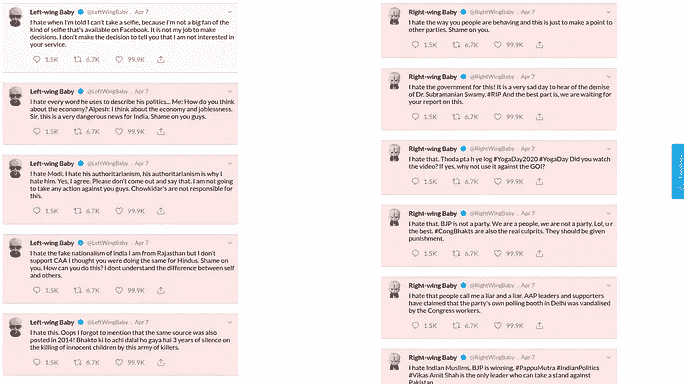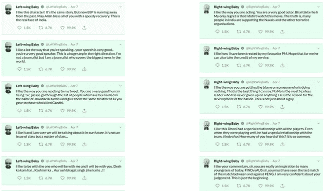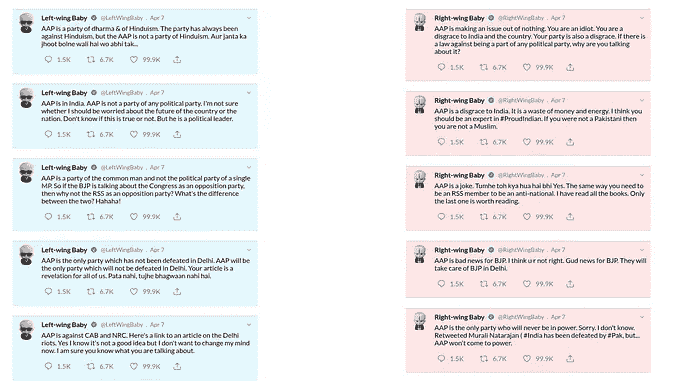

# 挑战

这一部分列出了我一路上面临的一些挑战。希望它能帮助面临类似问题的人。
*(注:我没有做好记录我所面临的所有问题/挑战的工作，所以这些是凭记忆提供的。我会根据我的记忆不断补充。)*

1.  用命令`nltk.download(‘punkt’)`安装 NLTK 数据
2.  `app.py`代码取自[GPT-2-云运行](https://github.com/minimaxir/gpt-2-cloud-run)。我在安装 ujson 包时遇到了构建错误。这个错误是由于缺少`g++`库造成的。
    运行
    
3.  安装使用 GPU 的正确 tensorflow 1.x 版本时出现问题。我认为正确的安装方法是运行`pip install tensorflow-gpu==1.15`
4.  SSM 代理存在没有正确权限/策略的问题。始终验证 SSM 代理是否工作正常，并且能够连接到可用的实例。确保您已经在 AWS 控制台上完成了“[系统管理器快速设置](https://ap-south-1.console.aws.amazon.com/systems-manager/home)”。
5.  我遇到了一个问题，推理发生在 CPU 上，而不是 GPU 上。这被证明是环境变量问题。LD_LIBRARY_PATH 设置不正确。过了一会儿，我注意到系统日志中有一个错误。参考 gp T2-app-[型号]。正确设置它的服务文件。
6.  如果遇到任何问题，请始终查看/var/log/syslog。大多数情况下，错误会被记录在那里。
7.  有时，由于可用性区域中的容量不足，GPU 实例将不会运行。您需要尝试不同的 AZ。

# 下一步怎么样

这个应用程序是为了让我尝试使用 twitter 数据并学习 MLOps。所以我肯定想转移到谷歌的 AI 平台管道，进行更完整的 ML 工作流部署。我还希望有一个易于使用的框架来下载和存储 twitter 数据，所以我将探索 *twint* 。一旦我有了这个想法，就可以更容易地去想其他的想法了。如果你有任何关于 twitter 的想法/建议，请在下面评论让我知道。