# 从零开始构建深度学习聊天机器人的完整指南

> 原文：<https://towardsdatascience.com/complete-guide-to-building-a-chatbot-with-spacy-and-deep-learning-d18811465876?source=collection_archive---------0----------------------->


[亚历山大·奈特](https://unsplash.com/@agkdesign?utm_source=medium&utm_medium=referral)在 [Unsplash](https://unsplash.com?utm_source=medium&utm_medium=referral) 上拍照

## [实践教程](https://towardsdatascience.com/tagged/hands-on-tutorials)

## spaCy 用于实体提取，Keras 用于意图分类，等等！

在过去的一个月里，我想寻找一个包含整个数据科学端到端工作流的项目——从数据管道到深度学习，再到部署。它必须具有挑战性，但不是毫无意义的——它仍然必须是有用的东西。这需要一点构思和发散思维，但当制作个人助理的想法出现时，没多久我就选定了它。会话助手无处不在。甚至我所在的大学目前也在使用聊天机器人医生来跟踪其成员的健康状况，以此作为监控当前疫情的有效方式。这很有意义:聊天机器人更快，更容易交互，特别是对于我们只想快速响应的事情来说，非常有用。在这个时代，能够向机器人寻求帮助开始成为新的标准。我个人认为机器人是未来，因为它们让我们的生活变得更加容易。聊天机器人也是机器人流程自动化的关键组成部分。

现在我要介绍EVE bot，我的机器人旨在为 Twitter 上的苹果支持团队增强虚拟参与(见我在那里做的)。虽然这种方法是用来支持苹果产品的，但老实说，它可以应用到任何你能想到聊天机器人有用的领域。

这是我给 EVE 的演示视频。(这是我的 Github [回购](https://github.com/mtaruno/eve-bot)这个项目)

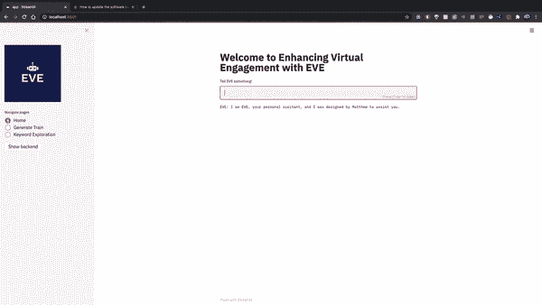

演示片段—询问 EVE 如何更新我的 MacBook Pro。图片作者。


图片作者。

为了使演示简洁明了，它对我的工作进行了一个高层次的、不太技术性的概述。但是，如果您想了解我是如何做到的，这正是本文其余部分的目的！

我也希望这篇文章能为那些需要一些关于如何从头构建自己的机器人的结构的人提供指导——从某种意义上说，你只使用众所周知的通用软件包，如 Keras 和 spaCy，而不是专门为聊天机器人设计的大型 API，如 Rasa API。

EVE 是一个基于上下文的机器人，由深度学习提供支持。基于上下文的机器人是你很久以前可能见过的简单的、基于关键字的聊天机器人之上的一步(见:[伊莱扎机器人](https://en.wikipedia.org/wiki/ELIZA))。虽然我确实有一些灵感，而且它确实与行业中的做法有相似之处，但我提供了一些方法，这些方法是我自己思考如何在 2020 年制作聊天机器人的。

*我在这篇文章中展示的这种方法利用了与亚马逊这样的大公司的聊天机器人相同的逻辑，即他们的 Lex conversational AI 服务。*

# 外面有什么？

在我进入技术工作之前，重要的是要知道你想以什么样的粒度来制作聊天机器人。聊天机器人就像煮意大利面条。你可以从生番茄开始，或者从别人已经为你做好的罐装番茄开始。相似之处还在于有许多不同的组件—您有:

*   **框架:**你的机器人根据顾客的话语决定如何回应他们。您可以为您的框架使用更高级别的工具，如 [DialogFlow(由 Google 提供)](https://www.googleadservices.com/pagead/aclk?sa=L&ai=DChcSEwibwpih54jrAhXKCisKHan7CE0YABACGgJzZg&ohost=www.google.com&cid=CAESQeD2JeiKQ7_pzcuwmznLeulmynmCY0g2KSdLMs4sfG6-jvth6y2dz5shYG-DzeB8-ofL91Tw3qJvZL0qei_B3eCT&sig=AOD64_3P9DkHsbz59R70s3YgIuyKjBXGEQ&q&adurl&ved=2ahUKEwiS04-h54jrAhUFjuYKHQ8fACYQ0Qx6BAgQEAE)、 [Amazon Lex](https://aws.amazon.com/lex/) 和 [Rasa](https://rasa.com/docs/) 。与我将在本文中展示的基于 Python 的工作相比，这些更高级别的 API 需要您做的工作更少，但是您可能对后台发生的事情没有信心。我的选择是 Tensorflow、spaCy 和 Python 的白盒方法。
*   对话管理:这是你的机器人的一部分，负责对话的状态和流程——在这里你可以提示用户你需要的信息等等。
*   **部署接口:**你可以用 [Messenger API](https://chatbotnewsdaily.com/build-a-facebook-messenger-chat-bot-in-10-minutes-5f28fe0312cd) 建立一个接口，你可以把它部署在 WhatsApp Business 上(收费)，或者任何地方，比如你自己的网站或应用程序，如果你有的话。我在 Streamlit 上部署了我的工具，作为一个非常快速的演示工具。

# 我的聊天机器人框架的目标应该是什么？

好了，你已经决定做自己的框架了。现在告诉你怎么做。

你的目标是双重的——而*这两个*都很重要:

1.  实体提取
2.  意图分类

> 当开始制作一个新的机器人时，这正是你首先要解决的问题，因为它指导你想要收集或生成什么样的数据。我建议你从你的意图和实体的基本概念开始，然后在你越来越多地测试它的时候迭代地改进它。

## 实体提取

实体是预定义的名称、组织、时间表达式、数量和其他有意义的通用对象组的类别。

每个聊天机器人都有不同的应该被捕获的实体集合。对于一个披萨递送聊天机器人，您可能希望捕获不同类型的披萨作为一个实体和递送位置。在这种情况下，*奶酪*或*意大利辣香肠*可能是披萨实体，而*厨师街*可能是递送位置实体。在我的例子中，我创建了一个苹果支持机器人，所以我想捕捉用户正在使用的硬件和应用程序。

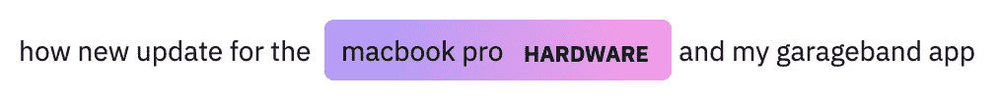

硬件实体“macbook pro”被标记。其他硬件可能包括 iPhone 和 iPads。图片作者。

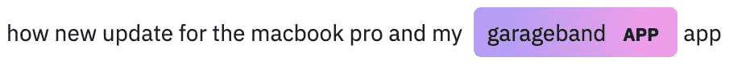

捕捉到的应用程序实体“garageband”已被标记。其他应用实体可能包括 Apple Music 或 FaceTime。图片作者。

*为了获得这些可视化，使用了 displaCy，这是 spaCy 用于命名实体识别的可视化工具(他们还有更多可视化工具用于其他事情，如依赖解析)。*

## 意图分类

意图就是客户想要做的事情。

> 他们想问候你吗？他们是想和代表谈吗？如果你是机器人，他们会挑战你吗？他们在尝试更新吗？

意图分类仅仅意味着找出用户话语的用户意图。下面是我在 Eve bot 中想要捕捉的所有意图的列表，以及每个意图各自的用户话语示例，以帮助您理解每个意图是什么。

*   **问候:**嗨！
*   **信息:**你们现有的最薄的 MacBook 是什么？
*   忘记密码:我忘记了我的登录信息，你能帮我找回吗？
*   发言代表:请问我能和人类说话吗
*   挑战机器人:你是人类吗
*   **更新:**我想将我的 MacBook Pro 更新到最新的操作系统
*   **付款:**我昨天在百思买买的 iPhone X 被双倍收费
*   **位置:**离我最近的苹果店在哪里？
*   电池:我的电池持续耗尽，一小时后就没电了
*   再见:谢谢伊芙，再见

**意图**和**实体**基本上是我们解读客户想要什么以及如何给客户一个好的答复的方式。我最初认为我只需要给出一个没有实体的答案的意图，但这导致了很多困难，因为你不能对你的客户做出细致的回应。如果没有多标签分类，也就是给一个用户输入分配多个类别标签(以准确性为代价)，就很难得到个性化的响应。实体有助于使你的意图仅仅是意图，并根据用户的细节个性化用户体验。

有了这两个目标，我把我的过程归结为五个步骤，我将在这篇文章中逐一分解:

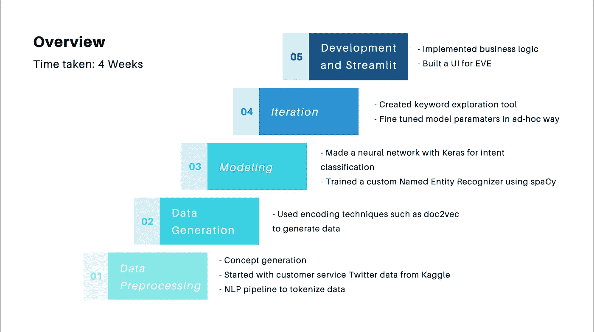

图片作者。

# 1.数据预处理

我做数据预处理的笔记本是[这里](https://github.com/mtaruno/eve-bot/blob/master/1.%20EDA%20%2C%20Wrangling%2C%20and%20Initial%20Preprocessing.ipynb)。

我提到的第一步是数据预处理，但实际上这 5 个步骤并不是线性完成的，因为你将在整个聊天机器人创建过程中预处理你的数据。

但是，即使在数据预处理之前，您究竟从哪里获得数据呢？

这真的取决于你的聊天机器人的领域。

## 数据指南

*   **你必须找到能最好地涵盖客户可能会问你的问题以及你想尽可能多地回答的数据。****数据应该包含你希望能够回答的所有意图。这可能是一项非常艰巨的任务，但是要知道你的数据不一定是完美的，它可以来自多个来源，只要它们在同一个通用域内。**
*   **对于每一个意图，你应该有相当数量的例子，这样你的机器人将能够了解该意图的性质。**
*   **如果你真的没有任何数据，就像我在我的下一个项目中想到的那样(它不是一个英语聊天机器人)，我试图通过制作一个谷歌表单来解决这个问题，让人们向我的机器人提问。整个要点是获得最接近真人将要问你的机器人的问题的数据。**

**但回到 Eve bot，因为我正在制作一个 Twitter 苹果支持机器人，我从 Kaggle 上的客户支持推文中获得了[我的数据](https://www.kaggle.com/thoughtvector/customer-support-on-twitter)。一旦获得了正确的数据集，就可以开始对其进行预处理。这个初始预处理步骤的目标是为我们进一步的数据生成和建模做好准备。**

**首先，我通过一些 Pandas merge 语句以入站和出站文本的格式获取数据。对于任何类型的客户数据，您都必须确保数据的格式能够区分客户对公司的话语(入站)和公司对客户的话语(出站)。**保持足够的敏感，以这样一种方式争论数据，你的客户可能会问你一些问题**。**

**不久之后，我应用了一个 NLP 预处理管道。包括哪些步骤取决于你的用例(比如你想要支持的语言，你想要你的机器人有多口语化，等等。).我的包括:**

*   **转换为小写**
*   **使用 NLTK 的 Tweet 标记器进行标记**
*   **删除标点符号和 URL 链接**
*   **纠正拼写错误(利维坦距离)**
*   **删除停用词**
*   **扩张收缩**
*   **用 spaCy 删除非英语推文**
*   **词汇化(您可以选择词干作为替代)**
*   **移除表情符号和数字(如果您的模型可以读取表情符号，并且如果您计划进行表情符号分析，您可以保留表情符号)**
*   **将每条推文的长度限制在 50(为了简洁)**

**我将所有这些步骤编译成一个名为`tokenize`的函数。在每一个预处理步骤中，我可视化数据中每个记号的长度。我还提供了每一步的数据头，以便清楚地显示每一步正在进行的处理。**

**我的整个记号赋予器函数。**

**我从 106k Apple Suppourt inbound Tweets 开始。这是预处理这些数据之前我的令牌长度的直方图。**

**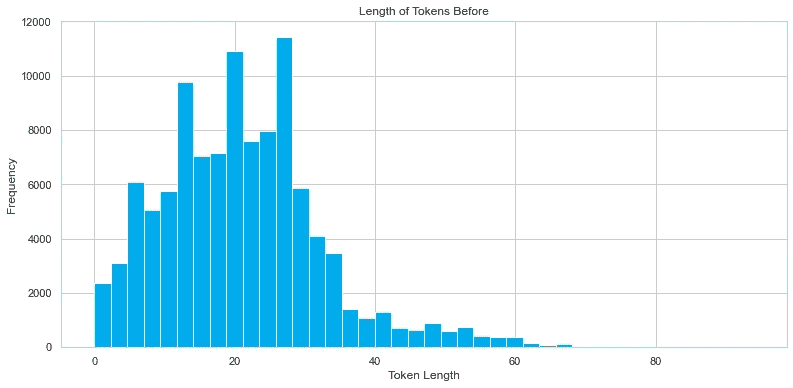**

**图片作者。**

**在第 10 步之后，我还剩下大约 76k 条推文。一般来说，像删除停用词这样的事情会使分布向左移动，因为我们在每个预处理步骤中的标记越来越少。**

**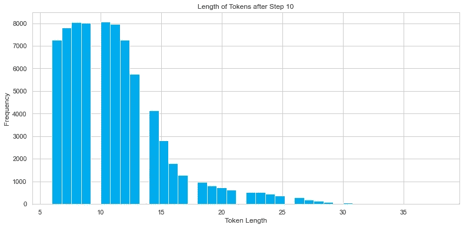**

**图片作者。**

**这里你可以看到这一步的结果。我让我的数据从左边的青色变为中间的已处理入站列。我还将出站数据放在右边，以防我需要查看 Apple 支持如何回复他们的查询，这将用于我实际回复客户的步骤(这称为自然语言生成)。**

**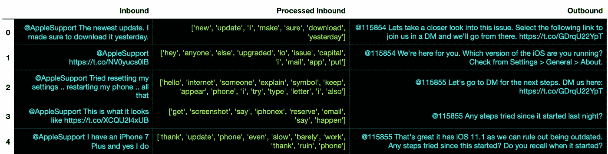**

**我的苹果头支持预处理前后的 Twitter 数据。图片作者。**

**最后，作为一个简短的 EDA，这里是我在数据集中的表情符号——可视化很有趣，但我最终没有将这些信息用于任何真正有用的东西。**

**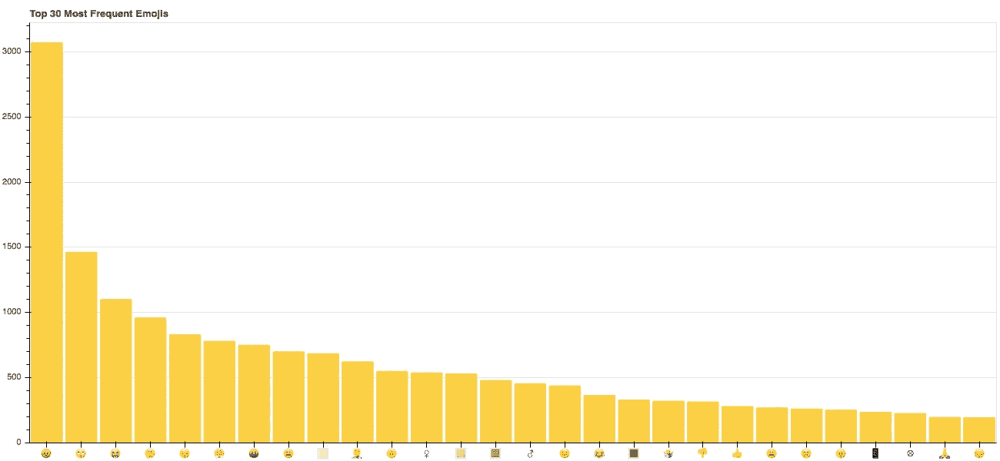**

**我的数据集中的表情符号:大多数客户表现出负面情绪(愤怒和失望的表情符号排在第二位)。图片作者。**

# **2.数据生成**

**我生成训练数据的完整脚本是这里的，但是如果你想要一步一步的解释，我这里还有一个笔记本。**

**是的，你没看错——数据*一代。*你可能会想:**

> **为什么我们需要生成数据？为什么我们不能只使用在上一步中预处理过的数据呢？**

**这是一个很好的问题。答案是因为数据还没有被标注。而意图分类是一个有监督的学习问题。这意味着我们需要每个数据点的意图标签。**

**如果您已经有了一个包含您想要分类的所有意图的带标签的数据集，我们不需要这一步。但更多的时候，你不会有这些数据。这就是为什么我们需要做一些额外的工作来将意图标签添加到我们的数据集。这是一个相当复杂的过程，但我相信我们能做到。**

## ****我们的目标是:****

> ****在这一步，我们希望将推文分组，以代表一种意图，这样我们就可以给它们贴上标签。此外，对于我们的数据中没有表达的意图，我们要么被迫手动添加它们，要么在另一个数据集中找到它们。****

**例如，我的推文中没有任何一条推文问“你是机器人吗？”这实际上非常有意义，因为 Twitter 苹果支持是由真正的客户支持团队回答的，而不是聊天机器人。因此，在这些情况下，由于在我们的数据集中没有表达挑战机器人意图的文档，我在它自己的组中手动添加了这种意图的示例来表示这种意图。我将在第 4 步中详细解释我是如何做到这一点的。**

**因为我计划使用一个相当复杂的神经网络架构(双向 LSTM)来对我的意图进行分类，所以我需要为每个意图生成足够多的例子。我选择的数字是 1000——我为每个意图生成 1000 个示例(例如，1000 个问候示例，1000 个遇到更新问题的客户示例，等等)。).我将每一个意图都精确地定义为 1000 个例子，这样我就不用担心以后建模阶段的类不平衡了。**一般来说，对于你自己的机器人，机器人越复杂，你需要的训练例子就越多。****

## **嵌入技术**

**这就是*如何发挥作用的地方，我们如何找到每个意图的 1000 个例子？首先，我们需要知道在我们的数据集中是否有 1000 个我们想要的意图的例子。为了做到这一点，我们需要一些推文之间的距离概念，如果两条推文被认为彼此“接近”，它们应该具有相同的意图。同样，两条相距“更远”的推文在含义上应该是非常不同的。***

**为此，我们使用一种称为 Doc2Vec 的编码方法。嵌入方法是将单词(或单词序列)转换成可以相互比较的数字表示的方法。我用 Streamlit 创建了一个训练数据生成器工具，将我的推文转换为 20D Doc2Vec 表示的数据，其中每个推文可以使用余弦相似性进行相互比较。**

**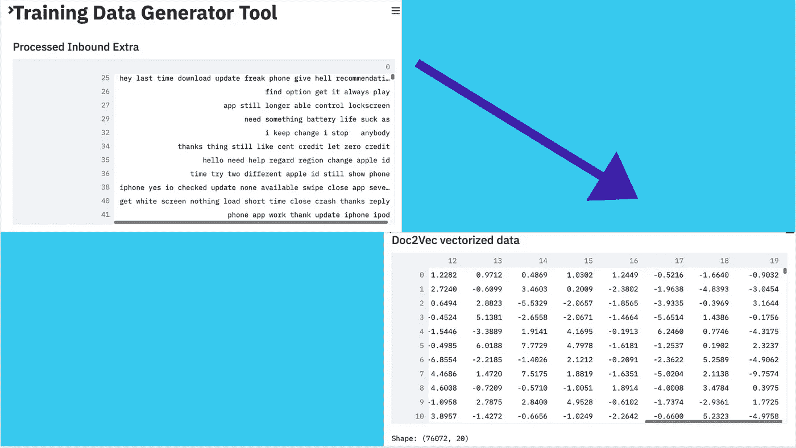**

**(左)Twitter 数据(右)Doc2Vec 20D 矢量化数据。图片作者。**

**下面的图表说明了 Doc2Vec 可以用来将相似的文档组合在一起。文档是一系列的标记，而标记是一系列的字符，它们被组合在一起作为一个有用的语义单元进行处理。对于这一数据生成步骤，我也用 gloVe 进行了试验，但是它们只在每个单词级别进行了矢量化，如果您想尝试另一种单词嵌入(也许它更适合您的领域)，请确保它在文档级别进行了矢量化。**

**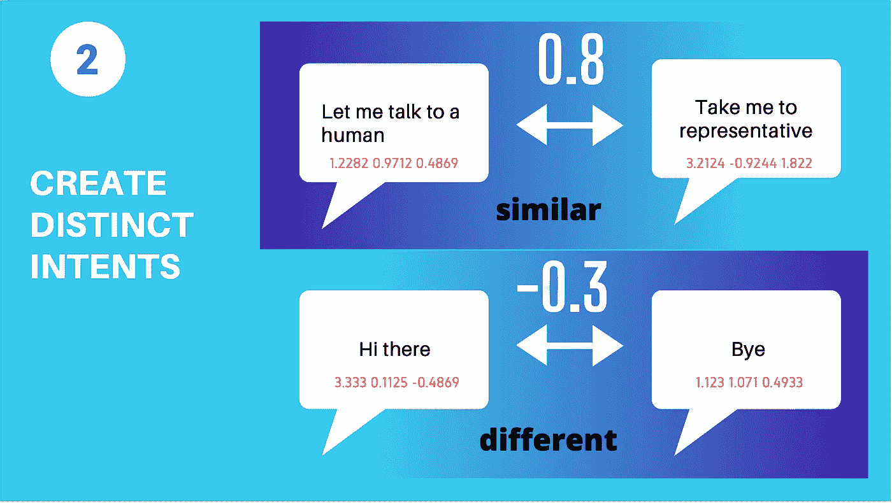**

**展示距离如何工作的玩具示例。图片作者。**

**在这个玩具示例中，我们将每一个话语转换为 3D 矢量(可以在每个短语下面的 3 个数字的粉色数组中看到)。这些 3D 向量中的每一个都是该文档的数字表示。例如，“Hi there”在数值上表示为[3.333，0.1125，-0.4869]。**

**当我们在这个玩具示例中比较 *top* *两条*意思相似的推文时(两者都要求与代表交谈)，我们得到的虚拟余弦相似度为 0.8。当我们比较底部两条不同含义的推文(一条是问候，一条是退场)时，我们得到-0.3。**

## **履行**

**至于实现，我用的是 gensim 的 Doc2Vec。你必须训练它，这类似于你如何训练一个神经网络(使用历元)。**

**这就是问题所在。在训练 Doc2Vec 矢量器之前，提前了解您想要的意图是很重要的。一旦你知道了你想要什么样的意图，你就可以应用这个程序来获得你的前 N 组意思相似的推文:**

*   **简单地想出你在这个意图中能想到的最重要的关键词，然后把它作为一行附加到你的训练数据的末尾(所以对于问候，这一行可以是“嗨，你好，嘿”)。**
*   **您添加的代表各自意图的额外行将被矢量化，这是一个好消息，因为现在您可以用余弦相似性将其与其他每一行进行比较。**
*   **通过训练 Doc2Vec 矢量器进行矢量化，然后用额外的行来拟合您的数据。**
*   **您已经成功地使用关键字来表示一种意图，从这种表示中，您将找到与之相似的前 1000 条推文，以便使用 Gensim 的`model.docvecs.most_similar()`方法为该意图生成您的训练数据。**

**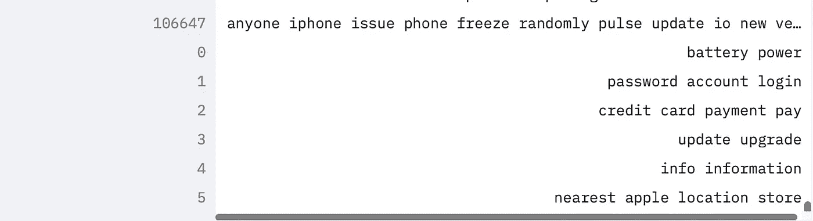**

**额外的行是 0-5，它们附加在我的 Tweets 训练数据的顶部——0 代表电池意图，1 代表支付意图，等等。图片作者。**

**请注意，在训练矢量器之前，我们必须将新的 intent 关键字表示附加到训练数据，因为 Gensim 的实现只能比较作为训练数据放入 Doc2Vec 矢量器的文档。此外，它只能访问每条 Tweet 的标签，所以我不得不在 Python 中做额外的工作，根据 Tweet 的内容找到它的标签。**

**一旦你生成了你的数据，确保你把它存储为两栏“话语”和“意图”。注意，话语被存储为一个标记化列表。这是你会经常遇到的事情，这没关系，因为你可以在任何时候用`Series.apply(" ".join)`把它转换成字符串形式。**

**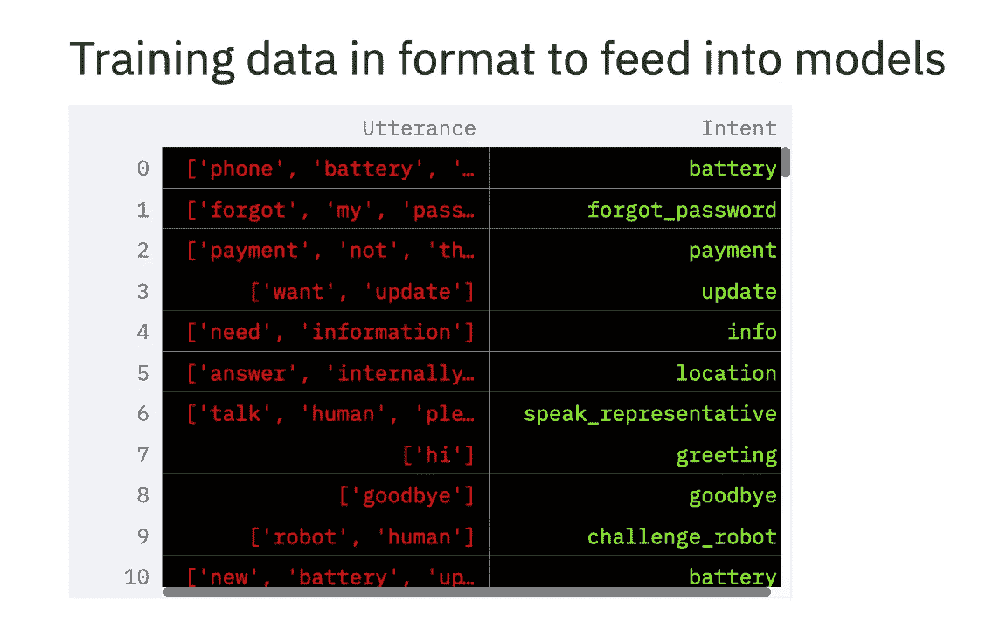**

**这就是培训数据格式应该的样子。图片作者。**

**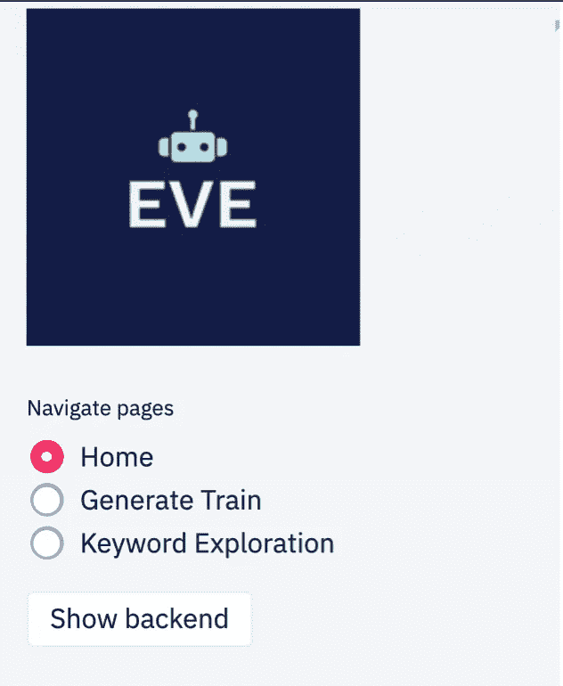**

**您也可以在我的 Streamlit 应用程序的侧边栏上访问我的培训数据生成器工具，作为其中一个页面。图片作者。**

## **我尝试了其他一些方法来添加意图标签**

**我想到要做的第一件事就是聚类。然而，在我尝试了 K-Means 之后，很明显聚类和无监督学习通常产生不好的结果。现实是，尽管它作为一种技术很好，但归根结底它仍然是一种算法。你不能指望算法按照你想要的方式对你的数据进行聚类。**

**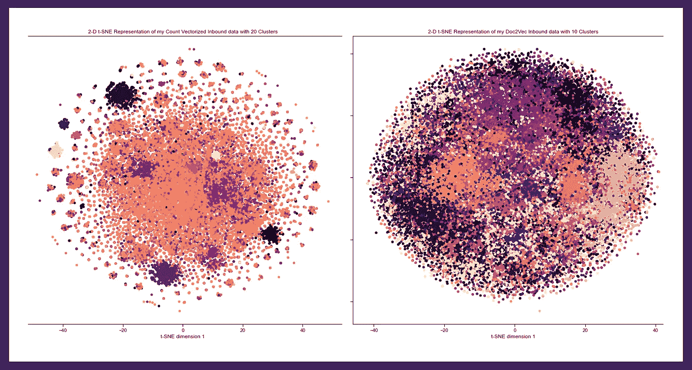**

**t-SNE 可视化显示 K-Means 聚类失败，因为数据不在自然聚类中。图片作者。**

**我还尝试了像 gloVe 这样的单词级嵌入技术，但是对于这个数据生成步骤，我们需要文档级的东西，因为我们试图在话语之间进行比较，而不是在话语中的单词之间进行比较。**

# **3.建模**

## **意图分类**

**我的意图分类笔记本是这里的。**

**有了我们的数据标签，我们终于可以进入有趣的部分了——实际上是对意图进行分类！我建议你不要花太长时间试图事先得到完美的数据。试着以合理的速度达到这一步，这样你就可以先得到一个最小的可行产品。这个想法是首先得到一个结果作为基准，这样我们就可以迭代地改进数据。**

**有许多方法可以进行意图分类，例如 Rasa NLU 允许您使用许多不同的模型，如支持向量机(SVMs)，但在这里，我将演示如何使用具有双向 LSTM 架构的神经网络进行分类。**

**我们试图将一个用户话语(它只是一个符号序列)映射到我们指定的 N 个意图之一。我们开始的数据应该只有一个话语和一个意向基础事实标签作为列。这个过程的顺序如下(关于实现，请查看 my Github 上提供的意图分类笔记本):**

1.  **训练测试拆分(是否应该让*总是*先走，我的导师在我的脑海里钻过这一点)**
2.  **Keras 标记器**
3.  **标签编码目标变量(意图)**
4.  **初始化嵌入矩阵(我使用手套嵌入，因为它们有一个在 Twitter 数据上训练的特殊变体)**
5.  **初始化模型架构**
6.  **初始化模型回调(解决过度拟合的技术)**
7.  **拟合模型并保存它**
8.  **加载模型并保存输出(我推荐字典)**

**对于**嵌入层**(步骤 4)，需要记住一些事情:**

*   **这些预先训练的嵌入本质上就是如何将进入模型的文本转换成数字表示。当您比较不同文档的数字表示的余弦相似性时，它们之间应该有有意义的距离(例如，“king”和“man”之间的余弦相似性应该比“king”和“women”更接近)。**
*   **选择适合聊天机器人领域的正确的预训练嵌入非常重要。如果你有一个基于 Twitter 的聊天机器人，你可能不希望在维基百科上训练嵌入。**
*   **我还建议您查看一下，您想要涵盖的所有词汇是否都在您预先训练的嵌入文件中。我检查了我的 gloVe Twitter 嵌入是否包含苹果特有的词，例如“macbook pro ”,幸运的是它包含了。**

**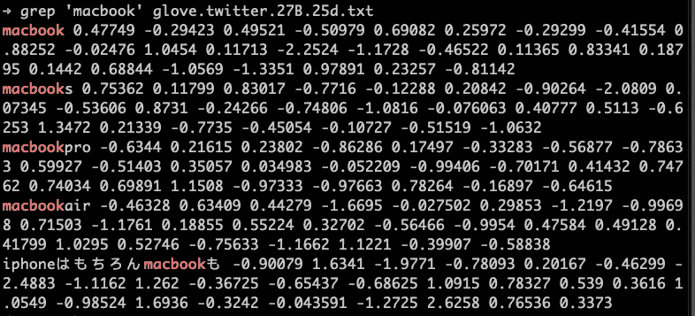**

**用 grep 检查“macbook”这个词是否在我的手套嵌入中(结果是！).图片作者。**

**对于**模型架构**(步骤 5)，需要记住一些事情:**

*   **确保输出图层为 softmax(如果要进行多标签分类，则使用 sigmoid)。**
*   **确保输出图层的维数与要分类的意图数相同，否则会遇到形状问题。**
*   **如果您没有标记 encode，那么您对`model.predict()`使用可能会不准确，因为您输出的最终字典(其中的键是意图，值是表达意图的概率)不会被正确映射。**
*   **当您部署您的机器人时，您不应该重新运行模型。相反，我编写了一个脚本，从读取保存的模型文件开始，并从那里进行预测。**

## **结果**

**结果是有希望的。损失收敛到一个低水平，我的模型对看不见的数据的准确率是 87%！**

**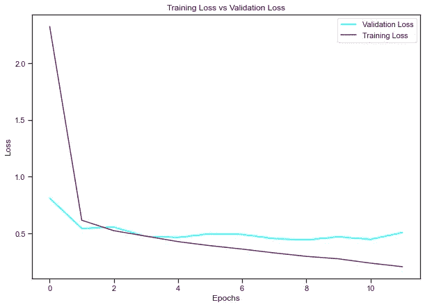**

**图片作者。**

**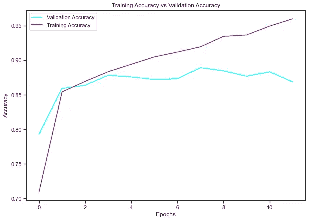**

**图片作者。**

**如果您将意图分类的输出可视化，这是话语“我的 iphone 电池停止工作了！”：**

**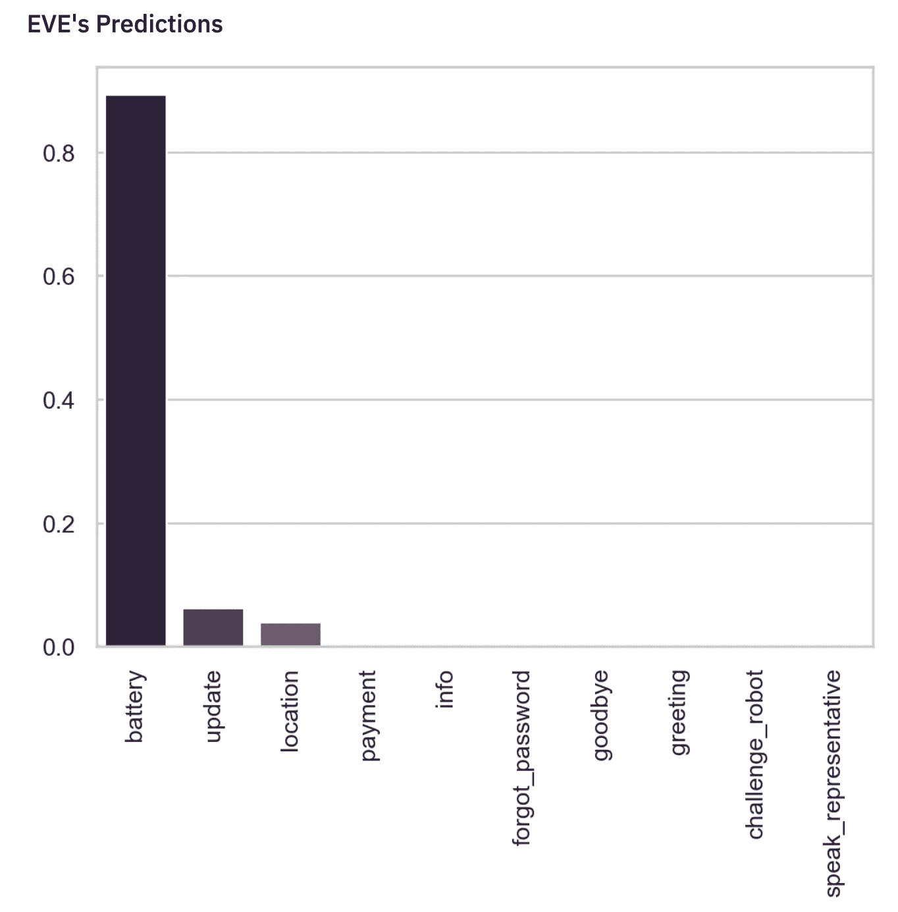**

**图片作者。**

## **防止过度拟合**

**为了防止我的模型过度拟合，我还以 Keras 回调的形式设置了一些其他设置:**

*   **学习率调度——在学习率超过某个时期数后，减慢学习率**
*   **提前停止-一旦验证损失(或您选择的任何其他参数)达到某个阈值，就提前停止训练**

**最后，在我运行模型之后，我将它保存到一个 h5 文件中，这样我就可以在以后初始化它，而不需要使用模型检查点重新训练我的模型。代码如下:**

```
*# Initializing checkpoint settings to view progress and save model*
filename = 'models/intent_classification_b.h5'

*# Learning rate scheduling*
*# This function keeps the initial learning rate for the first ten epochs* 
*# and decreases it exponentially after that.* 
**def** scheduler(epoch, lr):
    **if** epoch < 10:
        **return** lr
    **else**:
        **return** lr * tf.math.exp(-0.1)

lr_sched_checkpoint = tf.keras.callbacks.LearningRateScheduler(scheduler)

*# Early stopping*
early_stopping = tf.keras.callbacks.EarlyStopping(
    monitor='val_loss', min_delta=0, patience=3, verbose=0, mode='auto',
    baseline=**None**, restore_best_weights=**True**
)

*# This saves the best model*
checkpoint = ModelCheckpoint(filename, monitor='val_loss', verbose=1, 
                             save_best_only=**True**, mode='min')

*# The model you get at the end of it is after 100 epochs, but that might not have been*
*# the weights most associated with validation accuracy*

*# Only save the weights when you model has the lowest val loss. Early stopping*

*# Fitting model with all the callbacks above*
hist = model.fit(padded_X_train, y_train, epochs = 20, batch_size = 32, 
                 validation_data = (padded_X_val, y_val), 
                 callbacks = [checkpoint, lr_sched_checkpoint, early_stopping])
```

## **实体提取**

**这是我完整的关于实体提取的笔记本。**

**对于 EVE bot，目标是提取符合硬件或应用程序类别的特定于苹果的关键词。像意图分类一样，有许多方法可以做到这一点——根据上下文的不同，每种方法都有其优点。Rasa NLU 使用条件随机场(CRF)模型，但为此我将使用 spaCy 的随机梯度下降(SGD)实现。**

**第一步是创建一个字典，存储您认为与您的聊天机器人相关的实体类别。然后您会看到 spaCy 是否默认拥有它们。很可能他们不会。因此，在这种情况下，您必须训练自己的自定义空间命名实体识别(NER)模型。对于苹果产品来说，实体是客户正在使用的硬件和应用程序是有意义的。您希望对询问 iPhone 和询问 Macbook Pro 的客户做出不同的回应。**

```
{'hardware': ['macbook pro',
  'iphone',
  'iphones',
  'mac',
  'ipad',
  'watch',
  'TV',
  'airpods'],
 'apps': ['app store',
  'garageband',
  'books',
  'calendar',
  'podcasts',
  'notes',
  'icloud',
  'music',
  'messages',
  'facetime',
  'catalina',
  'maverick']}
```

**一旦在字典中存储了实体关键字，您还应该有一个基本上只在句子中使用这些关键字的数据集。幸运的是，我已经有了一个我一直在使用的来自 Kaggle 的大型 Twitter 数据集。如果您输入这些示例并指定哪些单词是实体关键字，您实际上就有了一个带标签的数据集，spaCy 可以了解这些单词在句子中使用的上下文。**

**为了标注数据集，您需要将数据转换为 spaCy 格式。这是一个样本，我的训练数据应该看起来像是能够被送入 spaCy，用于使用随机梯度下降(SGD)训练您的自定义 NER 模型。我们制作了一个 offsetter，并使用了 spaCy 的 PhraseMatcher，所有这些都是为了更容易地将其转换成这种格式。**

```
TRAIN_DATA = [
('what is the price of polo?', {'entities': [(21, 25, 'PrdName')]}), 
('what is the price of ball?', {'entities': [(21, 25, 'PrdName')]}),                
('what is the price of jegging?', {'entities': [(21, 28, 'PrdName')]}),                
('what is the price of t-shirt?', {'entities': [(21, 28, 'PrdName')]})
]
```

## **抵消器**

```
*# Utility function - converts the output of the PhraseMatcher to something usable in training*

**def** offsetter(lbl, doc, matchitem):
    *''' Converts word position to string position '''*
    one = len(str(doc[0:matchitem[1]]))
    subdoc = doc[matchitem[1]:matchitem[2]]
    two = one + len(str(subdoc))

    *# This function was misaligned by a factor of one character, not sure why, but this is my solution*
    **if** one != 0:
        one += 1
        two += 1
    **return** (one, two, lbl)# Example
# offsetter(‘HARDWARE’, nlp(‘hmm macbooks are great’),(2271554079456360229, 1, 2)) -> (4, 12, ‘HARDWARE’)
```

**我在更一般的函数中使用这个函数来“指定”一行，这个函数将原始行数据作为输入，并将其转换为 spaCy 可以读取的标记版本。我不得不修改索引定位，在开始时移动一个索引，我不知道为什么，但它工作得很好。**

**然后我还创建了一个函数`train_spacy`来输入 spaCy，它使用`nlp.update`方法来训练我的 NER 模型。它对任意数量的 20 个时期进行训练，其中在每个时期，训练样本被预先打乱。尽量不要选择太高的历元数，否则模型可能会开始“忘记”它在早期阶段已经学习过的模式。因为你是用随机梯度下降来最小化损失，你可以想象你在不同时期的损失。**

**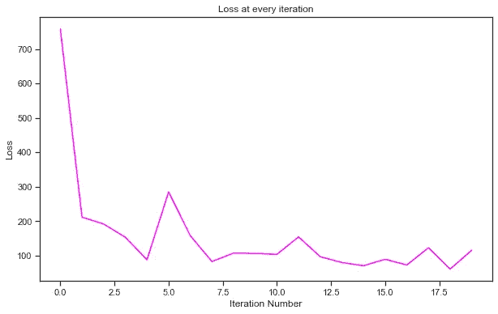**

**每次迭代都丢失硬件实体模型。图片作者。**

**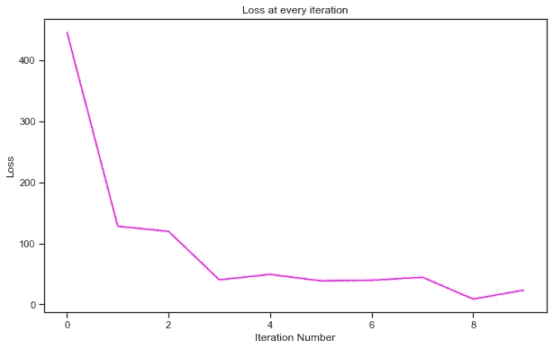**

**每次迭代都丢失应用程序实体模型。图片作者。**

**我没有找到一种方法将我训练的所有不同的模型组合到一个 spaCy pipe 对象中，所以我将两个单独的模型序列化到两个 pickle 文件中。同样，这是我上面演示的显示可视化——它成功地将 macbook pro 和 garageband 标记到正确的实体桶中。**

****

**硬件实体“macbook pro”被标记。其他硬件可能包括 iPhone 和 iPads。图片作者。**

****

**捕捉到的应用程序实体“garageband”已被标记。其他应用实体可能包括 Apple Music 或 FaceTime。图片作者。**

**从您保存的 pickle 文件中，您可以通过循环 doc 对象的 ents 属性将所有提取的实体存储为一个列表，如下所示:**

```
**def** extract_app(user_input, visualize = **False**):
    *# Loading it in*
    app_nlp = pickle.load(open("models/app_big_nlp.pkl", "rb"))
    doc = app_nlp(user_input)

    extracted_entities = []

    *# These are the objects you can take out*
    **for** ent **in** doc.ents:
        extracted_entities.append((ent.text, ent.start_char, ent.end_char, ent.label_))

    **return** extracted_entities
```

# **4.循环**

**通过迭代，我真正的意思是改进我的模型。我把它变成了自己的阶段，因为这实际上比你想象的要花更多的时间。我通过以下方式改进我的模型:**

*   **选择更好的意图和实体**
*   **提高我的数据质量**
*   **改进您的模型架构**

**你不需要像我在步骤 2 中那样生成数据。把它想象成你能够创建完美数据集的工具箱之一。**

> **您输入意图分类器的数据的目标是使每个意图范围广泛(意味着意图示例充分穷尽了用户可能说的话的状态空间和世界)并且彼此不同。**

**这样，神经网络就能够对以前从未见过的用户话语做出更好的预测。以下是我如何努力实现这个目标的。**

## **手动示例**

**除了使用 Doc2Vec 相似性来生成训练示例之外，我还在。我从我能想到的几个例子开始，然后我循环这些相同的例子，直到它达到 1000 个阈值。这将决定你的模型有多好。如果您知道某个客户很有可能会写一些东西，您应该将它添加到培训示例中。**

## **关键词探索调优**

**我们如何选择包含哪些意图和示例？为了帮助做出更有数据依据的决定，我做了一个关键词探索工具，告诉你有多少条推文包含该关键词，并让你预览那些推文实际上是什么。这有助于探索您的客户经常向您询问的问题以及如何回应他们，因为我们也有可以查看的出站数据。**

**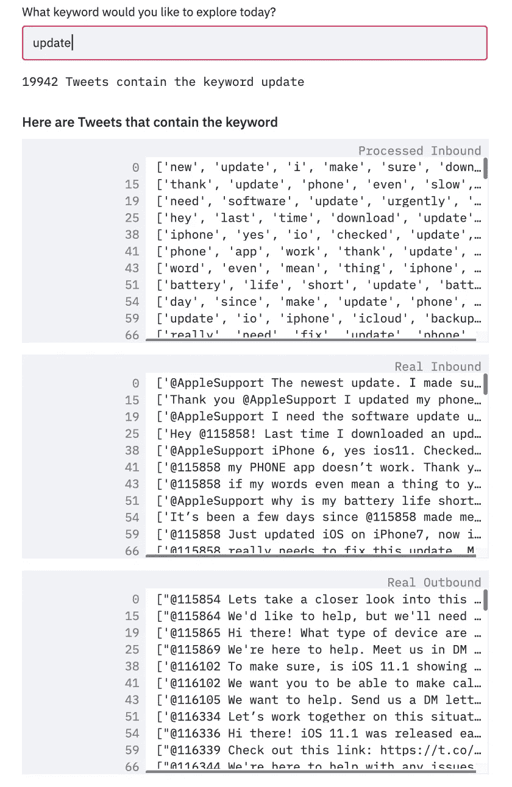**

**基于关键字过滤推文，以探索我的数据中的主题。图片作者。**

**我还找到了一种方法来估计我的 Twitter 数据中意图或主题的真实分布，并绘制出来。很简单。你从你的意图开始，然后你想代表那个意图的关键词。**

```
{"update":['update'], 
"battery": ['battery','power'], 
"forgot_password": ['password', 'account', 'login'],
"repair": ['repair', 'fix', 'broken'],
"payment": ['payment'}
```

**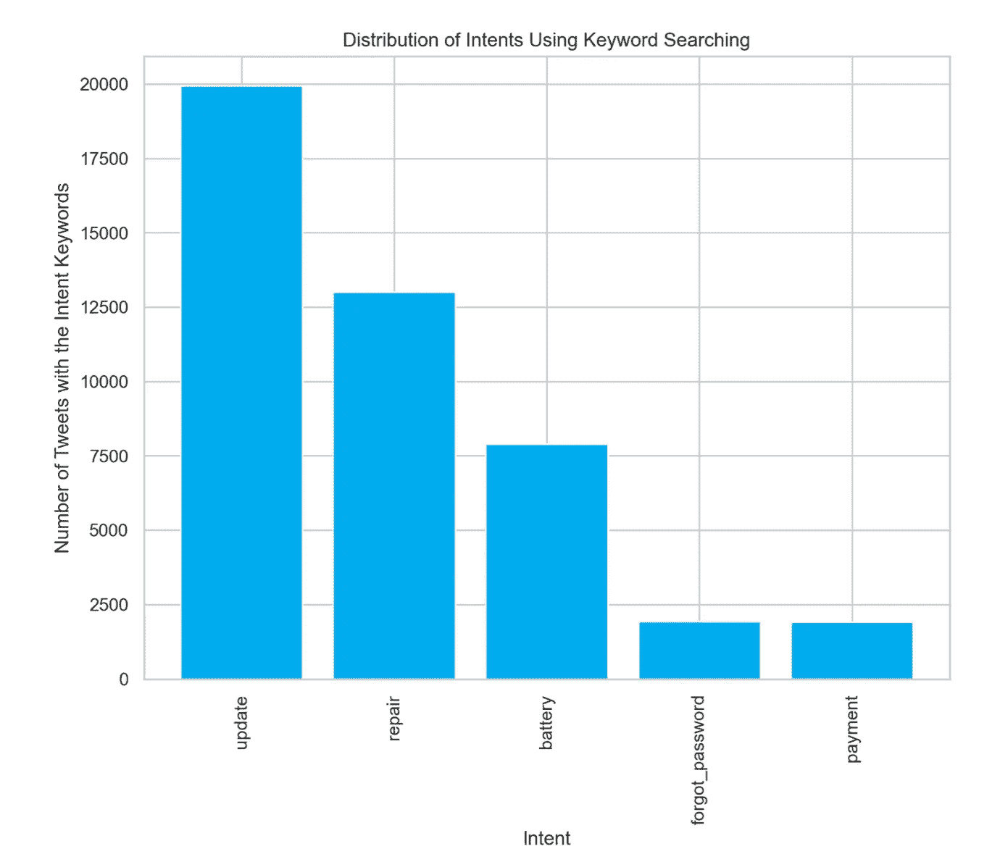**

**图片作者。**

**我也鼓励你查看 2 个、3 个甚至 4 个关键词的组合，看看你的数据是否自然地包含了同时具有多种意图的推文。在下面的例子中，您可以看到近 500 条推文同时包含了更新、电池和维修关键词。很明显，在这些推文中，客户希望解决他们的电池问题，这可能是由他们最近的更新引起的。**

**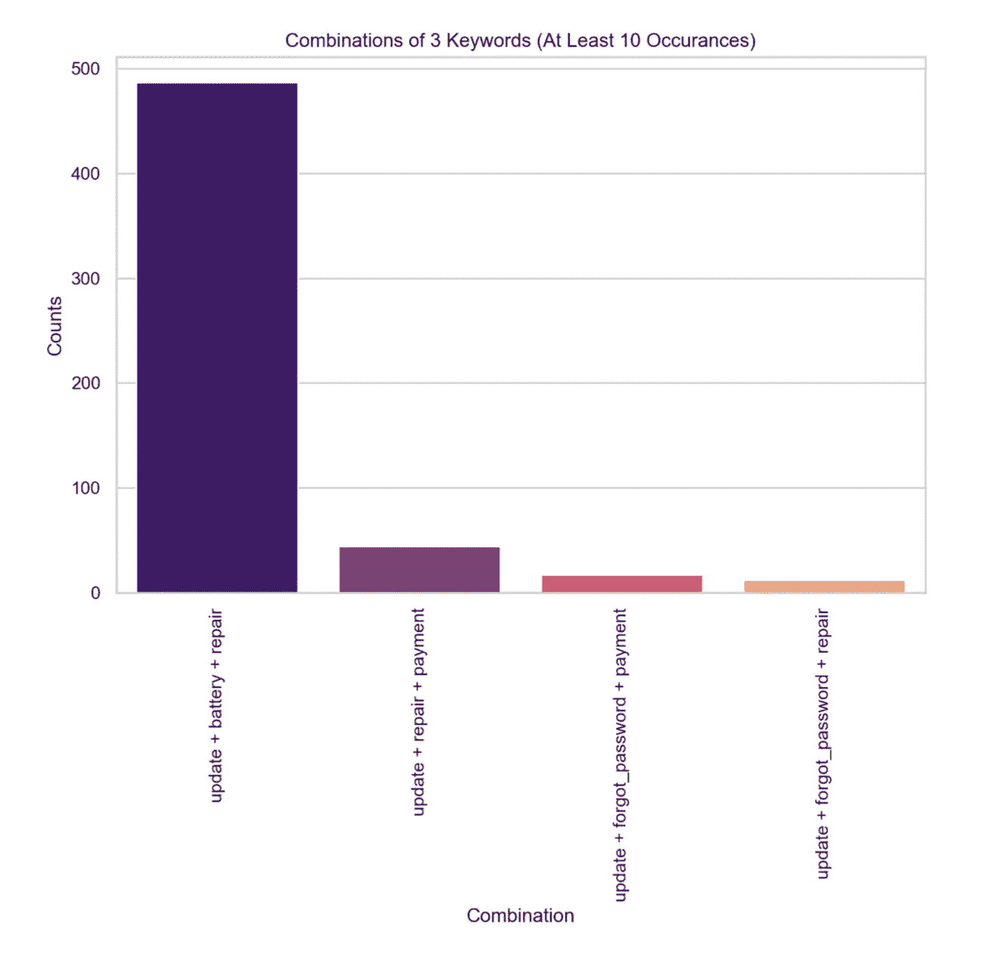**

**图片作者。**

**请记住，这一切都是为了让你的意图桶与众不同，范围广泛。**

# **5.发展**

**至于这个开发方面，这是您实现您认为最适合您的上下文的业务逻辑的地方。我喜欢用“这解决你的问题了吗”这样的肯定语来重申一个意图。**

**出于演示的目的，我使用了 Streamlit。它不是部署的理想位置，因为很难动态显示对话历史，但它可以完成工作。实际上，您将部署在一个消息平台上。例如，您可以使用 Flask 在 Facebook Messenger 和其他平台上部署您的聊天机器人。你也可以使用 api.slack.com 进行整合，并在那里快速构建你的 Slack 应用。**

**对话界面是一个全新的话题，随着我们走向未来，它有着巨大的潜力。有很多指南可以帮助你设计这些对话式界面的 UX 设计。**

# **下一步是什么？**

**在本文中，我将向您展示如何进行数据生成、意图分类和实体提取。这三个步骤对于制作聊天机器人是绝对必要的。然而，要让聊天机器人功能齐全、感觉自然，还有很多工作要做。这主要取决于你如何将当前的对话状态映射到聊天机器人应该采取的行动——或者简而言之，*对话管理*。**

**如果需要回答特定的意图，机器人需要准确地学习何时执行像倾听这样的动作，以及何时询问重要的信息。**

**以天气机器人为例，当用户询问天气时，机器人需要能够回答该问题的位置，以便它知道如何进行正确的 API 调用来检索天气信息。因此，对于天气检索这一特定目的，将位置保存到内存中的一个槽中是很重要的。如果用户没有提到位置，机器人应该会问用户用户在哪里。要求 bot 对世界上每个城市的天气进行 API 调用是不现实的，也是低效的。**

**我推荐看看这个[视频](https://www.youtube.com/watch?v=xu6D_vLP5vY)和 Rasa [文档](https://rasa.com/docs/)，看看 Rasa NLU(用于自然语言理解)和 Rasa 核心(用于对话管理)模块是如何被用来创建智能聊天机器人的。我谈了很多关于 Rasa 的事情，因为除了数据生成技术，我还从他们的[大师班](https://www.youtube.com/watch?v=rlAQWbhwqLA&list=PL75e0qA87dlHQny7z43NduZHPo6qd-cRc)视频中学到了我的聊天机器人逻辑，并理解了如何使用 Python 包来实现它。他们的框架提供了很多可定制性，以便在聊天机器人的不同阶段使用不同的策略和技术(例如是否使用 LSTMs 或 SVMs 进行意图分类，甚至当机器人对其意图分类没有信心时如何后退的更细粒度的细节)。**

**此外，我想使用一个元模型来更好地控制我的聊天机器人的对话管理。一个有趣的方法是为此使用变压器神经网络(参考 Rasa 就此发表的[论文](https://arxiv.org/abs/1910.00486)，他们称之为变压器嵌入对话策略)。这基本上有助于你有更多的自然感觉的对话。**

**最后，扩展我的聊天机器人也很重要。这只是意味着扩展我的聊天机器人能够响应的意图和实体的领域，以便它覆盖最重要的领域和边缘情况。记住我做的这个框架可以移植到任何其他聊天机器人上是很有帮助的，所以我希望将来也能支持其他语言！**

## **感谢阅读！**

**当然，这是我在过去一个月里通过观看 NLP 讲座、git 克隆许多 Github repos 亲自动手研究它们是如何工作的、YouTube 视频搜索和文档搜索所了解到的。因此，如果你有任何关于如何改进我的聊天机器人的反馈，或者如果有比我目前的方法更好的做法，请评论或联系我！我总是努力做出我能提供的最好的产品，并且总是努力学习更多。**