# Python 数据可视化完全指南

> 原文：<https://towardsdatascience.com/complete-guide-to-data-visualization-with-python-2dd74df12b5e?source=collection_archive---------3----------------------->

让我们来看看使用 Python 进行数据可视化的主要库，以及可以使用它们完成的所有类型的图表。我们还将看到在每种情况下推荐使用哪个库，以及每个库的独特功能。

我们将从直接查看数据的最基本的可视化开始，然后我们将继续绘制图表，最后，我们将制作交互式图表。

# 数据集

我们将使用两个数据集，它们将适应我们在文章中展示的可视化效果，数据集可以在这里下载。

它们是关于人工智能相关的三个术语(数据科学、机器学习和深度学习)在互联网上的搜索热度的数据。它们是从一个著名的搜索引擎中提取出来的。

有两个文件 *temporal.csv* 和 *mapa.csv* 。我们将在本教程的大部分内容中使用的第一个术语包括这三个术语在一段时间内的流行度数据(从 2004 年到现在，2020 年)。此外，我还添加了一个分类变量(1 和 0)来演示带有分类变量的图表的功能。

文件 *mapa.csv* 包含按国家划分的流行度数据。我们将在文章的最后一部分使用它来处理地图。

# 熊猫

在我们进入更复杂的方法之前，让我们从最基本的数据可视化方式开始。我们将简单地使用 pandas 来查看数据，并了解数据是如何分布的。

我们必须做的第一件事是可视化一些例子，看看有哪些列，它们包含什么信息，值是如何编码的…

```
import pandas as pd
df = pd.read_csv('temporal.csv')
df.head(10) #View first 10 data rows
```

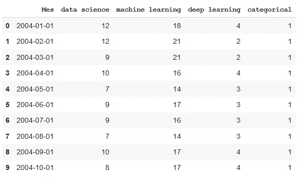

使用 describe 命令，我们将看到数据是如何分布的，最大值、最小值、平均值…

```
df.describe()
```

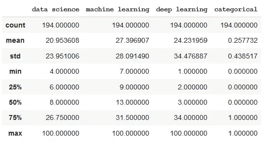

使用 info 命令，我们可以看到每一列包含什么类型的数据。我们可能会发现这样一种情况，当使用 head 命令查看某列时，该列看起来是数字，但是如果我们查看后续数据，就会发现值是字符串格式的，那么该变量将被编码为字符串。

```
df.info()
```

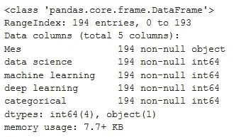

默认情况下，pandas 限制它显示的行数和列数。这通常会困扰我，因为我希望能够可视化所有的数据。

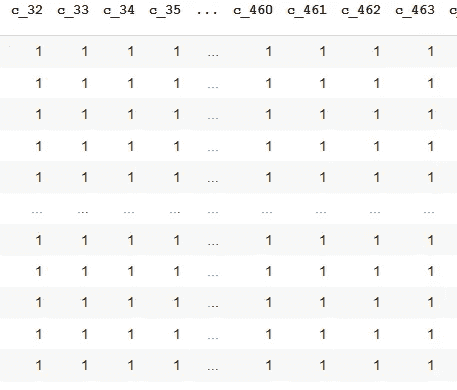

使用这些命令，我们增加了限制，并且可以可视化整个数据。对于大数据集，请小心使用这个选项，我们可能会在显示它们时遇到问题。

```
pd.set_option('display.max_rows', 500)
pd.set_option('display.max_columns', 500)
pd.set_option('display.width', 1000)
```

使用 Pandas 样式，我们可以在查看表格时获得更多信息。首先，我们定义一个格式字典，以便数字以清晰的方式显示(有一定数量的小数、相关格式的日期和小时、百分比、货币……)不要惊慌，这只是一个显示，不会改变数据，您稍后处理它不会有任何问题。

为了给出每种类型的示例，我添加了货币和百分比符号，尽管它们对该数据没有任何意义。

```
format_dict = {'data science':'${0:,.2f}', 'Mes':'{:%m-%Y}', 'machine learning':'{:.2%}'}#We make sure that the Month column has datetime format
df['Mes'] = pd.to_datetime(df['Mes'])#We apply the style to the visualization
df.head().style.format(format_dict)
```

我们可以用颜色突出最大值和最小值。

```
format_dict = {'Mes':'{:%m-%Y}'} #Simplified format dictionary with values that do make sense for our data
df.head().style.format(format_dict).highlight_max(color='darkgreen').highlight_min(color='#ff0000')
```

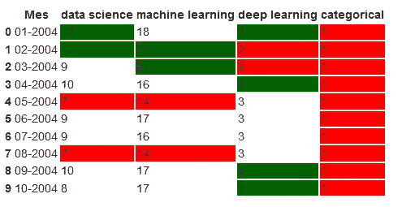

我们使用颜色渐变来显示数据值。

```
df.head(10).style.format(format_dict).background_gradient(subset=['data science', 'machine learning'], cmap='BuGn')
```

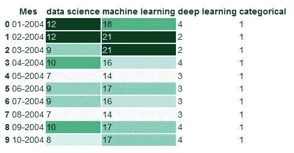

我们也可以用条形显示数据值。

```
df.head().style.format(format_dict).bar(color='red', subset=['data science', 'deep learning'])
```

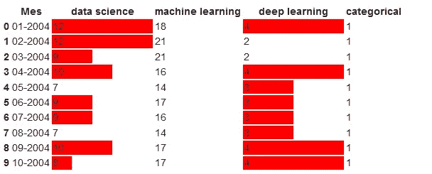

此外，我们还可以结合上述功能，生成一个更复杂的可视化。

```
df.head(10).style.format(format_dict).background_gradient(subset=['data science', 'machine learning'], cmap='BuGn').highlight_max(color='yellow')
```

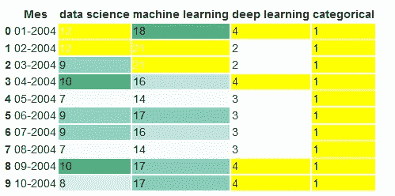

点击这里了解更多关于熊猫的可视化样式:[https://Pandas . pydata . org/Pandas-docs/stable/user _ guide/style . html](https://pandas.pydata.org/pandas-docs/stable/user_guide/style.html)

# 熊猫简介

Pandas profiling 是一个使用我们的数据生成交互式报告的库，我们可以看到数据的分布、数据的类型以及可能存在的问题。它非常容易使用，只用 3 行代码我们就可以生成一个报告，我们可以发送给任何人，即使你不懂编程也可以使用。

```
from pandas_profiling import ProfileReport
prof = ProfileReport(df)
prof.to_file(output_file='report.html')
```

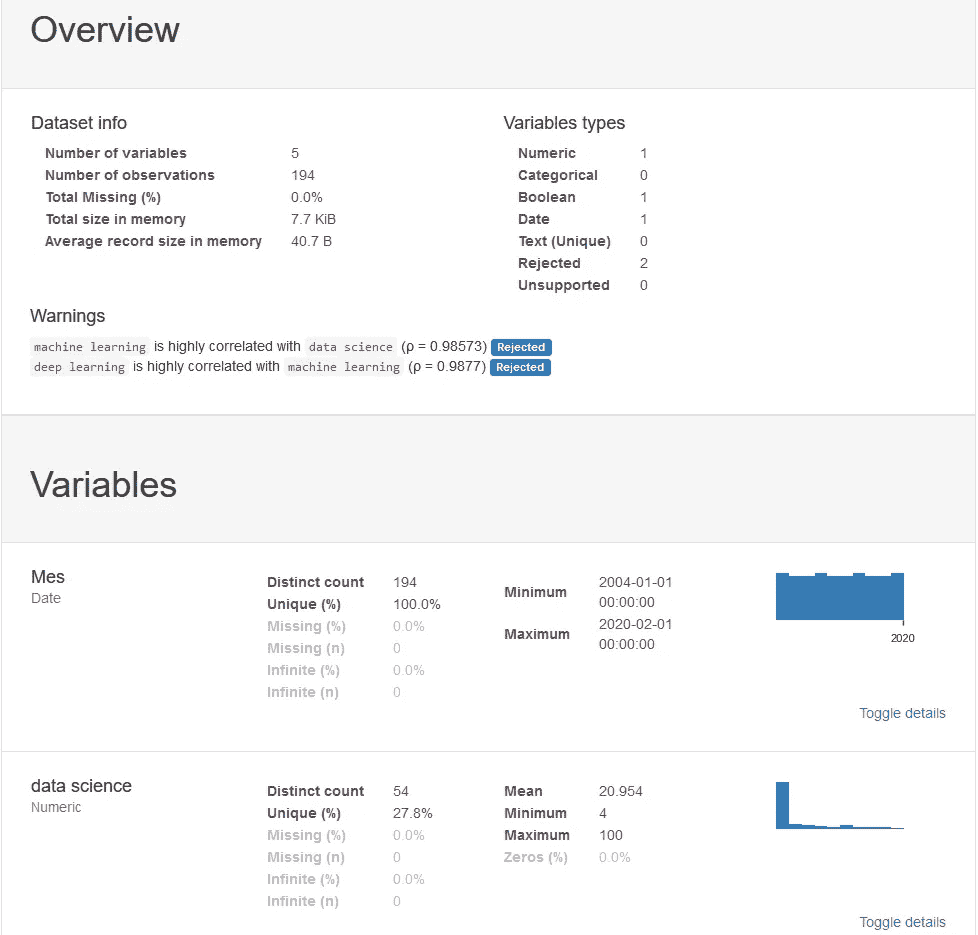

你可以看到从文章中使用的数据生成的交互报告，[这里](https://todoia.es/recursos/informe.html)。

你可以在这篇文章中找到更多关于熊猫简介[的信息。](/exploratory-data-analysis-with-pandas-profiling-de3aae2ddff3)

# Matplotlib

Matplotlib 是图形化可视化数据的最基本的库。它包括了许多我们能想到的图表。仅仅因为它是基本的，并不意味着它不强大，我们将要谈到的许多其他数据可视化库都是基于它的。

Matplotlib 的图表由两个主要部分组成，轴(界定图表区域的线条)和图形(我们在这里绘制轴、标题和轴区域之外的东西)。现在让我们创建一个尽可能简单的图表:

```
import matplotlib.pyplot as plt
plt.plot(df['Mes'], df['data science'], label='data science') #The parameter label is to indicate the legend. This doesn't mean that it will be shown, we'll have to use another command that I'll explain later.
```

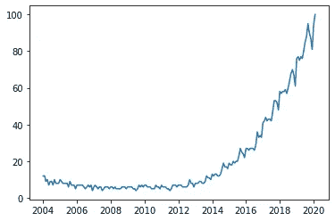

我们可以在同一个图形中制作多个变量的图形，从而进行比较。

```
plt.plot(df['Mes'], df['data science'], label='data science')
plt.plot(df['Mes'], df['machine learning'], label='machine learning')
plt.plot(df['Mes'], df['deep learning'], label='deep learning')
```

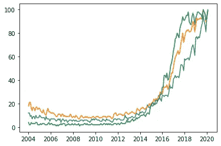

不是很清楚每种颜色代表哪个变量。我们将通过添加图例和标题来改进图表。

```
plt.plot(df['Mes'], df['data science'], label='data science')
plt.plot(df['Mes'], df['machine learning'], label='machine learning')
plt.plot(df['Mes'], df['deep learning'], label='deep learning')
plt.xlabel('Date')
plt.ylabel('Popularity')
plt.title('Popularity of AI terms by date')
plt.grid(True)
plt.legend()
```

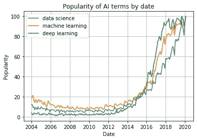

如果您正在从终端或脚本使用 Python，在使用我们上面编写的函数定义图形之后，使用 plt.show()。如果您正在 jupyter 笔记本上工作，请在文件的开头内联添加%matplotlib，并在制作图表之前运行它。

我们可以在一个图形中制作多个图形。这非常适用于比较图表，或者使用单个图像轻松共享多种图表类型的数据。

```
fig, axes = plt.subplots(2,2)
axes[0, 0].hist(df['data science'])
axes[0, 1].scatter(df['Mes'], df['data science'])
axes[1, 0].plot(df['Mes'], df['machine learning'])
axes[1, 1].plot(df['Mes'], df['deep learning'])
```

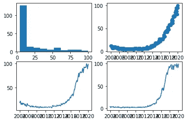

我们可以为每个变量的点绘制不同风格的图形:

```
plt.plot(df['Mes'], df['data science'], 'r-')
plt.plot(df['Mes'], df['data science']*2, 'bs')
plt.plot(df['Mes'], df['data science']*3, 'g^')
```

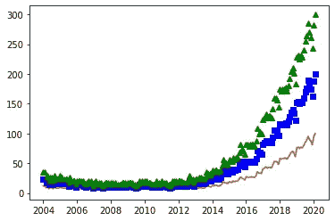

现在让我们来看几个我们可以用 Matplotlib 做的不同图形的例子。我们从散点图开始:

```
plt.scatter(df['data science'], df['machine learning'])
```

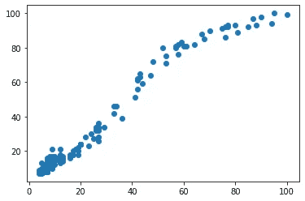

条形图示例:

```
plt.bar(df['Mes'], df['machine learning'], width=20)
```

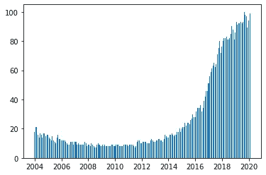

直方图示例:

```
plt.hist(df['deep learning'], bins=15)
```

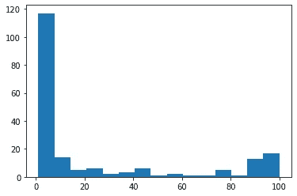

我们可以在图形中添加一段文字，用我们在图形中看到的相同单位来表示文字的位置。在文本中，我们甚至可以在 TeX 语言之后添加特殊字符

我们还可以添加指向图上特定点的标记。

```
plt.plot(df['Mes'], df['data science'], label='data science')
plt.plot(df['Mes'], df['machine learning'], label='machine learning')
plt.plot(df['Mes'], df['deep learning'], label='deep learning')
plt.xlabel('Date')
plt.ylabel('Popularity')
plt.title('Popularity of AI terms by date')
plt.grid(True)
plt.text(x='2010-01-01', y=80, s=r'$\lambda=1, r^2=0.8$') #Coordinates use the same units as the graph
plt.annotate('Notice something?', xy=('2014-01-01', 30), xytext=('2006-01-01', 50), arrowprops={'facecolor':'red', 'shrink':0.05})
```

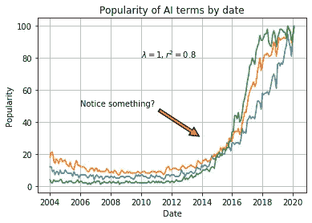

**图库示例:**
在此链接:[https://matplotlib.org/gallery/index.html](https://matplotlib.org/gallery/index.html)我们可以看到可以用 Matplotlib 完成的所有类型图形的示例。

# 海生的

Seaborn 是一个基于 Matplotlib 的库。基本上，它给我们的是更好的图形和函数，只用一行代码就可以制作复杂类型的图形。

我们导入这个库，并用 sns.set()初始化图形的样式，如果没有这个命令，图形仍然具有与 Matplotlib 相同的样式。我们展示一个最简单的图形，一个散点图

```
import seaborn as sns
sns.set()
sns.scatterplot(df['Mes'], df['data science'])
```

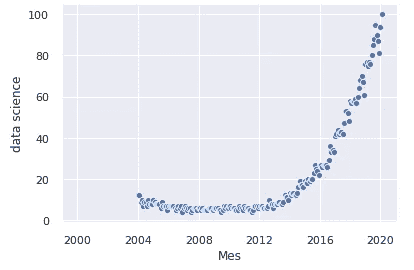

我们可以在同一张图中添加两个以上变量的信息。为此，我们使用颜色和大小。我们还根据类别列的值制作了一个不同的图表:

```
sns.relplot(x='Mes', y='deep learning', hue='data science', size='machine learning', col='categorical', data=df)
```

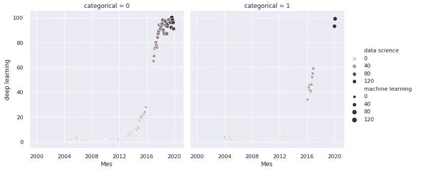

Seaborn 提供的最受欢迎的图形之一是**热图**。通常使用它来显示数据集中变量之间的所有相关性:

```
sns.heatmap(df.corr(), annot=True, fmt='.2f')
```

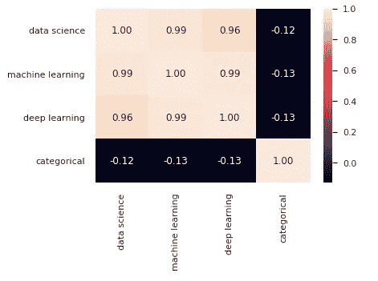

另一个最流行的是 pairplot，它向我们展示了所有变量之间的关系。如果您有一个大型数据集，请小心使用此函数，因为它必须显示所有数据点的次数与列数一样多，这意味着通过增加数据的维度，处理时间会呈指数增长。

```
sns.pairplot(df)
```

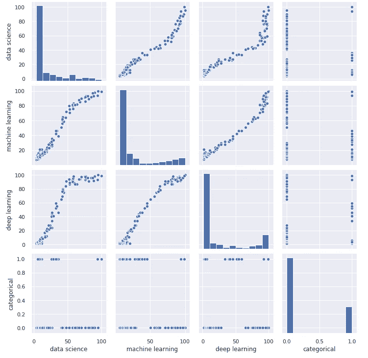

现在让我们做一个 pairplot，展示根据*分类*变量的值划分的图表

```
sns.pairplot(df, hue='categorical')
```

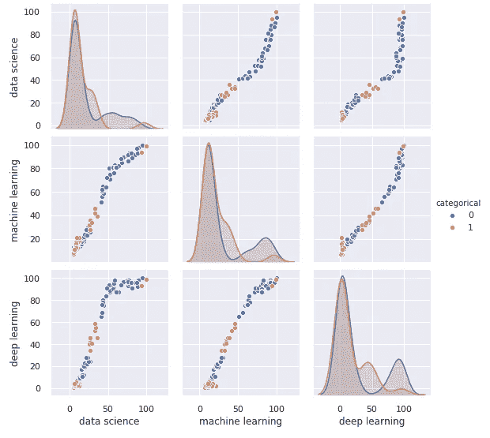

一个非常有用的图表是联合图，它允许我们看到散点图和两个变量的直方图，并看到它们是如何分布的:

```
sns.jointplot(x='data science', y='machine learning', data=df)
```

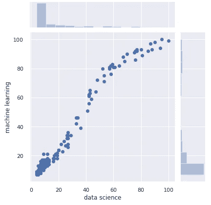

另一个有趣的图形是**小提琴图**:

```
sns.catplot(x='categorical', y='data science', kind='violin', data=df)
```

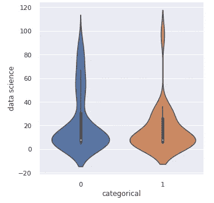

我们可以在一个图像中创建多个图形，就像我们使用 Matplotlib 一样:

```
fig, axes = plt.subplots(1, 2, sharey=True, figsize=(8, 4))
sns.scatterplot(x="Mes", y="deep learning", hue="categorical", data=df, ax=axes[0])
axes[0].set_title('Deep Learning')
sns.scatterplot(x="Mes", y="machine learning", hue="categorical", data=df, ax=axes[1])
axes[1].set_title('Machine Learning')
```

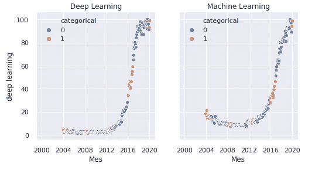

**例子图库:**
[在这个链接](https://seaborn.pydata.org/examples/index.html)中，我们可以看到用 Seaborn 可以做的一切事情的例子。

# 散景

Bokeh 是一个允许你生成交互式图形的库。我们可以将它们导出到一个 HTML 文档中，与任何拥有网络浏览器的人共享。

当我们有兴趣在图形中寻找东西，并且希望能够放大和移动图形时，它是一个非常有用的库。或者当我们想要分享它们，并给另一个人探索数据的可能性时。

我们首先导入库并定义保存图形的文件:

```
from bokeh.plotting import figure, output_file, save
output_file('data_science_popularity.html')
```

我们画出我们想要的并保存在文件中:

```
p = figure(title='data science', x_axis_label='Mes', y_axis_label='data science')
p.line(df['Mes'], df['data science'], legend='popularity', line_width=2)
save(p)
```

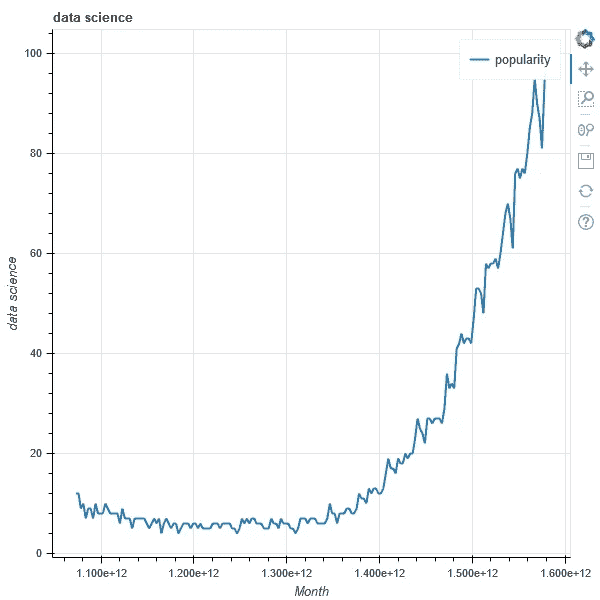

你可以通过[点击这里](https://todoia.es/recursos/data_science_popularity.html)看到文件[*data _ science _ popularity . html*](https://todoia.es/recursos/data_science_popularity.html)的样子。它是交互式的，你可以随意移动和放大图片

将多个图形添加到单个文件:

```
output_file('multiple_graphs.html')s1 = figure(width=250, plot_height=250, title='data science')
s1.circle(df['Mes'], df['data science'], size=10, color='navy', alpha=0.5)
s2 = figure(width=250, height=250, x_range=s1.x_range, y_range=s1.y_range, title='machine learning') #share both axis range
s2.triangle(df['Mes'], df['machine learning'], size=10, color='red', alpha=0.5)
s3 = figure(width=250, height=250, x_range=s1.x_range, title='deep learning') #share only one axis range
s3.square(df['Mes'], df['deep learning'], size=5, color='green', alpha=0.5)p = gridplot([[s1, s2, s3]])
save(p)
```

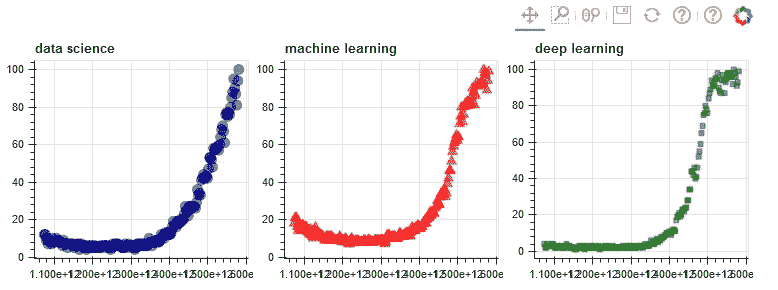

点击[可以看到文件](https://todoia.es/recursos/multiple_graphs.html) [multiple_graphs.html](https://todoia.es/recursos/multiple_graphs.html) 的样子。

**示例图库:**
在这个链接中[https://docs.bokeh.org/en/latest/docs/gallery.html](https://docs.bokeh.org/en/latest/docs/gallery.html)你可以看到用散景可以做的所有事情的示例。

# 阿尔泰尔

在我看来，Altair 并没有给我们已经讨论过的其他库带来任何新的东西，因此我不会深入讨论它。我想提一下这个库，因为也许在他们的示例库中，我们可以找到一些可以帮助我们的特定图形。

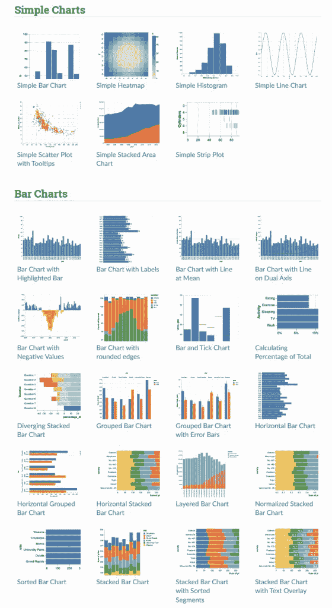

**范例库:**
[在这个链接里](https://altair-viz.github.io/gallery/index.html)你可以找到所有你能用 Altair 做的范例库。

# 薄层

Folium 是一个允许我们绘制地图和标记的库，我们也可以在上面绘制我们的数据。让我们选择地图供应商，这决定了地图的风格和质量。在本文中，为了简单起见，我们只将 OpenStreetMap 视为一个地图提供商。

使用地图是相当复杂的，值得单独撰写一篇文章。在这里，我们只看一些基础知识，并用现有的数据画几张地图。

让我们从基础开始，我们将画一个简单的地图，上面什么也没有。

```
import folium
m1 = folium.Map(location=[41.38, 2.17], tiles='openstreetmap', zoom_start=18)
m1.save('map1.html')
```

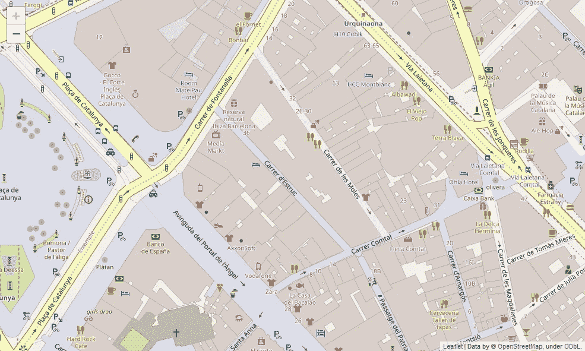

我们为地图生成一个交互式文件，你可以随意移动和缩放。这里可以看到[。](https://todoia.es/recursos/mapa1.html)

我们可以在地图上添加标记:

```
m2 = folium.Map(location=[41.38, 2.17], tiles='openstreetmap', zoom_start=16)folium.Marker([41.38, 2.176], popup='<i>You can use whatever HTML code you want</i>', tooltip='click here').add_to(m2)
folium.Marker([41.38, 2.174], popup='<b>You can use whatever HTML code you want</b>', tooltip='dont click here').add_to(m2)m2.save('map2.html')
```

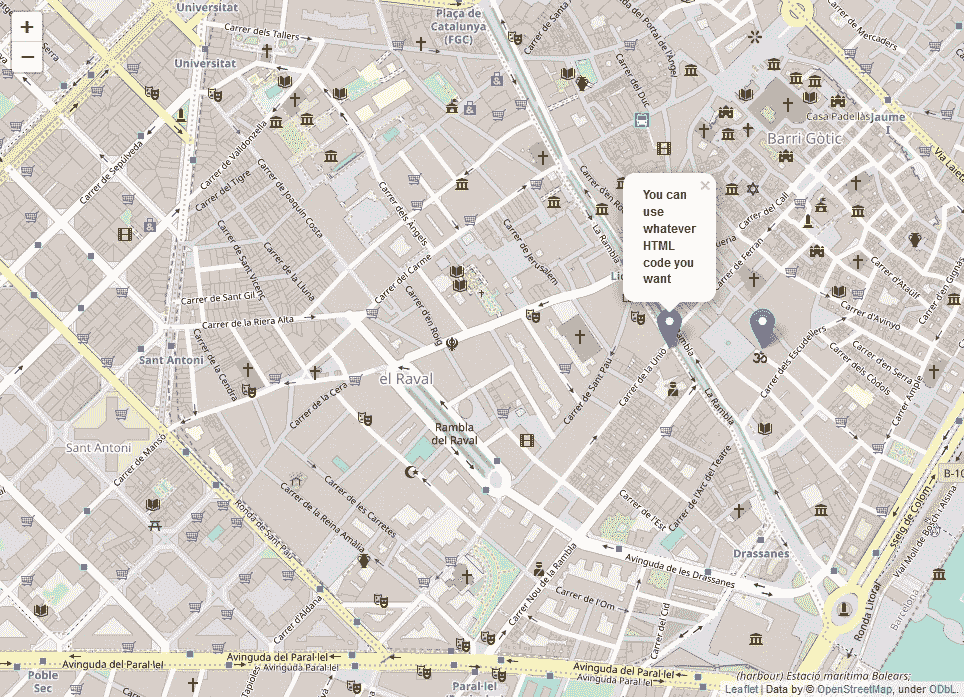

您可以看到交互式地图文件，您可以通过[点击此处](http://todoia.es/recursos/map2_medium.html)点击标记。

在开始展示的数据集中，我们有国家名称和人工智能术语的流行程度。快速可视化后，您会发现有些国家缺少其中一种价值观。我们将把这些国家排除在外，以便于操作。然后，我们将使用 Geopandas 将国家名称转换为可以在地图上绘制的坐标。

```
from geopandas.tools import geocode
df2 = pd.read_csv('mapa.csv')
df2.dropna(axis=0, inplace=True)df2['geometry'] = geocode(df2['País'], provider='nominatim')['geometry'] #It may take a while because it downloads a lot of data.
df2['Latitude'] = df2['geometry'].apply(lambda l: l.y)
df2['Longitude'] = df2['geometry'].apply(lambda l: l.x)
```

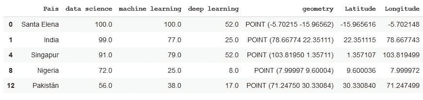

现在我们有了用纬度和经度编码的数据，让我们在地图上表示它。我们将从一张泡泡地图开始，我们将在这些国家上画圈。它们的大小将取决于术语的流行度，并且它们的颜色将是红色或绿色，这取决于它们的流行度是否高于某个值。

```
m3 = folium.Map(location=[39.326234,-4.838065], tiles='openstreetmap', zoom_start=3)def color_producer(val):
	if val <= 50:
		return 'red'
	else:
		return 'green'for i in range(0,len(df2)):
	folium.Circle(location=[df2.iloc[i]['Latitud'], df2.iloc[i]['Longitud']], radius=5000*df2.iloc[i]['data science'], color=color_producer(df2.iloc[i]['data science'])).add_to(m3)m3.save('map3.html')
```

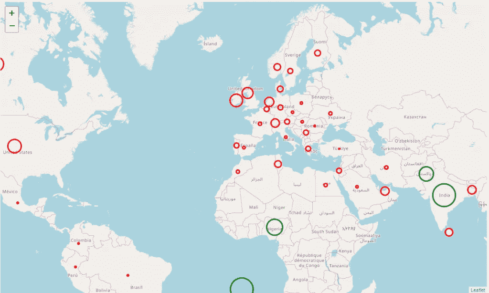

点击这里可以查看互动地图文件[。](http://todoia.es/recursos/mapa3.html)

# 在任何给定的时间使用哪个库？

有了这么多种类的库，您可能想知道哪个库最适合您的项目。快速的答案是库，让您可以轻松地制作您想要的图形。

对于一个项目的初始阶段，随着熊猫和熊猫概况，我们将快速可视化，以了解数据。如果我们需要可视化更多的信息，我们可以使用简单的图表，我们可以在 matplotlib 中找到散点图或直方图。

对于项目的高级阶段，我们可以在主要库(Matplotlib、Seaborn、Bokeh、Altair)的图库中搜索我们喜欢并适合项目的图形。这些图形可用于在报告中给出信息，制作交互式报告，搜索特定值，…